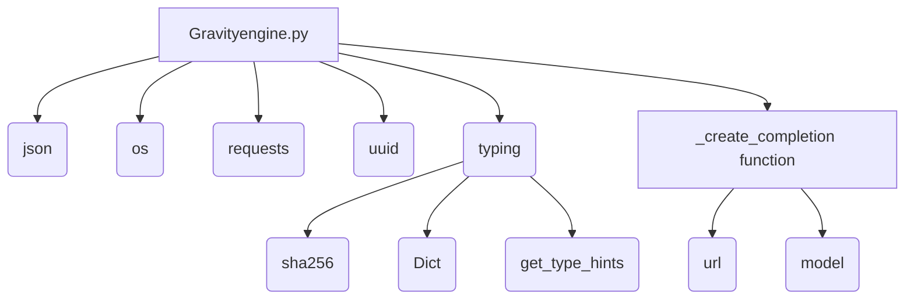

### **Системные инструкции для обработки кода проекта `hypotez`**

=========================================================================================

Описание функциональности и правил для генерации, анализа и улучшения кода. Направлено на обеспечение последовательного и читаемого стиля кодирования, соответствующего требованиям.

---

### **Основные принципы**

#### **1. Общие указания**:
- Соблюдай четкий и понятный стиль кодирования.
- Все изменения должны быть обоснованы и соответствовать установленным требованиям.

#### **2. Комментарии**:
- Используй `#` для внутренних комментариев.
- Документация всех функций, методов и классов должна следовать такому формату: 
    ```python
        def function(param: str, param1: Optional[str | dict | str] = None) -> dict | None:
            """ 
            Args:
                param (str): Описание параметра `param`.
                param1 (Optional[str | dict | str], optional): Описание параметра `param1`. По умолчанию `None`.
    
            Returns:
                dict | None: Описание возвращаемого значения. Возвращает словарь или `None`.
    
            Raises:
                SomeError: Описание ситуации, в которой возникает исключение `SomeError`.

            Ехаmple:
                >>> function('param', 'param1')
                {'param': 'param1'}
            """
    ```
- Комментарии и документация должны быть четкими, лаконичными и точными.

#### **3. Форматирование кода**:
- Используй одинарные кавычки. `a:str = 'value'`, `print('Hello World!')`;
- Добавляй пробелы вокруг операторов. Например, `x = 5`;
- Все параметры должны быть аннотированы типами. `def function(param: str, param1: Optional[str | dict | str] = None) -> dict | None:`;
- Не используй `Union`. Вместо этого используй `|`.

#### **4. Логирование**:
- Для логгирования Всегда Используй модуль `logger` из `src.logger.logger`.
- Ошибки должны логироваться с использованием `logger.error`.
Пример:
    ```python
        try:
            ...
        except Exception as ex:
            logger.error('Error while processing data', ех, exc_info=True)
    ```
#### **5 Не используй `Union[]` в коде. Вместо него используй `|`
Например:
```python
x: str | int ...
```


---

### **Основные требования**:

#### **1. Формат ответов в Markdown**:
- Все ответы должны быть выполнены в формате **Markdown**.

#### **2. Формат комментариев**:
- Используй указанный стиль для комментариев и документации в коде.
- Пример:

```python
from typing import Generator, Optional, List
from pathlib import Path


def read_text_file(
    file_path: str | Path,
    as_list: bool = False,
    extensions: Optional[List[str]] = None,
    chunk_size: int = 8192,
) -> Generator[str, None, None] | str | None:
    """
    Считывает содержимое файла (или файлов из каталога) с использованием генератора для экономии памяти.

    Args:
        file_path (str | Path): Путь к файлу или каталогу.
        as_list (bool): Если `True`, возвращает генератор строк.
        extensions (Optional[List[str]]): Список расширений файлов для чтения из каталога.
        chunk_size (int): Размер чанков для чтения файла в байтах.

    Returns:
        Generator[str, None, None] | str | None: Генератор строк, объединенная строка или `None` в случае ошибки.

    Raises:
        Exception: Если возникает ошибка при чтении файла.

    Example:
        >>> from pathlib import Path
        >>> file_path = Path('example.txt')
        >>> content = read_text_file(file_path)
        >>> if content:
        ...    print(f'File content: {content[:100]}...')
        File content: Example text...
    """
    ...
```
- Всегда делай подробные объяснения в комментариях. Избегай расплывчатых терминов, 
- таких как *«получить»* или *«делать»*. Вместо этого используйте точные термины, такие как *«извлечь»*, *«проверить»*, *«выполнить»*.
- Вместо: *«получаем»*, *«возвращаем»*, *«преобразовываем»* используй имя объекта *«функция получае»*, *«переменная возвращает»*, *«код преобразовывает»* 
- Комментарии должны непосредственно предшествовать описываемому блоку кода и объяснять его назначение.

#### **3. Пробелы вокруг операторов присваивания**:
- Всегда добавляйте пробелы вокруг оператора `=`, чтобы повысить читаемость.
- Примеры:
  - **Неправильно**: `x=5`
  - **Правильно**: `x = 5`

#### **4. Использование `j_loads` или `j_loads_ns`**:
- Для чтения JSON или конфигурационных файлов замените стандартное использование `open` и `json.load` на `j_loads` или `j_loads_ns`.
- Пример:

```python
# Неправильно:
with open('config.json', 'r', encoding='utf-8') as f:
    data = json.load(f)

# Правильно:
data = j_loads('config.json')
```

#### **5. Сохранение комментариев**:
- Все существующие комментарии, начинающиеся с `#`, должны быть сохранены без изменений в разделе «Улучшенный код».
- Если комментарий кажется устаревшим или неясным, не изменяйте его. Вместо этого отметьте его в разделе «Изменения».

#### **6. Обработка `...` в коде**:
- Оставляйте `...` как указатели в коде без изменений.
- Не документируйте строки с `...`.
```

#### **7. Аннотации**
Для всех переменных должны быть определены аннотации типа. 
Для всех функций все входные и выходные параметры аннотириваны
Для все параметров должны быть аннотации типа.


### **8. webdriver**
В коде используется webdriver. Он импртируется из модуля `webdriver` проекта `hypotez`
```python
from src.webdirver import Driver, Chrome, Firefox, Playwright, ...
driver = Driver(Firefox)

Пoсле чего может использоваться как

close_banner = {
  "attribute": null,
  "by": "XPATH",
  "selector": "//button[@id = 'closeXButton']",
  "if_list": "first",
  "use_mouse": false,
  "mandatory": false,
  "timeout": 0,
  "timeout_for_event": "presence_of_element_located",
  "event": "click()",
  "locator_description": "Закрываю pop-up окно, если оно не появилось - не страшно (`mandatory`:`false`)"
}

result = driver.execute_locator(close_banner)
```

```markdown
## Анализ кода `hypotez/src/endpoints/freegpt-webui-ru/g4f/Provider/Providers/Gravityengine.py`

### 1. Блок-схема

```mermaid
graph TD
    A[Начало] --> B{Импорт библиотек: json, os, requests, uuid, typing};
    B --> C{Определение констант: url, model, supports_stream, needs_auth};
    C --> D[Определение функции _create_completion];
    D --> E{Подготовка headers и data для запроса};
    E --> F[Выполнение POST запроса к url + '/api/openai/v1/chat/completions'];
    F --> G{Обработка ответа и извлечение content из choices[0]['message']};
    G --> H[Генерация значения content];
    H --> I[Определение params];
    I --> J[Конец];
```

**Примеры для каждого логического блока:**

-   **A[Начало]**: Начало работы модуля.
-   **B{Импорт библиотек}**: Импортируются библиотеки `json`, `os`, `requests`, `uuid` и `typing` для работы с JSON, операционной системой, HTTP-запросами, генерацией UUID и аннотациями типов соответственно.
-   **C{Определение констант}**:
    -   `url = 'https://gpt4.gravityengine.cc'` - URL-адрес API.
    -   `model = ['gpt-3.5-turbo-16k', 'gpt-3.5-turbo-0613']` - Список поддерживаемых моделей.
    -   `supports_stream = True` - Указывает, что поддерживается потоковая передача.
    -   `needs_auth = False` - Указывает, что не требуется аутентификация.
-   **D[Определение функции `_create_completion`]**: Функция для создания запроса к API.

    ```python
    def _create_completion(model: str, messages: list, stream: bool, **kwargs):
        # ...
    ```

-   **E{Подготовка `headers` и `data` для запроса}**: Формируются заголовки и данные для POST-запроса.

    ```python
    headers = {
        'Content-Type': 'application/json',
    }
    data = {
        'model': model,
        'temperature': 0.7,
        'presence_penalty': 0,
        'messages': messages
    }
    ```

-   **F[Выполнение POST запроса]**: Отправляется POST-запрос к API.

    ```python
    response = requests.post(url + '/api/openai/v1/chat/completions', headers=headers,
                                 json=data, stream=True)
    ```

-   **G{Обработка ответа и извлечение content}**: Извлекается содержимое сообщения из ответа API.

    ```python
    response.json()['choices'][0]['message']['content']
    ```

-   **H[Генерация значения `content`]**: Функция возвращает `content`.
-   **I[Определение `params`]**: Формируется строка `params` для отображения поддерживаемых типов параметров функции `_create_completion`.
-   **J[Конец]**: Завершение работы модуля.

### 2. Диаграмма



**Объяснение:**

-   `Gravityengine.py`: Основной файл, представляющий собой модуль для взаимодействия с API Gravityengine.
-   `json`: Используется для работы с JSON-данными, в частности, для обработки ответов от API.
-   `os`: Используется для работы с операционной системой, например, для получения имени файла.
-   `requests`: Используется для отправки HTTP-запросов к API.
-   `uuid`: Используется для генерации уникальных идентификаторов, если это необходимо. В данном коде не используется, но импортирован.
-   `typing`: Используется для аннотации типов, что улучшает читаемость и помогает в отладке кода.
    -   `sha256`, `Dict`, `get_type_hints`: Импортируются из модуля `typing` для указания типов переменных и параметров функций.
-   `_create_completion function`: Функция, выполняющая запрос к API и обрабатывающая ответ.
-   `url`: Константа, содержащая URL-адрес API Gravityengine.
-   `model`: Константа, содержащая список поддерживаемых моделей.

### 3. Объяснение

**Импорты:**

-   `import json`: Используется для работы с данными в формате JSON. Например, для десериализации JSON-ответа от API.
-   `import os`: Предоставляет функции для взаимодействия с операционной системой. В данном случае используется для получения имени файла (`os.path.basename(__file__)`).
-   `import requests`: Используется для выполнения HTTP-запросов к API Gravityengine.
-   `import uuid`: Используется для генерации уникальных идентификаторов. В предоставленном коде явно не используется.
-   `from ...typing import sha256, Dict, get_type_hints`: Импортирует типы данных и функции из модуля `typing`.
    -   `sha256`: Вероятно, используется для представления SHA256-хешей. В данном коде явно не используется.
    -   `Dict`: Используется для аннотации типов словарей.
    -   `get_type_hints`: Используется для получения информации о типах параметров функции.

**Константы:**

-   `url: str = 'https://gpt4.gravityengine.cc'`: URL-адрес API Gravityengine.
-   `model: list = ['gpt-3.5-turbo-16k', 'gpt-3.5-turbo-0613']`: Список поддерживаемых моделей.
-   `supports_stream: bool = True`: Флаг, указывающий на поддержку потоковой передачи данных.
-   `needs_auth: bool = False`: Флаг, указывающий на необходимость аутентификации.

**Функции:**

-   `_create_completion(model: str, messages: list, stream: bool, **kwargs)`:
    -   Аргументы:
        -   `model (str)`: Идентификатор используемой модели.
        -   `messages (list)`: Список сообщений для отправки в API.
        -   `stream (bool)`: Флаг, указывающий на использование потоковой передачи данных.
        -   `**kwargs`: Дополнительные параметры.
    -   Возвращаемое значение:
        -   `yield response.json()['choices'][0]['message']['content']`: Возвращает генератор, который выдает содержимое ответа от API.
    -   Назначение:
        -   Формирует HTTP-запрос к API Gravityengine и возвращает ответ.
    -   Пример:

        ```python
        def _create_completion(model='gpt-3.5-turbo-16k', messages=[{'role': 'user', 'content': 'Hello'}], stream=True):
            # ...
            yield response.json()['choices'][0]['message']['content']
        ```

**Переменные:**

-   `headers: dict`: Заголовки HTTP-запроса.
-   `data: dict`: Данные, отправляемые в теле HTTP-запроса.
-   `response: requests.Response`: Объект ответа от API.
-   `params: str`: Строка, содержащая информацию о поддерживаемых типах параметров функции `_create_completion`.

**Потенциальные ошибки и области для улучшения:**

-   Отсутствует обработка ошибок при выполнении HTTP-запроса. В случае ошибки запрос может завершиться неудачно, что приведет к исключению.
-   Не используется `uuid`. Импорт библиотеки без использования является избыточным.
-   Отсутствует логирование. Добавление логирования позволит отслеживать ход выполнения программы и выявлять ошибки.
-   Не указаны типы для `headers` и `data`.
-   Обработка ошибок отсутствует, если `response.json()` не содержит ожидаемых ключей.

**Взаимосвязь с другими частями проекта:**

-   Этот модуль, вероятно, используется как один из провайдеров для `g4f` (GenerativeForFree), позволяя использовать Gravityengine в качестве источника для генерации текста. Он интегрируется в систему выбора провайдера и предоставляет унифицированный интерфейс для запросов к различным API.
-   Типы данных, такие как `sha256` и `Dict`, импортируются из `...typing`, что указывает на общую систему типизации в проекте `hypotez`.