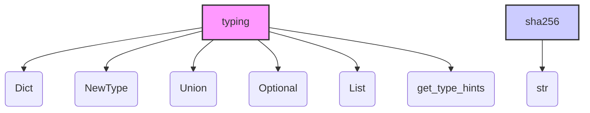

### **Анализ кода проекта `hypotez`**

=========================================================================================

Анализ файла: `hypotez/src/endpoints/freegpt-webui-ru/g4f/typing.py`

---

### **1. Блок-схема**

```mermaid
graph TD
    A[Начало] --> B{Импорт модулей};
    B --> C{Определение типа sha256};
    C --> D[Конец];

    subgraph Импорт модулей
        B --> B1[typing: Dict, NewType, Union, Optional, List, get_type_hints];
    end

    subgraph Определение типа sha256
        C --> C1[sha256 = NewType('sha_256_hash', str)];
    end
```

**Примеры для логических блоков:**

- **Импорт модулей:**
    - `from typing import Dict, NewType, Union, Optional, List, get_type_hints`
        - Пример использования `Dict`: `my_dict: Dict[str, int] = {'a': 1, 'b': 2}`
        - Пример использования `NewType`: `UserId = NewType('UserId', int)`
        - Пример использования `Union`: `value: Union[str, int] = 'hello' or 123`
        - Пример использования `Optional`: `name: Optional[str] = 'John' or None`
        - Пример использования `List`: `my_list: List[int] = [1, 2, 3]`
        - Пример использования `get_type_hints`: `hints = get_type_hints(MyClass)`

- **Определение типа sha256:**
    - `sha256 = NewType('sha_256_hash', str)`
        - Пример использования: `file_hash: sha256 = 'a948904f2f0d479d8f81a1e3a0c5a472'`

### **2. Диаграмма**



**Анализ зависимостей:**

- Модуль `typing` предоставляет инструменты для аннотации типов в Python.
    - `Dict`: Используется для обозначения типов словарей.
    - `NewType`: Используется для создания новых типов на основе существующих.
    - `Union`: Используется для обозначения переменных, которые могут иметь несколько типов.
    - `Optional`: Используется для обозначения переменных, которые могут быть `None`.
    - `List`: Используется для обозначения типов списков.
    - `get_type_hints`: Используется для получения аннотаций типов во время выполнения.
- `sha256` – это новый тип, созданный на основе `str`, предназначенный для представления SHA256-хешей.

### **3. Объяснение**

**Импорты:**

- `from typing import Dict, NewType, Union, Optional, List, get_type_hints`:
    - `Dict`: Класс для определения типов словарей (ключ-значение).
    - `NewType`: Функция для создания новых типов на основе существующих типов данных. Используется для повышения читаемости и предотвращения логических ошибок.
    - `Union`: Позволяет указывать, что переменная может иметь один из нескольких указанных типов.
    - `Optional`: Указывает, что переменная может иметь указанный тип или значение `None`. Эквивалентно `Union[T, None]`.
    - `List`: Класс для определения типов списков.
    - `get_type_hints`: Функция для получения аннотаций типов для объекта, функции или класса.

**Классы:**

- В данном коде классы отсутствуют.

**Функции:**

- `NewType(name, tp)`:
    - Аргументы:
        - `name` (str): Имя нового типа.
        - `tp` (type): Тип, на основе которого создается новый тип.
    - Возвращаемое значение: Новый тип.
    - Назначение: Создает новый тип с указанным именем на основе существующего типа.

**Переменные:**

- `sha256: NewType`:
    - Тип: `NewType`.
    - Использование: Определяет новый тип `sha256` для представления SHA256-хешей, основанный на типе `str`.

**Потенциальные ошибки и области для улучшения:**

- В данном коде нет явных потенциальных ошибок. Код выполняет простое определение типа.
- Область для улучшения: Добавить документацию (docstring) к переменной `sha256` для пояснения её назначения.

**Взаимосвязь с другими частями проекта:**

- Этот файл определяет типы данных, используемые в других частях проекта `hypotez`, в частности, в модуле `freegpt-webui-ru`, для обеспечения статической типизации и повышения читаемости кода. `sha256` может использоваться для аннотации переменных, содержащих SHA256-хеши, что помогает избежать ошибок и улучшает понимание кода.