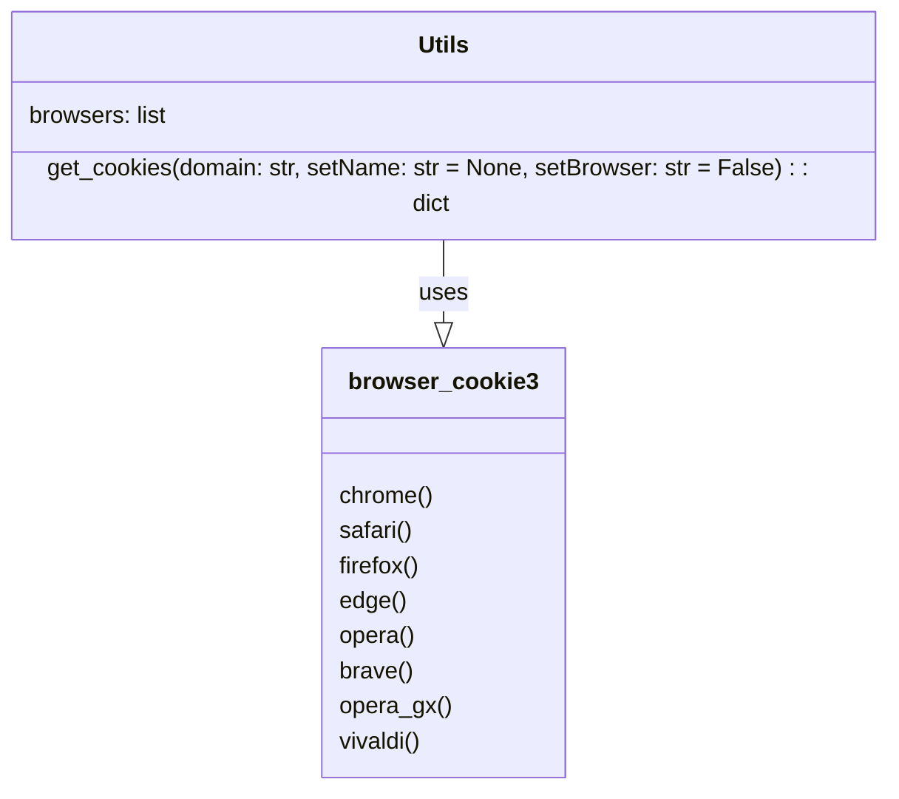

### **Системные инструкции для обработки кода проекта `hypotez`**

=========================================================================================

Описание функциональности и правил для генерации, анализа и улучшения кода. Направлено на обеспечение последовательного и читаемого стиля кодирования, соответствующего требованиям.

---

### **Основные принципы**

#### **1. Общие указания**:
- Соблюдай четкий и понятный стиль кодирования.
- Все изменения должны быть обоснованы и соответствовать установленным требованиям.

#### **2. Комментарии**:
- Используй `#` для внутренних комментариев.
- Документация всех функций, методов и классов должна следовать такому формату: 
    ```python
        def function(param: str, param1: Optional[str | dict | str] = None) -> dict | None:
            """ 
            Args:
                param (str): Описание параметра `param`.
                param1 (Optional[str | dict | str], optional): Описание параметра `param1`. По умолчанию `None`.
    
            Returns:
                dict | None: Описание возващаемого значения. Возвращает словарь или `None`.
    
            Raises:
                SomeError: Описание ситуации, в которой возникает исключение `SomeError`.

            Ехаmple:
                >>> function('param', 'param1')
                {'param': 'param1'}
            """
    ```
- Комментарии и документация должны быть четкими, лаконичными и точными.

#### **3. Форматирование кода**:
- Используй одинарные кавычки. `a:str = 'value'`, `print('Hello World!')`;
- Добавляй пробелы вокруг операторов. Например, `x = 5`;
- Все параметры должны быть аннотированы типами. `def function(param: str, param1: Optional[str | dict | str] = None) -> dict | None:`;
- Не используй `Union`. Вместо этого используй `|`.

#### **4. Логирование**:
- Для логгирования Всегда Используй модуль `logger` из `src.logger.logger`.
- Ошибки должны логироваться с использованием `logger.error`.
Пример:
    ```python
        try:
            ...
        except Exception as ex:
            logger.error('Error while processing data', ех, exc_info=True)
    ```
#### **5 Не используй `Union[]` в коде. Вместо него используй `|`
Например:
```python
x: str | int ...
```


---

### **Основные требования**:

#### **1. Формат ответов в Markdown**:
- Все ответы должны быть выполнены в формате **Markdown**.

#### **2. Формат комментариев**:
- Используй указанный стиль для комментариев и документации в коде.
- Пример:

```python
from typing import Generator, Optional, List
from pathlib import Path


def read_text_file(
    file_path: str | Path,
    as_list: bool = False,
    extensions: Optional[List[str]] = None,
    chunk_size: int = 8192,
) -> Generator[str, None, None] | str | None:
    """
    Считывает содержимое файла (или файлов из каталога) с использованием генератора для экономии памяти.

    Args:
        file_path (str | Path): Путь к файлу или каталогу.
        as_list (bool): Если `True`, возвращает генератор строк.
        extensions (Optional[List[str]]): Список расширений файлов для чтения из каталога.
        chunk_size (int): Размер чанков для чтения файла в байтах.

    Returns:
        Generator[str, None, None] | str | None: Генератор строк, объединенная строка или `None` в случае ошибки.

    Raises:
        Exception: Если возникает ошибка при чтении файла.

    Example:
        >>> from pathlib import Path
        >>> file_path = Path('example.txt')
        >>> content = read_text_file(file_path)
        >>> if content:
        ...    print(f'File content: {content[:100]}...')
        File content: Example text...
    """
    ...
```
- Всегда делай подробные объяснения в комментариях. Избегай расплывчатых терминов, 
- таких как *«получить»* или *«делать»*. Вместо этого используйте точные термины, такие как *«извлечь»*, *«проверить»*, *«выполнить»*.
- Вместо: *«получаем»*, *«возвращаем»*, *«преобразовываем»* используй имя объекта *«функция получае»*, *«переменная возвращает»*, *«код преобразовывает»* 
- Комментарии должны непосредственно предшествовать описываемому блоку кода и объяснять его назначение.

#### **3. Пробелы вокруг операторов присваивания**:
- Всегда добавляйте пробелы вокруг оператора `=`, чтобы повысить читаемость.
- Примеры:
  - **Неправильно**: `x=5`
  - **Правильно**: `x = 5`

#### **4. Использование `j_loads` или `j_loads_ns`**:
- Для чтения JSON или конфигурационных файлов замените стандартное использование `open` и `json.load` на `j_loads` или `j_loads_ns`.
- Пример:

```python
# Неправильно:
with open('config.json', 'r', encoding='utf-8') as f:
    data = json.load(f)

# Правильно:
data = j_loads('config.json')
```

#### **5. Сохранение комментариев**:
- Все существующие комментарии, начинающиеся с `#`, должны быть сохранены без изменений в разделе «Улучшенный код».
- Если комментарий кажется устаревшим или неясным, не изменяйте его. Вместо этого отметьте его в разделе «Изменения».

#### **6. Обработка `...` в коде**:
- Оставляйте `...` как указатели в коде без изменений.
- Не документируйте строки с `...`.
```

#### **7. Аннотации**
Для всех переменных должны быть определены аннотации типа. 
Для всех функций все входные и выходные параметры аннотириваны
Для все параметров должны быть аннотации типа.


### **8. webdriver**
В коде используется webdriver. Он импртируется из модуля `webdriver` проекта `hypotez`
```python
from src.webdirver import Driver, Chrome, Firefox, Playwright, ...
driver = Driver(Firefox)

Пoсле чего может использоваться как

close_banner = {
  "attribute": null,
  "by": "XPATH",
  "selector": "//button[@id = 'closeXButton']",
  "if_list": "first",
  "use_mouse": false,
  "mandatory": false,
  "timeout": 0,
  "timeout_for_event": "presence_of_element_located",
  "event": "click()",
  "locator_description": "Закрываю pop-up окно, если оно не появилось - не страшно (`mandatory`:`false`)"
}

result = driver.execute_locator(close_banner)
```

### Анализ кода `hypotez/src/endpoints/freegpt-webui-ru/g4f/utils.py`

#### 1. Блок-схема

```mermaid
graph TD
    A[Начало: Вызов Utils.get_cookies(domain: str, setName: str = None, setBrowser: str = False)] --> B{setBrowser != False?};
    B -- Да --> C[Перебор браузеров из Utils.browsers];
    B -- Нет --> G[Перебор браузеров из Utils.browsers];
    C --> D{browser.__name__ == setBrowser?};
    D -- Да --> E[Попытка получить cookies для домена из указанного браузера];
    D -- Нет --> C;
    E --> F{Успешно?};
    F -- Да --> H[Добавление cookies в словарь cookies];
    F -- Нет --> C;
    H --> C;
    G --> I[Попытка получить cookies для домена из каждого браузера];
    I --> J{Успешно?};
    J -- Да --> K[Добавление cookies в словарь cookies];
    J -- Нет --> G;
    K --> G;
    C --> L{setName?};
    G --> L;
    L -- Да --> M[Попытка вернуть конкретный cookie из словаря cookies];
    L -- Нет --> N[Возврат словаря cookies];
    M --> O{Cookie найден?};
    O -- Да --> P[Возврат словаря с конкретным cookie];
    O -- Нет --> Q[Вывод сообщения об ошибке и выход из программы];
    P --> R[Конец];
    N --> R;
    Q --> R;
```

**Примеры для логических блоков:**

- **A**: `Utils.get_cookies("example.com")` или `Utils.get_cookies("example.com", "session_id")` или `Utils.get_cookies("example.com", setBrowser="chrome")`.
- **B**: Если `setBrowser` указан (например, `"chrome"`), то переходим к блоку C. Если нет, переходим к блоку G.
- **D**: Проверяем, соответствует ли имя текущего браузера значению `setBrowser`.
- **E**: `browser_cookie3.chrome(domain_name="example.com")` – попытка получить куки из Chrome для домена "example.com".
- **F**: Если при получении куки возникает исключение (например, браузер не установлен), переходим к следующему браузеру.
- **H**: `cookies = cookies | {c.name: c.value}` – добавление полученных куки в общий словарь.
- **J**: Если при получении куки возникает исключение (например, для конкретного браузера), переходим к следующему браузеру.
- **L**: Проверка, указано ли имя конкретного cookie (`setName`).
- **M**: `cookies["session_id"]` – попытка получить cookie с именем "session_id".
- **O**: Если cookie с именем `setName` не найден, выводим сообщение об ошибке и завершаем программу.

#### 2. Диаграмма



**Объяснение:**

- `Utils`: Класс, содержащий список браузеров и метод для получения куки.
    - `browsers`: Список функций из модуля `browser_cookie3`, представляющих различные браузеры.
    - `get_cookies`: Метод, который получает куки для указанного домена из всех или указанного браузера.

- `browser_cookie3`: Модуль, предоставляющий функции для получения куки из различных браузеров.
    - `chrome`, `safari`, `firefox`, `edge`, `opera`, `brave`, `opera_gx`, `vivaldi`: Функции, которые возвращают куки для соответствующих браузеров.

**Зависимости:**

- Класс `Utils` использует функции из модуля `browser_cookie3` для получения куки различных браузеров.

#### 3. Объяснение

**Импорты:**

- `import browser_cookie3`: Этот модуль предоставляет функции для доступа к куки, сохраненным в различных браузерах (Chrome, Firefox, Safari и т. д.). Он используется для извлечения куки с целью автоматизации или обхода ограничений.

**Класс `Utils`:**

- **Роль**: Предоставляет утилиту для извлечения куки из различных браузеров.
- **Атрибуты**:
    - `browsers`: Список функций из модуля `browser_cookie3`, каждая из которых соответствует определенному браузеру.
- **Методы**:
    - `get_cookies(domain: str, setName: str = None, setBrowser: str = False) -> dict`:
        - **Аргументы**:
            - `domain` (str): Домен, для которого нужно получить куки.
            - `setName` (str, optional): Имя конкретного cookie, который нужно получить. Если `None`, возвращаются все куки. По умолчанию `None`.
            - `setBrowser` (str, optional): Имя браузера, из которого нужно получить куки. Если `False`, куки извлекаются из всех поддерживаемых браузеров. По умолчанию `False`.
        - **Возвращаемое значение**:
            - `dict`: Словарь, содержащий куки. Если указан `setName`, возвращается словарь, содержащий только этот cookie.
        - **Назначение**:
            - Извлекает куки из указанного браузера(ов) для указанного домена. Если указано имя конкретного cookie, возвращает только этот cookie.
        - **Примеры**:
            - `Utils.get_cookies("example.com")`: Возвращает все куки для домена "example.com" из всех поддерживаемых браузеров.
            - `Utils.get_cookies("example.com", "session_id")`: Возвращает cookie с именем "session_id" для домена "example.com" из всех поддерживаемых браузеров.
            - `Utils.get_cookies("example.com", setBrowser="chrome")`: Возвращает все куки для домена "example.com" только из браузера Chrome.
        - **Логика работы**:
            1. Инициализирует пустой словарь `cookies` для хранения куки.
            2. Если указан конкретный браузер (`setBrowser`), перебирает только этот браузер. Иначе перебирает все браузеры в списке `Utils.browsers`.
            3. Пытается получить куки для указанного домена из текущего браузера.
            4. Если получение куки успешно, добавляет их в словарь `cookies`, если cookie с таким именем еще не существует.
            5. Если указано имя конкретного cookie (`setName`), пытается вернуть словарь, содержащий только этот cookie. Если cookie не найден, выводит сообщение об ошибке и завершает программу.
            6. Если имя cookie не указано, возвращает словарь `cookies`, содержащий все полученные куки.

**Переменные:**

- `browsers`: Список, содержащий функции для получения куки из различных браузеров.
- `cookies`: Словарь, используемый для хранения полученных куки.
- `domain`: Строка, представляющая домен, для которого нужно получить куки.
- `setName`: Строка, представляющая имя конкретного cookie, который нужно получить.
- `setBrowser`: Строка, представляющая имя браузера, из которого нужно получить куки.

**Потенциальные ошибки и области для улучшения:**

1.  **Обработка исключений**: В блоках `try...except` обрабатываются все исключения без разбора. Желательно конкретизировать обрабатываемые исключения и логировать ошибки с использованием `logger.error`.
2.  **Выход из программы**: При отсутствии cookie с указанным именем программа завершается (`exit(1)`). Это может быть нежелательным поведением, лучше возвращать `None` или выбрасывать исключение, которое можно обработать выше по стеку вызовов.
3.  **Объединение словарей**: Использование `cookies = cookies | {c.name: c.value}` для объединения словарей может быть неэффективным для больших объемов данных. Лучше использовать `cookies.update({c.name: c.value})`.
4.  **Отсутствие аннотации типов**: В коде отсутствуют аннотации типов для переменных и возвращаемых значений. Это усложняет чтение и понимание кода.

**Цепочка взаимосвязей с другими частями проекта:**

Этот модуль может использоваться другими частями проекта `hypotez`, где требуется автоматизированный доступ к веб-сайтам с использованием куки, например, для обхода авторизации или сбора данных. Этот модуль может использоваться в `src/webdirver` для предварительной установки куки в браузере перед началом работы.