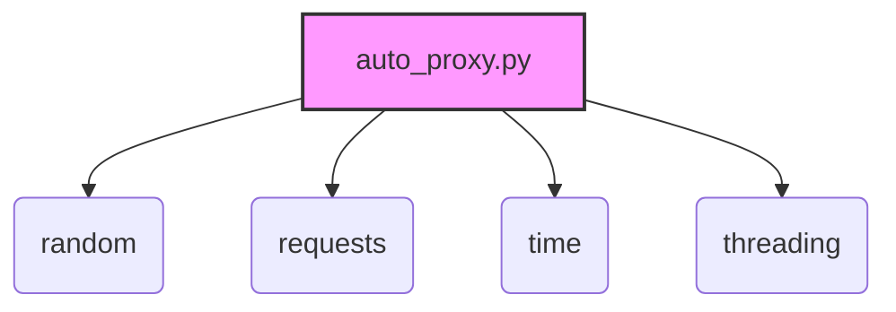

### **Системные инструкции для обработки кода проекта `hypotez`**

=========================================================================================

Описание функциональности и правил для генерации, анализа и улучшения кода. Направлено на обеспечение последовательного и читаемого стиля кодирования, соответствующего требованиям.

---

### **Основные принципы**

#### **1. Общие указания**:
- Соблюдай четкий и понятный стиль кодирования.
- Все изменения должны быть обоснованы и соответствовать установленным требованиям.

#### **2. Комментарии**:
- Используй `#` для внутренних комментариев.
- Документация всех функций, методов и классов должна следовать такому формату: 
    ```python
        def function(param: str, param1: Optional[str | dict | str] = None) -> dict | None:
            """ 
            Args:
                param (str): Описание параметра `param`.
                param1 (Optional[str | dict | str], optional): Описание параметра `param1`. По умолчанию `None`.
    
            Returns:
                dict | None: Описание возвращаемого значения. Возвращает словарь или `None`.
    
            Raises:
                SomeError: Описание ситуации, в которой возникает исключение `SomeError`.

            Ехаmple:
                >>> function('param', 'param1')
                {'param': 'param1'}
            """
    ```
- Комментарии и документация должны быть четкими, лаконичными и точными.

#### **3. Форматирование кода**:
- Используй одинарные кавычки. `a:str = 'value'`, `print('Hello World!')`;
- Добавляй пробелы вокруг операторов. Например, `x = 5`;
- Все параметры должны быть аннотированы типами. `def function(param: str, param1: Optional[str | dict | str] = None) -> dict | None:`;
- Не используй `Union`. Вместо этого используй `|`.

#### **4. Логирование**:
- Для логгирования Всегда Используй модуль `logger` из `src.logger.logger`.
- Ошибки должны логироваться с использованием `logger.error`.
Пример:
    ```python
        try:
            ...
        except Exception as ex:
            logger.error('Error while processing data', ех, exc_info=True)
    ```
#### **5 Не используй `Union[]` в коде. Вместо него используй `|`
Например:
```python
x: str | int ...
```


---

### **Основные требования**:

#### **1. Формат ответов в Markdown**:
- Все ответы должны быть выполнены в формате **Markdown**.

#### **2. Формат комментариев**:
- Используй указанный стиль для комментариев и документации в коде.
- Пример:

```python
from typing import Generator, Optional, List
from pathlib import Path


def read_text_file(
    file_path: str | Path,
    as_list: bool = False,
    extensions: Optional[List[str]] = None,
    chunk_size: int = 8192,
) -> Generator[str, None, None] | str | None:
    """
    Считывает содержимое файла (или файлов из каталога) с использованием генератора для экономии памяти.

    Args:
        file_path (str | Path): Путь к файлу или каталогу.
        as_list (bool): Если `True`, возвращает генератор строк.
        extensions (Optional[List[str]]): Список расширений файлов для чтения из каталога.
        chunk_size (int): Размер чанков для чтения файла в байтах.

    Returns:
        Generator[str, None, None] | str | None: Генератор строк, объединенная строка или `None` в случае ошибки.

    Raises:
        Exception: Если возникает ошибка при чтении файла.

    Example:
        >>> from pathlib import Path
        >>> file_path = Path('example.txt')
        >>> content = read_text_file(file_path)
        >>> if content:
        ...    print(f'File content: {content[:100]}...')
        File content: Example text...
    """
    ...
```
- Всегда делай подробные объяснения в комментариях. Избегай расплывчатых терминов, 
- таких как *«получить»* или *«делать»*
-  . Вместо этого используйте точные термины, такие как *«извлечь»*, *«проверить»*, *«выполнить»*.
- Вместо: *«получаем»*, *«возвращаем»*, *«преобразовываем»* используй имя объекта *«функция получае»*, *«переменная возвращает»*, *«код преобразовывает»* 
- Комментарии должны непосредственно предшествовать описываемому блоку кода и объяснять его назначение.

#### **3. Пробелы вокруг операторов присваивания**:
- Всегда добавляйте пробелы вокруг оператора `=`, чтобы повысить читаемость.
- Примеры:
  - **Неправильно**: `x=5`
  - **Правильно**: `x = 5`

#### **4. Использование `j_loads` или `j_loads_ns`**:
- Для чтения JSON или конфигурационных файлов замените стандартное использование `open` и `json.load` на `j_loads` или `j_loads_ns`.
- Пример:

```python
# Неправильно:
with open('config.json', 'r', encoding='utf-8') as f:
    data = json.load(f)

# Правильно:
data = j_loads('config.json')
```

#### **5. Сохранение комментариев**:
- Все существующие комментарии, начинающиеся с `#`, должны быть сохранены без изменений в разделе «Улучшенный код».
- Если комментарий кажется устаревшим или неясным, не изменяйте его. Вместо этого отметьте его в разделе «Изменения».

#### **6. Обработка `...` в коде**:
- Оставляйте `...` как указатели в коде без изменений.
- Не документируйте строки с `...`.
```

#### **7. Аннотации**
Для всех переменных должны быть определены аннотации типа. 
Для всех функций все входные и выходные параметры аннотириваны
Для все параметров должны быть аннотации типа.


### **8. webdriver**
В коде используется webdriver. Он импртируется из модуля `webdriver` проекта `hypotez`
```python
from src.webdirver import Driver, Chrome, Firefox, Playwright, ...
driver = Driver(Firefox)

Пoсле чего может использоваться как

close_banner = {
  "attribute": null,
  "by": "XPATH",
  "selector": "//button[@id = 'closeXButton']",
  "if_list": "first",
  "use_mouse": false,
  "mandatory": false,
  "timeout": 0,
  "timeout_for_event": "presence_of_element_located",
  "event": "click()",
  "locator_description": "Закрываю pop-up окно, если оно не появилось - не страшно (`mandatory`:`false`)"
}

result = driver.execute_locator(close_banner)
```

## Анализ кода `hypotez/src/endpoints/freegpt-webui-ru/server/auto_proxy.py`

### 1. Блок-схема

```mermaid
graph LR
    A[Начало: Вызов `update_working_proxies`] --> B{`working_proxies = []`}
    B --> C[Вызов `get_working_proxies(test_prompt)`]
    C --> D[Вызов `fetch_proxies()`]
    D --> E{Получение списка прокси с "https://www.proxy-list.download/api/v1/get?type=http"}
    E -- Успех --> F[Разделение ответа на список прокси]
    E -- Ошибка --> G[Вывод сообщения об ошибке и возврат пустого списка]
    F --> H{Цикл по списку прокси}
    H -- Для каждого прокси --> I[Создание и запуск потока для `test_proxy`]
    I --> J[Вызов `test_proxy(proxy, prompt, timeout)`]
    J --> K{Измерение времени ответа прокси}
    K -- Время ответа < timeout --> L[Вывод сообщения об успехе и добавление прокси в `working_proxies`]
    K -- Время ответа >= timeout --> M[Исключение или пропуск]
    J -- Exception --> M
    L --> N[Вызов `add_working_proxy(proxy)`]
    N --> O{`working_proxies.append(proxy)`}
    O --> H
    H -- Все прокси проверены --> P{Ожидание завершения всех потоков}
    P --> Q[Вывод сообщения "proxies updated"]
    Q --> R{`time.sleep(1800)` (30 минут)}
    R --> A

    style A fill:#f9f,stroke:#333,stroke-width:2px
    style B fill:#ccf,stroke:#333,stroke-width:2px
    style C fill:#ccf,stroke:#333,stroke-width:2px
    style D fill:#ccf,stroke:#333,stroke-width:2px
    style E fill:#ffc,stroke:#333,stroke-width:2px
    style F fill:#ccf,stroke:#333,stroke-width:2px
    style G fill:#fcc,stroke:#333,stroke-width:2px
    style H fill:#ccf,stroke:#333,stroke-width:2px
    style I fill:#ccf,stroke:#333,stroke-width:2px
    style J fill:#ccf,stroke:#333,stroke-width:2px
    style K fill:#ccf,stroke:#333,stroke-width:2px
    style L fill:#cfc,stroke:#333,stroke-width:2px
    style M fill:#fcc,stroke:#333,stroke-width:2px
    style N fill:#ccf,stroke:#333,stroke-width:2px
    style O fill:#cfc,stroke:#333,stroke-width:2px
    style P fill:#ccf,stroke:#333,stroke-width:2px
    style Q fill:#ccf,stroke:#333,stroke-width:2px
    style R fill:#ccf,stroke:#333,stroke-width:2px
```

### 2. Диаграмма зависимостей



**Объяснение зависимостей:**

-   `random`: Используется для случайного выбора прокси из списка рабочих прокси.
-   `requests`: Используется для выполнения HTTP-запросов для получения списка прокси и тестирования прокси-серверов.
-   `time`: Используется для измерения времени ответа прокси-серверов и для задержки между обновлениями списка прокси.
-   `threading`: Используется для выполнения тестов прокси в параллельных потоках.

### 3. Объяснение

#### Импорты:

-   `random`: Используется для выбора случайного рабочего прокси из списка `working_proxies`.
-   `requests`: Используется для отправки HTTP-запроса к `https://www.proxy-list.download/api/v1/get?type=http` для получения списка прокси серверов.
-   `time`: Используется для измерения времени ответа прокси-сервера и для приостановки выполнения программы на заданный интервал времени в функции `update_working_proxies`.
-   `threading`: Используется для создания и управления потоками, что позволяет параллельно тестировать несколько прокси-серверов.

#### Переменные:

-   `working_proxies`: Глобальный список, содержащий рабочие прокси-серверы. Инициализируется как пустой список и обновляется функцией `update_working_proxies`.
-   `url`: URL для получения списка прокси-серверов.
-   `test_prompt`: Используется для проверки прокси.

#### Функции:

-   `fetch_proxies()`:
    -   **Назначение**: Получает список прокси-серверов с сайта `www.proxy-list.download`.
    -   **Возвращаемое значение**: Список прокси-серверов в формате `"IP:Port"`. Если запрос не удался, возвращает пустой список.
    -   **Пример**:

        ```python
        proxies = fetch_proxies()
        if proxies:
            print(f"Получено {len(proxies)} прокси.")
        else:
            print("Не удалось получить прокси.")
        ```

-   `test_proxy(proxy: str, prompt: str, timeout: int)`:
    -   **Назначение**: Проверяет, работает ли прокси-сервер, отправляя тестовый запрос.
    -   **Аргументы**:
        -   `proxy`: Прокси-сервер в формате `"IP:Port"`.
        -   `prompt`: Тестовый запрос для проверки прокси.
        -   `timeout`: Максимальное время ожидания ответа от прокси-сервера в секундах.
    -   Функция измеряет время ответа прокси-сервера и, если время ответа меньше заданного таймаута, добавляет прокси-сервер в список `working_proxies`.
    -   **Пример**:

        ```python
        test_proxy("127.0.0.1:8080", "Test prompt", 5)
        ```

-   `add_working_proxy(proxy: str)`:
    -   **Назначение**: Добавляет прокси-сервер в глобальный список `working_proxies`.
    -   **Аргументы**:
        -   `proxy`: Прокси-сервер в формате `"IP:Port"`.

-   `remove_proxy(proxy: str)`:
    -   **Назначение**: Удаляет прокси-сервер из глобального списка `working_proxies`.
    -   **Аргументы**:
        -   `proxy`: Прокси-сервер в формате `"IP:Port"`.

-   `get_working_proxies(prompt: str, timeout: int = 5)`:
    -   **Назначение**: Получает список прокси-серверов и тестирует их, добавляя рабочие прокси в список `working_proxies`.
    -   **Аргументы**:
        -   `prompt`: Тестовый запрос для проверки прокси.
        -   `timeout`: Максимальное время ожидания ответа от прокси-сервера в секундах.
    -   Функция создает потоки для параллельного тестирования прокси-серверов.
    -   **Пример**:

        ```python
        get_working_proxies("What is the capital of France?", 5)
        ```

-   `update_working_proxies()`:
    -   **Назначение**: Обновляет список `working_proxies`, периодически запрашивая и тестируя новые прокси-серверы.
    -   Функция запускается в отдельном потоке и работает непрерывно, обновляя список прокси-серверов каждые 30 минут.
    -   **Пример**:

        ```python
        update_working_proxies() # запустится в отдельном потоке
        ```

-   `get_random_proxy()`:
    -   **Назначение**: Возвращает случайный рабочий прокси-сервер из списка `working_proxies`.
    -   **Возвращаемое значение**: Случайный прокси-сервер в формате `"IP:Port"`.
    -   **Пример**:

        ```python
        proxy = get_random_proxy()
        if proxy:
            print(f"Случайный прокси: {proxy}")
        else:
            print("Нет рабочих прокси.")
        ```

#### Потенциальные ошибки и области для улучшения:

1.  **Отсутствие обработки исключений в `test_proxy`**: Блок `except Exception as e` в функции `test_proxy` просто пропускает исключение. Это может привести к тому, что не будут обнаружены неработающие прокси. Необходимо добавить логирование ошибок с использованием `logger.error` из `src.logger.logger`.
2.  **Отсутствие аннотаций типов**: В коде отсутствуют аннотации типов для переменных и возвращаемых значений функций. Это затрудняет чтение и понимание кода.
3.  **Неэффективное использование глобальных переменных**: Использование глобальной переменной `working_proxies` может привести к проблемам с многопоточностью. Рассмотреть возможность использования блокировок для защиты доступа к этой переменной.
4.  **Жестко заданный URL**: URL для получения списка прокси жестко задан в коде. Рассмотреть возможность вынесения его в конфигурационный файл.
5.  **Отсутствие обработки ошибок при получении прокси**: Если `response.status_code` не равен 200, возвращается пустой список, но не предпринимается попыток повторного запроса или использования резервного источника прокси.
6.  **Отсутствие таймаутов для запросов**: При выполнении запросов к прокси-серверам не установлены таймауты, что может привести к зависанию потоков при недоступности прокси.

#### Взаимосвязи с другими частями проекта:

-   Этот код может использоваться в других частях проекта `hypotez` для автоматического получения и использования прокси-серверов при выполнении запросов к внешним API. Например, он может быть использован для обхода ограничений на количество запросов с одного IP-адреса.
-   Для логирования ошибок необходимо использовать модуль `logger` из `src.logger.logger`.

```python
from src.logger.logger import logger

def test_proxy(proxy: str, prompt: str, timeout: int):
    """Test the given proxy server with a specified prompt and timeout.

    Args:
        proxy (str): The proxy server in the format "IP:Port".
        prompt (str): The test prompt to be used for testing.
        timeout (int): The maximum time in seconds allowed for the test.
    """
    try:
        start_time = time.time()
        # res = gpt3.Completion.create(prompt=prompt, proxy=proxy)
        end_time = time.time()
        response_time = end_time - start_time

        if response_time < timeout:
            response_time = int(response_time*1000)
            print(f'proxy: {proxy} [{response_time}ms] ✅')
            add_working_proxy((proxy))
    except Exception as e:
        logger.error(f"Proxy {proxy} failed: {e}", exc_info=True)