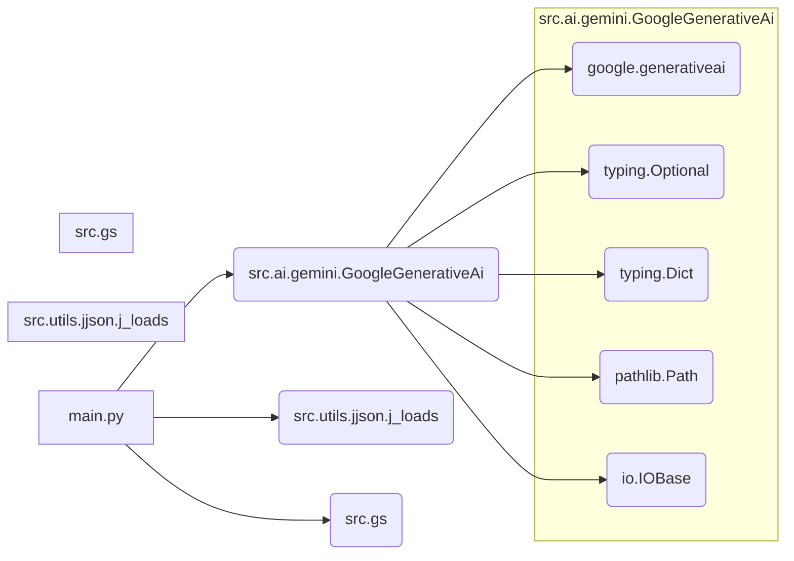

### **Системные инструкции для обработки кода проекта `hypotez`**

=========================================================================================

Описание функциональности и правил для генерации, анализа и улучшения кода. Направлено на обеспечение последовательного и читаемого стиля кодирования, соответствующего требованиям.

---

### **Основные принципы**

#### **1. Общие указания**:
- Соблюдай четкий и понятный стиль кодирования.
- Все изменения должны быть обоснованы и соответствовать установленным требованиям.

#### **2. Комментарии**:
- Используй `#` для внутренних комментариев.
- Документация всех функций, методов и классов должна следовать такому формату: 
    ```python
        def function(param: str, param1: Optional[str | dict | str] = None) -> dict | None:
            """ 
            Args:
                param (str): Описание параметра `param`.
                param1 (Optional[str | dict | str], optional): Описание параметра `param1`. По умолчанию `None`.
    
            Returns:
                dict | None: Описание возвращаемого значения. Возвращает словарь или `None`.
    
            Raises:
                SomeError: Описание ситуации, в которой возникает исключение `SomeError`.

            Ехаmple:
                >>> function('param', 'param1')
                {'param': 'param1'}
            """
    ```
- Комментарии и документация должны быть четкими, лаконичными и точными.

#### **3. Форматирование кода**:
- Используй одинарные кавычки. `a:str = 'value'`, `print('Hello World!')`;
- Добавляй пробелы вокруг операторов. Например, `x = 5`;
- Все параметры должны быть аннотированы типами. `def function(param: str, param1: Optional[str | dict | str] = None) -> dict | None:`;
- Не используй `Union`. Вместо этого используй `|`.

#### **4. Логирование**:
- Для логгирования Всегда Используй модуль `logger` из `src.logger.logger`.
- Ошибки должны логироваться с использованием `logger.error`.
Пример:
    ```python
        try:
            ...
        except Exception as ex:
            logger.error('Error while processing data', ех, exc_info=True)
    ```
#### **5 Не используй `Union[]` в коде. Вместо него используй `|`
Например:
```python
x: str | int ...
```


---

### **Основные требования**:

#### **1. Формат ответов в Markdown**:
- Все ответы должны быть выполнены в формате **Markdown**.

#### **2. Формат комментариев**:
- Используй указанный стиль для комментариев и документации в коде.
- Пример:

```python
from typing import Generator, Optional, List
from pathlib import Path


def read_text_file(
    file_path: str | Path,
    as_list: bool = False,
    extensions: Optional[List[str]] = None,
    chunk_size: int = 8192,
) -> Generator[str, None, None] | str | None:
    """
    Считывает содержимое файла (или файлов из каталога) с использованием генератора для экономии памяти.

    Args:
        file_path (str | Path): Путь к файлу или каталогу.
        as_list (bool): Если `True`, возвращает генератор строк.
        extensions (Optional[List[str]]): Список расширений файлов для чтения из каталога.
        chunk_size (int): Размер чанков для чтения файла в байтах.

    Returns:
        Generator[str, None, None] | str | None: Генератор строк, объединенная строка или `None` в случае ошибки.

    Raises:
        Exception: Если возникает ошибка при чтении файла.

    Example:
        >>> from pathlib import Path
        >>> file_path = Path('example.txt')
        >>> content = read_text_file(file_path)
        >>> if content:
        ...    print(f'File content: {content[:100]}...')
        File content: Example text...
    """
    ...
```
- Всегда делай подробные объяснения в комментариях. Избегай расплывчатых терминов, 
- таких как *«получить»* или *«делать»*
-  . Вместо этого используйте точные термины, такие как *«извлечь»*, *«проверить»*, *«выполнить»*.
- Вместо: *«получаем»*, *«возвращаем»*, *«преобразовываем»* используй имя объекта *«функция получае»*, *«переменная возвращает»*, *«код преобразовывает»* 
- Комментарии должны непосредственно предшествовать описываемому блоку кода и объяснять его назначение.

#### **3. Пробелы вокруг операторов присваивания**:
- Всегда добавляйте пробелы вокруг оператора `=`, чтобы повысить читаемость.
- Примеры:
  - **Неправильно**: `x=5`
  - **Правильно**: `x = 5`

#### **4. Использование `j_loads` или `j_loads_ns`**:
- Для чтения JSON или конфигурационных файлов замените стандартное использование `open` и `json.load` на `j_loads` или `j_loads_ns`.
- Пример:

```python
# Неправильно:
with open('config.json', 'r', encoding='utf-8') as f:
    data = json.load(f)

# Правильно:
data = j_loads('config.json')
```

#### **5. Сохранение комментариев**:
- Все существующие комментарии, начинающиеся с `#`, должны быть сохранены без изменений в разделе «Улучшенный код».
- Если комментарий кажется устаревшим или неясным, не изменяйте его. Вместо этого отметьте его в разделе «Изменения».

#### **6. Обработка `...` в коде**:
- Оставляйте `...` как указатели в коде без изменений.
- Не документируйте строки с `...`.
```

#### **7. Аннотации**
Для всех переменных должны быть определены аннотации типа. 
Для всех функций все входные и выходные параметры аннотириваны
Для все параметров должны быть аннотации типа.


### **8. webdriver**
В коде используется webdriver. Он импртируется из модуля `webdriver` проекта `hypotez`
```python
from src.webdirver import Driver, Chrome, Firefox, Playwright, ...
driver = Driver(Firefox)

Пoсле чего может использоваться как

close_banner = {
  "attribute": null,
  "by": "XPATH",
  "selector": "//button[@id = 'closeXButton']",
  "if_list": "first",
  "use_mouse": false,
  "mandatory": false,
  "timeout": 0,
  "timeout_for_event": "presence_of_element_located",
  "event": "click()",
  "locator_description": "Закрываю pop-up окно, если оно не появилось - не страшно (`mandatory`:`false`)"
}

result = driver.execute_locator(close_banner)
```

## Анализ кода `hypotez/src/endpoints/gemini_simplechat/README.MD`

### 1. Блок-схема

```mermaid
graph LR
    A[Начало: Инициализация] --> B(Чтение конфигурационного файла `config.json`);
    B --> C{Проверка наличия API ключа Gemini};
    C -- Да --> D(Инициализация класса `GoogleGenerativeAi` с API ключом и системными инструкциями);
    C -- Нет --> E(Вывод сообщения об ошибке: "API ключ не найден");
    D --> F{Выбор действия: чат, описание изображения, загрузка файла};
    F -- Чат --> G(Ввод сообщения пользователя);
    G --> H(Вызов метода `chat(q: str)` класса `GoogleGenerativeAi`);
    H --> I{Получение ответа от модели Gemini};
    I -- Успех --> J(Вывод ответа Gemini);
    I -- Ошибка --> K(Обработка ошибки и повторная попытка);
    F -- Описание изображения --> L(Выбор пути к изображению или ввод байтов изображения);
    L --> M(Вызов метода `describe_image(image: Path | bytes, mime_type: Optional[str], prompt: Optional[str])` класса `GoogleGenerativeAi`);
    M --> N{Получение описания изображения от модели Gemini};
    N -- Успех --> O(Вывод описания изображения);
    N -- Ошибка --> K;
    F -- Загрузка файла --> P(Выбор пути к файлу);
    P --> Q(Вызов метода `upload_file(file: str | Path | IOBase, file_name: Optional[str])` класса `GoogleGenerativeAi`);
    Q --> R{Получение статуса загрузки файла};
    R -- Успех --> S(Вывод сообщения об успешной загрузке);
    R -- Ошибка --> K;
    K --> T{Превышено количество попыток?};
    T -- Да --> U(Вывод сообщения об ошибке и завершение);
    T -- Нет --> H;
    J --> G;
    O --> G;
    S --> G;
```

**Примеры для логических блоков:**

-   **B (Чтение конфигурационного файла):** Читается файл `config.json` с использованием `j_loads` или стандартного `json.load`, чтобы получить API-ключ и другие параметры.

    ```python
    config = j_loads('config.json')
    api_key = config['credentials']['gemini']['api_key']
    ```

-   **D (Инициализация класса `GoogleGenerativeAi`):** Создается экземпляр класса `GoogleGenerativeAi` с использованием API-ключа и системных инструкций.

    ```python
    ai = GoogleGenerativeAi(api_key=api_key, system_instruction=system_instruction)
    ```

-   **H (Вызов метода `chat(q: str)`):** Отправляется сообщение пользователя в чат и получается ответ от модели Gemini.

    ```python
    ai_message = await ai.chat(user_message)
    ```

-   **M (Вызов метода `describe_image(image: Path | bytes, mime_type: Optional[str], prompt: Optional[str])`):** Отправляется изображение на описание и получается текстовое описание.

    ```python
    description = await ai.describe_image(image_path, prompt=prompt)
    ```

### 2. Диаграмма



**Объяснение зависимостей:**

-   **`main.py`:** Основной файл, который использует класс `GoogleGenerativeAi`, функцию `j_loads` и глобальные настройки из `src.gs`.
-   **`src.ai.gemini.GoogleGenerativeAi`:** Класс, который обертывает API Google Gemini, использует библиотеки `google.generativeai` для взаимодействия с API, `typing` для аннотации типов, `pathlib` для работы с путями к файлам и `io` для работы с файловыми объектами.
-   **`src.utils.jjson.j_loads`:** Функция для удобной загрузки JSON файлов.
-   **`src.gs`:** Модуль, предоставляющий глобальные настройки, включая API-ключи и пути.
-   **`google.generativeai`:** Библиотека Google для взаимодействия с Gemini API.

### 3. Объяснение

-   **Импорты:**
    -   `src.ai.gemini.GoogleGenerativeAi`: Класс для взаимодействия с API Google Gemini.
    -   `src.utils.jjson.j_loads`: Функция для загрузки JSON файлов конфигурации.
    -   `src.gs`: Модуль глобальных настроек, содержащий API-ключи и пути.
    -   `asyncio`: Библиотека для асинхронного программирования.
    -   `pathlib.Path`: Класс для представления путей к файлам и директориям.

-   **Класс `GoogleGenerativeAi`:**
    -   **Роль:** Обеспечивает интерфейс для взаимодействия с моделями Google Gemini.
    -   **Атрибуты:**
        -   `api_key` (str): API-ключ Google Gemini.
        -   `model_name` (str): Имя используемой модели Gemini (по умолчанию `"gemini-2.0-flash-exp"`).
        -   `generation_config` (Dict): Настройки генерации текста (по умолчанию `None`).
        -   `system_instruction` (Optional[str]): Системные инструкции для модели.
    -   **Методы:**
        -   `__init__(api_key: str, model_name: str = "gemini-2.0-flash-exp", generation_config: Dict = None, system_instruction: Optional[str] = None)`: Инициализирует объект класса.
        -   `ask(q: str, attempts: int = 15) -> Optional[str]`: Отправляет текстовый запрос к модели и возвращает ответ.
        -   `chat(q: str) -> Optional[str]`: Отправляет запрос в чат и поддерживает историю диалога.
        -   `describe_image(image: Path | bytes, mime_type: Optional[str] = 'image/jpeg', prompt: Optional[str] = '') -> Optional[str]`: Описывает изображение.
        -   `upload_file(file: str | Path | IOBase, file_name: Optional[str] = None) -> bool`: Загружает файл в Gemini API.
    -   **Взаимодействие:** Класс `GoogleGenerativeAi` использует библиотеку `google.generativeai` для отправки запросов к API Google Gemini и получения ответов.

-   **Функции:**
    -   `main()`: Асинхронная функция, демонстрирующая примеры использования класса `GoogleGenerativeAi`.
        -   Загружает изображение, описывает его с использованием различных промптов, загружает файл и запускает интерактивный чат.
        -   Использует `j_loads` для разбора JSON-ответа.
        -   Использует `asyncio.run()` для запуска асинхронной функции.
    -   `upload_file()`: загружает файл в Gemini API

-   **Переменные:**
    -   `api_key` (str): API-ключ Google Gemini, полученный из `gs.credentials.gemini.api_key`.
    -   `system_instruction` (str): Системные инструкции для модели.
    -   `ai` (GoogleGenerativeAi): Экземпляр класса `GoogleGenerativeAi`.
    -   `image_path` (Path): Путь к файлу изображения.
    -   `description` (Optional[str]): Описание изображения, полученное от модели.
    -   `user_message` (str): Сообщение пользователя, введенное в чате.
    -   `ai_message` (Optional[str]): Ответ модели Gemini.

-   **Потенциальные ошибки и области для улучшения:**
    -   Обработка ошибок при загрузке и описании изображений может быть улучшена.
    -   Логирование ошибок и диалогов можно сделать более подробным.
    -   Необходимо добавить обработку исключений при чтении конфигурационного файла.
    -   Следует рассмотреть возможность добавления аннотаций типов.

-   **Взаимосвязи с другими частями проекта:**
    -   Использует `src.gs` для получения глобальных настроек, таких как API-ключ.
    -   Использует `src.utils.jjson.j_loads` для загрузки JSON файлов, что обеспечивает централизованный подход к работе с JSON.

```mermaid
flowchart TD
    Start --> Header[<code>header.py</code><br> Determine Project Root]

    Header --> import[Import Global Settings: <br><code>from src import gs</code>]