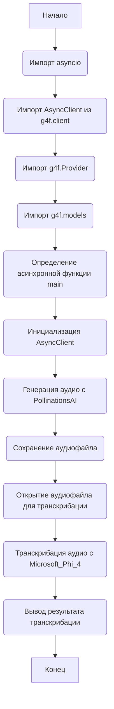

### Анализ кода проекта `hypotez`

=========================================================================================

#### 1. **Блок-схема**

```mermaid
graph LR
    A[Начало] --> B{Инициализация AsyncClient с PollinationsAI};
    B --> C{Запрос на генерацию аудио};
    C --> D{Сохранение аудиофайла "alloy.mp3"};
    D --> E{Открытие аудиофайла "audio.wav" для транскрибации};
    E --> F{Запрос на транскрибацию аудио с Microsoft_Phi_4};
    F --> G{Печать результата транскрибации};
    G --> H[Конец];
```

**Примеры для каждого логического блока:**

- **Инициализация AsyncClient с PollinationsAI**:
  ```python
  client = AsyncClient(provider=g4f.Provider.PollinationsAI)
  ```
  Этот блок инициализирует асинхронный клиент `AsyncClient` с провайдером `PollinationsAI`.

- **Запрос на генерацию аудио**:
  ```python
  response = await client.chat.completions.create(
      model="openai-audio",
      messages=[{"role": "user", "content": "Say good day to the world"}],
      audio={ "voice": "alloy", "format": "mp3" },
  )
  ```
  Здесь отправляется запрос на генерацию аудио с моделью `openai-audio`, сообщением "Say good day to the world", голосом `alloy` и форматом `mp3`.

- **Сохранение аудиофайла "alloy.mp3"**:
  ```python
  response.choices[0].message.save("alloy.mp3")
  ```
  Полученный аудиофайл сохраняется под именем `alloy.mp3`.

- **Открытие аудиофайла "audio.wav" для транскрибации**:
  ```python
  with open("audio.wav", "rb") as audio_file:
  ```
  Аудиофайл `audio.wav` открывается для чтения в бинарном режиме.

- **Запрос на транскрибацию аудио с Microsoft_Phi_4**:
  ```python
  response = await client.chat.completions.create(
      messages="Transcribe this audio",
      provider=g4f.Provider.Microsoft_Phi_4,
      media=[[audio_file, "audio.wav"]],
      modalities=["text"],
  )
  ```
  Отправляется запрос на транскрибацию аудиофайла с использованием провайдера `Microsoft_Phi_4`.

- **Печать результата транскрибации**:
  ```python
  print(response.choices[0].message.content)
  ```
  Результат транскрибации выводится в консоль.

#### 2. **Диаграмма зависимостей**



**Объяснение зависимостей:**

- `asyncio`: Используется для поддержки асинхронного программирования.
- `g4f.client.AsyncClient`: Клиент для асинхронного взаимодействия с моделями.
- `g4f.Provider`: Перечисляет различных провайдеров моделей, таких как `PollinationsAI` и `Microsoft_Phi_4`.
- `g4f.models`: Содержит доступные модели, хотя в данном коде напрямую не используется, но может потребоваться для других задач.

#### 3. **Объяснение кода**

**Импорты:**
- `import asyncio`: Используется для асинхронного выполнения кода.
- `from g4f.client import AsyncClient`: Импортирует класс `AsyncClient` из библиотеки `g4f`, который предоставляет асинхронный клиент для работы с различными провайдерами и моделями.
- `import g4f.Provider`: Импортирует модуль `Provider` из библиотеки `g4f`, который содержит перечисление доступных провайдеров, таких как `PollinationsAI` и `Microsoft_Phi_4`.
- `import g4f.models`: Импортирует модуль `models` из библиотеки `g4f`, который содержит определения различных моделей, хотя в данном коде напрямую не используется.

**Функции:**
- `async def main()`:
  - **Аргументы**: Отсутствуют.
  - **Возвращаемое значение**: Отсутствует (None).
  - **Назначение**: Главная асинхронная функция, которая выполняет следующие действия:
    1. Инициализирует асинхронный клиент `AsyncClient` с провайдером `PollinationsAI`.
    2. Отправляет запрос на генерацию аудио с использованием модели `openai-audio`, текста "Say good day to the world", голоса `alloy` и формата `mp3`.
    3. Сохраняет сгенерированный аудиофайл в файл `alloy.mp3`.
    4. Открывает аудиофайл `audio.wav` для чтения в бинарном режиме.
    5. Отправляет запрос на транскрибацию аудиофайла с использованием провайдера `Microsoft_Phi_4`.
    6. Выводит результат транскрибации в консоль.
  - **Пример**:
    ```python
    async def main():
        client = AsyncClient(provider=g4f.Provider.PollinationsAI)
        response = await client.chat.completions.create(
            model="openai-audio",
            messages=[{"role": "user", "content": "Say good day to the world"}],
            audio={ "voice": "alloy", "format": "mp3" },
        )
        response.choices[0].message.save("alloy.mp3")
        with open("audio.wav", "rb") as audio_file:
            response = await client.chat.completions.create(
                messages="Transcribe this audio",
                provider=g4f.Provider.Microsoft_Phi_4,
                media=[[audio_file, "audio.wav"]],
                modalities=["text"],
            )
            print(response.choices[0].message.content)
    ```

**Переменные:**
- `client`: Экземпляр класса `AsyncClient`, используемый для отправки запросов к моделям.
- `response`: Содержит ответ от модели на запрос генерации или транскрибации аудио.
- `audio_file`: Файловый объект, представляющий открытый аудиофайл для транскрибации.

**Потенциальные ошибки и области для улучшения:**

1. **Обработка исключений**: В коде отсутствует обработка исключений. Следует добавить блоки `try...except` для обработки возможных ошибок при выполнении запросов к моделям и при работе с файлами.
2. **Конфигурация провайдеров и моделей**: Параметры провайдеров и моделей заданы статически. Было бы полезно добавить возможность конфигурации этих параметров через аргументы командной строки или конфигурационный файл.
3. **Пути к файлам**: Пути к файлам `alloy.mp3` и `audio.wav` заданы относительно. Следует использовать абсолютные пути или относительные пути, вычисленные относительно корня проекта.

**Цепочка взаимосвязей с другими частями проекта:**

Этот код является примером использования библиотеки `g4f` для генерации и транскрибации аудио. В контексте проекта `hypotez` он может быть использован для интеграции с другими модулями, такими как:

- Модули обработки текста: Для обработки текста, который будет использоваться для генерации аудио.
- Модули работы с файлами: Для более гибкой работы с аудиофайлами, например, для конвертации форматов или изменения параметров.
- Модули логирования: Для логирования процесса генерации и транскрибации аудио, а также для записи ошибок.