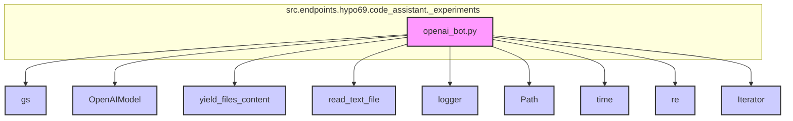

### **Системные инструкции для обработки кода проекта `hypotez`**

=========================================================================================

Описание функциональности и правил для генерации, анализа и улучшения кода. Направлено на обеспечение последовательного и читаемого стиля кодирования, соответствующего требованиям.

---

### **Основные принципы**

#### **1. Общие указания**:
- Соблюдай четкий и понятный стиль кодирования.
- Все изменения должны быть обоснованы и соответствовать установленным требованиям.

#### **2. Комментарии**:
- Используй `#` для внутренних комментариев.
- Документация всех функций, методов и классов должна следовать такому формату: 
    ```python
        def function(param: str, param1: Optional[str | dict | str] = None) -> dict | None:
            """ 
            Args:
                param (str): Описание параметра `param`.
                param1 (Optional[str | dict | str], optional): Описание параметра `param1`. По умолчанию `None`.
    
            Returns:
                dict | None: Описание возвращаемого значения. Возвращает словарь или `None`.
    
            Raises:
                SomeError: Описание ситуации, в которой возникает исключение `SomeError`.

            Ехаmple:
                >>> function('param', 'param1')
                {'param': 'param1'}
            """
    ```
- Комментарии и документация должны быть четкими, лаконичными и точными.

#### **3. Форматирование кода**:
- Используй одинарные кавычки. `a:str = 'value'`, `print('Hello World!')`;
- Добавляй пробелы вокруг операторов. Например, `x = 5`;
- Все параметры должны быть аннотированы типами. `def function(param: str, param1: Optional[str | dict | str] = None) -> dict | None:`;
- Не используй `Union`. Вместо этого используй `|`.

#### **4. Логирование**:
- Для логгирования Всегда Используй модуль `logger` из `src.logger.logger`.
- Ошибки должны логироваться с использованием `logger.error`.
Пример:
    ```python
        try:
            ...
        except Exception as ex:
            logger.error('Error while processing data', ех, exc_info=True)
    ```
#### **5 Не используй `Union[]` в коде. Вместо него используй `|`
Например:
```python
x: str | int ...
```


---

### **Основные требования**:

#### **1. Формат ответов в Markdown**:
- Все ответы должны быть выполнены в формате **Markdown**.

#### **2. Формат комментариев**:
- Используй указанный стиль для комментариев и документации в коде.
- Пример:

```python
from typing import Generator, Optional, List
from pathlib import Path


def read_text_file(
    file_path: str | Path,
    as_list: bool = False,
    extensions: Optional[List[str]] = None,
    chunk_size: int = 8192,
) -> Generator[str, None, None] | str | None:
    """
    Считывает содержимое файла (или файлов из каталога) с использованием генератора для экономии памяти.

    Args:
        file_path (str | Path): Путь к файлу или каталогу.
        as_list (bool): Если `True`, возвращает генератор строк.
        extensions (Optional[List[str]]): Список расширений файлов для чтения из каталога.
        chunk_size (int): Размер чанков для чтения файла в байтах.

    Returns:
        Generator[str, None, None] | str | None: Генератор строк, объединенная строка или `None` в случае ошибки.

    Raises:
        Exception: Если возникает ошибка при чтении файла.

    Example:
        >>> from pathlib import Path
        >>> file_path = Path('example.txt')
        >>> content = read_text_file(file_path)
        >>> if content:
        ...    print(f'File content: {content[:100]}...')
        File content: Example text...
    """
    ...
```
- Всегда делай подробные объяснения в комментариях. Избегай расплывчатых терминов, 
- таких как *«получить»* или *«делать»*
-  . Вместо этого используйте точные термины, такие как *«извлечь»*, *«проверить»*, *«выполнить»*.
- Вместо: *«получаем»*, *«возвращаем»*, *«преобразовываем»* используй имя объекта *«функция получае»*, *«переменная возвращает»*, *«код преобразовывает»* 
- Комментарии должны непосредственно предшествовать описываемому блоку кода и объяснять его назначение.

#### **3. Пробелы вокруг операторов присваивания**:
- Всегда добавляйте пробелы вокруг оператора `=`, чтобы повысить читаемость.
- Примеры:
  - **Неправильно**: `x=5`
  - **Правильно**: `x = 5`

#### **4. Использование `j_loads` или `j_loads_ns`**:
- Для чтения JSON или конфигурационных файлов замените стандартное использование `open` и `json.load` на `j_loads` или `j_loads_ns`.
- Пример:

```python
# Неправильно:
with open('config.json', 'r', encoding='utf-8') as f:
    data = json.load(f)

# Правильно:
data = j_loads('config.json')
```

#### **5. Сохранение комментариев**:
- Все существующие комментарии, начинающиеся с `#`, должны быть сохранены без изменений в разделе «Улучшенный код».
- Если комментарий кажется устаревшим или неясным, не изменяйте его. Вместо этого отметьте его в разделе «Изменения».

#### **6. Обработка `...` в коде**:
- Оставляйте `...` как указатели в коде без изменений.
- Не документируйте строки с `...`.
```

#### **7. Аннотации**
Для всех переменных должны быть определены аннотации типа. 
Для всех функций все входные и выходные параметры аннотириваны
Для все параметров должны быть аннотации типа.


### **8. webdriver**
В коде используется webdriver. Он импртируется из модуля `webdriver` проекта `hypotez`
```python
from src.webdirver import Driver, Chrome, Firefox, Playwright, ...
driver = Driver(Firefox)

Пoсле чего может использоваться как

close_banner = {
  "attribute": null,
  "by": "XPATH",
  "selector": "//button[@id = 'closeXButton']",
  "if_list": "first",
  "use_mouse": false,
  "mandatory": false,
  "timeout": 0,
  "timeout_for_event": "presence_of_element_located",
  "event": "click()",
  "locator_description": "Закрываю pop-up окно, если оно не появилось - не страшно (`mandatory`:`false`)"
}

result = driver.execute_locator(close_banner)
```

## Анализ кода `hypotez/src/endpoints/hypo69/code_assistant/_experiments/openai_bot.py`

### 1. Блок-схема

```mermaid
graph TD
    A[Начало: Установка роли и чтение инструкций] --> B{Определение роли: doc_writer или другая?}
    B -- Да --> C[Чтение comment_for_model_about_piece_of_code и system_instruction]
    B -- Нет --> D[Установка роли по умолчанию: doc_writer]
    D --> C
    C --> E[Инициализация OpenAIModel]
    E --> F{Цикл по файлам: yield_files_content}
    F --> G[Формирование контента для модели]
    G --> H[Отправка запроса в OpenAIModel: openai_model.ask(content)]
    H --> I{Успешный ответ?}
    I -- Да --> J[Сохранение ответа: save_response]
    J --> K{Следующий файл?}
    I -- Нет --> L[Логирование ошибки: logger.error(ex)]
    L --> K
    K -- Да --> F
    K -- Нет --> M[Конец]

    style A fill:#f9f,stroke:#333,stroke-width:2px
    style B fill:#ccf,stroke:#333,stroke-width:2px
    style C fill:#ccf,stroke:#333,stroke-width:2px
    style D fill:#ccf,stroke:#333,stroke-width:2px
    style E fill:#ccf,stroke:#333,stroke-width:2px
    style F fill:#ccf,stroke:#333,stroke-width:2px
    style G fill:#ccf,stroke:#333,stroke-width:2px
    style H fill:#ccf,stroke:#333,stroke-width:2px
    style I fill:#ccf,stroke:#333,stroke-width:2px
    style J fill:#ccf,stroke:#333,stroke-width:2px
    style K fill:#ccf,stroke:#333,stroke-width:2px
    style L fill:#fcc,stroke:#333,stroke-width:2px
    style M fill:#f9f,stroke:#333,stroke-width:2px
```

**Примеры для логических блоков:**

*   **A**: Устанавливает `role = 'doc_writer'` и загружает необходимые инструкции для модели.
*   **B**: Проверяет, установлена ли роль выполнения. Если нет, устанавливает значение по умолчанию `'doc_writer'`.
*   **C**: Читает файлы `doc_writer.md` и `create_documentation.md` для использования в качестве инструкций для модели.
*   **E**: Инициализирует модель `OpenAIModel` с заданными инструкциями и именем модели.
*   **F**: Перебирает файлы Python и Markdown в директории `src`.
*   **G**: Формирует запрос для модели, включая комментарии, расположение файла и код.
*   **H**: Отправляет сформированный запрос в модель OpenAI и получает ответ.
*   **I**: Проверяет, был ли получен ответ от модели успешно. Если произошла ошибка, она логируется.
*   **J**: Сохраняет полученный от модели ответ в файл Markdown.
*   **K**: Проверяет, остались ли еще файлы для обработки.

### 2. Диаграмма зависимостей



**Зависимости и их объяснение:**

*   **`gs`**: Глобальные настройки проекта, используется для доступа к путям к файлам и учетным данным OpenAI.
*   **`OpenAIModel`**: Класс для взаимодействия с OpenAI API. Отвечает за отправку запросов к модели и получение ответов.
*   **`yield_files_content`**: Функция-генератор для итерации по содержимому файлов в указанной директории с учетом заданных паттернов и исключений.
*   **`read_text_file`**: Функция для чтения содержимого текстового файла.
*   **`logger`**: Модуль для логирования ошибок и другой информации о работе программы.
*   **`Path`**: Класс из модуля `pathlib` для работы с путями к файлам и директориям.
*   **`time`**: Модуль для работы со временем, используется для добавления задержки между запросами к API.
*   **`re`**: Модуль для работы с регулярными выражениями, используется для исключения файлов и директорий.
*    **`Iterator`**: Используется для аннотации возвращаемого типа функции `yield_files_content`.

### 3. Объяснение

#### Импорты:

*   `re`: Используется для работы с регулярными выражениями, в частности, для исключения определенных файлов и директорий из обработки.
*   `pathlib.Path`: Используется для удобной работы с путями к файлам и директориям.
*   `time`: Используется для добавления задержки между запросами к OpenAI API, чтобы избежать превышения лимитов.
*   `typing.Iterator`: Используется для аннотации возвращаемого типа функции `yield_files_content`, указывая, что она является генератором, возвращающим кортежи из `Path` и `str`.
*   `src.gs`: Предположительно, содержит глобальные настройки проекта, включая пути к директориям и учетные данные для доступа к OpenAI API.
*   `src.ai.openai.OpenAIModel`: Класс, инкапсулирующий логику взаимодействия с OpenAI API. Позволяет отправлять запросы к модели и получать ответы.
*   `src.utils.file.yield_files_content`: Функция-генератор, которая обходит указанную директорию и возвращает содержимое файлов, соответствующих заданным шаблонам, исключая определенные файлы и директории.
*   `src.utils.file.read_text_file`: Функция для чтения содержимого текстового файла.
*   `src.logger.logger.logger`: Объект логгера для записи информации о работе программы, включая ошибки.

#### Переменные:

*   `role`: Глобальная переменная, определяющая роль, для которой будет использоваться модель OpenAI. В данном случае установлена как `'doc_writer'`.
*   `openai_model_name`: Определяет имя используемой модели OpenAI, по умолчанию `'gpt-4o-mini'`.
*   `openai_assistant_id`: Идентификатор ассистента OpenAI, используемого для взаимодействия с моделью.
*   `openai_model`: Объект класса `OpenAIModel`, используемый для взаимодействия с OpenAI API.

#### Функции:

*   `main()`:
    *   Главная функция, которая координирует работу программы.
    *   Определяет роль, считывает инструкции для модели из файлов, инициализирует `OpenAIModel`, обходит файлы в директории `src`, формирует запросы к модели, получает ответы и сохраняет их в файлы.
    *   Использует `yield_files_content` для получения содержимого файлов.
    *   Использует `read_text_file` для чтения инструкций для модели.
    *   Использует `OpenAIModel.ask()` для отправки запроса к модели и получения ответа.
    *   Использует `save_response()` для сохранения ответа модели в файл.
*   `save_response(file_path: Path, response: str, from_model: str) -> None`:
    *   Сохраняет ответ модели в файл Markdown.
    *   Формирует путь к файлу, основываясь на роли и исходном пути файла.
    *   Создает необходимые директории, если они не существуют.
    *   Записывает ответ модели в файл.
*   `yield_files_content(src_path: Path, patterns: list[str]) -> Iterator[tuple[Path, str]]`:
    *   Генератор, который обходит указанную директорию и возвращает содержимое файлов, соответствующих заданным шаблонам.
    *   Исключает файлы и директории, соответствующие определенным шаблонам и спискам исключений.

#### Классы:

*   `OpenAIModel`: Класс, инкапсулирующий логику взаимодействия с OpenAI API. Определен в модуле `src.ai.openai`.

#### Потенциальные ошибки и области для улучшения:

*   Обработка ошибок: В блоке `try...except` в функции `main()` логируется ошибка, но не предпринимается никаких действий для восстановления после ошибки. Возможно, стоит добавить логику для повторной попытки отправки запроса или пропуска файла.
*   Зависимость от глобальных переменных: Функция `save_response` использует глобальную переменную `role`. Это может затруднить тестирование и понимание кода. Лучше передавать роль в качестве аргумента функции.
*   Жестко заданные пути к файлам: В функции `main()` жестко заданы пути к файлам инструкций для модели. Лучше сделать эти пути настраиваемыми, например, через аргументы командной строки или конфигурационный файл.
*   Обработка исключений: В функции `yield_files_content` все исключаемые директории и файлы заданы статически. Было бы полезно вынести их в конфигурационный файл или передавать через аргументы.
*   Отсутствие обработки краевых случаев: Код предполагает, что роль всегда будет найдена в словаре `role_directories`. В противном случае логируется ошибка, но дальнейшие действия не предпринимаются. Следует добавить логику для обработки таких ситуаций, например, устанавливать роль по умолчанию или прекращать выполнение программы.
*   Аннотации типов: Не все переменные аннотированы типами.

#### Взаимосвязи с другими частями проекта:

*   Модуль использует `src.gs` для получения глобальных настроек, таких как пути к файлам и учетные данные OpenAI.
*   Модуль использует `src.ai.openai.OpenAIModel` для взаимодействия с OpenAI API.
*   Модуль использует `src.utils.file.yield_files_content` и `src.utils.file.read_text_file` для работы с файлами.
*   Модуль использует `src.logger.logger.logger` для логирования.

```mermaid
flowchart TD
    Start --> Header[<code>src.header.py</code><br> Determine Project Root]

    Header --> import[Import Global Settings: <br><code>from src import gs</code>]