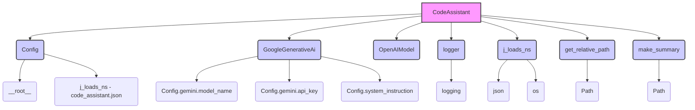
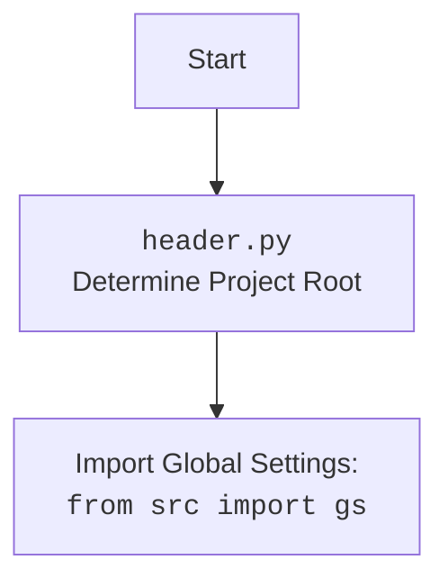

### **Системные инструкции для обработки кода проекта `hypotez`**

=========================================================================================

Описание функциональности и правил для генерации, анализа и улучшения кода. Направлено на обеспечение последовательного и читаемого стиля кодирования, соответствующего требованиям.

---

### **Основные принципы**

#### **1. Общие указания**:
- Соблюдай четкий и понятный стиль кодирования.
- Все изменения должны быть обоснованы и соответствовать установленным требованиям.

#### **2. Комментарии**:
- Используй `#` для внутренних комментариев.
- Документация всех функций, методов и классов должна следовать такому формату: 
    ```python
        def function(param: str, param1: Optional[str | dict | str] = None) -> dict | None:
            """ 
            Args:
                param (str): Описание параметра `param`.
                param1 (Optional[str | dict | str], optional): Описание параметра `param1`. По умолчанию `None`.
    
            Returns:
                dict | None: Описание возвращаемого значения. Возвращает словарь или `None`.
    
            Raises:
                SomeError: Описание ситуации, в которой возникает исключение `SomeError`.

            Ехаmple:
                >>> function('param', 'param1')
                {'param': 'param1'}
            """
    ```
- Комментарии и документация должны быть четкими, лаконичными и точными.

#### **3. Форматирование кода**:
- Используй одинарные кавычки. `a:str = 'value'`, `print('Hello World!')`;
- Добавляй пробелы вокруг операторов. Например, `x = 5`;
- Все параметры должны быть аннотированы типами. `def function(param: str, param1: Optional[str | dict | str] = None) -> dict | None:`;
- Не используй `Union`. Вместо этого используй `|`.

#### **4. Логирование**:
- Для логгирования Всегда Используй модуль `logger` из `src.logger.logger`.
- Ошибки должны логироваться с использованием `logger.error`.
Пример:
    ```python
        try:
            ...
        except Exception as ex:
            logger.error('Error while processing data', ех, exc_info=True)
    ```
#### **5 Не используй `Union[]` в коде. Вместо него используй `|`
Например:
```python
x: str | int ...
```


---

### **Основные требования**:

#### **1. Формат ответов в Markdown**:
- Все ответы должны быть выполнены в формате **Markdown**.

#### **2. Формат комментариев**:
- Используй указанный стиль для комментариев и документации в коде.
- Пример:

```python
from typing import Generator, Optional, List
from pathlib import Path


def read_text_file(
    file_path: str | Path,
    as_list: bool = False,
    extensions: Optional[List[str]] = None,
    chunk_size: int = 8192,
) -> Generator[str, None, None] | str | None:
    """
    Считывает содержимое файла (или файлов из каталога) с использованием генератора для экономии памяти.

    Args:
        file_path (str | Path): Путь к файлу или каталогу.
        as_list (bool): Если `True`, возвращает генератор строк.
        extensions (Optional[List[str]]): Список расширений файлов для чтения из каталога.
        chunk_size (int): Размер чанков для чтения файла в байтах.

    Returns:
        Generator[str, None, None] | str | None: Генератор строк, объединенная строка или `None` в случае ошибки.

    Raises:
        Exception: Если возникает ошибка при чтении файла.

    Example:
        >>> from pathlib import Path
        >>> file_path = Path('example.txt')
        >>> content = read_text_file(file_path)
        >>> if content:
        ...    print(f'File content: {content[:100]}...')
        File content: Example text...
    """
    ...
```
- Всегда делай подробные объяснения в комментариях. Избегай расплывчатых терминов, 
- таких как *«получить»* или *«делать»*. Вместо этого используйте точные термины, такие как *«извлечь»*, *«проверить»*, *«выполнить»*.
- Вместо: *«получаем»*, *«возвращаем»*, *«преобразовываем»* используй имя объекта *«функция получае»*, *«переменная возвращает»*, *«код преобразовывает»* 
- Комментарии должны непосредственно предшествовать описываемому блоку кода и объяснять его назначение.

#### **3. Пробелы вокруг операторов присваивания**:
- Всегда добавляйте пробелы вокруг оператора `=`, чтобы повысить читаемость.
- Примеры:
  - **Неправильно**: `x=5`
  - **Правильно**: `x = 5`

#### **4. Использование `j_loads` или `j_loads_ns`**:
- Для чтения JSON или конфигурационных файлов замените стандартное использование `open` и `json.load` на `j_loads` или `j_loads_ns`.
- Пример:

```python
# Неправильно:
with open('config.json', 'r', encoding='utf-8') as f:
    data = json.load(f)

# Правильно:
data = j_loads('config.json')
```

#### **5. Сохранение комментариев**:
- Все существующие комментарии, начинающиеся с `#`, должны быть сохранены без изменений в разделе «Улучшенный код».
- Если комментарий кажется устаревшим или неясным, не изменяйте его. Вместо этого отметьте его в разделе «Изменения».

#### **6. Обработка `...` в коде**:
- Оставляйте `...` как указатели в коде без изменений.
- Не документируйте строки с `...`.
```

#### **7. Аннотации**
Для всех переменных должны быть определены аннотации типа. 
Для всех функций все входные и выходные параметры аннотириваны
Для все параметров должны быть аннотации типа.


### **8. webdriver**
В коде используется webdriver. Он импртируется из модуля `webdriver` проекта `hypotez`
```python
from src.webdirver import Driver, Chrome, Firefox, Playwright, ...
driver = Driver(Firefox)

Пoсле чего может использоваться как

close_banner = {
  "attribute": null,
  "by": "XPATH",
  "selector": "//button[@id = 'closeXButton']",
  "if_list": "first",
  "use_mouse": false,
  "mandatory": false,
  "timeout": 0,
  "timeout_for_event": "presence_of_element_located",
  "event": "click()",
  "locator_description": "Закрываю pop-up окно, если оно не появилось - не страшно (`mandatory`:`false`)"
}

result = driver.execute_locator(close_banner)
```

### **Анализ кода `hypotez/src/endpoints/hypo69/code_assistant/code_assistant.py`**

#### **1. Блок-схема**

```mermaid
graph LR
    A[Начало: Инициализация CodeAssistant] --> B{Чтение конфигурации из code_assistant.json}
    B --> C{Инициализация моделей (Gemini, OpenAI)}
    C --> D{Перебор директорий для обработки (process_dirs)}
    D --> E{Перебор файлов в директории}
    E --> F{Чтение содержимого файла}
    F -- Ошибка чтения --> G[Логирование ошибки чтения]
    F -- Успешно --> H{Создание запроса к модели}
    H --> I{Отправка запроса в Gemini}
    I -- Успешный ответ --> J{Удаление внешних кавычек из ответа}
    J --> K{Сохранение ответа в файл}
    K -- Ошибка сохранения --> L[Логирование ошибки сохранения]
    K -- Успешно --> M[Логирование успешного сохранения]
    I -- Ошибка ответа --> N[Логирование ошибки ответа модели]
    E --> O{Переход к следующему файлу}
    D --> P{Переход к следующей директории}
    P --> End[Завершение]
    G --> O
    L --> O
    N --> O
    O --> E
    M --> O
```

**Примеры для каждого блока:**

-   **A**: Создание экземпляра `CodeAssistant` с ролью "code\_checker" и языком "ru".
-   **B**: Чтение параметров, таких как `roles_list`, `languages_list`, `process_dirs`, из файла `code_assistant.json`.
-   **C**: Инициализация модели Gemini с использованием API ключа и инструкций из конфигурации.
-   **D**: Перебор директорий, указанных в `Config.process_dirs`, например, \['src', 'tests'].
-   **E**: Перебор файлов `.py` в текущей директории.
-   **F**: Чтение содержимого файла `/src/utils/jjson.py`.
-   **G**: Если файл не удалось прочитать, логируется ошибка.
-   **H**: Создание запроса к модели, содержащего роль, язык, путь к файлу и код файла.
-   **I**: Отправка созданного запроса в модель Gemini для обработки.
-   **J**: Удаление внешних кавычек из ответа, полученного от модели.
-   **K**: Сохранение ответа модели в файл, например, `/docs/gemini/code_checker/ru/utils/jjson.py.md`.
-   **L**: Если файл не удалось сохранить, логируется ошибка.
-   **M**: Если файл успешно сохранен, логируется сообщение об успехе.
-   **N**: Если модель не вернула ответ, логируется ошибка.
-   **O**: Переход к следующему файлу в директории.
-   **P**: Переход к следующей директории в списке.
-   **End**: Завершение обработки всех файлов.

#### **2. Диаграмма**



**Объяснение зависимостей:**

-   `CodeAssistant` зависит от `Config` для получения настроек и конфигураций.
-   `CodeAssistant` использует `GoogleGenerativeAi` и `OpenAIModel` для взаимодействия с моделями ИИ.
-   `CodeAssistant` использует `logger` для логирования информации, ошибок и предупреждений.
-   `CodeAssistant` использует `j_loads_ns` для загрузки конфигурации из JSON файлов в виде `SimpleNamespace`.
-   `CodeAssistant` использует `get_relative_path` для получения относительного пути к файлу в проекте.
-   `CodeAssistant` использует `make_summary` для создания сводки документации.
-   `Config` зависит от `__root__` (определенной в `header.py`) для определения корневого каталога проекта.
-   `Config` использует `j_loads_ns` для загрузки конфигурации из `code_assistant.json`.
-   `GoogleGenerativeAi` зависит от параметров модели и API ключа, полученных из `Config`.
-   `make_summary` использует `Path` для работы с путями к файлам и директориям.
-   `logger` использует модуль `logging` для выполнения операций логирования.
-   `j_loads_ns` использует модули `json` и `os` для работы с JSON и переменными окружения.
-   `get_relative_path` использует `Path` для работы с путями к файлам и директориям.



#### **3. Объяснение**

**Импорты:**

-   `asyncio`: Используется для асинхронного программирования, позволяет выполнять несколько задач одновременно.
-   `argparse`: Используется для разбора аргументов командной строки.
-   `sys`: Предоставляет доступ к некоторым переменным и функциям, взаимодействующим с интерпретатором Python.
-   `os`: Предоставляет функции для взаимодействия с операционной системой, такие как чтение переменных окружения.
-   `pathlib.Path`: Предоставляет способ представления путей к файлам и директориям.
-   `typing.Iterator, List, Optional`: Используются для аннотации типов.
-   `types.SimpleNamespace`: Используется для создания объектов, к атрибутам которых можно обращаться как к обычным атрибутам.
-   `signal`: Используется для обработки сигналов операционной системы, таких как `SIGINT` (Ctrl+C).
-   `time`: Предоставляет функции для работы со временем.
-   `re`: Используется для работы с регулярными выражениями.
-   `fnmatch`: Используется для сопоставления имен файлов с шаблонами.
-   `header`: Содержит определение корневого каталога проекта `__root__`.
-   `src.gs`: Содержит глобальные настройки проекта.
-   `src.utils.jjson.j_loads, j_loads_ns`: Функции для загрузки JSON файлов.
-   `src.ai.gemini.GoogleGenerativeAi`: Класс для взаимодействия с моделью Gemini.
-   `src.ai.openai.OpenAIModel`: Класс для взаимодействия с моделью OpenAI.
-   `src.utils.path.get_relative_path`: Функция для получения относительного пути к файлу.
-   `src.logger.logger.logger`: Объект для логирования событий.
-   `src.endpoints.hypo69.code_assistant.make_summary.make_summary`: Функция для создания сводки документации.
-   `src.USE_ENV`: Флаг, определяющий, использовать ли переменные окружения.

**Классы:**

-   `Config`:
    -   **Роль**: Хранит конфигурацию для работы `CodeAssistant`.
    -   **Атрибуты**:
        -   `base_path`: Путь к директории `code_assistant`.
        -   `config`: Объект `SimpleNamespace`, содержащий конфигурацию из `code_assistant.json`.
        -   `roles_list`: Список ролей.
        -   `languages_list`: Список языков.
        -   `role`: Текущая роль.
        -   `lang`: Текущий язык.
        -   `process_dirs`: Список директорий для обработки.
        -   `exclude_dirs`: Список исключаемых директорий.
        -   `exclude_files_patterns`: Список шаблонов исключаемых файлов.
        -   `include_files_patterns`: Список шаблонов включаемых файлов.
        -   `exclude_files`: Список исключаемых файлов.
        -   `response_mime_type`: MIME тип ответа.
        -    `output_directory_patterns`: Список шаблонов директорий для вывода результатов.
        -    `code_instruction`: Инструкция для кода. При каждом вызове читает файл с инструкцией, что позволяет обновлять инструкции "на лету"
        -   `system_instruction`: Инструкция для модели. При каждом вызове читает файл с инструкцией, что позволяет обновлять инструкции "на лету"
        -   `gemini`: Объект `SimpleNamespace`, содержащий параметры для модели Gemini.
    -   **Методы**:
        -   `code_instruction(cls)`: property, читает инструкцию для кода из файла.
        -   `system_instruction(cls)`: property, читает инструкцию для модели из файла.
    -   **Взаимодействие**: Используется классом `CodeAssistant` для получения настроек.

-   `CodeAssistant`:
    -   **Роль**: Ассистент программиста для работы с моделями ИИ.
    -   **Атрибуты**:
        -   `role`: Роль для выполнения задачи.
        -   `lang`: Язык выполнения.
        -   `gemini`: Экземпляр класса `GoogleGenerativeAi`.
        -   `openai`: Экземпляр класса `OpenAIModel`.
    -   **Методы**:
        -   `__init__(self, role, lang, models_list, system_instruction, \*\*kwards)`: Инициализация ассистента с заданными параметрами.
        -   `_initialize_models(self, models_list, response_mime_type, \*\*kwards)`: Инициализация моделей на основе заданных параметров.
        -   `send_file(self, file_path, file_name)`: Отправка файла в модель.
        -   `process_files(self, process_dirs, start_from_file)`: Компиляция, отправка запроса и сохранение результата.
        -   `_create_request(self, file_path, content)`: Создание запроса с учетом роли и языка.
        -   `_yield_files_content(self, process_directory)`: Генерация путей файлов и их содержимого.
        -   `_save_response(self, file_path, response, model_name)`: Сохранение ответа модели в файл.
        -   `_remove_outer_quotes(self, response)`: Удаление внешних кавычек в начале и в конце строки.
        -   `run(self, start_from_file)`: Запуск процесса обработки файлов.
        -   `_signal_handler(self, signal, frame)`: Обработка прерывания выполнения.
    -   **Взаимодействие**: Использует классы `GoogleGenerativeAi` и `OpenAIModel` для взаимодействия с моделями ИИ, `Config` для получения настроек, `logger` для логирования.

**Функции:**

-   `parse_args() -> dict`:
    -   **Аргументы**: Нет.
    -   **Возвращаемое значение**: `dict` - словарь с аргументами командной строки.
    -   **Назначение**: Разбор аргументов командной строки.
    -   **Пример**:
        ```python
        args = parse_args()
        role = args['role']
        lang = args['lang']
        ```

-   `main() -> None`:
    -   **Аргументы**: Нет.
    -   **Возвращаемое значение**: `None`.
    -   **Назначение**: Запуск бесконечного цикла обработки файлов с учетом ролей и языков.
    -   **Пример**:
        ```python
        if __name__ == '__main__':
            main()
        ```

**Переменные:**

-   `__root__`: Корневой каталог проекта.
-   `gs`: Глобальные настройки проекта.
-   `USE_ENV`: Флаг, определяющий, использовать ли переменные окружения.

**Потенциальные ошибки и области для улучшения:**

-   Обработка исключений: В некоторых местах обработка исключений выполняется с использованием `except Exception as ex:`, что может быть слишком общим. Рекомендуется использовать более конкретные типы исключений.
-   Логирование: В некоторых местах логирование выполняется с использованием `logger.error(f'Ошибка ...', None, False)`, что не предоставляет достаточно информации для отладки. Рекомендуется передавать объект исключения `ex` в функцию логирования.
-   Асинхронность: В коде используется `asyncio.sleep(20)`, что может замедлить выполнение программы. Рекомендуется использовать более эффективные способы ожидания.
-   Конфигурация: Конфигурация загружается из JSON файлов, что может быть неудобно для изменения настроек во время работы программы. Рекомендуется использовать более гибкий способ конфигурации, например, с использованием переменных окружения.
-   Отсутствуют проверки типов для переменных окружения.

**Цепочка взаимосвязей с другими частями проекта:**

1.  `header.py` определяет корневой каталог проекта `__root__`, который используется в `Config` для определения путей к файлам конфигурации.
2.  `src.gs` содержит глобальные настройки проекта, которые используются в `Config` для получения значений по умолчанию.
3.  `src.utils.jjson.j_loads` и `j_loads_ns` используются для загрузки конфигурации из JSON файлов.
4.  `src.ai.gemini.GoogleGenerativeAi` и `src.ai.openai.OpenAIModel` используются для взаимодействия с моделями ИИ.
5.  `src.utils.path.get_relative_path` используется для получения относительного пути к файлу в проекте.
6.  `src.logger.logger.logger` используется для логирования событий.
7.  `src.endpoints.hypo69.code_assistant.make_summary.make_summary` используется для создания сводки документации.
8.  `src.USE_ENV` используется для определения, использовать ли переменные окружения.