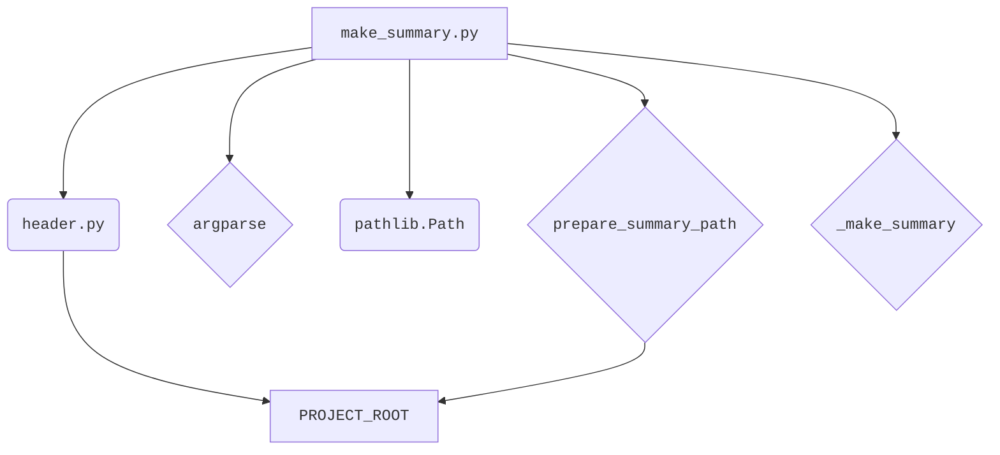
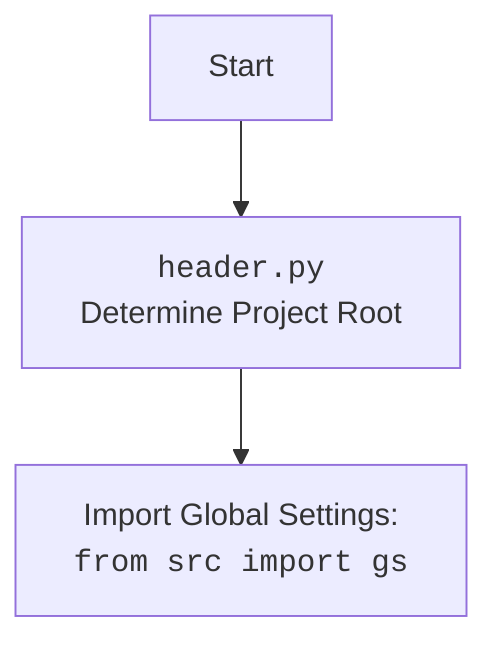

### **Системные инструкции для обработки кода проекта `hypotez`**

=========================================================================================

Описание функциональности и правил для генерации, анализа и улучшения кода. Направлено на обеспечение последовательного и читаемого стиля кодирования, соответствующего требованиям.

---

### **Основные принципы**

#### **1. Общие указания**:
- Соблюдай четкий и понятный стиль кодирования.
- Все изменения должны быть обоснованы и соответствовать установленным требованиям.

#### **2. Комментарии**:
- Используй `#` для внутренних комментариев.
- Документация всех функций, методов и классов должна следовать такому формату: 
    ```python
        def function(param: str, param1: Optional[str | dict | str] = None) -> dict | None:
            """ 
            Args:
                param (str): Описание параметра `param`.
                param1 (Optional[str | dict | str], optional): Описание параметра `param1`. По умолчанию `None`.
    
            Returns:
                dict | None: Описание возвращаемого значения. Возвращает словарь или `None`.
    
            Raises:
                SomeError: Описание ситуации, в которой возникает исключение `SomeError`.

            Ехаmple:
                >>> function('param', 'param1')
                {'param': 'param1'}
            """
    ```
- Комментарии и документация должны быть четкими, лаконичными и точными.

#### **3. Форматирование кода**:
- Используй одинарные кавычки. `a:str = 'value'`, `print('Hello World!')`;
- Добавляй пробелы вокруг операторов. Например, `x = 5`;
- Все параметры должны быть аннотированы типами. `def function(param: str, param1: Optional[str | dict | str] = None) -> dict | None:`;
- Не используй `Union`. Вместо этого используй `|`.

#### **4. Логирование**:
- Для логгирования Всегда Используй модуль `logger` из `src.logger.logger`.
- Ошибки должны логироваться с использованием `logger.error`.
Пример:
    ```python
        try:
            ...
        except Exception as ex:
            logger.error('Error while processing data', ех, exc_info=True)
    ```
#### **5 Не используй `Union[]` в коде. Вместо него используй `|`
Например:
```python
x: str | int ...
```


---

### **Основные требования**:

#### **1. Формат ответов в Markdown**:
- Все ответы должны быть выполнены в формате **Markdown**.

#### **2. Формат комментариев**:
- Используй указанный стиль для комментариев и документации в коде.
- Пример:

```python
from typing import Generator, Optional, List
from pathlib import Path


def read_text_file(
    file_path: str | Path,
    as_list: bool = False,
    extensions: Optional[List[str]] = None,
    chunk_size: int = 8192,
) -> Generator[str, None, None] | str | None:
    """
    Считывает содержимое файла (или файлов из каталога) с использованием генератора для экономии памяти.

    Args:
        file_path (str | Path): Путь к файлу или каталогу.
        as_list (bool): Если `True`, возвращает генератор строк.
        extensions (Optional[List[str]]): Список расширений файлов для чтения из каталога.
        chunk_size (int): Размер чанков для чтения файла в байтах.

    Returns:
        Generator[str, None, None] | str | None: Генератор строк, объединенная строка или `None` в случае ошибки.

    Raises:
        Exception: Если возникает ошибка при чтении файла.

    Example:
        >>> from pathlib import Path
        >>> file_path = Path('example.txt')
        >>> content = read_text_file(file_path)
        >>> if content:
        ...    print(f'File content: {content[:100]}...')
        File content: Example text...
    """
    ...
```
- Всегда делай подробные объяснения в комментариях. Избегай расплывчатых терминов, 
- таких как *«получить»* или *«делать»*
-  . Вместо этого используйте точные термины, такие как *«извлечь»*, *«проверить»*, *«выполнить»*.
- Вместо: *«получаем»*, *«возвращаем»*, *«преобразовываем»* используй имя объекта *«функция получае»*, *«переменная возвращает»*, *«код преобразовывает»* 
- Комментарии должны непосредственно предшествовать описываемому блоку кода и объяснять его назначение.

#### **3. Пробелы вокруг операторов присваивания**:
- Всегда добавляйте пробелы вокруг оператора `=`, чтобы повысить читаемость.
- Примеры:
  - **Неправильно**: `x=5`
  - **Правильно**: `x = 5`

#### **4. Использование `j_loads` или `j_loads_ns`**:
- Для чтения JSON или конфигурационных файлов замените стандартное использование `open` и `json.load` на `j_loads` или `j_loads_ns`.
- Пример:

```python
# Неправильно:
with open('config.json', 'r', encoding='utf-8') as f:
    data = json.load(f)

# Правильно:
data = j_loads('config.json')
```

#### **5. Сохранение комментариев**:
- Все существующие комментарии, начинающиеся с `#`, должны быть сохранены без изменений в разделе «Улучшенный код».
- Если комментарий кажется устаревшим или неясным, не изменяйте его. Вместо этого отметьте его в разделе «Изменения».

#### **6. Обработка `...` в коде**:
- Оставляйте `...` как указатели в коде без изменений.
- Не документируйте строки с `...`.
```

#### **7. Аннотации**
Для всех переменных должны быть определены аннотации типа. 
Для всех функций все входные и выходные параметры аннотириваны
Для все параметров должны быть аннотации типа.


### **8. webdriver**
В коде используется webdriver. Он импртируется из модуля `webdriver` проекта `hypotez`
```python
from src.webdirver import Driver, Chrome, Firefox, Playwright, ...
driver = Driver(Firefox)

Пoсле чего может использоваться как

close_banner = {
  "attribute": null,
  "by": "XPATH",
  "selector": "//button[@id = 'closeXButton']",
  "if_list": "first",
  "use_mouse": false,
  "mandatory": false,
  "timeout": 0,
  "timeout_for_event": "presence_of_element_located",
  "event": "click()",
  "locator_description": "Закрываю pop-up окно, если оно не появилось - не страшно (`mandatory`:`false`)"
}

result = driver.execute_locator(close_banner)
```

## Анализ кода `hypotez/src/endpoints/hypo69/code_assistant/make_summary.py`

### 1. Блок-схема

```mermaid
graph TD
    A[Начало: `if __name__ == '__main__':`] --> B{Парсинг аргументов командной строки};
    B -- `-lang` (язык) и `src_dir` (путь к исходной директории) --> C[Преобразование `src_dir` в объект `Path`];
    C --> D[Вызов функции `make_summary(src_dir, args.lang)`];
    D --> E{`make_summary`: Подготовка пути к файлу `SUMMARY.md` с помощью `prepare_summary_path`};
    E --> F[Создание родительских директорий для `SUMMARY.md`];
    F --> G[Вызов функции `_make_summary(docs_dir, summary_file, lang)`];
    G --> H{`_make_summary`: Проверка существования `summary_file`};
    H -- Файл существует --> I[Вывод сообщения о перезаписи];
    H -- Файл не существует --> J[Открытие `summary_file` для записи];
    J --> K[Запись заголовка "# Summary\n\n"];
    K --> L{Обход файлов `.md` в `src_dir` с помощью `rglob`};
    L --> M{Фильтрация файлов по языку (`lang`)};
    M -- Файл соответствует языку --> N[Формирование относительного пути файла];
    M -- Файл не соответствует языку --> L;
    N --> O[Запись строки в `summary_file` в формате '- [имя файла](относительный путь)\n'];
    O --> L;
    L -- Все файлы обработаны --> P[Завершение: Закрытие `summary_file`];
    P --> Q[Возврат `True`];
    G -- Возникла ошибка --> R[Вывод сообщения об ошибке];
    R --> S[Возврат `False`];
    E -- Возникла ошибка --> R;
```

**Примеры для логических блоков:**

*   **B (Парсинг аргументов командной строки):** Если скрипт запускается с аргументами `-lang ru src/my_docs`, то `args.lang` будет `'ru'`, а `args.src_dir` будет `'src/my_docs'`.
*   **M (Фильтрация файлов по языку):** Если `lang` равно `'ru'`, файл `example.ru.md` будет обработан, а `example.md` будет пропущен.
*   **O (Запись строки в `summary_file`):** Для файла `src/my_docs/example.md`, в `summary_file` будет записано `- [example](my_docs/example.md)`.

### 2. Диаграмма



**Объяснение зависимостей:**

*   `header.py`: Используется для определения корневого пути проекта (`PROJECT_ROOT`), который необходим для формирования путей к файлам.
*   `argparse`: Используется для обработки аргументов командной строки, переданных скрипту.
*   `pathlib.Path`: Используется для работы с путями к файлам и директориям. Позволяет удобно создавать, проверять и манипулировать путями.
*   `prepare_summary_path`: Функция, которая формирует путь к файлу `SUMMARY.md`, заменяя часть пути `'src'` на `'docs'`.
*   `_make_summary`: Рекурсивно обходит указанную директорию, создает и записывает в файл `SUMMARY.md` оглавление на основе найденных `.md` файлов, фильтруя их по языку.

Дополнительный блок `mermaid` flowchart, объясняющий `header.py`:



### 3. Объяснение

**Импорты:**

*   `pathlib.Path`: Используется для представления путей к файлам и директориям в объектно-ориентированном стиле. Это упрощает работу с файловой системой.
*   `argparse`: Модуль для парсинга аргументов командной строки. Позволяет передавать параметры скрипту при запуске.
*   `header`: Локальный модуль, предположительно, предназначен для определения корневого пути проекта. Это позволяет скрипту находить необходимые файлы и директории независимо от текущего рабочего каталога.

**Переменные:**

*   `PROJECT_ROOT`:  `Path` - хранит корневой путь к проекту, полученный из модуля `header`.
*   `docs_dir`: `Path` - путь к исходной директории `'src'`, переданный в функцию `make_summary`.
*   `lang`: `str` - язык фильтрации файлов (`'ru'` или `'en'`), переданный в функцию `make_summary`.
*   `summary_file`: `Path` - путь к файлу `SUMMARY.md`, сформированный функцией `prepare_summary_path`.
*   `src_dir`: `Path` - путь к папке с исходниками `.md`, переданный в функцию `_make_summary`.
*   `file_name`: `str` - имя файла `SUMMARY.md`, переданный в функцию `prepare_summary_path`.
*   `relative_path`: `Path` - относительный путь к файлу `.md`, сформированный в функции `_make_summary`.
*    `parser`: `argparse.ArgumentParser` - используется для описания структуры командной строки и последующей обработки переданных аргументов.
*    `args`: `argparse.Namespace` - содержит значения аргументов командной строки, распарсенные с помощью `parser.parse_args()`.

**Функции:**

*   `make_summary(docs_dir: Path, lang: str = 'en') -> None`:
    *   Аргументы:
        *   `docs_dir` (`Path`): Путь к исходной директории `'src'`.
        *   `lang` (`str`): Язык фильтрации файлов. Возможные значения: `'ru'` или `'en'`. По умолчанию `'en'`.
    *   Возвращаемое значение: `None`.
    *   Назначение: Создает файл `SUMMARY.md`, рекурсивно обходя папку.  Функция подготавливает путь к файлу и вызывает функцию `_make_summary` для фактического создания файла.
    *   Пример:
        ```python
        make_summary(Path('./src'), 'ru')
        ```
*   `_make_summary(src_dir: Path, summary_file: Path, lang: str = 'en') -> bool`:
    *   Аргументы:
        *   `src_dir` (`Path`): Путь к папке с исходниками `.md`.
        *   `summary_file` (`Path`): Путь для сохранения файла `SUMMARY.md`.
        *   `lang` (`str`): Язык фильтрации файлов. Возможные значения: `'ru'` или `'en'`. По умолчанию `'en'`.
    *   Возвращаемое значение: `bool` - `True` в случае успеха, `False` в случае ошибки.
    *   Назначение: Рекурсивно обходит папку и создает файл `SUMMARY.md` с главами на основе `.md` файлов.  Выполняет чтение и фильтрацию файлов, и запись в файл `SUMMARY.md`.
    *   Пример:
        ```python
        _make_summary(Path('./src'), Path('./docs/SUMMARY.md'), 'en')
        ```
*   `prepare_summary_path(src_dir: Path, file_name: str = 'SUMMARY.md') -> Path`:
    *   Аргументы:
        *   `src_dir` (`Path`): Исходный путь с `'src'`.
        *   `file_name` (`str`): Имя файла, который нужно создать. По умолчанию `'SUMMARY.md'`.
    *   Возвращаемое значение: `Path` - Новый путь к файлу.
    *   Назначение: Формирует путь к файлу, заменяя часть пути `'src'` на `'docs'` и добавляя имя файла.  Эта функция обеспечивает согласованное расположение файла `SUMMARY.md` в директории `'docs'`.
    *   Пример:
        ```python
        prepare_summary_path(Path('./src')) # возвращает Path('./docs/SUMMARY.md')
        ```

**Классы:**

В данном коде классы не используются.

**Потенциальные ошибки и области для улучшения:**

1.  **Обработка исключений**:  В функции `_make_summary` исключение перехватывается и выводится в консоль, но не логируется с использованием `logger.error`.  Было бы полезно использовать `logger` для записи ошибок, чтобы облегчить отладку и мониторинг.

2.  **Использование `header`**: Модуль `header` используется для определения `PROJECT_ROOT`. Стоит проверить, насколько надежен и переносим этот способ определения корневого пути проекта.  Возможно, стоит рассмотреть альтернативные методы, например, использование `os.path.dirname(os.path.abspath(__file__))` для определения пути к текущему файлу и последующего поиска корневой директории.

3.  **Сообщения об ошибках**: Сообщения об ошибках выводятся с помощью `print`. Лучше использовать `logger.error` для унификации логирования.

4.  **Кодировка**: Кодировка `'utf-8'` указана только при открытии файла `summary_file`.  Следует убедиться, что все операции с файлами и строками используют кодировку `'utf-8'` для предотвращения проблем с символами.

**Цепочка взаимосвязей с другими частями проекта:**

*   Этот модуль зависит от модуля `header`, который определяет корневой путь проекта.  `header` является частью структуры проекта `hypotez`.
*   Результат работы модуля (файл `SUMMARY.md`) может использоваться другими частями проекта, например, системой документации `mdbook`.
*   Модуль предназначен для использования в рамках системы сборки документации, поэтому он связан с другими скриптами и инструментами, которые участвуют в этом процессе.