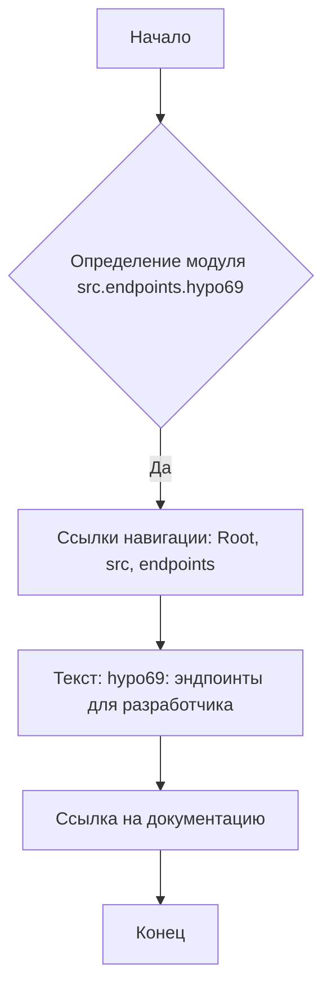
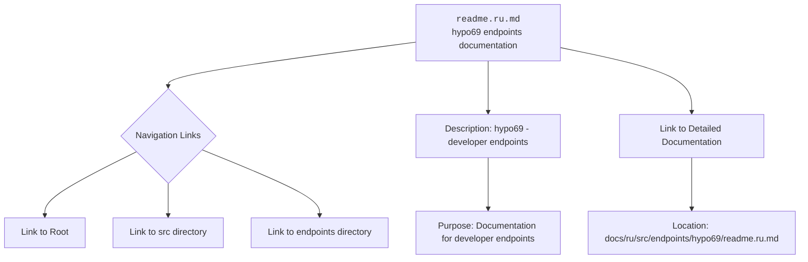

### **Анализ кода проекта `hypotez`**

=========================================================================================

#### **Расположение файла в проекте:** `hypotez/src/endpoints/hypo69/readme.ru.md`

#### **Описание:**

Файл `readme.ru.md` является файлом документации в формате Markdown, предназначенным для описания группы эндпоинтов `hypo69`, ориентированных на нужды разработчиков. Содержит ссылки на другие части проекта и документацию, а также указывает на доступность англоязычной версии документа.

---

### **1. Блок-схема:**

1.  **Начало**: Начальная точка процесса.
2.  **Определение модуля src.endpoints.hypo69**: Указание на модуль, который описывается в данном файле.
3.  **Ссылки навигации**: Ссылки для навигации по проекту (`Root`, `src`, `endpoints`).
4.  **Текст: hypo69: эндпоинты для разработчика**: Описание назначения эндпоинтов.
5.  **Ссылка на документацию**: Ссылка на подробную документацию по эндпоинтам.
6.  **Конец**: Конечная точка процесса.

---

### **2. Диаграмма:**

**Объяснение зависимостей:**

Диаграмма `mermaid` представляет структуру файла `readme.ru.md`, его навигационные ссылки и назначение. Она показывает, что файл содержит ссылки на корневой каталог проекта, каталог `src` и каталог `endpoints`, а также предоставляет описание эндпоинтов `hypo69` и ссылку на подробную документацию. Имена переменных соответствуют элементам структуры документа.

---

### **3. Объяснение:**

**Импорты:**

В данном коде импорты отсутствуют, так как это файл документации. Однако упоминается модуль `src.endpoints.hypo69`, который указывает на местоположение Python-модуля, документация к которому представлена в этом файле.

**Классы:**

Классы в данном файле не определены, так как это файл документации.

**Функции:**

Функции в данном файле не определены, так как это файл документации.

**Переменные:**

Переменные в данном файле не определены, так как это файл документации. Основные элементы, представленные в файле, — это текст и ссылки.

#### **Потенциальные ошибки или области для улучшения:**

*   Отсутствуют. Это файл документации, который содержит ссылки и описание.

#### **Взаимосвязи с другими частями проекта:**

Файл `readme.ru.md` связан с модулем `src.endpoints.hypo69` и предоставляет документацию для этого модуля. Также он связан с корневым каталогом проекта, каталогом `src` и каталогом `endpoints` через навигационные ссылки. Документация, на которую ведет ссылка, является более подробным описанием функциональности эндпоинтов `hypo69`.