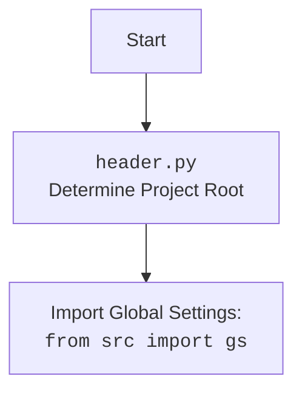

### **Системные инструкции для обработки кода проекта `hypotez`**

=========================================================================================

Описание функциональности и правил для генерации, анализа и улучшения кода. Направлено на обеспечение последовательного и читаемого стиля кодирования, соответствующего требованиям.

---

### **Основные принципы**

#### **1. Общие указания**:
- Соблюдай четкий и понятный стиль кодирования.
- Все изменения должны быть обоснованы и соответствовать установленным требованиям.

#### **2. Комментарии**:
- Используй `#` для внутренних комментариев.
- Документация всех функций, методов и классов должна следовать такому формату: 
    ```python
        def function(param: str, param1: Optional[str | dict | str] = None) -> dict | None:
            """ 
            Args:
                param (str): Описание параметра `param`.
                param1 (Optional[str | dict | str], optional): Описание параметра `param1`. По умолчанию `None`.
    
            Returns:
                dict | None: Описание возвращаемого значения. Возвращает словарь или `None`.
    
            Raises:
                SomeError: Описание ситуации, в которой возникает исключение `SomeError`.

            Ехаmple:
                >>> function('param', 'param1')
                {'param': 'param1'}
            """
    ```
- Комментарии и документация должны быть четкими, лаконичными и точными.

#### **3. Форматирование кода**:
- Используй одинарные кавычки. `a:str = 'value'`, `print('Hello World!')`;
- Добавляй пробелы вокруг операторов. Например, `x = 5`;
- Все параметры должны быть аннотированы типами. `def function(param: str, param1: Optional[str | dict | str] = None) -> dict | None:`;
- Не используй `Union`. Вместо этого используй `|`.

#### **4. Логирование**:
- Для логгирования Всегда Используй модуль `logger` из `src.logger.logger`.
- Ошибки должны логироваться с использованием `logger.error`.
Пример:
    ```python
        try:
            ...
        except Exception as ex:
            logger.error('Error while processing data', ех, exc_info=True)
    ```
#### **5 Не используй `Union[]` в коде. Вместо него используй `|`
Например:
```python
x: str | int ...
```


---

### **Основные требования**:

#### **1. Формат ответов в Markdown**:
- Все ответы должны быть выполнены в формате **Markdown**.

#### **2. Формат комментариев**:
- Используй указанный стиль для комментариев и документации в коде.
- Пример:

```python
from typing import Generator, Optional, List
from pathlib import Path


def read_text_file(
    file_path: str | Path,
    as_list: bool = False,
    extensions: Optional[List[str]] = None,
    chunk_size: int = 8192,
) -> Generator[str, None, None] | str | None:
    """
    Считывает содержимое файла (или файлов из каталога) с использованием генератора для экономии памяти.

    Args:
        file_path (str | Path): Путь к файлу или каталогу.
        as_list (bool): Если `True`, возвращает генератор строк.
        extensions (Optional[List[str]]): Список расширений файлов для чтения из каталога.
        chunk_size (int): Размер чанков для чтения файла в байтах.

    Returns:
        Generator[str, None, None] | str | None: Генератор строк, объединенная строка или `None` в случае ошибки.

    Raises:
        Exception: Если возникает ошибка при чтении файла.

    Example:
        >>> from pathlib import Path
        >>> file_path = Path('example.txt')
        >>> content = read_text_file(file_path)
        >>> if content:
        ...    print(f'File content: {content[:100]}...')
        File content: Example text...
    """
    ...
```
- Всегда делай подробные объяснения в комментариях. Избегай расплывчатых терминов, 
- таких как *«получить»* или *«делать»*. Вместо этого используйте точные термины, такие как *«извлечь»*, *«проверить»*, *«выполнить»*.
- Вместо: *«получаем»*, *«возвращаем»*, *«преобразовываем»* используй имя объекта *«функция получае»*, *«переменная возвращает»*, *«код преобразовывает»* 
- Комментарии должны непосредственно предшествовать описываемому блоку кода и объяснять его назначение.

#### **3. Пробелы вокруг операторов присваивания**:
- Всегда добавляйте пробелы вокруг оператора `=`, чтобы повысить читаемость.
- Примеры:
  - **Неправильно**: `x=5`
  - **Правильно**: `x = 5`

#### **4. Использование `j_loads` или `j_loads_ns`**:
- Для чтения JSON или конфигурационных файлов замените стандартное использование `open` и `json.load` на `j_loads` или `j_loads_ns`.
- Пример:

```python
# Неправильно:
with open('config.json', 'r', encoding='utf-8') as f:
    data = json.load(f)

# Правильно:
data = j_loads('config.json')
```

#### **5. Сохранение комментариев**:
- Все существующие комментарии, начинающиеся с `#`, должны быть сохранены без изменений в разделе «Улучшенный код».
- Если комментарий кажется устаревшим или неясным, не изменяйте его. Вместо этого отметьте его в разделе «Изменения».

#### **6. Обработка `...` в коде**:
- Оставляйте `...` как указатели в коде без изменений.
- Не документируйте строки с `...`.
```

#### **7. Аннотации**
Для всех переменных должны быть определены аннотации типа. 
Для всех функций все входные и выходные параметры аннотириваны
Для все параметров должны быть аннотации типа.


### **8. webdriver**
В коде используется webdriver. Он импртируется из модуля `webdriver` проекта `hypotez`
```python
from src.webdirver import Driver, Chrome, Firefox, Playwright, ...
driver = Driver(Firefox)

Пoсле чего может использоваться как

close_banner = {
  "attribute": null,
  "by": "XPATH",
  "selector": "//button[@id = 'closeXButton']",
  "if_list": "first",
  "use_mouse": false,
  "mandatory": false,
  "timeout": 0,
  "timeout_for_event": "presence_of_element_located",
  "event": "click()",
  "locator_description": "Закрываю pop-up окно, если оно не появилось - не страшно (`mandatory`:`false`)"
}

result = driver.execute_locator(close_banner)
```

## Анализ кода `hypotez/src/endpoints/kazarinov/main.py`

### 1. Блок-схема

```mermaid
graph TD
    A[Начало: `if __name__ == "__main__":`] --> B{Вызов `main()` из `src.endpoints.kazarinov.minibot`};
    B --> C[Запуск основного функционала `minibot`];
    C --> D{Сбор компонентов компьютера с сайтов поставщиков};
    D --> E{Объединение компонентов в onetab};
    E --> F{Отправка созданной ссылки боту};
    F --> G{Бот запускает сценарий сбора информации с веб-страниц};
    G --> H{Сценарий подключает `quotation_builder`};
    H --> I{Создание конечного прайс-листа};

    style A fill:#f9f,stroke:#333,stroke-width:2px
    style B fill:#ccf,stroke:#333,stroke-width:2px
    style C fill:#ccf,stroke:#333,stroke-width:2px
    style D fill:#ccf,stroke:#333,stroke-width:2px
    style E fill:#ccf,stroke:#333,stroke-width:2px
    style F fill:#ccf,stroke:#333,stroke-width:2px
    style G fill:#ccf,stroke:#333,stroke-width:2px
    style H fill:#ccf,stroke:#333,stroke-width:2px
    style I fill:#ccf,stroke:#333,stroke-width:2px
```

**Примеры для каждого логического блока:**

- **D (Сбор компонентов компьютера с сайтов поставщиков):** `minibot` обращается к сайтам магазинов, например, DNS, Regard и т.д., чтобы собрать информацию о видеокартах, процессорах, материнских платах.
- **E (Объединение компонентов в onetab):** `minibot` формирует ссылку onetab с информацией о выбранных компонентах.
- **F (Отправка созданной ссылки боту):** Ссылка onetab отправляется, например, в Telegram бот, для дальнейшей обработки.
- **H (Сценарий подключает `quotation_builder`):** Сценарий обработки данных, полученных от бота, использует `quotation_builder` для формирования прайс-листа.

### 2. Диаграмма

```mermaid
flowchart TD
    Start[<code>main.py</code><br>Точка входа для Kazarinov endpoint] --> ImportModules[Импорт модулей: <br><code>import asyncio</code>,<br><code>import header</code>,<br><code>from src.endpoints.kazarinov.minibot import main</code>];
    ImportModules --> CallMain[Вызов функции <code>main()</code> из <code>minibot.py</code>];
    CallMain --> End[Запуск основного функционала <code>minibot</code>];
```

**Объяснение зависимостей:**

- `asyncio`: Используется для асинхронного программирования, что может быть необходимо для выполнения сетевых запросов или параллельной обработки данных.
- `header`: Используется для определения корень проекта.
- `src.endpoints.kazarinov.minibot`: Модуль, содержащий основную логику работы "микробота" для сборки информации и формирования запросов. Импортируется функция `main` из этого модуля.



### 3. Объяснение

- **Импорты:**
    - `asyncio`: Используется для поддержки асинхронных операций.
    - `header`: Используется для определения корневого каталога проекта.
    - `from src.endpoints.kazarinov.minibot import main`: Импортирует функцию `main` из модуля `minibot.py`, расположенного в той же директории `src.endpoints.kazarinov`.

- **Функции:**
    - `main()`: Функция из модуля `minibot.py`, которая запускает основной процесс сбора, обработки и отправки данных.
        - **Аргументы**: Функция не принимает аргументов.
        - **Возвращаемое значение**: Функция ничего не возвращает (`None`), но запускает основной процесс.
        - **Назначение**: Запуск основного процесса `minibot`.
        - **Пример**: `main()` запускает сбор данных, объединяет их и отправляет боту.

- **Переменные:**
    - В данном коде переменные явно не объявлены, так как основное действие - запуск функции `main()`.

- **Потенциальные ошибки или области для улучшения:**
    - Отсутствие обработки исключений: В коде не предусмотрена обработка возможных исключений, которые могут возникнуть при выполнении `main()`.  Рекомендуется добавить блоки `try...except` для обработки ошибок и логирования их с использованием `logger.error`.
    - Отсутствие логирования: Код не содержит логирования, что затрудняет отладку и мониторинг. Рекомендуется добавить логирование основных этапов выполнения программы.

- **Взаимосвязи с другими частями проекта:**
    - `minibot.py`: Содержит основную логику работы "микробота", включая сбор данных с веб-сайтов, формирование запросов и отправку их боту.
    - `scenario.py`: Содержит сценарии обработки данных, полученных от бота, включая разбор данных и формирование прайс-листа.
    - `quotation_builder.py`: Модуль, используемый для формирования конечного прайс-листа на основе данных, собранных и обработанных `minibot` и сценариями.