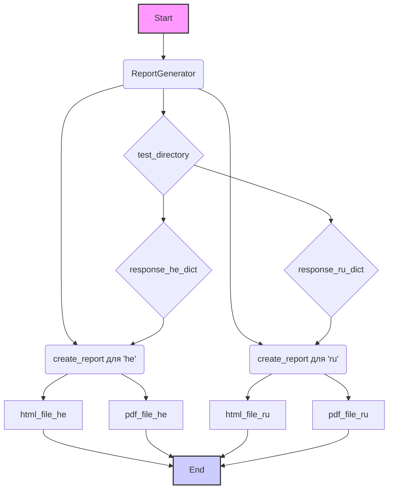
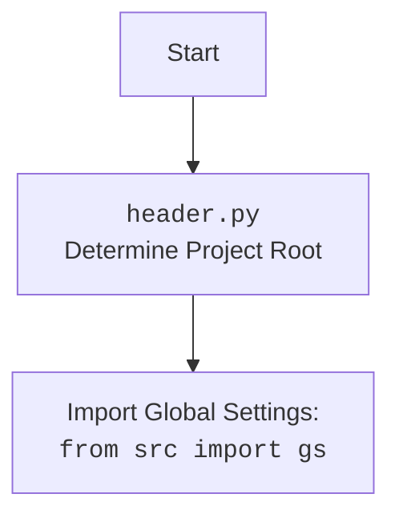

### **Системные инструкции для обработки кода проекта `hypotez`**

=========================================================================================

Описание функциональности и правил для генерации, анализа и улучшения кода. Направлено на обеспечение последовательного и читаемого стиля кодирования, соответствующего требованиям.

---

### **Основные принципы**

#### **1. Общие указания**:
- Соблюдай четкий и понятный стиль кодирования.
- Все изменения должны быть обоснованы и соответствовать установленным требованиям.

#### **2. Комментарии**:
- Используй `#` для внутренних комментариев.
- Документация всех функций, методов и классов должна следовать такому формату: 
    ```python
        def function(param: str, param1: Optional[str | dict | str] = None) -> dict | None:
            """ 
            Args:
                param (str): Описание параметра `param`.
                param1 (Optional[str | dict | str], optional): Описание параметра `param1`. По умолчанию `None`.
    
            Returns:
                dict | None: Описание возвращаемого значения. Возвращает словарь или `None`.
    
            Raises:
                SomeError: Описание ситуации, в которой возникает исключение `SomeError`.

            Ехаmple:
                >>> function('param', 'param1')
                {'param': 'param1'}
            """
    ```
- Комментарии и документация должны быть четкими, лаконичными и точными.

#### **3. Форматирование кода**:
- Используй одинарные кавычки. `a:str = 'value'`, `print('Hello World!')`;
- Добавляй пробелы вокруг операторов. Например, `x = 5`;
- Все параметры должны быть аннотированы типами. `def function(param: str, param1: Optional[str | dict | str] = None) -> dict | None:`;
- Не используй `Union`. Вместо этого используй `|`.

#### **4. Логирование**:
- Для логгирования Всегда Используй модуль `logger` из `src.logger.logger`.
- Ошибки должны логироваться с использованием `logger.error`.
Пример:
    ```python
        try:
            ...
        except Exception as ex:
            logger.error('Error while processing data', ех, exc_info=True)
    ```
#### **5 Не используй `Union[]` в коде. Вместо него используй `|`
Например:
```python
x: str | int ...
```


---

### **Основные требования**:

#### **1. Формат ответов в Markdown**:
- Все ответы должны быть выполнены в формате **Markdown**.

#### **2. Формат комментариев**:
- Используй указанный стиль для комментариев и документации в коде.
- Пример:

```python
from typing import Generator, Optional, List
from pathlib import Path


def read_text_file(
    file_path: str | Path,
    as_list: bool = False,
    extensions: Optional[List[str]] = None,
    chunk_size: int = 8192,
) -> Generator[str, None, None] | str | None:
    """
    Считывает содержимое файла (или файлов из каталога) с использованием генератора для экономии памяти.

    Args:
        file_path (str | Path): Путь к файлу или каталогу.
        as_list (bool): Если `True`, возвращает генератор строк.
        extensions (Optional[List[str]]): Список расширений файлов для чтения из каталога.
        chunk_size (int): Размер чанков для чтения файла в байтах.

    Returns:
        Generator[str, None, None] | str | None: Генератор строк, объединенная строка или `None` в случае ошибки.

    Raises:
        Exception: Если возникает ошибка при чтении файла.

    Example:
        >>> from pathlib import Path
        >>> file_path = Path('example.txt')
        >>> content = read_text_file(file_path)
        >>> if content:
        ...    print(f'File content: {content[:100]}...')
        File content: Example text...
    """
    ...
```
- Всегда делай подробные объяснения в комментариях. Избегай расплывчатых терминов, 
- таких как *«получить»* или *«делать»*
-  . Вместо этого используйте точные термины, такие как *«извлечь»*, *«проверить»*, *«выполнить»*.
- Вместо: *«получаем»*, *«возвращаем»*, *«преобразовываем»* используй имя объекта *«функция получае»*, *«переменная возвращает»*, *«код преобразовывает»* 
- Комментарии должны непосредственно предшествовать описываемому блоку кода и объяснять его назначение.

#### **3. Пробелы вокруг операторов присваивания**:
- Всегда добавляйте пробелы вокруг оператора `=`, чтобы повысить читаемость.
- Примеры:
  - **Неправильно**: `x=5`
  - **Правильно**: `x = 5`

#### **4. Использование `j_loads` или `j_loads_ns`**:
- Для чтения JSON или конфигурационных файлов замените стандартное использование `open` и `json.load` на `j_loads` или `j_loads_ns`.
- Пример:

```python
# Неправильно:
with open('config.json', 'r', encoding='utf-8') as f:
    data = json.load(f)

# Правильно:
data = j_loads('config.json')
```

#### **5. Сохранение комментариев**:
- Все существующие комментарии, начинающиеся с `#`, должны быть сохранены без изменений в разделе «Улучшенный код».
- Если комментарий кажется устаревшим или неясным, не изменяйте его. Вместо этого отметьте его в разделе «Изменения».

#### **6. Обработка `...` в коде**:
- Оставляйте `...` как указатели в коде без изменений.
- Не документируйте строки с `...`.
```

#### **7. Аннотации**
Для всех переменных должны быть определены аннотации типа. 
Для всех функций все входные и выходные параметры аннотириваны
Для все параметров должны быть аннотации типа.


### **8. webdriver**
В коде используется webdriver. Он импртируется из модуля `webdriver` проекта `hypotez`
```python
from src.webdirver import Driver, Chrome, Firefox, Playwright, ...
driver = Driver(Firefox)

Пoсле чего может использоваться как

close_banner = {
  "attribute": null,
  "by": "XPATH",
  "selector": "//button[@id = 'closeXButton']",
  "if_list": "first",
  "use_mouse": false,
  "mandatory": false,
  "timeout": 0,
  "timeout_for_event": "presence_of_element_located",
  "event": "click()",
  "locator_description": "Закрываю pop-up окно, если оно не появилось - не страшно (`mandatory`:`false`)"
}

result = driver.execute_locator(close_banner)
```

### Анализ кода `hypotez/src/endpoints/kazarinov/scenarios/_experiments/create_report.py`

#### 1. Блок-схема:

```mermaid
graph TD
    A[Начало] --> B{Импорт модулей: pathlib, header, src, ReportGenerator, ask_model};
    B --> C[Инициализация ReportGenerator: report_generator = ReportGenerator()];
    C --> D{Определение путей к файлам: html_file_he, pdf_file_he, html_file_ru, pdf_file_ru};
    D --> E[Генерация отчета для 'he': report_generator.create_report(response_he_dict['he'], 'he', html_file_he, pdf_file_he)];
    E --> F[Генерация отчета для 'ru': report_generator.create_report(response_ru_dict['ru'], 'ru', html_file_ru, pdf_file_ru)];
    F --> G[Конец];
```

**Примеры для логических блоков:**

*   **Импорт модулей**: Импортируются необходимые библиотеки и модули, такие как `pathlib` для работы с путями к файлам, `header` (предположительно, для общих настроек проекта), `src` (общий пакет проекта), `ReportGenerator` (класс для генерации отчетов) и `ask_model` (модуль для взаимодействия с AI моделью).
*   **Инициализация `ReportGenerator`**: Создается экземпляр класса `ReportGenerator`, который будет использоваться для генерации отчетов.
*   **Определение путей к файлам**: Определяются пути к HTML и PDF файлам для отчетов на двух языках: иврите (`he`) и русском (`ru`). Пути формируются с использованием переменной `test_directory`.
*   **Генерация отчета для 'he'**: Вызывается метод `create_report` объекта `report_generator` для создания отчета на иврите. В качестве аргументов передаются данные (`response_he_dict['he']`), язык (`'he'`) и пути к HTML и PDF файлам.
*   **Генерация отчета для 'ru'**: Аналогично, вызывается метод `create_report` для создания отчета на русском языке.

#### 2. Диаграмма:



**Объяснение зависимостей:**

*   `ReportGenerator`: Класс, отвечающий за генерацию отчетов. Импортируется из `src.endpoints.kazarinov.pricelist_generator`.
*   `test_directory`: Переменная, содержащая путь к каталогу для сохранения отчетов. Предположительно, определена в `ask_model.py`.
*   `response_he_dict` и `response_ru_dict`: Словари, содержащие данные для отчетов на иврите и русском языках соответственно.  Предположительно, определены в `ask_model.py`.
*   `create_report`: Метод класса `ReportGenerator`, создающий отчет.
*   `html_file_he`, `pdf_file_he`, `html_file_ru`, `pdf_file_ru`: Переменные, содержащие пути к HTML и PDF файлам для отчетов.



#### 3. Объяснение:

*   **Импорты**:
    *   `pathlib`: Модуль для работы с файловыми путями в объектно-ориентированном стиле.
    *   `header`:  Предположительно, содержит общие настройки проекта.
    *   `src`: Общий пакет проекта.
    *   `src.gs`: Глобальные настройки проекта, импортированные из `src`.
    *   `src.endpoints.kazarinov.pricelist_generator.ReportGenerator`: Класс, отвечающий за генерацию отчетов.
    *   `src.endpoints.kazarinov.scenarios._experiments.ask_model`: Модуль, содержащий функции для взаимодействия с AI моделью. Здесь импортируются все (*) имена из этого модуля, включая `test_directory`, `response_he_dict`, `response_ru_dict`.

*   **Переменные**:
    *   `report_generator`: Экземпляр класса `ReportGenerator`.
    *   `html_file_he`, `pdf_file_he`, `html_file_ru`, `pdf_file_ru`: Объекты `Path`, представляющие пути к файлам HTML и PDF отчетов на иврите и русском языках.
    * `test_directory:Path`: путь к директории тестов

*   **Функциональность**:
    Основная цель кода - сгенерировать отчеты на иврите и русском языках, используя данные, полученные от AI модели (через модуль `ask_model`). Отчеты сохраняются в формате HTML и PDF.  Класс `ReportGenerator` отвечает за фактическое создание отчетов. Пути к файлам отчетов определяются с использованием `pathlib` и хранятся в соответствующих переменных.

*   **Потенциальные области для улучшения**:
    *   Необходимо добавить обработку исключений для случаев, когда не удается сгенерировать отчет или получить данные от AI модели.
    *   Было бы полезно логировать действия по созданию отчетов, чтобы можно было отслеживать процесс и выявлять ошибки.
    *   Отсутствуют аннотации типов.
    *   Стоит пересмотреть способ импорта из `ask_model` (`from ... import *`), чтобы явно указать, какие имена используются, и избежать возможных конфликтов имен.
    *   Отсутствует документация для `response_he_dict`, `response_ru_dict`, `test_directory`

*   **Взаимосвязь с другими частями проекта**:
    Код зависит от модуля `ask_model` для получения данных для отчетов и от класса `ReportGenerator` для создания отчетов.  Он также использует глобальные настройки проекта из `src.gs`.