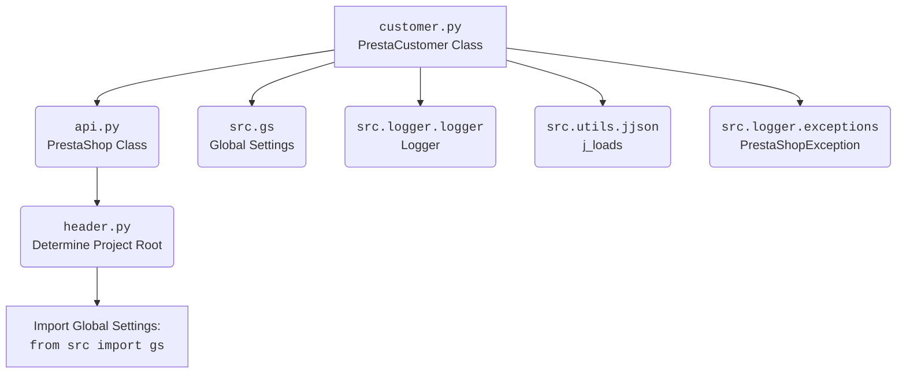

### **Системные инструкции для обработки кода проекта `hypotez`**

=========================================================================================

Описание функциональности и правил для генерации, анализа и улучшения кода. Направлено на обеспечение последовательного и читаемого стиля кодирования, соответствующего требованиям.

---

### **Основные принципы**

#### **1. Общие указания**:
- Соблюдай четкий и понятный стиль кодирования.
- Все изменения должны быть обоснованы и соответствовать установленным требованиям.

#### **2. Комментарии**:
- Используй `#` для внутренних комментариев.
- Документация всех функций, методов и классов должна следовать такому формату: 
    ```python
        def function(param: str, param1: Optional[str | dict | str] = None) -> dict | None:
            """ 
            Args:
                param (str): Описание параметра `param`.
                param1 (Optional[str | dict | str], optional): Описание параметра `param1`. По умолчанию `None`.
    
            Returns:
                dict | None: Описание возвращаемого значения. Возвращает словарь или `None`.
    
            Raises:
                SomeError: Описание ситуации, в которой возникает исключение `SomeError`.

            Ехаmple:
                >>> function('param', 'param1')
                {'param': 'param1'}
            """
    ```
- Комментарии и документация должны быть четкими, лаконичными и точными.

#### **3. Форматирование кода**:
- Используй одинарные кавычки. `a:str = 'value'`, `print('Hello World!')`;
- Добавляй пробелы вокруг операторов. Например, `x = 5`;
- Все параметры должны быть аннотированы типами. `def function(param: str, param1: Optional[str | dict | str] = None) -> dict | None:`;
- Не используй `Union`. Вместо этого используй `|`.

#### **4. Логирование**:
- Для логгирования Всегда Используй модуль `logger` из `src.logger.logger`.
- Ошибки должны логироваться с использованием `logger.error`.
Пример:
    ```python
        try:
            ...
        except Exception as ex:
            logger.error('Error while processing data', ех, exc_info=True)
    ```
#### **5 Не используй `Union[]` в коде. Вместо него используй `|`
Например:
```python
x: str | int ...
```


---

### **Основные требования**:

#### **1. Формат ответов в Markdown**:
- Все ответы должны быть выполнены в формате **Markdown**.

#### **2. Формат комментариев**:
- Используй указанный стиль для комментариев и документации в коде.
- Пример:

```python
from typing import Generator, Optional, List
from pathlib import Path


def read_text_file(
    file_path: str | Path,
    as_list: bool = False,
    extensions: Optional[List[str]] = None,
    chunk_size: int = 8192,
) -> Generator[str, None, None] | str | None:
    """
    Считывает содержимое файла (или файлов из каталога) с использованием генератора для экономии памяти.

    Args:
        file_path (str | Path): Путь к файлу или каталогу.
        as_list (bool): Если `True`, возвращает генератор строк.
        extensions (Optional[List[str]]): Список расширений файлов для чтения из каталога.
        chunk_size (int): Размер чанков для чтения файла в байтах.

    Returns:
        Generator[str, None, None] | str | None: Генератор строк, объединенная строка или `None` в случае ошибки.

    Raises:
        Exception: Если возникает ошибка при чтении файла.

    Example:
        >>> from pathlib import Path
        >>> file_path = Path('example.txt')
        >>> content = read_text_file(file_path)
        >>> if content:
        ...    print(f'File content: {content[:100]}...')
        File content: Example text...
    """
    ...
```
- Всегда делай подробные объяснения в комментариях. Избегай расплывчатых терминов, 
- таких как *«получить»* или *«делать»*. Вместо этого используйте точные термины, такие как *«извлечь»*, *«проверить»*, *«выполнить»*.
- Вместо: *«получаем»*, *«возвращаем»*, *«преобразовываем»* используй имя объекта *«функция получае»*, *«переменная возвращает»*, *«код преобразовывает»* 
- Комментарии должны непосредственно предшествовать описываемому блоку кода и объяснять его назначение.

#### **3. Пробелы вокруг операторов присваивания**:
- Всегда добавляйте пробелы вокруг оператора `=`, чтобы повысить читаемость.
- Примеры:
  - **Неправильно**: `x=5`
  - **Правильно**: `x = 5`

#### **4. Использование `j_loads` или `j_loads_ns`**:
- Для чтения JSON или конфигурационных файлов замените стандартное использование `open` и `json.load` на `j_loads` или `j_loads_ns`.
- Пример:

```python
# Неправильно:
with open('config.json', 'r', encoding='utf-8') as f:
    data = json.load(f)

# Правильно:
data = j_loads('config.json')
```

#### **5. Сохранение комментариев**:
- Все существующие комментарии, начинающиеся с `#`, должны быть сохранены без изменений в разделе «Улучшенный код».
- Если комментарий кажется устаревшим или неясным, не изменяйте его. Вместо этого отметьте его в разделе «Изменения».

#### **6. Обработка `...` в коде**:
- Оставляйте `...` как указатели в коде без изменений.
- Не документируйте строки с `...`.
```

#### **7. Аннотации**
Для всех переменных должны быть определены аннотации типа. 
Для всех функций все входные и выходные параметры аннотириваны
Для все параметров должны быть аннотации типа.


### **8. webdriver**
В коде используется webdriver. Он импртируется из модуля `webdriver` проекта `hypotez`
```python
from src.webdirver import Driver, Chrome, Firefox, Playwright, ...
driver = Driver(Firefox)

Пoсле чего может использоваться как

close_banner = {
  "attribute": null,
  "by": "XPATH",
  "selector": "//button[@id = 'closeXButton']",
  "if_list": "first",
  "use_mouse": false,
  "mandatory": false,
  "timeout": 0,
  "timeout_for_event": "presence_of_element_located",
  "event": "click()",
  "locator_description": "Закрываю pop-up окно, если оно не появилось - не страшно (`mandatory`:`false`)"
}

result = driver.execute_locator(close_banner)
```

### **Анализ кода `hypotez/src/endpoints/prestashop/customer.py`**

#### **1. Блок-схема**

```mermaid
graph TD
    A[Начало] --> B{Инициализация PrestaCustomer};
    B --> C{credentials is not None?};
    C -- Да --> D{api_domain = credentials.get('api_domain', api_domain)};
    D --> E{api_key = credentials.get('api_key', api_key)};
    C -- Нет --> F{api_domain и api_key заданы?};
    E --> F;
    F -- Нет --> G{ValueError: 'Необходимы оба параметра: api_domain и api_key.'};
    F -- Да --> H{super().__init__(api_domain, api_key, *args, **kwards)};
    H --> I[Конец];
    G --> I;
```

**Описание блок-схемы:**

1.  **Начало**: Начальная точка выполнения.
2.  **Инициализация `PrestaCustomer`**: Создается экземпляр класса `PrestaCustomer`.
3.  **`credentials is not None?`**: Проверка, переданы ли учетные данные (`credentials`).
    *   **Да**: Извлекаются `api_domain` и `api_key` из `credentials`, если они там есть, иначе используются значения по умолчанию.
        *   Пример: `credentials = {'api_domain': 'example.com', 'api_key': '123'}`.
    *   **Нет**: Пропускается шаг извлечения из `credentials`.
4.  **`api_domain` и `api_key` заданы?**: Проверяется, что `api_domain` и `api_key` не `None` и не пустые.
    *   **Нет**: Возбуждается исключение `ValueError`, указывающее на необходимость обоих параметров.
    *   **Да**: Вызывается конструктор родительского класса (`PrestaShop`) с переданными `api_domain` и `api_key`.
        *   Пример: `super().__init__('example.com', '123')`.
5.  **Конец**: Конечная точка выполнения.

#### **2. Диаграмма**



**Описание диаграммы:**

*   `customer.py`: Основной файл, содержащий класс `PrestaCustomer`.
*   `api.py`: Модуль, содержащий класс `PrestaShop`, от которого наследуется `PrestaCustomer`.
*   `header.py`: Определяет корень проекта.
*   `src.gs`: Глобальные настройки проекта.
*   `src.logger.logger`: Модуль логирования.
*   `src.utils.jjson`: Модуль для загрузки JSON-данных.
*   `src.logger.exceptions`: Модуль, содержащий пользовательские исключения, специфичные для PrestaShop.

#### **3. Объяснение**

**Импорты:**

*   `sys`: Используется для доступа к некоторым переменным и функциям, взаимодействующим с Python runtime.
*   `os`: Предоставляет функции для взаимодействия с операционной системой.
*   `attr`, `attrs`: Из библиотеки `attrs`, используются для определения классов, автоматически генерирующих методы, такие как `__init__`, `__repr__` и т.д.
*   `pathlib.Path`: Представляет пути к файлам или каталогам.
*   `typing.Union`: Позволяет указывать, что переменная может иметь один из нескольких типов.
*   `types.SimpleNamespace`: Простой класс для создания объектов, к атрибутам которых можно обращаться как к свойствам.
*   `header`: Модуль, определяющий корень проекта.
*   `src.gs`: Модуль глобальных настроек.
*   `src.logger.logger`: Модуль для логирования.
*   `src.utils.jjson.j_loads`: Функция для загрузки JSON-данных из файла.
*   `.api.PrestaShop`: Класс `PrestaShop` для взаимодействия с API PrestaShop.
*   `src.logger.exceptions.PrestaShopException`: Пользовательское исключение для PrestaShop.
*    `typing.Optional`: Указывает, что переменная может быть заданного типа или `None`.

**Класс `PrestaCustomer`:**

*   **Роль**: Предоставляет методы для работы с клиентами в PrestaShop API.
*   **Атрибуты**: Наследует атрибуты от класса `PrestaShop` (например, `api_domain`, `api_key`).
*   **Методы**:
    *   `__init__`: Конструктор класса. Принимает учетные данные (`credentials` или `api_domain` и `api_key`) и инициализирует соединение с API PrestaShop через родительский класс `PrestaShop`.
        *   Аргументы:
            *   `credentials` (`Optional[dict | SimpleNamespace]`): Словарь или объект `SimpleNamespace` с параметрами `api_domain` и `api_key`.
            *   `api_domain` (`Optional[str]`): Домен API PrestaShop.
            *   `api_key` (`Optional[str]`): Ключ API PrestaShop.
        *   Возвращаемое значение: `None`.
        *   Пример:

```python
prestacustomer = PrestaCustomer(api_domain='example.com', api_key='123')
```

*   **Взаимодействие**: Наследуется от класса `PrestaShop`, использует модули `logger` для логирования и `j_loads` для загрузки JSON-данных.

**Функции:**

*   `__init__`: Конструктор класса `PrestaCustomer`, инициализирует атрибуты класса и вызывает конструктор родительского класса `PrestaShop`.

**Переменные:**

*   `credentials` (`Optional[dict | SimpleNamespace]`): Учетные данные для доступа к API PrestaShop.
*   `api_domain` (`Optional[str]`): Домен API PrestaShop.
*   `api_key` (`Optional[str]`): Ключ API PrestaShop.

**Потенциальные ошибки и области для улучшения:**

*   Отсутствует обработка исключений при извлечении `api_domain` и `api_key` из `credentials`.
*   Не реализованы методы для добавления, удаления и обновления клиентов PrestaShop (указаны только в docstring).

**Цепочка взаимосвязей:**

1.  `customer.py` использует класс `PrestaShop` из `api.py` для взаимодействия с API PrestaShop.
2.  `PrestaShop` использует `header.py` для определения корня проекта и `src.gs` для глобальных настроек.
3.  `customer.py` и `PrestaShop` используют `src.logger.logger` для логирования.
4.  `customer.py` использует `src.utils.jjson.j_loads` для загрузки JSON-данных.
5.  `customer.py` использует `src.logger.exceptions.PrestaShopException` для обработки специфичных исключений.