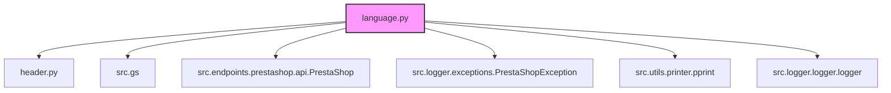
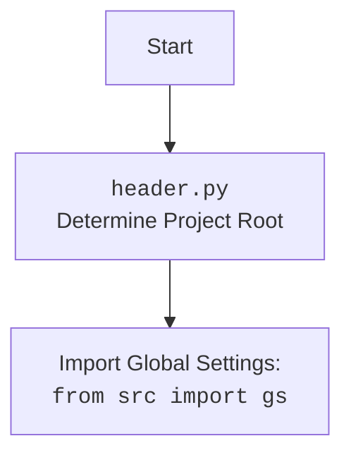

### **Системные инструкции для обработки кода проекта `hypotez`**

=========================================================================================

Описание функциональности и правил для генерации, анализа и улучшения кода. Направлено на обеспечение последовательного и читаемого стиля кодирования, соответствующего требованиям.

---

### **Основные принципы**

#### **1. Общие указания**:
- Соблюдай четкий и понятный стиль кодирования.
- Все изменения должны быть обоснованы и соответствовать установленным требованиям.

#### **2. Комментарии**:
- Используй `#` для внутренних комментариев.
- Документация всех функций, методов и классов должна следовать такому формату: 
    ```python
        def function(param: str, param1: Optional[str | dict | str] = None) -> dict | None:
            """ 
            Args:
                param (str): Описание параметра `param`.
                param1 (Optional[str | dict | str], optional): Описание параметра `param1`. По умолчанию `None`.
    
            Returns:
                dict | None: Описание возвращаемого значения. Возвращает словарь или `None`.
    
            Raises:
                SomeError: Описание ситуации, в которой возникает исключение `SomeError`.

            Ехаmple:
                >>> function('param', 'param1')
                {'param': 'param1'}
            """
    ```
- Комментарии и документация должны быть четкими, лаконичными и точными.

#### **3. Форматирование кода**:
- Используй одинарные кавычки. `a:str = 'value'`, `print('Hello World!')`;
- Добавляй пробелы вокруг операторов. Например, `x = 5`;
- Все параметры должны быть аннотированы типами. `def function(param: str, param1: Optional[str | dict | str] = None) -> dict | None:`;
- Не используй `Union`. Вместо этого используй `|`.

#### **4. Логирование**:
- Для логгирования Всегда Используй модуль `logger` из `src.logger.logger`.
- Ошибки должны логироваться с использованием `logger.error`.
Пример:
    ```python
        try:
            ...
        except Exception as ex:
            logger.error('Error while processing data', ех, exc_info=True)
    ```
#### **5 Не используй `Union[]` в коде. Вместо него используй `|`
Например:
```python
x: str | int ...
```


---

### **Основные требования**:

#### **1. Формат ответов в Markdown**:
- Все ответы должны быть выполнены в формате **Markdown**.

#### **2. Формат комментариев**:
- Используй указанный стиль для комментариев и документации в коде.
- Пример:

```python
from typing import Generator, Optional, List
from pathlib import Path


def read_text_file(
    file_path: str | Path,
    as_list: bool = False,
    extensions: Optional[List[str]] = None,
    chunk_size: int = 8192,
) -> Generator[str, None, None] | str | None:
    """
    Считывает содержимое файла (или файлов из каталога) с использованием генератора для экономии памяти.

    Args:
        file_path (str | Path): Путь к файлу или каталогу.
        as_list (bool): Если `True`, возвращает генератор строк.
        extensions (Optional[List[str]]): Список расширений файлов для чтения из каталога.
        chunk_size (int): Размер чанков для чтения файла в байтах.

    Returns:
        Generator[str, None, None] | str | None: Генератор строк, объединенная строка или `None` в случае ошибки.

    Raises:
        Exception: Если возникает ошибка при чтении файла.

    Example:
        >>> from pathlib import Path
        >>> file_path = Path('example.txt')
        >>> content = read_text_file(file_path)
        >>> if content:
        ...    print(f'File content: {content[:100]}...')
        File content: Example text...
    """
    ...
```
- Всегда делай подробные объяснения в комментариях. Избегай расплывчатых терминов, 
- таких как *«получить»* или *«делать»*. Вместо этого используйте точные термины, такие как *«извлечь»*, *«проверить»*, *«выполнить»*.
- Вместо: *«получаем»*, *«возвращаем»*, *«преобразовываем»* используй имя объекта *«функция получае»*, *«переменная возвращает»*, *«код преобразовывает»* 
- Комментарии должны непосредственно предшествовать описываемому блоку кода и объяснять его назначение.

#### **3. Пробелы вокруг операторов присваивания**:
- Всегда добавляйте пробелы вокруг оператора `=`, чтобы повысить читаемость.
- Примеры:
  - **Неправильно**: `x=5`
  - **Правильно**: `x = 5`

#### **4. Использование `j_loads` или `j_loads_ns`**:
- Для чтения JSON или конфигурационных файлов замените стандартное использование `open` и `json.load` на `j_loads` или `j_loads_ns`.
- Пример:

```python
# Неправильно:
with open('config.json', 'r', encoding='utf-8') as f:
    data = json.load(f)

# Правильно:
data = j_loads('config.json')
```

#### **5. Сохранение комментариев**:
- Все существующие комментарии, начинающиеся с `#`, должны быть сохранены без изменений в разделе «Улучшенный код».
- Если комментарий кажется устаревшим или неясным, не изменяйте его. Вместо этого отметьте его в разделе «Изменения».

#### **6. Обработка `...` в коде**:
- Оставляйте `...` как указатели в коде без изменений.
- Не документируйте строки с `...`.
```

#### **7. Аннотации**
Для всех переменных должны быть определены аннотации типа. 
Для всех функций все входные и выходные параметры аннотириваны
Для все параметров должны быть аннотации типа.


### **8. webdriver**
В коде используется webdriver. Он импртируется из модуля `webdriver` проекта `hypotez`
```python
from src.webdirver import Driver, Chrome, Firefox, Playwright, ...
driver = Driver(Firefox)

Пoсле чего может использоваться как

close_banner = {
  "attribute": null,
  "by": "XPATH",
  "selector": "//button[@id = 'closeXButton']",
  "if_list": "first",
  "use_mouse": false,
  "mandatory": false,
  "timeout": 0,
  "timeout_for_event": "presence_of_element_located",
  "event": "click()",
  "locator_description": "Закрываю pop-up окно, если оно не появилось - не страшно (`mandatory`:`false`)"
}

result = driver.execute_locator(close_banner)
```

### **Анализ кода `hypotez/src/endpoints/prestashop/language.py`**

#### **1. Блок-схема**

```mermaid
graph TD
    A[Начало] --> B{Вызов класса PrestaLanguage};
    B --> C{Инициализация класса PrestaLanguage};
    C --> D{Вызов метода get_lang_name_by_index(lang_index: int | str) -> str};
    D --> E{Супер вызов get(languages, resource_id=str(lang_index), display=full, io_format=JSON)};
    E --> F{Обработка исключений};
    F -- Ошибка --> G[Логирование ошибки logger.error];
    F -- Успех --> H[Возврат ISO имени языка];
    C --> I{Вызов метода get_languages_schema() -> Optional[dict]};
    I --> J{Вызов _exec(languages, display=full, io_format=JSON)};
    J --> K{Обработка исключений};
    K -- Ошибка --> L[Логирование ошибки logger.error];
    K -- Успех --> M[Возврат Language schema];
    A --> N{Вызов asyncio.run(main())};
    N --> O{Создание экземпляра класса PrestaLanguage};
    O --> P{Вызов метода get_languages_schema()};
    P --> Q{Вывод Language schema};
```

**Примеры для логических блоков:**

*   **B**: `prestalanguage = PrestaLanguage(API_DOMAIN='example.com', API_KEY='12345')`
*   **D**: `lang_name = prestalanguage.get_lang_name_by_index(1)`
*   **E**: `super().get('languages', resource_id='1', display='full', io_format='JSON')`
*   **G**: `logger.error('Ошибка получения языка по индексу', ex)`
*   **H**: `return 'English'`
*   **I**: `languages_schema = prestalanguage.get_languages_schema()`
*   **J**: `self._exec('languages', display='full', io_format='JSON')`
*   **L**: `logger.error('Error:', ex)`
*   **M**: `return { "languages": { ... } }`
*   **O**: `lang_class = PrestaLanguage()`
*   **P**: `languagas_schema = await lang_class.get_languages_schema()`
*   **Q**: `print(languagas_schema)`

#### **2. Диаграмма зависимостей**



**Объяснение зависимостей:**

*   `header`: Используется для определения корневой директории проекта.
*   `src.gs`: Содержит глобальные настройки проекта.
*   `src.endpoints.prestashop.api.PrestaShop`: Базовый класс для работы с API PrestaShop.
*   `src.logger.exceptions.PrestaShopException`: Класс исключений для PrestaShop.
*   `src.utils.printer.pprint`: Функция для "красивой" печати данных.
*   `src.logger.logger.logger`: Модуль для логирования событий.

Дополнительный блок `mermaid` для `header.py`:



#### **3. Объяснение**

**Импорты:**

*   `asyncio`: Используется для асинхронного программирования.
*   `from types import SimpleNamespace`:  Используется для создания простых объектов, к которым можно добавлять произвольные атрибуты. В данном коде не используется.
*   `header`: Предположительно, содержит общие функции для работы с заголовками или определения корневой директории проекта.
*   `from src import gs`: Импортирует глобальные настройки из модуля `gs`.
*   `from src.endpoints.prestashop.api import PrestaShop`: Импортирует класс `PrestaShop`, который предоставляет интерфейс для взаимодействия с API PrestaShop.
*   `from src.logger.exceptions import PrestaShopException`: Импортирует класс исключений `PrestaShopException`, который используется для обработки ошибок, связанных с PrestaShop.
*   `from src.utils.printer import pprint as print`: Импортирует функцию `pprint` из модуля `src.utils.printer` и переименовывает ее в `print` для удобного использования.  Предположительно, используется для форматированного вывода данных.
*   `from src.logger.logger import logger`: Импортирует объект `logger` для логирования событий.
*   `from typing import Optional`: Используется для указания, что переменная может иметь значение `None`.

**Класс `PrestaLanguage`:**

*   **Роль**: Управляет языками в магазине PrestaShop через API PrestaShop.
*   **Атрибуты**: Отсутствуют явно заданные атрибуты в представленном коде, но класс наследуется от `PrestaShop`, который, вероятно, содержит атрибуты для аутентификации и URL API.
*   **Методы**:
    *   `__init__(self, *args, **kwards)`: Конструктор класса. Инициализирует экземпляр класса `PrestaLanguage`.  Не выполняет никаких действий, кроме вызова конструктора родительского класса (`PrestaShop`).
    *   `get_lang_name_by_index(self, lang_index: int | str) -> str`:
        *   **Аргументы**:
            *   `lang_index (int | str)`: Индекс языка в PrestaShop.
        *   **Возвращаемое значение**: ISO код языка (str).
        *   **Назначение**: Получает ISO код языка по его индексу в PrestaShop.
        *   **Пример**: `lang_name = self.get_lang_name_by_index(1)`
    *   `get_languages_schema(self) -> Optional[dict]`:
        *   **Возвращаемое значение**: Словарь, представляющий структуру языков в PrestaShop, или `None` в случае ошибки.
        *   **Назначение**: Получает структуру языков из API PrestaShop.
        *   **Пример**: `languages_schema = self.get_languages_schema()`
        *   Внутри вызывает метод `_exec` для выполнения запроса к API.  Вероятно, `_exec` - это метод из родительского класса `PrestaShop`, который выполняет HTTP запросы к API PrestaShop.

**Функции:**

*   `main()`:
    *   **Назначение**: Асинхронная функция, которая создает экземпляр класса `PrestaLanguage`, получает структуру языков и выводит ее на экран.
    *   **Пример**: `asyncio.run(main())`

**Переменные:**

*   `lang_class`: Экземпляр класса `PrestaLanguage`.
*   `languagas_schema`:  Словарь, содержащий структуру языков, полученный из API PrestaShop.

**Потенциальные ошибки и области для улучшения:**

*   В методах `get_lang_name_by_index` и `get_languages_schema` обрабатываются исключения, но отсутствует какая-либо логика для восстановления после ошибки.  Можно добавить повторные попытки или возвращать значения по умолчанию.
*   В классе `PrestaLanguage` отсутствует обработка аргументов `*args` и `**kwards` в конструкторе.
*   Использование `super().get` в `get_lang_name_by_index` выглядит нелогичным.  Скорее всего, должно быть `self._exec`.
*   В `main()` функция `get_languages_schema` вызывается как `await lang_class.get_languages_schema()`, что подразумевает, что она должна быть асинхронной.  Однако в коде она определена как обычная синхронная функция.
*   Отсутствует обработка ошибок в `main()`.

**Взаимосвязи с другими частями проекта:**

*   Модуль `language.py` является частью подсистемы для работы с PrestaShop API.
*   Он использует общие компоненты, такие как `logger` для логирования и `gs` для глобальных настроек.
*   Класс `PrestaLanguage` наследуется от `PrestaShop`, что обеспечивает повторное использование кода и единообразие в работе с API PrestaShop.