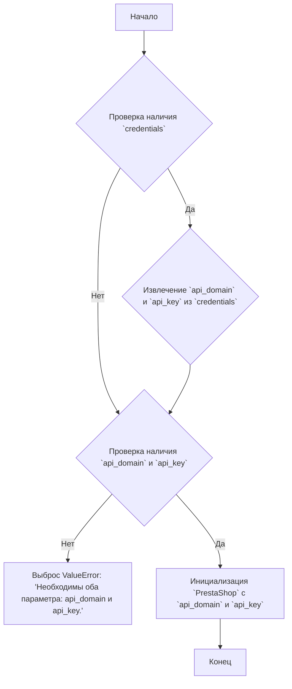
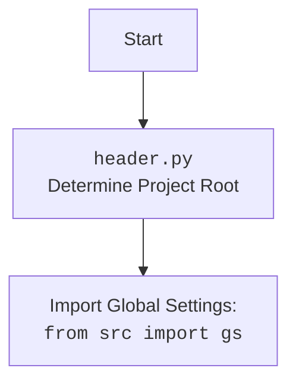

### **Анализ кода проекта `hypotez`**

=========================================================================================

#### **1. Блок-схема**



**Примеры для каждого логического блока:**

- **A (Начало)**: Начало выполнения кода класса `PrestaSupplier`.
- **B (Проверка наличия `credentials`)**:
  ```python
  credentials = {'api_domain': 'example.com', 'api_key': '123'}
  if credentials is not None:
      # ...
  ```
- **C (Извлечение `api_domain` и `api_key` из `credentials`)**:
  ```python
  api_domain = credentials.get('api_domain', api_domain)
  api_key = credentials.get('api_key', api_key)
  ```
- **D (Проверка наличия `api_domain` и `api_key`)**:
  ```python
  if not api_domain or not api_key:
      # ...
  ```
- **E (Выброс ValueError)**:
  ```python
  raise ValueError('Необходимы оба параметра: api_domain и api_key.')
  ```
- **F (Инициализация `PrestaShop`)**:
  ```python
  super().__init__(api_domain, api_key, *args, **kwards)
  ```
- **G (Конец)**: Завершение инициализации класса `PrestaSupplier`.

#### **2. Диаграмма**

```mermaid
flowchart TD
    A[PrestaSupplier] --> B(PrestaShop)
    B --> C{credentials: Optional[dict | SimpleNamespace]}
    B --> D{api_domain: Optional[str]}
    B --> E{api_key: Optional[str]}
    C --> F{j_loads_ns}
    style A fill:#f9f,stroke:#333,stroke-width:2px
    style B fill:#ccf,stroke:#333,stroke-width:2px
```

**Объяснение зависимостей:**

- `PrestaSupplier` наследуется от `PrestaShop`, что означает, что он использует функциональность, предоставляемую классом `PrestaShop`.
- `credentials`, `api_domain` и `api_key` являются параметрами, используемыми при инициализации классов `PrestaSupplier` и `PrestaShop`.
- `j_loads_ns` используется для загрузки JSON-конфигураций (предположительно, для управления `credentials`).



#### **3. Объяснение**

**Импорты:**

- `types.SimpleNamespace`: Используется для создания объектов, к атрибутам которых можно обращаться как к атрибутам объекта.
- `typing.Optional`: Указывает, что переменная может иметь значение определенного типа или `None`.
- `header`: Предположительно, содержит логику для определения корневого каталога проекта и, возможно, загрузки глобальных настроек.
- `src.gs`: Глобальные настройки проекта.
- `src.logger.logger`: Модуль логирования для записи информации о работе программы.
- `src.utils.jjson.j_loads_ns`: Функция для загрузки JSON-данных в объект `SimpleNamespace`.
- `.api.PrestaShop`: Базовый класс для работы с API PrestaShop.

**Классы:**

- `PrestaSupplier(PrestaShop)`:
  - **Роль**: Класс предназначен для работы с поставщиками в PrestaShop. Наследуется от класса `PrestaShop`, что подразумевает использование общих методов для работы с API PrestaShop.
  - **Атрибуты**: Не имеет явно определенных атрибутов, но наследует атрибуты от `PrestaShop` (например, `api_domain`, `api_key`).
  - **Методы**:
    - `__init__(self, credentials: Optional[dict | SimpleNamespace] = None, api_domain: Optional[str] = None, api_key: Optional[str] = None, *args, **kwards)`:
      - Инициализирует экземпляр класса `PrestaSupplier`.
      - Принимает учетные данные (`credentials`), домен API (`api_domain`) и ключ API (`api_key`).
      - Если `credentials` предоставлены, пытается извлечь `api_domain` и `api_key` из них.
      - Если `api_domain` или `api_key` не предоставлены, вызывает исключение `ValueError`.
      - Вызывает конструктор родительского класса `PrestaShop` с переданными параметрами.

**Функции:**

- `__init__`: Конструктор класса `PrestaSupplier`.
  - **Аргументы**:
    - `credentials (Optional[dict | SimpleNamespace], optional)`: Словарь или `SimpleNamespace` с учетными данными (содержащими `api_domain` и `api_key`). По умолчанию `None`.
    - `api_domain (Optional[str], optional)`: Домен API PrestaShop. По умолчанию `None`.
    - `api_key (Optional[str], optional)`: Ключ API PrestaShop. По умолчанию `None`.
    - `*args`: Произвольные позиционные аргументы, передаваемые в конструктор `PrestaShop`.
    - `**kwards`: Произвольные именованные аргументы, передаваемые в конструктор `PrestaShop`.
  - **Возвращаемое значение**: Отсутствует (конструктор).
  - **Назначение**: Инициализация объекта `PrestaSupplier` с необходимыми параметрами для работы с API PrestaShop.

**Переменные:**

- `credentials`: Может быть словарем или объектом `SimpleNamespace`, содержащим учетные данные для доступа к API PrestaShop.
- `api_domain`: Строка, представляющая домен API PrestaShop.
- `api_key`: Строка, представляющая ключ API PrestaShop.

**Потенциальные ошибки и области для улучшения:**

1. **Обработка исключений**:
   - Обработка исключения `ValueError` при отсутствии `api_domain` или `api_key`.
2. **Валидация данных**:
   - Добавить валидацию форматов `api_domain` и `api_key`.
3. **Использование `j_loads_ns`**:
   - Уточнить, где и как предполагается использование `j_loads_ns` для загрузки конфигурации.

**Взаимосвязи с другими частями проекта:**

- Класс `PrestaSupplier` является частью модуля `src.endpoints.prestashop`, который, вероятно, содержит другие классы и функции для работы с API PrestaShop (например, для управления продуктами, заказами и т.д.).
- Он использует `src.logger.logger` для логирования, что позволяет отслеживать работу класса и выявлять ошибки.
- Он использует `src.utils.jjson.j_loads_ns` для загрузки конфигурационных данных, что обеспечивает гибкость и удобство управления параметрами подключения к API.