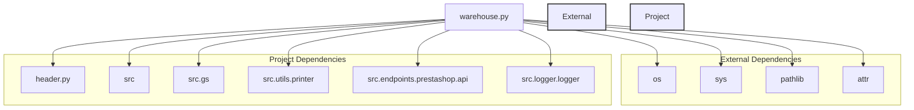

### **Анализ кода проекта `hypotez` - `warehouse.py`**

=========================================================================================

#### **1. Блок-схема**

```mermaid
graph TD
    A[Начало] --> B{Определение класса PrestaWarehouse (наследуется от PrestaShop)};
    B --> C{Импорт модулей и библиотек};
    C --> D{Инициализация переменных окружения (из `header.py` и `src.gs`)};
    D --> E[Использование класса PrestaWarehouse];
    E --> F[Завершение];
```

**Примеры для блоков:**

*   **A (Начало)**: Начало выполнения скрипта `warehouse.py`.
*   **B (Определение класса `PrestaWarehouse`)**: Определяется класс `PrestaWarehouse`, который наследуется от класса `PrestaShop`. Внутри класса реализуется логика, специфичная для работы со складом PrestaShop.
    ```python
    class PrestaWarehouse(PrestaShop):
        ...
    ```
*   **C (Импорт модулей и библиотек)**: Импортируются необходимые модули, такие как `os`, `sys`, `attr`, `Path`, `header`, `src.gs`, `pprint`, `PrestaShop` и `logger`.
*   **D (Инициализация переменных окружения)**: Инициализация глобальных настроек из `header.py` и `src.gs`. Эти настройки могут включать параметры подключения к API PrestaShop, ключи API и другие параметры конфигурации.
*   **E (Использование класса `PrestaWarehouse`)**: Создается экземпляр класса `PrestaWarehouse` и вызываются его методы для выполнения операций, связанных со складом PrestaShop.
*   **F (Завершение)**: Завершение выполнения скрипта.

#### **2. Диаграмма зависимостей**



**Объяснение зависимостей:**

*   **`os`**: Модуль для взаимодействия с операционной системой (например, для работы с путями файлов).
*   **`sys`**: Модуль, предоставляющий доступ к некоторым переменным и функциям, взаимодействующим с интерпретатором Python.
*   **`pathlib`**: Модуль для работы с путями к файлам и директориям в объектно-ориентированном стиле.
*   **`attr`**: Библиотека для создания классов данных.
*   **`header.py`**: Содержит общие настройки проекта, включая определение корневой директории.
    ```mermaid
    flowchart TD
        Start --> Header[<code>header.py</code><br> Determine Project Root]
    
        Header --> import[Import Global Settings: <br><code>from src import gs</code>] 
    ```
*   **`src`**: Общий пакет, содержащий другие подпакеты и модули проекта.
*   **`gs` (из `src`)**: Модуль, содержащий глобальные настройки проекта.
*   **`printer` (из `src.utils`)**: Модуль для форматированного вывода данных (pretty printing).
*   **`PrestaShop` (из `.api`)**: Класс для взаимодействия с API PrestaShop.
*   **`logger` (из `src.logger.logger`)**: Модуль для логирования событий и ошибок.

#### **3. Объяснение**

*   **Импорты:**
    *   `os`, `sys`, `pathlib`: Стандартные модули Python для работы с операционной системой, интерпретатором и путями к файлам соответственно.
    *   `attr`: Используется для определения классов данных с меньшим количеством boilerplate кода.
    *   `header`: Предположительно, содержит общие настройки проекта, включая определение корневой директории.
    *   `src.gs`: Содержит глобальные настройки проекта.
    *   `src.utils.printer`: Используется для форматированного вывода данных.
    *   `.api`: Содержит класс `PrestaShop` для взаимодействия с API PrestaShop.
    *   `src.logger.logger`: Используется для логирования событий и ошибок.

*   **Классы:**
    *   `PrestaWarehouse(PrestaShop)`: Класс `PrestaWarehouse` наследуется от класса `PrestaShop`. Он предназначен для выполнения операций, связанных со складом PrestaShop.
        *   Атрибуты: Атрибуты класса наследуются от `PrestaShop` и могут включать параметры подключения к API, ключи API и другие параметры конфигурации.
        *   Методы: Методы класса `PrestaWarehouse` реализуют логику для работы со складом PrestaShop, такую как получение информации о складе, обновление данных о складе и т.д.
        *   Взаимодействие: Класс взаимодействует с API PrestaShop через методы, унаследованные от класса `PrestaShop`.

*   **Функции:**
    *   В предоставленном коде нет явных функций, но класс `PrestaWarehouse` может содержать методы для выполнения различных операций.

*   **Переменные:**
    *   Переменные в коде включают импортированные модули и классы, а также атрибуты класса `PrestaWarehouse`.

*   **Потенциальные ошибки и области для улучшения:**
    *   Необходимо добавить обработку ошибок и исключений для обеспечения стабильной работы скрипта.
    *   Следует реализовать логирование для отслеживания событий и ошибок.
    *   Необходимо добавить документацию для класса `PrestaWarehouse` и его методов.

*   **Взаимосвязи с другими частями проекта:**
    *   Класс `PrestaWarehouse` зависит от класса `PrestaShop` для взаимодействия с API PrestaShop.
    *   Он также зависит от модулей `header` и `src.gs` для получения общих настроек проекта.
    *   Модуль `src.logger.logger` используется для логирования событий и ошибок.