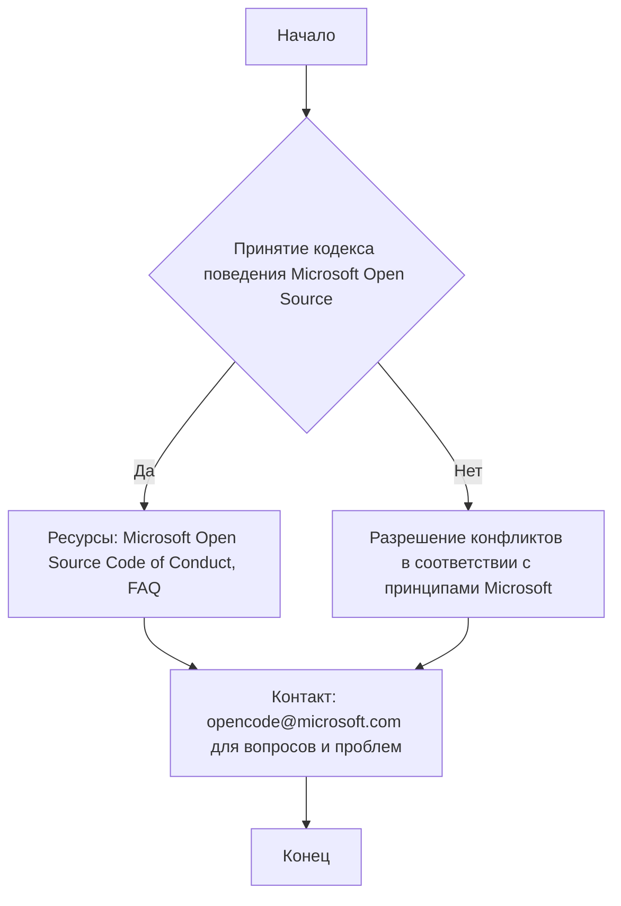

### Анализ кода проекта `hypotez`

=========================================================================================

Данный файл является кодексом поведения (Code of Conduct) для проекта `hypotez`. Он основан на кодексе поведения Microsoft Open Source.

#### **1. Блок-схема**

#### **2. Диаграмма**

В данном файле нет кода для построения диаграммы в формате `mermaid`, так как он представляет собой текстовое описание кодекса поведения. Здесь нет импортов или зависимостей, которые можно было бы визуализировать.

#### **3. Объяснение**

- **Назначение**:
  - Файл `CODE_OF_CONDUCT.md` определяет стандарты поведения для участников проекта `hypotez`. Он направлен на создание открытой и дружелюбной среды.

- **Содержание**:
  - Кодекс поведения основан на [Microsoft Open Source Code of Conduct](https://opensource.microsoft.com/codeofconduct/).
  - Предоставлены ссылки на ресурсы, такие как сам кодекс поведения и часто задаваемые вопросы (FAQ).
  - Указан контактный адрес электронной почты ([opencode@microsoft.com](mailto:opencode@microsoft.com)) для сообщений о нарушениях или для получения дополнительной информации.

- **Потенциальные улучшения**:
  - Можно добавить конкретные примеры поведения, ожидаемого от участников проекта `hypotez`.
  - Указать процедуры для разрешения конфликтов внутри сообщества.

- **Взаимосвязь с другими частями проекта**:
  - Этот файл важен для всего проекта, поскольку устанавливает общие стандарты взаимодействия между разработчиками, контрибьюторами и пользователями.
  - Он гарантирует, что все участники будут следовать этическим нормам при работе над проектом.