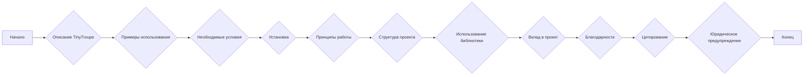
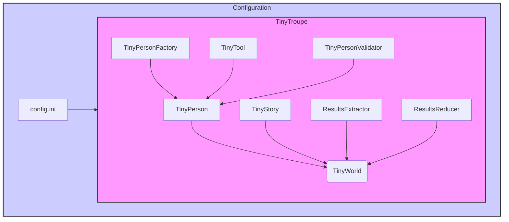

### **Системные инструкции для обработки кода проекта `hypotez`**

=========================================================================================

Описание функциональности и правил для генерации, анализа и улучшения кода. Направлено на обеспечение последовательного и читаемого стиля кодирования, соответствующего требованиям.

---

### **Основные принципы**

#### **1. Общие указания**:
- Соблюдай четкий и понятный стиль кодирования.
- Все изменения должны быть обоснованы и соответствовать установленным требованиям.

#### **2. Комментарии**:
- Используй `#` для внутренних комментариев.
- Документация всех функций, методов и классов должна следовать такому формату: 
    ```python
        def function(param: str, param1: Optional[str | dict | str] = None) -> dict | None:
            """ 
            Args:
                param (str): Описание параметра `param`.
                param1 (Optional[str | dict | str], optional): Описание параметра `param1`. По умолчанию `None`.
    
            Returns:
                dict | None: Описание возвращаемого значения. Возвращает словарь или `None`.
    
            Raises:
                SomeError: Описание ситуации, в которой возникает исключение `SomeError`.

            Ехаmple:
                >>> function('param', 'param1')
                {'param': 'param1'}
            """
    ```
- Комментарии и документация должны быть четкими, лаконичными и точными.

#### **3. Форматирование кода**:
- Используй одинарные кавычки. `a:str = 'value'`, `print('Hello World!')`;
- Добавляй пробелы вокруг операторов. Например, `x = 5`;
- Все параметры должны быть аннотированы типами. `def function(param: str, param1: Optional[str | dict | str] = None) -> dict | None:`;
- Не используй `Union`. Вместо этого используй `|`.

#### **4. Логирование**:
- Для логгирования Всегда Используй модуль `logger` из `src.logger.logger`.
- Ошибки должны логироваться с использованием `logger.error`.
Пример:
    ```python
        try:
            ...
        except Exception as ex:
            logger.error('Error while processing data', ех, exc_info=True)
    ```
#### **5 Не используй `Union[]` в коде. Вместо него используй `|`
Например:
```python
x: str | int ...
```


---

### **Основные требования**:

#### **1. Формат ответов в Markdown**:
- Все ответы должны быть выполнены в формате **Markdown**.

#### **2. Формат комментариев**:
- Используй указанный стиль для комментариев и документации в коде.
- Пример:

```python
from typing import Generator, Optional, List
from pathlib import Path


def read_text_file(
    file_path: str | Path,
    as_list: bool = False,
    extensions: Optional[List[str]] = None,
    chunk_size: int = 8192,
) -> Generator[str, None, None] | str | None:
    """
    Считывает содержимое файла (или файлов из каталога) с использованием генератора для экономии памяти.

    Args:
        file_path (str | Path): Путь к файлу или каталогу.
        as_list (bool): Если `True`, возвращает генератор строк.
        extensions (Optional[List[str]]): Список расширений файлов для чтения из каталога.
        chunk_size (int): Размер чанков для чтения файла в байтах.

    Returns:
        Generator[str, None, None] | str | None: Генератор строк, объединенная строка или `None` в случае ошибки.

    Raises:
        Exception: Если возникает ошибка при чтении файла.

    Example:
        >>> from pathlib import Path
        >>> file_path = Path('example.txt')
        >>> content = read_text_file(file_path)
        >>> if content:
        ...    print(f'File content: {content[:100]}...')
        File content: Example text...
    """
    ...
```
- Всегда делай подробные объяснения в комментариях. Избегай расплывчатых терминов, 
- таких как *«получить»* или *«делать»*. Вместо этого используйте точные термины, такие как *«извлечь»*, *«проверить»*, *«выполнить»*.
- Вместо: *«получаем»*, *«возвращаем»*, *«преобразовываем»* используй имя объекта *«функция получае»*, *«переменная возвращает»*, *«код преобразовывает»* 
- Комментарии должны непосредственно предшествовать описываемому блоку кода и объяснять его назначение.

#### **3. Пробелы вокруг операторов присваивания**:
- Всегда добавляйте пробелы вокруг оператора `=`, чтобы повысить читаемость.
- Примеры:
  - **Неправильно**: `x=5`
  - **Правильно**: `x = 5`

#### **4. Использование `j_loads` или `j_loads_ns`**:
- Для чтения JSON или конфигурационных файлов замените стандартное использование `open` и `json.load` на `j_loads` или `j_loads_ns`.
- Пример:

```python
# Неправильно:
with open('config.json', 'r', encoding='utf-8') as f:
    data = json.load(f)

# Правильно:
data = j_loads('config.json')
```

#### **5. Сохранение комментариев**:
- Все существующие комментарии, начинающиеся с `#`, должны быть сохранены без изменений в разделе «Улучшенный код».
- Если комментарий кажется устаревшим или неясным, не изменяйте его. Вместо этого отметьте его в разделе «Изменения».

#### **6. Обработка `...` в коде**:
- Оставляйте `...` как указатели в коде без изменений.
- Не документируйте строки с `...`.
```

#### **7. Аннотации**
Для всех переменных должны быть определены аннотации типа. 
Для всех функций все входные и выходные параметры аннотириваны
Для все параметров должны быть аннотации типа.


### **8. webdriver**
В коде используется webdriver. Он импртируется из модуля `webdriver` проекта `hypotez`
```python
from src.webdirver import Driver, Chrome, Firefox, Playwright, ...
driver = Driver(Firefox)

Пoсле чего может использоваться как

close_banner = {
  "attribute": null,
  "by": "XPATH",
  "selector": "//button[@id = 'closeXButton']",
  "if_list": "first",
  "use_mouse": false,
  "mandatory": false,
  "timeout": 0,
  "timeout_for_event": "presence_of_element_located",
  "event": "click()",
  "locator_description": "Закрываю pop-up окно, если оно не появилось - не страшно (`mandatory`:`false`)"
}

result = driver.execute_locator(close_banner)
```

## Анализ кода проекта `hypotez`

### 1. Блок-схема



**Примеры для каждого логического блока:**

-   **Описание TinyTroupe**: *TinyTroupe* - это Python-библиотека для моделирования людей с определенными личностями, интересами и целями, использующая LLM.
-   **Примеры использования**: Оценка цифровой рекламы, тестирование программного обеспечения, генерация синтетических данных.
-   **Необходимые условия**: Python 3.10+, доступ к Azure OpenAI Service или OpenAI GPT-4 APIs.
-   **Установка**: Клонирование репозитория и установка через pip.
-   **Принципы работы**: Программный, аналитический, основанный на персонах, многоагентный, с большим количеством утилит и ориентированный на эксперименты.
-   **Структура проекта**: `/tinytroupe`, `/tests`, `/examples`, `/data`, `/docs`.
-   **Использование библиотеки**: Описание `TinyPerson`, `TinyWorld` и различных утилит.
-   **Вклад в проект**: Приветствуются демонстрации новых интересных вариантов использования, идеи для конкретных областей применения.
-   **Благодарности**: Список основных участников и консультантов проекта.
-   **Цитирование**: Рекомендации по цитированию TinyTroupe в научных работах.
-   **Юридическое предупреждение**: TinyTroupe предназначен только для исследований и моделирования.

### 2. Диаграмма



**Объяснение зависимостей:**

*   `TinyPerson`: Агент с личностными чертами, интересами и целями.
*   `TinyWorld`: Среда, в которой существуют и взаимодействуют агенты.
*   `TinyPersonFactory`: Используется для генерации новых `TinyPerson` с использованием LLM.
*   `TinyTool`: Инструменты, которые могут использоваться `TinyPerson`.
*   `TinyStory`: Используется для создания и управления историей, рассказываемой посредством симуляций.
*   `TinyPersonValidator`: Помогает проверить поведение `TinyPerson`.
*   `ResultsExtractor` и `ResultsReducer`: Извлекают и обрабатывают результаты взаимодействий между агентами.
*   `config.ini`: Файл конфигурации, содержащий параметры для настройки поведения библиотеки.

### 3. Объяснение

#### Импорты

В предоставленном тексте нет явных операторов импорта, поскольку это файл README.md, а не Python-код. Однако, в тексте упоминаются различные классы и модули, которые подразумевают наличие соответствующих импортов в коде библиотеки `tinytroupe`.

#### Классы

*   **`TinyPerson`**:
    *   **Роль**: Представляет собой моделируемого человека с уникальными чертами личности, интересами и целями.
    *   **Атрибуты**: `name`, `age`, `nationality`, `occupation`, `personality`, `preferences`, `behaviors` и другие.
    *   **Методы**: `listen`, `see`, `act`, `listen_and_act`, `define`, `import_fragment`.
    *   **Взаимодействие**: Взаимодействует с `TinyWorld` и другими `TinyPerson`.
*   **`TinyWorld`**:
    *   **Роль**: Представляет собой среду, в которой существуют и взаимодействуют агенты `TinyPerson`.
    *   **Атрибуты**: Название, список агентов.
    *   **Методы**: `make_everyone_accessible`, `run`.
    *   **Взаимодействие**: Содержит и управляет взаимодействием между `TinyPerson`.
*   **`TinyPersonFactory`**:
    *   **Роль**: Фабрика для создания новых экземпляров `TinyPerson` на основе LLM.
    *   **Методы**: `generate_person`.
*   **`TinyTool`**:
    *Роль*: Инструмент, который может использовать `TinyPerson`.
*   **`TinyStory`**:
    *Роль*: Используется для создания и управления историей, рассказываемой посредством симуляций.
*   **`TinyPersonValidator`**:
    *Роль*: Помогает проверить поведение `TinyPerson`.
*   **`ResultsExtractor`** и **`ResultsReducer`**:
    *Роль*: Извлекают и обрабатывают результаты взаимодействий между агентами.

#### Функции

В тексте упоминаются примеры функций, но их определения отсутствуют. На основе контекста можно предположить следующее:

*   **`create_lisa_the_data_scientist()`**:
    *   **Аргументы**: Нет.
    *   **Возвращаемое значение**: Объект `TinyPerson`, представляющий data scientist по имени Lisa.
    *   **Назначение**: Создает экземпляр `TinyPerson` с предустановленными атрибутами и поведением.
    *   **Пример**:

        ```python
        from tinytroupe.examples import create_lisa_the_data_scientist

        lisa = create_lisa_the_data_scientist()
        lisa.listen_and_act("Tell me about your life.")
        ```

#### Переменные

*   `lisa`: Объект класса `TinyPerson`, представляющий data scientist Lisa.
*   `oscar`: Объект класса `TinyPerson`, представляющий архитектора Oscar.
*   `world`: Объект класса `TinyWorld`, представляющий среду, в которой Lisa и Oscar взаимодействуют.
*   `factory`: Объект класса `TinyPersonFactory`, используемый для создания новых агентов.

#### Потенциальные ошибки и области для улучшения

*   **Отсутствие подробной документации по API**: README предоставляет общее представление, но не хватает подробной документации по каждому классу, методу и параметру.
*   **Зависимость от внешних API**: Проект зависит от Azure OpenAI Service или OpenAI API, что может быть проблематично из-за ограничений тарифов, доступности и цен.
*   **Сложность настройки**: Настройка агентов вручную может быть трудоемкой, хотя `TinyPersonFactory` и fragments облегчают этот процесс.
*   **Необходимость в улучшении механизмов памяти и рассуждений агентов**: В тексте упоминается необходимость улучшения этих механизмов, что указывает на потенциальную область для развития.

#### Взаимосвязи с другими частями проекта

Проект `TinyTroupe` тесно связан со следующими частями проекта `hypotez`:

*   **`/tinytroupe`**: Основная библиотека с классами и функциями для моделирования агентов и сред.
*   **`/examples`**: Примеры использования библиотеки, демонстрирующие различные сценарии моделирования.
*   **`/tests`**: Юнит-тесты для проверки корректности работы библиотеки.
*   **`config.ini`**: Файл конфигурации, позволяющий настраивать параметры библиотеки, такие как API keys и logging level.

Этот файл README.md предоставляет общее описание библиотеки `TinyTroupe`, ее возможностей, структуры и способов использования. Он служит отправной точкой для пользователей, желающих познакомиться с проектом и начать создавать свои собственные симуляции.