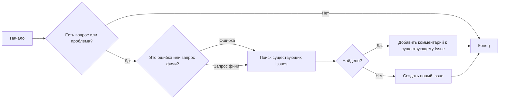
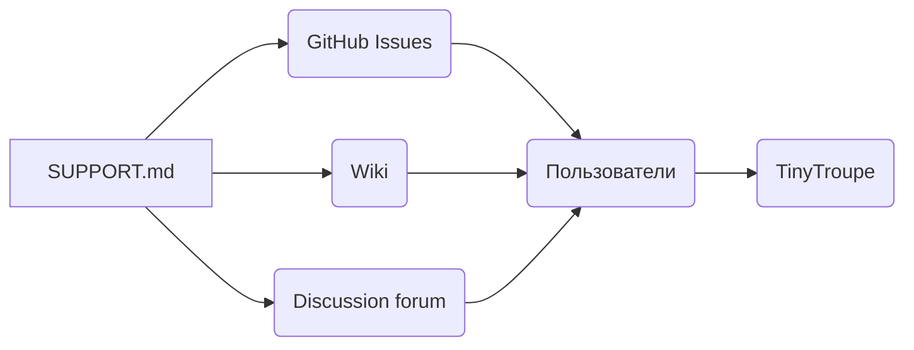

### **Анализ кода файла `SUPPORT.md` проекта `hypotez`**

=========================================================================================

Файл `SUPPORT.md` расположен в директории `hypotez/src/endpoints/tiny_troupe/`. Этот файл предназначен для предоставления информации о поддержке и способах получения помощи по проекту TinyTroupe.

---

### **1. Блок-схема**

**Пояснения к блок-схеме:**

1.  **Начало**: Начало процесса.
2.  **Есть вопрос или проблема?**: Проверка, есть ли у пользователя вопрос или проблема, требующая поддержки.
3.  **Это ошибка или запрос фичи?**: Определение типа запроса.
4.  **Поиск существующих Issues**: Поиск существующих сообщений об ошибках или запросов фич.
5.  **Найдено?**: Проверка, существуют ли аналогичные Issues.
6.  **Добавить комментарий к существующему Issue**: Добавление комментария к существующему Issue, если он найден.
7.  **Создать новый Issue**: Создание нового Issue, если аналогичный не найден.
8.  **Конец**: Завершение процесса.

### **2. Диаграмма зависимостей**

В предоставленном файле `SUPPORT.md` нет кода для диаграммы зависимостей, т.к. это markdown файл. Тем не менее, можно представить общую зависимость данного файла от других частей проекта в контексте документации и поддержки:

**Пояснения к диаграмме:**

*   `SUPPORT.md`: Файл, предоставляющий информацию о поддержке.
*   `GitHub Issues`: Используется для отслеживания ошибок и запросов фич.
*   `Wiki`: Используется для документации и помощи в использовании проекта.
*   `Discussion forum`: Форум для обсуждений и вопросов.
*   `Пользователи`: Лица, использующие ресурсы поддержки.
*   `TinyTroupe`: Проект, для которого предоставляется поддержка.

### **3. Объяснение**

Файл `SUPPORT.md` предназначен для предоставления информации о том, как пользователи могут получить поддержку и помощь по проекту TinyTroupe.

*   **Как сообщать об ошибках и получать помощь**:
    *   Используйте GitHub Issues для отслеживания ошибок и запросов фич.
    *   Перед созданием нового Issue выполните поиск существующих, чтобы избежать дубликатов.
    *   Для вопросов и помощи используйте Wiki или форум обсуждений на GitHub.
*   **Политика поддержки Microsoft**:
    *   Поддержка TinyTroupe ограничена перечисленными ресурсами.

#### **Импорты**:

В данном файле нет импортов, так как это файл в формате Markdown.

#### **Классы**:

В данном файле нет классов.

#### **Функции**:

В данном файле нет функций.

#### **Переменные**:

В данном файле нет переменных.

#### **Потенциальные ошибки и области для улучшения**:

*   **Поддержание актуальности**: Важно поддерживать актуальность информации в файле `SUPPORT.md`, чтобы пользователи получали правильную и своевременную помощь.
*   **Явные ссылки**: Добавить прямые ссылки на Wiki и форум обсуждений для упрощения навигации.
*   **FAQ**: Рассмотреть возможность добавления раздела FAQ для часто задаваемых вопросов.

#### **Взаимосвязь с другими частями проекта**:

Файл `SUPPORT.md` связан с остальными частями проекта через документацию и поддержку пользователей. Он предоставляет информацию о том, как пользователи могут взаимодействовать с разработчиками и сообщать об ошибках или предлагать улучшения.