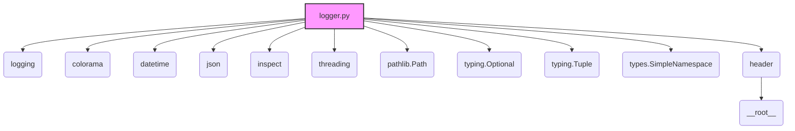

### **Системные инструкции для обработки кода проекта `hypotez`**

=========================================================================================

Описание функциональности и правил для генерации, анализа и улучшения кода. Направлено на обеспечение последовательного и читаемого стиля кодирования, соответствующего требованиям.

---

### **Основные принципы**

#### **1. Общие указания**:
- Соблюдай четкий и понятный стиль кодирования.
- Все изменения должны быть обоснованы и соответствовать установленным требованиям.

#### **2. Комментарии**:
- Используй `#` для внутренних комментариев.
- Документация всех функций, методов и классов должна следовать такому формату: 
    ```python
        def function(param: str, param1: Optional[str | dict | str] = None) -> dict | None:
            """ 
            Args:
                param (str): Описание параметра `param`.
                param1 (Optional[str | dict | str], optional): Описание параметра `param1`. По умолчанию `None`.
    
            Returns:
                dict | None: Описание возвращаемого значения. Возвращает словарь или `None`.
    
            Raises:
                SomeError: Описание ситуации, в которой возникает исключение `SomeError`.

            Ехаmple:
                >>> function('param', 'param1')
                {'param': 'param1'}
            """
    ```
- Комментарии и документация должны быть четкими, лаконичными и точными.

#### **3. Форматирование кода**:
- Используй одинарные кавычки. `a:str = 'value'`, `print('Hello World!')`;
- Добавляй пробелы вокруг операторов. Например, `x = 5`;
- Все параметры должны быть аннотированы типами. `def function(param: str, param1: Optional[str | dict | str] = None) -> dict | None:`;
- Не используй `Union`. Вместо этого используй `|`.

#### **4. Логирование**:
- Для логгирования Всегда Используй модуль `logger` из `src.logger.logger`.
- Ошибки должны логироваться с использованием `logger.error`.
Пример:
    ```python
        try:
            ...
        except Exception as ex:
            logger.error('Error while processing data', ех, exc_info=True)
    ```
#### **5 Не используй `Union[]` в коде. Вместо него используй `|`
Например:
```python
x: str | int ...
```


---

### **Основные требования**:

#### **1. Формат ответов в Markdown**:
- Все ответы должны быть выполнены в формате **Markdown**.

#### **2. Формат комментариев**:
- Используй указанный стиль для комментариев и документации в коде.
- Пример:

```python
from typing import Generator, Optional, List
from pathlib import Path


def read_text_file(
    file_path: str | Path,
    as_list: bool = False,
    extensions: Optional[List[str]] = None,
    chunk_size: int = 8192,
) -> Generator[str, None, None] | str | None:
    """
    Считывает содержимое файла (или файлов из каталога) с использованием генератора для экономии памяти.

    Args:
        file_path (str | Path): Путь к файлу или каталогу.
        as_list (bool): Если `True`, возвращает генератор строк.
        extensions (Optional[List[str]]): Список расширений файлов для чтения из каталога.
        chunk_size (int): Размер чанков для чтения файла в байтах.

    Returns:
        Generator[str, None, None] | str | None: Генератор строк, объединенная строка или `None` в случае ошибки.

    Raises:
        Exception: Если возникает ошибка при чтении файла.

    Example:
        >>> from pathlib import Path
        >>> file_path = Path('example.txt')
        >>> content = read_text_file(file_path)
        >>> if content:
        ...    print(f'File content: {content[:100]}...')
        File content: Example text...
    """
    ...
```
- Всегда делай подробные объяснения в комментариях. Избегай расплывчатых терминов, 
- таких как *«получить»* или *«делать»*. Вместо этого используйте точные термины, такие как *«извлечь»*, *«проверить»*, *«выполнить»*.
- Вместо: *«получаем»*, *«возвращаем»*, *«преобразовываем»* используй имя объекта *«функция получае»*, *«переменная возвращает»*, *«код преобразовывает»* 
- Комментарии должны непосредственно предшествовать описываемому блоку кода и объяснять его назначение.

#### **3. Пробелы вокруг операторов присваивания**:
- Всегда добавляйте пробелы вокруг оператора `=`, чтобы повысить читаемость.
- Примеры:
  - **Неправильно**: `x=5`
  - **Правильно**: `x = 5`

#### **4. Использование `j_loads` или `j_loads_ns`**:
- Для чтения JSON или конфигурационных файлов замените стандартное использование `open` и `json.load` на `j_loads` или `j_loads_ns`.
- Пример:

```python
# Неправильно:
with open('config.json', 'r', encoding='utf-8') as f:
    data = json.load(f)

# Правильно:
data = j_loads('config.json')
```

#### **5. Сохранение комментариев**:
- Все существующие комментарии, начинающиеся с `#`, должны быть сохранены без изменений в разделе «Улучшенный код».
- Если комментарий кажется устаревшим или неясным, не изменяйте его. Вместо этого отметьте его в разделе «Изменения».

#### **6. Обработка `...` в коде**:
- Оставляйте `...` как указатели в коде без изменений.
- Не документируйте строки с `...`.
```

#### **7. Аннотации**
Для всех переменных должны быть определены аннотации типа. 
Для всех функций все входные и выходные параметры аннотириваны
Для все параметров должны быть аннотации типа.


### **8. webdriver**
В коде используется webdriver. Он импртируется из модуля `webdriver` проекта `hypotez`
```python
from src.webdirver import Driver, Chrome, Firefox, Playwright, ...
driver = Driver(Firefox)

Пoсле чего может использоваться как

close_banner = {
  "attribute": null,
  "by": "XPATH",
  "selector": "//button[@id = 'closeXButton']",
  "if_list": "first",
  "use_mouse": false,
  "mandatory": false,
  "timeout": 0,
  "timeout_for_event": "presence_of_element_located",
  "event": "click()",
  "locator_description": "Закрываю pop-up окно, если оно не появилось - не страшно (`mandatory`:`false`)"
}

result = driver.execute_locator(close_banner)
```

## Анализ кода `hypotez/src/logger/logger.py`

### 1. Блок-схема

```mermaid
graph TD
    A[Начало] --> B{Инициализация Logger}
    B --> C{Определение путей к файлам логов}
    C --> D{Создание директорий логов}
    D --> E{Создание файлов логов}
    E --> F{Инициализация консольного логгера}
    F --> G{Инициализация файловых логгеров (info, debug, errors, json)}
    G --> H{Установка форматтеров для файловых логгеров}
    H --> I{Добавление обработчиков к файловым логгерам}
    I --> J{Удаление StreamHandler из JSON логгера}
    J --> K{Определение методов логирования (info, debug, warning, error, critical)}
    K --> L[Конец]

    subgraph Пример: Логирование сообщения
        M[Вызов logger.info("Сообщение")] --> N{Форматирование сообщения}
        N --> O{Логирование в консоль и файл}
        O --> P[Запись в info.log]
    end

    style A fill:#f9f,stroke:#333,stroke-width:2px
    style L fill:#f9f,stroke:#333,stroke-width:2px
    style M fill:#ccf,stroke:#333,stroke-width:2px
    style P fill:#ccf,stroke:#333,stroke-width:2px
```

### 2. Диаграмма зависимостей



*   **logging**: Используется для реализации функциональности логирования в Python. Позволяет записывать сообщения разных уровней (DEBUG, INFO, WARNING, ERROR, CRITICAL) в различные обработчики (консоль, файл).
*   **colorama**:  Используется для добавления цветов в вывод консоли. Позволяет выделять сообщения разного уровня разными цветами.
*   **datetime**:  Используется для получения текущей даты и времени, что необходимо для формирования имени файла лога и добавления временных меток к записям лога.
*   **json**: Используется для работы с JSON-форматом, в частности для сериализации логов в JSON.
*   **inspect**:  Используется для получения информации о стеке вызовов, чтобы определить, из какой функции была вызвана функция логирования. Это позволяет добавлять в логи информацию о файле, функции и номере строки, где произошло событие.
*   **threading**:  Используется для реализации потокобезопасного Singleton-паттерна. Это необходимо для предотвращения проблем при одновременном обращении к логгеру из разных потоков.
*   **pathlib.Path**:  Используется для работы с путями к файлам и директориям.  Облегчает создание директорий логов и файлов логов.
*   **typing.Optional, typing.Tuple**: Используются для аннотации типов, что улучшает читаемость и облегчает отладку кода.
*   **types.SimpleNamespace**: Используется для создания объектов, к атрибутам которых можно обращаться как к атрибутам объекта. Это упрощает доступ к параметрам конфигурации.
*   **header**:  Импортируется для определения корневого каталога проекта (`__root__`), который используется для определения путей к файлам конфигурации и логов.
*   **header.py**:
    ```mermaid
    flowchart TD
        Start --> Header[<code>header.py</code><br> Determine Project Root]
    
        Header --> import[Import Global Settings: <br><code>from src import gs</code>] 
    ```

### 3. Объяснение

**Импорты:**

*   `logging`: Предоставляет инструменты для логирования, позволяя записывать информацию о работе приложения.
*   `colorama`: Позволяет добавлять цвета в вывод консоли для улучшения читаемости.
*   `datetime`: Используется для добавления временных меток к логам и формирования уникальных имен файлов логов.
*   `json`: Используется для форматирования логов в формате JSON.
*   `inspect`: Позволяет получать информацию о текущем стеке вызовов, чтобы определить местоположение вызова логгера.
*   `threading`: Обеспечивает потокобезопасность при использовании Singleton-паттерна.
*   `pathlib`: Предоставляет удобный способ работы с путями к файлам и директориям.
*   `typing`: Используется для аннотации типов.
*   `header`: Содержит константу `__root__`, которая определяет корневой каталог проекта.

**Классы:**

*   `SingletonMeta(type)`: Метакласс, реализующий Singleton-паттерн. Гарантирует, что у класса будет только один экземпляр.
    *   `_instances`: Словарь для хранения экземпляров классов.
    *   `_lock`: Блокировка для обеспечения потокобезопасности.
    *   `__call__(cls, *args, **kwargs)`: Метод, вызываемый при создании экземпляра класса. Если экземпляр класса уже существует, он возвращает существующий экземпляр, иначе создает новый.
*   `JsonFormatter(logging.Formatter)`: Пользовательский форматтер для логирования в формате JSON.
    *   `format(self, record)`: Форматирует запись лога в JSON.
*   `Logger(metaclass=SingletonMeta)`: Класс логгера, реализующий Singleton-паттерн. Обеспечивает логирование в консоль, файлы и JSON.
    *   `log_files_path`: Путь к директории, где хранятся файлы логов.
    *   `info_log_path`: Путь к файлу лога с информацией.
    *   `debug_log_path`: Путь к файлу лога с отладочной информацией.
    *   `errors_log_path`: Путь к файлу лога с ошибками.
    *   `json_log_path`: Путь к файлу лога в формате JSON.
    *   `__init__(self, info_log_path=None, debug_log_path=None, errors_log_path=None, json_log_path=None)`: Инициализирует экземпляр логгера. Определяет пути к файлам логов, создает директории и файлы логов, настраивает консольный и файловые логгеры.
    *   `_format_message(self, message, ex=None, color=None, level=None)`: Форматирует сообщение лога с учетом цвета и уровня.
    *   `_ex_full_info(self, ex)`: Возвращает полную информацию об исключении, включая файл, функцию и номер строки, где оно произошло.
    *   `log(self, level, message, ex=None, exc_info=False, color=None)`: Общий метод для логирования сообщений на указанном уровне.
    *   `info(self, message, ex=None, exc_info=False, text_color="green", bg_color="")`: Логирует информационное сообщение.
    *   `success(self, message, ex=None, exc_info=False, text_color="yellow", bg_color="")`: Логирует сообщение об успехе.
    *   `warning(self, message, ex=None, exc_info=False, text_color="light_red", bg_color="")`: Логирует предупреждение.
    *   `debug(self, message, ex=None, exc_info=True, text_color="cyan", bg_color="")`: Логирует отладочное сообщение.
    *   `exception(self, message, ex=None, exc_info=True, text_color="cyan", bg_color="light_gray")`: Логирует исключение.
    *   `error(self, message, ex=None, exc_info=True, text_color="red", bg_color="")`: Логирует сообщение об ошибке.
    *   `critical(self, message, ex=None, exc_info=True, text_color="red", bg_color="white")`: Логирует критическое сообщение.

**Функции:**

*   `format(self, record)` (в классе `JsonFormatter`): Форматирует запись лога в JSON-формат.
*   `__call__(cls, *args, **kwargs)` (в классе `SingletonMeta`): Обеспечивает создание только одного экземпляра класса.
*   Методы логирования (`info`, `debug`, `warning`, `error`, `critical`) в классе `Logger`:  Обеспечивают запись сообщений в лог с указанным уровнем и форматированием.

**Переменные:**

*   `TEXT_COLORS`: Словарь, содержащий коды цветов для текста в консоли.
*   `BG_COLORS`: Словарь, содержащий коды цветов для фона в консоли.
*   `LOG_SYMBOLS`:  Словарь, содержащий символы для обозначения разных уровней логирования.
*   `logger`:  Экземпляр класса `Logger`, используемый для логирования.
*   `__root__`:  Корневой каталог проекта, полученный из модуля `header`.

**Потенциальные ошибки и области для улучшения:**

*   Обработка исключений в методах логирования может быть улучшена для более детального логирования.
*   Можно добавить возможность динамической настройки уровней логирования через конфигурационный файл.
*   Не все методы логирования используют `exc_info=True` по умолчанию. Возможно, стоит сделать это значение True для всех методов, чтобы всегда получать информацию об исключении, если оно возникло.

**Взаимосвязи с другими частями проекта:**

*   Модуль `header` используется для определения корневого каталога проекта, что позволяет логгеру определять пути к файлам логов и конфигурации.
*   Логгер используется во многих частях проекта для записи информации о работе приложения, отладки и обработки ошибок.

```python
# Пример использования логгера
from src.logger.logger import logger

try:
    x = 1 / 0
except Exception as e:
    logger.error("Произошла ошибка при делении на ноль", ex=e, exc_info=True)