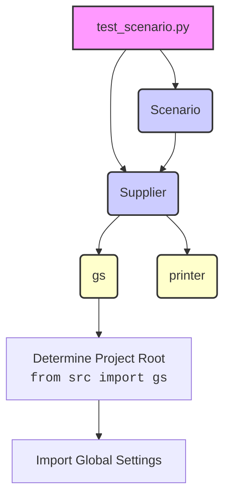

### **Анализ кода проекта `hypotez`**

=========================================================================================

#### **1. Блок-схема**

```mermaid
graph LR
    A[Start] --> B{start_supplier(supplier_prefix)}
    B --> C[Supplier(**params)]
    C --> D{Scenario(s)}
    D --> E[scenario.run_scenarios()]
    E --> F[End]
```

**Примеры для каждого логического блока:**

- **Start**: Начало выполнения скрипта `test_scenario.py`.
- **`start_supplier(supplier_prefix)`**: Создание экземпляра класса `Supplier` с заданным префиксом поставщика.
  - Пример: `supplier_prefix = 'aliexpress'`
  - Вход: `supplier_prefix` (строка)
  - Выход: экземпляр класса `Supplier`
- **`Supplier(**params)`**: Инициализация класса `Supplier` с параметрами.
  - Вход: словарь `params`
  - Выход: экземпляр класса `Supplier`
- **`Scenario(s)`**: Создание экземпляра класса `Scenario` с экземпляром класса `Supplier`.
  - Вход: экземпляр класса `Supplier` `s`
  - Выход: экземпляр класса `Scenario`
- **`scenario.run_scenarios()`**: Запуск сценариев для заданного поставщика.
  - Вход: экземпляр класса `Scenario`
  - Выход: Результат выполнения сценариев (зависит от реализации `run_scenarios`)
- **End**: Завершение выполнения скрипта.

#### **2. Диаграмма зависимостей**



**Объяснение зависимостей:**

- `test_scenario.py` зависит от классов `Supplier` и `Scenario`.
- `Supplier` зависит от глобальных настроек `gs` и утилит печати `printer`.
- `Scenario` зависит от `Supplier`.
- `gs` (global settings) определяет корень проекта.

#### **3. Объяснение кода**

**Импорты:**

- `sys`: Предоставляет доступ к некоторым переменным и функциям, взаимодействующим с интерпретатором Python.
- `os`: Предоставляет функции для взаимодействия с операционной системой.
- `pathlib`: Предоставляет классы для представления путей файловой системы.
- `json`: Предоставляет функции для работы с данными в формате JSON.
- `re`: Предоставляет операции регулярных выражений.
- `hypotez.gs`: Импортирует глобальные настройки проекта.
- `src.utils.printer.pprint`: Импортирует функцию для "красивой" печати данных.
- `src.scenario.Scenario`: Импортирует класс `Scenario`.
- `src.suppliers.Supplier`: Импортирует класс `Supplier`.

**Переменные:**

- `path`: Определяет корень проекта `hypotez`.
- `supplier_prefix`: Определяет префикс поставщика (например, 'aliexpress', 'amazon').
- `s`: Экземпляр класса `Supplier`.
- `scenario`: Экземпляр класса `Scenario`.
- `params`: Словарь с параметрами для инициализации `Supplier`.

**Функции:**

- `start_supplier(supplier_prefix: str) -> Supplier`:
  - Аргументы:
    - `supplier_prefix` (str): Префикс поставщика.
  - Возвращаемое значение:
    - Экземпляр класса `Supplier`.
  - Назначение:
    - Создает и возвращает экземпляр класса `Supplier` с заданным префиксом.
  - Пример:
    ```python
    supplier = start_supplier('aliexpress')
    ```

**Классы:**

- `Supplier`:
  - Роль: Представляет поставщика и его параметры.
  - Атрибуты: Зависят от реализации класса.
  - Методы: Зависят от реализации класса.
  - Взаимодействие: Используется для определения параметров поставщика и выполнения операций, связанных с поставщиком.
- `Scenario`:
  - Роль: Представляет сценарий работы с поставщиком.
  - Атрибуты: Зависят от реализации класса.
  - Методы: Зависят от реализации класса.
  - Взаимодействие: Использует экземпляр класса `Supplier` для выполнения сценариев.

**Цепочка взаимосвязей:**

1. Скрипт `test_scenario.py` определяет префикс поставщика (`supplier_prefix`).
2. Функция `start_supplier` создает экземпляр класса `Supplier` с заданным префиксом.
3. Создается экземпляр класса `Scenario` с экземпляром класса `Supplier`.
4. Метод `run_scenarios` запускает сценарии для заданного поставщика.

**Потенциальные ошибки и области для улучшения:**

- Отсутствует обработка исключений.
- Жестко заданные значения `supplier_prefix`.
- Код содержит много неиспользуемых комментариев.
- Аннотации типов отсутствуют.