### **Системные инструкции для обработки кода проекта `hypotez`**

=========================================================================================

Описание функциональности и правил для генерации, анализа и улучшения кода. Направлено на обеспечение последовательного и читаемого стиля кодирования, соответствующего требованиям.

---

### **Основные принципы**

#### **1. Общие указания**:
- Соблюдай четкий и понятный стиль кодирования.
- Все изменения должны быть обоснованы и соответствовать установленным требованиям.

#### **2. Комментарии**:
- Используй `#` для внутренних комментариев.
- Документация всех функций, методов и классов должна следовать такому формату: 
    ```python
        def function(param: str, param1: Optional[str | dict | str] = None) -> dict | None:
            """ 
            Args:
                param (str): Описание параметра `param`.
                param1 (Optional[str | dict | str], optional): Описание параметра `param1`. По умолчанию `None`.
    
            Returns:
                dict | None: Описание возвращаемого значения. Возвращает словарь или `None`.
    
            Raises:
                SomeError: Описание ситуации, в которой возникает исключение `SomeError`.

            Ехаmple:
                >>> function('param', 'param1')
                {'param': 'param1'}
            """
    ```
- Комментарии и документация должны быть четкими, лаконичными и точными.

#### **3. Форматирование кода**:
- Используй одинарные кавычки. `a:str = 'value'`, `print('Hello World!')`;
- Добавляй пробелы вокруг операторов. Например, `x = 5`;
- Все параметры должны быть аннотированы типами. `def function(param: str, param1: Optional[str | dict | str] = None) -> dict | None:`;
- Не используй `Union`. Вместо этого используй `|`.

#### **4. Логирование**:
- Для логгирования Всегда Используй модуль `logger` из `src.logger.logger`.
- Ошибки должны логироваться с использованием `logger.error`.
Пример:
    ```python
        try:
            ...
        except Exception as ex:
            logger.error('Error while processing data', ех, exc_info=True)
    ```
#### **5 Не используй `Union[]` в коде. Вместо него используй `|`
Например:
```python
x: str | int ...
```


---

### **Основные требования**:

#### **1. Формат ответов в Markdown**:
- Все ответы должны быть выполнены в формате **Markdown**.

#### **2. Формат комментариев**:
- Используй указанный стиль для комментариев и документации в коде.
- Пример:

```python
from typing import Generator, Optional, List
from pathlib import Path


def read_text_file(
    file_path: str | Path,
    as_list: bool = False,
    extensions: Optional[List[str]] = None,
    chunk_size: int = 8192,
) -> Generator[str, None, None] | str | None:
    """
    Считывает содержимое файла (или файлов из каталога) с использованием генератора для экономии памяти.

    Args:
        file_path (str | Path): Путь к файлу или каталогу.
        as_list (bool): Если `True`, возвращает генератор строк.
        extensions (Optional[List[str]]): Список расширений файлов для чтения из каталога.
        chunk_size (int): Размер чанков для чтения файла в байтах.

    Returns:
        Generator[str, None, None] | str | None: Генератор строк, объединенная строка или `None` в случае ошибки.

    Raises:
        Exception: Если возникает ошибка при чтении файла.

    Example:
        >>> from pathlib import Path
        >>> file_path = Path('example.txt')
        >>> content = read_text_file(file_path)
        >>> if content:
        ...    print(f'File content: {content[:100]}...')
        File content: Example text...
    """
    ...
```
- Всегда делай подробные объяснения в комментариях. Избегай расплывчатых терминов, 
- таких как *«получить»* или *«делать»*. Вместо этого используйте точные термины, такие как *«извлечь»*, *«проверить»*, *«выполнить»*.
- Вместо: *«получаем»*, *«возвращаем»*, *«преобразовываем»* используй имя объекта *«функция получае»*, *«переменная возвращает»*, *«код преобразовывает»* 
- Комментарии должны непосредственно предшествовать описываемому блоку кода и объяснять его назначение.

#### **3. Пробелы вокруг операторов присваивания**:
- Всегда добавляйте пробелы вокруг оператора `=`, чтобы повысить читаемость.
- Примеры:
  - **Неправильно**: `x=5`
  - **Правильно**: `x = 5`

#### **4. Использование `j_loads` или `j_loads_ns`**:
- Для чтения JSON или конфигурационных файлов замените стандартное использование `open` и `json.load` на `j_loads` или `j_loads_ns`.
- Пример:

```python
# Неправильно:
with open('config.json', 'r', encoding='utf-8') as f:
    data = json.load(f)

# Правильно:
data = j_loads('config.json')
```

#### **5. Сохранение комментариев**:
- Все существующие комментарии, начинающиеся с `#`, должны быть сохранены без изменений в разделе «Улучшенный код».
- Если комментарий кажется устаревшим или неясным, не изменяйте его. Вместо этого отметьте его в разделе «Изменения».

#### **6. Обработка `...` в коде**:
- Оставляйте `...` как указатели в коде без изменений.
- Не документируйте строки с `...`.
```

#### **7. Аннотации**
Для всех переменных должны быть определены аннотации типа. 
Для всех функций все входные и выходные параметры аннотириваны
Для все параметров должны быть аннотации типа.


### **8. webdriver**
В коде используется webdriver. Он импртируется из модуля `webdriver` проекта `hypotez`
```python
from src.webdirver import Driver, Chrome, Firefox, Playwright, ...
driver = Driver(Firefox)

Пoсле чего может использоваться как

close_banner = {
  "attribute": null,
  "by": "XPATH",
  "selector": "//button[@id = 'closeXButton']",
  "if_list": "first",
  "use_mouse": false,
  "mandatory": false,
  "timeout": 0,
  "timeout_for_event": "presence_of_element_located",
  "event": "click()",
  "locator_description": "Закрываю pop-up окно, если оно не появилось - не страшно (`mandatory`:`false`)"
}

result = driver.execute_locator(close_banner)
```

### **Анализ кода `hypotez/src/utils/README.MD`**

#### **1. Блок-схема**

```mermaid
graph LR
    A[Начало] --> B{Установка Tiny Utils};
    B -- Клонировать репозиторий --> C[git clone https://github.com/hypo69/tiny-utils.git];
    C --> D[cd tiny_utils];
    D --> E[Установить зависимости: pip install -r requirements.txt];
    E --> F{Использование модулей Tiny Utils};
    F -- Convertors (CSV, JSON, XML, Base64, text2png, и т.д.) --> G[Преобразование данных между различными форматами];
    F -- String Utilities --> H[Расширенные операции со строками];
    F -- File Operations --> I[Операции с файлами (чтение, запись, копирование, удаление)];
    F -- Date-Time Utilities --> J[Форматирование и манипуляция датой и временем];
    F -- FTP Utilities --> K[FTP операции (загрузка, скачивание, управление файлами)];
    F -- Image Utilities --> L[Базовая обработка изображений (изменение размера, обрезка, конвертация форматов)];
    F -- PDF Utilities --> M[Операции с PDF файлами (конвертация, слияние, разделение, извлечение текста)];
    F -- Printer Utilities --> N[Отправка данных на принтер];
    G --> O[Пример: convertors.text2png.convert(text, output_path)];
    H --> P[Пример: Расширенные манипуляции со строками];
    I --> Q[Пример: file.read(), file.write()];
    J --> R[Пример: date_time.parse(), date_time.format()];
    K --> S[Пример: ftp.connect(), ftp.upload(), ftp.download()];
    L --> T[Пример: image.resize(), image.crop()];
    M --> U[Пример: pdf.convert(), pdf.merge(), pdf.split()];
    N --> V[Пример: printer.send()];
    O --> W[Конец];
    P --> W;
    Q --> W;
    R --> W;
    S --> W;
    T --> W;
    U --> W;
    V --> W;
```

#### **2. Диаграмма**

```mermaid
graph TD
    subgraph Tiny Utils
        Convertors[Convertors]
        StringUtilities[String Utilities]
        FileOperations[File Operations]
        DateTimeUtilities[Date-Time Utilities]
        FTPUtilities[FTP Utilities]
        ImageUtilities[Image Utilities]
        PDFUtilities[PDF Utilities]
        PrinterUtilities[Printer Utilities]
    end

    Convertors --> text2png[text2png.py: Text to PNG Conversion]
    Convertors --> tts[tts.py: Text to Speech Conversion]
    Convertors --> webp2png[webp2png.py: WebP to PNG Conversion]
    Convertors --> xls[xls.py: XLS File Handling]
    Convertors --> xml2dict[xml2dict.py: XML to Dictionary Conversion]
    Convertors --> base64[base64.py: Base64 Encoding/Decoding]
    Convertors --> csv[csv.py: CSV Parsing and Manipulation]
    Convertors --> dict[dict.py: Dictionary Utilities]
    Convertors --> html[html.py: HTML Conversion]
    Convertors --> json[json.py: JSON Parsing and Manipulation]
    Convertors --> md2dict[md2dict.py: Markdown to Dictionary Conversion]
    Convertors --> ns[ns.py: Namespace Conversion Utilities]

    FileOperations --> file[file.py: File Handling Utilities]

    DateTimeUtilities --> date_time[date_time.py: Date and Time Utilities]

    FTPUtilities --> ftp[ftp.py: FTP Operations]

    ImageUtilities --> image[image.py: Image Manipulation Tools]

    PDFUtilities --> pdf[pdf.py: PDF Handling Utilities]

    PrinterUtilities --> printer[printer.py: Printer Functions]
```



**Объяснение диаграммы:**

Диаграмма показывает структуру библиотеки `Tiny Utils` и её модули.

-   `Tiny Utils`: Главный контейнер, представляющий библиотеку утилит.
-   `Convertors`: Модуль, содержащий утилиты для преобразования данных между различными форматами.
    -   `text2png.py`: Конвертирует текст в изображение PNG.
    -   `tts.py`: Конвертирует текст в речь и сохраняет в аудиофайл.
    -   `webp2png.py`: Конвертирует изображения из формата WebP в PNG.
    -   `xls.py`: Обрабатывает конвертации и манипуляции с файлами XLS.
    -   `xml2dict.py`: Конвертирует XML данные в Python словарь.
    -   `base64.py`: Кодирует или декодирует данные, используя Base64.
    -   `csv.py`: Предоставляет инструменты для парсинга и манипуляции CSV.
    -   `dict.py`: Утилиты для работы с Python словарями.
    -   `html.py`: Конвертирует HTML контент в различные форматы.
    -   `json.py`: Утилиты для парсинга и манипуляции JSON.
    -   `md2dict.py`: Конвертирует Markdown контент в словарь.
    -   `ns.py`: Утилиты для преобразования пространств имен.
-   `StringUtilities`: Модуль, предоставляющий расширенные функции для манипуляции строками.
-   `FileOperations`: Модуль для операций с файлами.
    -   `file.py`: Утилиты для обработки файлов.
-   `DateTimeUtilities`: Модуль для работы с датой и временем.
    -   `date_time.py`: Утилиты для работы с датой и временем.
-   `FTPUtilities`: Модуль для операций с FTP.
    -   `ftp.py`: Функции для операций FTP.
-   `ImageUtilities`: Модуль для базовой обработки изображений.
    -   `image.py`: Инструменты для манипуляции изображениями.
-   `PDFUtilities`: Модуль для работы с PDF.
    -   `pdf.py`: Утилиты для обработки PDF файлов.
-   `PrinterUtilities`: Модуль для отправки данных на принтер.
    -   `printer.py`: Функции для принтера.

#### **3. Объяснение**

**Общее описание:**

Файл `README.MD` для библиотеки `Tiny Utils` предоставляет общее описание библиотеки, инструкции по установке, обзор модулей и примеры использования. Библиотека содержит набор небольших утилитных функций, предназначенных для выполнения различных задач, таких как преобразование данных, манипуляции со строками, файлами, датой и временем, работа с изображениями и PDF, а также отправка данных на принтер.

**Импорты:**

В данном файле `README.MD` отсутствуют импорты, так как это файл документации, а не исполняемый код. Однако, в примерах использования указаны импорты из модулей библиотеки `Tiny Utils`:

```python
from tiny_utils.convertors import text2png
from tiny_utils.convertors import xml2dict
from tiny_utils.convertors import json
```

**Классы:**

Файл `README.MD` не содержит описания классов. Классы могут быть определены внутри модулей, на которые ссылается этот файл, например, классы для работы с FTP, PDF или изображениями.

**Функции:**

Файл `README.MD` описывает функции, предоставляемые различными модулями библиотеки `Tiny Utils`. Примеры:

*   `text2png.convert(text, output_path)`: Конвертирует текст в PNG изображение.
*   `xml2dict.convert(xml_data)`: Конвертирует XML данные в словарь Python.
*   `json.parse(json_data)`: Парсит JSON данные.

**Переменные:**

Файл `README.MD` не содержит описания переменных, используемых внутри библиотеки. Однако, в примерах кода указаны переменные, такие как `text`, `output_path`, `xml_data`, `dictionary`, `json_data`, `parsed_data`.

**Потенциальные ошибки и области для улучшения:**

*   В файле `README.MD` отсутствуют примеры для всех модулей библиотеки. Было бы полезно добавить больше примеров, чтобы продемонстрировать возможности каждого модуля.
*   Отсутствует описание обработки ошибок и исключений в функциях библиотеки.
*   Не указаны требования к версиям Python и зависимостей.

**Взаимосвязь с другими частями проекта:**

`Tiny Utils` является частью проекта `hypotez` и предоставляет набор утилит, которые могут использоваться в других частях проекта для выполнения различных задач, таких как обработка данных, манипуляции с файлами и т.д. Библиотека организована в виде набора модулей, каждый из которых предоставляет функции для решения определенной задачи.