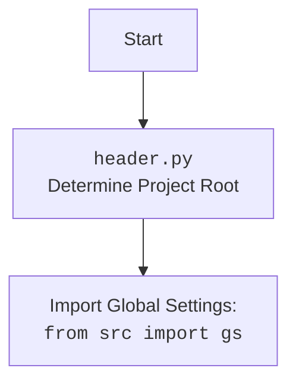

### **Анализ кода проекта `hypotez`**

=========================================================================================

Анализ файла: `hypotez/src/utils/convertors/_experiments/html2text.py`

---

### **1. Блок-схема**

```mermaid
graph TD
    A[Начало] --> B(Чтение HTML файла: <code>html = read_text_file(...)</code>);
    B --> C(Преобразование HTML в текст: <code>text_from_html = html2text(html)</code>);
    C --> D(Сохранение текста в файл: <code>save_text_file(text_from_html, ...)</code>);
    D --> E[Конец];
```

**Примеры:**

- **Чтение HTML файла**:
  ```python
  html = read_text_file(gs.path.google_drive / 'html2text' / 'index.html')
  # Читает содержимое файла index.html, расположенного в google_drive/html2text.
  ```
- **Преобразование HTML в текст**:
  ```python
  text_from_html = html2text(html)
  # Преобразует HTML-код в текст.
  ```
- **Сохранение текста в файл**:
  ```python
  save_text_file(text_from_html, gs.path.google_drive / 'html2text' / 'index.txt')
  # Сохраняет преобразованный текст в файл index.txt.
  ```

### **2. Диаграмма**

```mermaid
flowchart TD
    Start --> ImportHeader[<code>import header</code><br>Определение корневой директории проекта]
    ImportHeader --> ImportGS[<code>from src import gs</code><br>Импорт глобальных настроек]
    ImportGS --> ImportConvertors[<code>from src.utils.convertors import html2text, html2text_file</code><br>Импорт функций для конвертации HTML в текст]
    ImportConvertors --> ImportFile[<code>from src.utils.file import read_text_file, save_text_file</code><br>Импорт функций для работы с файлами]
    ImportFile --> HTMLRead[<code>html = read_text_file(...)</code><br>Чтение HTML файла]
    HTMLRead --> HTMLToText[<code>text_from_html = html2text(html)</code><br>Преобразование HTML в текст]
    HTMLToText --> SaveText[<code>save_text_file(text_from_html, ...)</code><br>Сохранение текста в файл]
    SaveText --> End[Конец]
```

#### **Объяснение зависимостей в диаграмме `mermaid`:**

- **`import header`**: Определяет корневую директорию проекта, что важно для доступа к другим модулям.
- **`from src import gs`**: Импортирует глобальные настройки проекта, такие как пути к директориям.
- **`from src.utils.convertors import html2text, html2text_file`**: Импортирует функции для преобразования HTML в текст.
- **`from src.utils.file import read_text_file, save_text_file`**: Импортирует функции для чтения и сохранения текстовых файлов.
- **`HTMLRead`**: Использует `read_text_file` для чтения содержимого HTML-файла.
- **`HTMLToText`**: Использует `html2text` для преобразования HTML-кода в текст.
- **`SaveText`**: Использует `save_text_file` для сохранения преобразованного текста в файл.

Дополнительный блок `mermaid` flowchart, объясняющий `header.py`:



### **3. Объяснение**

#### **Импорты:**

- `import header`:
  - **Назначение**: Этот модуль отвечает за определение корневой директории проекта.
  - **Взаимосвязь**: Необходим для правильной работы с путями к файлам и модулям.

- `from src import gs`:
  - **Назначение**: Импортирует глобальные настройки проекта, содержащие, например, пути к различным директориям.
  - **Взаимосвязь**: Используется для получения пути к директории `google_drive`, где хранятся HTML-файлы.

- `from src.utils.convertors import html2text, html2text_file`:
  - **Назначение**: Импортирует функции `html2text` и `html2text_file`, предназначенные для преобразования HTML-кода в текст.
  - **Взаимосвязь**: `html2text` используется для преобразования содержимого HTML-файла, прочитанного из `read_text_file`.

- `from src.utils.file import read_text_file, save_text_file`:
  - **Назначение**: Импортирует функции для чтения и сохранения текстовых файлов.
  - **Взаимосвязь**: `read_text_file` используется для чтения HTML-файла, а `save_text_file` — для сохранения преобразованного текста.

#### **Переменные:**

- `html`:
  - **Тип**: `str` (предположительно).
  - **Использование**: Содержит HTML-код, прочитанный из файла.
- `text_from_html`:
  - **Тип**: `str`.
  - **Использование**: Содержит текст, полученный после преобразования HTML-кода.

#### **Функции:**

- `read_text_file(file_path: str | Path, as_list: bool = False, extensions: Optional[List[str]] = None, chunk_size: int = 8192) -> Generator[str, None, None] | str | None:`
  - **Аргументы**:
    - `file_path` (str | Path): Путь к файлу.
    - `as_list` (bool): Флаг, указывающий, нужно ли возвращать содержимое файла в виде списка строк.
    - `extensions` (Optional[List[str]]): Список расширений файлов для чтения из каталога.
    - `chunk_size` (int): Размер чанков для чтения файла в байтах.
  - **Возвращаемое значение**: Генератор строк, объединенная строка или `None` в случае ошибки.
  - **Назначение**: Читает содержимое текстового файла.
  - **Пример**:
    ```python
    html = read_text_file(gs.path.google_drive / 'html2text' / 'index.html')
    ```

- `html2text(html: str) -> str:`
  - **Аргументы**:
    - `html` (str): HTML-код для преобразования.
  - **Возвращаемое значение**: Преобразованный текст.
  - **Назначение**: Преобразует HTML-код в текст.
  - **Пример**:
    ```python
    text_from_html = html2text(html)
    ```

- `save_text_file(text: str, file_path: str | Path, encoding: str = 'utf-8') -> None:`
  - **Аргументы**:
    - `text` (str): Текст для сохранения.
    - `file_path` (str | Path): Путь к файлу для сохранения.
    - `encoding` (str): Кодировка файла.
  - **Возвращаемое значение**: `None`.
  - **Назначение**: Сохраняет текст в файл.
  - **Пример**:
    ```python
    save_text_file(text_from_html, gs.path.google_drive / 'html2text' / 'index.txt')
    ```

#### **Потенциальные ошибки и области для улучшения:**

- Отсутствуют обработки исключений. В случае ошибки при чтении или записи файла программа завершится аварийно.
- Типы переменных `html` и `text_from_html` явно не указаны, что может привести к ошибкам.
- Строка `...` в конце файла не имеет никакого смысла и должна быть удалена или заменена полезным кодом.

#### **Взаимосвязи с другими частями проекта:**

- Модуль использует глобальные настройки (`gs`) для определения путей к файлам, что позволяет легко конфигурировать пути в одном месте.
- Функции `read_text_file` и `save_text_file` используются для работы с файлами, что способствует повторному использованию кода.
- Функция `html2text` используется для преобразования HTML в текст, что может быть полезно в других частях проекта, где требуется извлечение текста из HTML-кода.