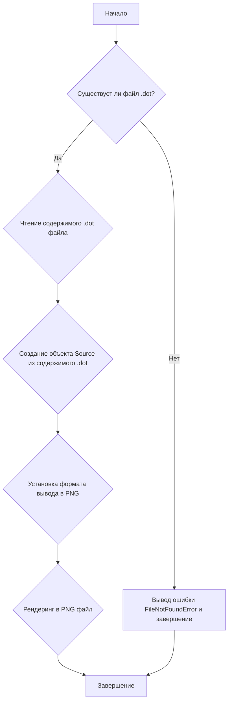
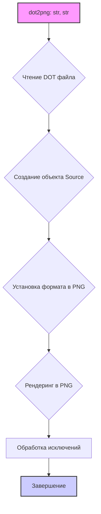

### **Системные инструкции для обработки кода проекта `hypotez`**

=========================================================================================

Описание функциональности и правил для генерации, анализа и улучшения кода. Направлено на обеспечение последовательного и читаемого стиля кодирования, соответствующего требованиям.

---

### **Основные принципы**

#### **1. Общие указания**:
- Соблюдай четкий и понятный стиль кодирования.
- Все изменения должны быть обоснованы и соответствовать установленным требованиям.

#### **2. Комментарии**:
- Используй `#` для внутренних комментариев.
- Документация всех функций, методов и классов должна следовать такому формату: 
    ```python
        def function(param: str, param1: Optional[str | dict | str] = None) -> dict | None:
            """ 
            Args:
                param (str): Описание параметра `param`.
                param1 (Optional[str | dict | str], optional): Описание параметра `param1`. По умолчанию `None`.
    
            Returns:
                dict | None: Описание возвращаемого значения. Возвращает словарь или `None`.
    
            Raises:
                SomeError: Описание ситуации, в которой возникает исключение `SomeError`.

            Ехаmple:
                >>> function('param', 'param1')
                {'param': 'param1'}
            """
    ```
- Комментарии и документация должны быть четкими, лаконичными и точными.

#### **3. Форматирование кода**:
- Используй одинарные кавычки. `a:str = 'value'`, `print('Hello World!')`;
- Добавляй пробелы вокруг операторов. Например, `x = 5`;
- Все параметры должны быть аннотированы типами. `def function(param: str, param1: Optional[str | dict | str] = None) -> dict | None:`;
- Не используй `Union`. Вместо этого используй `|`.

#### **4. Логирование**:
- Для логгирования Всегда Используй модуль `logger` из `src.logger.logger`.
- Ошибки должны логироваться с использованием `logger.error`.
Пример:
    ```python
        try:
            ...
        except Exception as ex:
            logger.error('Error while processing data', ех, exc_info=True)
    ```
#### **5 Не используй `Union[]` в коде. Вместо него используй `|`
Например:
```python
x: str | int ...
```


---

### **Основные требования**:

#### **1. Формат ответов в Markdown**:
- Все ответы должны быть выполнены в формате **Markdown**.

#### **2. Формат комментариев**:
- Используй указанный стиль для комментариев и документации в коде.
- Пример:

```python
from typing import Generator, Optional, List
from pathlib import Path


def read_text_file(
    file_path: str | Path,
    as_list: bool = False,
    extensions: Optional[List[str]] = None,
    chunk_size: int = 8192,
) -> Generator[str, None, None] | str | None:
    """
    Считывает содержимое файла (или файлов из каталога) с использованием генератора для экономии памяти.

    Args:
        file_path (str | Path): Путь к файлу или каталогу.
        as_list (bool): Если `True`, возвращает генератор строк.
        extensions (Optional[List[str]]): Список расширений файлов для чтения из каталога.
        chunk_size (int): Размер чанков для чтения файла в байтах.

    Returns:
        Generator[str, None, None] | str | None: Генератор строк, объединенная строка или `None` в случае ошибки.

    Raises:
        Exception: Если возникает ошибка при чтении файла.

    Example:
        >>> from pathlib import Path
        >>> file_path = Path('example.txt')
        >>> content = read_text_file(file_path)
        >>> if content:
        ...    print(f'File content: {content[:100]}...')
        File content: Example text...
    """
    ...
```
- Всегда делай подробные объяснения в комментариях. Избегай расплывчатых терминов, 
- таких как *«получить»* или *«делать»*. Вместо этого используйте точные термины, такие как *«извлечь»*, *«проверить»*, *«выполнить»*.
- Вместо: *«получаем»*, *«возвращаем»*, *«преобразовываем»* используй имя объекта *«функция получае»*, *«переменная возвращает»*, *«код преобразовывает»* 
- Комментарии должны непосредственно предшествовать описываемому блоку кода и объяснять его назначение.

#### **3. Пробелы вокруг операторов присваивания**:
- Всегда добавляйте пробелы вокруг оператора `=`, чтобы повысить читаемость.
- Примеры:
  - **Неправильно**: `x=5`
  - **Правильно**: `x = 5`

#### **4. Использование `j_loads` или `j_loads_ns`**:
- Для чтения JSON или конфигурационных файлов замените стандартное использование `open` и `json.load` на `j_loads` или `j_loads_ns`.
- Пример:

```python
# Неправильно:
with open('config.json', 'r', encoding='utf-8') as f:
    data = json.load(f)

# Правильно:
data = j_loads('config.json')
```

#### **5. Сохранение комментариев**:
- Все существующие комментарии, начинающиеся с `#`, должны быть сохранены без изменений в разделе «Улучшенный код».
- Если комментарий кажется устаревшим или неясным, не изменяйте его. Вместо этого отметьте его в разделе «Изменения».

#### **6. Обработка `...` в коде**:
- Оставляйте `...` как указатели в коде без изменений.
- Не документируйте строки с `...`.
```

#### **7. Аннотации**
Для всех переменных должны быть определены аннотации типа. 
Для всех функций все входные и выходные параметры аннотириваны
Для все параметров должны быть аннотации типа.


### **8. webdriver**
В коде используется webdriver. Он импртируется из модуля `webdriver` проекта `hypotez`
```python
from src.webdirver import Driver, Chrome, Firefox, Playwright, ...
driver = Driver(Firefox)

Пoсле чего может использоваться как

close_banner = {
  "attribute": null,
  "by": "XPATH",
  "selector": "//button[@id = 'closeXButton']",
  "if_list": "first",
  "use_mouse": false,
  "mandatory": false,
  "timeout": 0,
  "timeout_for_event": "presence_of_element_located",
  "event": "click()",
  "locator_description": "Закрываю pop-up окно, если оно не появилось - не страшно (`mandatory`:`false`)"
}

result = driver.execute_locator(close_banner)
```

## Анализ кода файла `hypotez/src/utils/convertors/dot.py`

### 1. Блок-схема



**Примеры для каждого логического блока:**

-   **A (Начало)**: Запуск скрипта `dot2png.py`.
-   **B (Существует ли файл .dot?)**: Проверка наличия файла `example.dot`. Если файл существует, переходим к чтению его содержимого; иначе выводим сообщение об ошибке.
-   **C (Чтение содержимого .dot файла)**: Чтение данных из файла `example.dot` и сохранение их в переменной `dot_content`.
-   **D (Создание объекта Source из содержимого .dot)**: Инициализация объекта `Source` из библиотеки `graphviz` с использованием содержимого, прочитанного из DOT-файла.
-   **F (Установка формата вывода в PNG)**: Установка формата выходного файла как PNG.
-   **G (Рендеринг в PNG файл)**: Преобразование DOT-контента в PNG-изображение и сохранение его в файл `output.png`.
-   **H (Завершение)**: Успешное завершение работы скрипта или завершение после обработки ошибки.
-   **E (Вывод ошибки FileNotFoundError и завершение)**: Вывод сообщения об ошибке, если файл `example.dot` не найден, и завершение работы скрипта.

### 2. Диаграмма



**Объяснение зависимостей:**

-   `dot2png`: Функция, принимающая пути к DOT и PNG файлам. Она отвечает за чтение DOT-файла, создание объекта `Source` из библиотеки `graphviz`, установку формата вывода в PNG и рендеринг PNG-изображения.

### 3. Объяснение

#### Импорты:

-   `import sys`: Используется для доступа к параметрам командной строки, переданным скрипту. В частности, `sys.argv` содержит список аргументов командной строки.
-   `from graphviz import Source`: Импортирует класс `Source` из библиотеки `graphviz`. Этот класс используется для представления DOT-контента и его последующего рендеринга в различные форматы, такие как PNG.

#### Классы:

-   `graphviz.Source`: Класс, представляющий DOT-граф. Он инициализируется с содержимым DOT-файла. Основные методы:
    -   `__init__(dot_content)`: Конструктор класса, принимающий DOT-контент в виде строки.
    -   `render(filename, cleanup=True)`: Метод для рендеринга DOT-графа в файл указанного формата. `cleanup=True` удаляет временные файлы, созданные в процессе рендеринга.

#### Функции:

-   `dot2png(dot_file: str, png_file: str) -> None`:
    -   **Аргументы**:
        -   `dot_file` (str): Путь к входному DOT-файлу.
        -   `png_file` (str): Путь, куда будет сохранен PNG-файл.
    -   **Возвращаемое значение**: `None`.
    -   **Назначение**: Конвертирует DOT-файл в PNG-изображение.
    -   **Пример**:
        ```python
        dot2png('example.dot', 'output.png')
        ```
        Этот вызов функции преобразует файл `example.dot` в PNG-изображение и сохраняет его как `output.png`.
    -   **Обработка ошибок**:
        -   `FileNotFoundError`: Возникает, если DOT-файл не найден.
        -   `Exception`: Возникает при любых других ошибках в процессе конвертации.

#### Переменные:

-   `dot_file` (str): Путь к входному DOT-файлу.
-   `png_file` (str): Путь для сохранения выходного PNG-файла.
-   `dot_content` (str): Содержимое DOT-файла, прочитанное как строка.
-   `source` (graphviz.Source): Объект `Source`, созданный из содержимого DOT-файла.
-   `input_dot_file` (str):  Получает имя входного DOT-файла из аргументов командной строки.
-   `output_png_file` (str): Получает имя выходного PNG-файла из аргументов командной строки.

#### Потенциальные ошибки и области для улучшения:

1.  **Отсутствие логирования**: В случае возникновения исключений выводится сообщение в консоль, но не используется логирование. Рекомендуется добавить логирование с использованием модуля `logger` из `src.logger.logger` для более эффективного отслеживания ошибок.
2.  **Обработка исключений**: Обработка исключений включает в себя только вывод сообщения об ошибке и повторное возбуждение исключения.  Можно добавить более детальную обработку, например, запись в лог или выполнение дополнительных действий.
3.  **Аннотации**: В коде отсутствуют аннотации типов для переменных, что может снизить читаемость и повысить вероятность ошибок. Рекомендуется добавить аннотации типов для всех переменных.

#### Взаимосвязи с другими частями проекта:

-   Этот модуль может быть использован другими частями проекта для автоматической генерации изображений графов из DOT-файлов. Например, для визуализации структуры данных, алгоритмов или других процессов.  Для этого другие модули могут импортировать функцию `dot2png` и использовать ее для преобразования DOT-файлов в PNG-изображения.