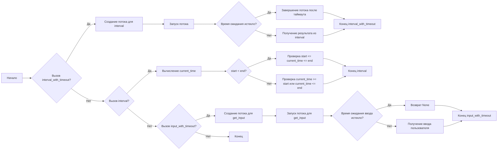
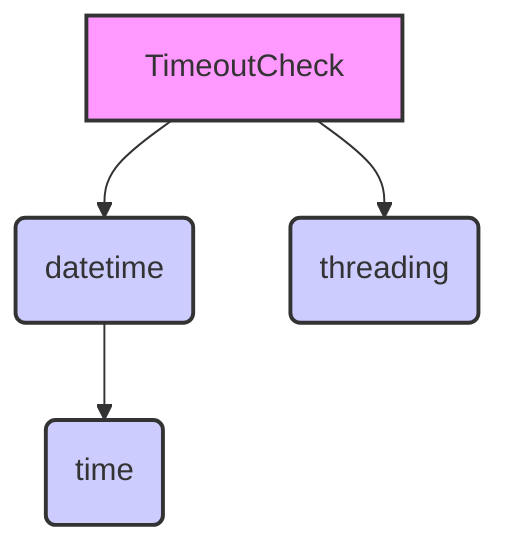

### **Системные инструкции для обработки кода проекта `hypotez`**

=========================================================================================

Описание функциональности и правил для генерации, анализа и улучшения кода. Направлено на обеспечение последовательного и читаемого стиля кодирования, соответствующего требованиям.

---

### **Основные принципы**

#### **1. Общие указания**:
- Соблюдай четкий и понятный стиль кодирования.
- Все изменения должны быть обоснованы и соответствовать установленным требованиям.

#### **2. Комментарии**:
- Используй `#` для внутренних комментариев.
- Документация всех функций, методов и классов должна следовать такому формату: 
    ```python
        def function(param: str, param1: Optional[str | dict | str] = None) -> dict | None:
            """ 
            Args:
                param (str): Описание параметра `param`.
                param1 (Optional[str | dict | str], optional): Описание параметра `param1`. По умолчанию `None`.
    
            Returns:
                dict | None: Описание возвращаемого значения. Возвращает словарь или `None`.
    
            Raises:
                SomeError: Описание ситуации, в которой возникает исключение `SomeError`.

            Ехаmple:
                >>> function('param', 'param1')
                {'param': 'param1'}
            """
    ```
- Комментарии и документация должны быть четкими, лаконичными и точными.

#### **3. Форматирование кода**:
- Используй одинарные кавычки. `a:str = 'value'`, `print('Hello World!')`;
- Добавляй пробелы вокруг операторов. Например, `x = 5`;
- Все параметры должны быть аннотированы типами. `def function(param: str, param1: Optional[str | dict | str] = None) -> dict | None:`;
- Не используй `Union`. Вместо этого используй `|`.

#### **4. Логирование**:
- Для логгирования Всегда Используй модуль `logger` из `src.logger.logger`.
- Ошибки должны логироваться с использованием `logger.error`.
Пример:
    ```python
        try:
            ...
        except Exception as ex:
            logger.error('Error while processing data', ех, exc_info=True)
    ```
#### **5 Не используй `Union[]` в коде. Вместо него используй `|`
Например:
```python
x: str | int ...
```


---

### **Основные требования**:

#### **1. Формат ответов в Markdown**:
- Все ответы должны быть выполнены в формате **Markdown**.

#### **2. Формат комментариев**:
- Используй указанный стиль для комментариев и документации в коде.
- Пример:

```python
from typing import Generator, Optional, List
from pathlib import Path


def read_text_file(
    file_path: str | Path,
    as_list: bool = False,
    extensions: Optional[List[str]] = None,
    chunk_size: int = 8192,
) -> Generator[str, None, None] | str | None:
    """
    Считывает содержимое файла (или файлов из каталога) с использованием генератора для экономии памяти.

    Args:
        file_path (str | Path): Путь к файлу или каталогу.
        as_list (bool): Если `True`, возвращает генератор строк.
        extensions (Optional[List[str]]): Список расширений файлов для чтения из каталога.
        chunk_size (int): Размер чанков для чтения файла в байтах.

    Returns:
        Generator[str, None, None] | str | None: Генератор строк, объединенная строка или `None` в случае ошибки.

    Raises:
        Exception: Если возникает ошибка при чтении файла.

    Example:
        >>> from pathlib import Path
        >>> file_path = Path('example.txt')
        >>> content = read_text_file(file_path)
        >>> if content:
        ...    print(f'File content: {content[:100]}...')
        File content: Example text...
    """
    ...
```
- Всегда делай подробные объяснения в комментариях. Избегай расплывчатых терминов, 
- таких как *«получить»* или *«делать»*
-  . Вместо этого используйте точные термины, такие как *«извлечь»*, *«проверить»*, *«выполнить»*.
- Вместо: *«получаем»*, *«возвращаем»*, *«преобразовываем»* используй имя объекта *«функция получае»*, *«переменная возвращает»*, *«код преобразовывает»* 
- Комментарии должны непосредственно предшествовать описываемому блоку кода и объяснять его назначение.

#### **3. Пробелы вокруг операторов присваивания**:
- Всегда добавляйте пробелы вокруг оператора `=`, чтобы повысить читаемость.
- Примеры:
  - **Неправильно**: `x=5`
  - **Правильно**: `x = 5`

#### **4. Использование `j_loads` или `j_loads_ns`**:
- Для чтения JSON или конфигурационных файлов замените стандартное использование `open` и `json.load` на `j_loads` или `j_loads_ns`.
- Пример:

```python
# Неправильно:
with open('config.json', 'r', encoding='utf-8') as f:
    data = json.load(f)

# Правильно:
data = j_loads('config.json')
```

#### **5. Сохранение комментариев**:
- Все существующие комментарии, начинающиеся с `#`, должны быть сохранены без изменений в разделе «Улучшенный код».
- Если комментарий кажется устаревшим или неясным, не изменяйте его в разделе «Изменения».

#### **6. Обработка `...` в коде**:
- Оставляйте `...` как указатели в коде без изменений.
- Не документируйте строки с `...`.
```

#### **7. Аннотации**
Для всех переменных должны быть определены аннотации типа. 
Для всех функций все входные и выходные параметры аннотириваны
Для все параметров должны быть аннотации типа.


### **8. webdriver**
В коде используется webdriver. Он импртируется из модуля `webdriver` проекта `hypotez`
```python
from src.webdirver import Driver, Chrome, Firefox, Playwright, ...
driver = Driver(Firefox)

Пoсле чего может использоваться как

close_banner = {
  "attribute": null,
  "by": "XPATH",
  "selector": "//button[@id = 'closeXButton']",
  "if_list": "first",
  "use_mouse": false,
  "mandatory": false,
  "timeout": 0,
  "timeout_for_event": "presence_of_element_located",
  "event": "click()",
  "locator_description": "Закрываю pop-up окно, если оно не появилось - не страшно (`mandatory`:`false`)"
}

result = driver.execute_locator(close_banner)
```

### **Анализ кода `hypotez/src/utils/date_time.py`**

#### **1. Блок-схема**



**Примеры для каждого логического блока:**

- **A (Начало)**: Начало выполнения программы.
- **B (Вызов `interval_with_timeout`?)**: Проверка, вызвана ли функция `interval_with_timeout`.
    - *Пример*: `timeout_check.interval_with_timeout(timeout=5)`
- **C (Создание потока для `interval`)**: Создание нового потока для выполнения метода `interval`.
    - *Пример*: `thread = threading.Thread(target=self.interval, args=(start, end))`
- **B (Нет) -> D (Вызов `interval`?)**: Проверка, вызвана ли функция `interval`.
    - *Пример*: `timeout_check.interval()`
- **E (Вычисление `current_time`)**: Получение текущего времени.
    - *Пример*: `current_time = datetime.now().time()`
- **D (Нет) -> F (Вызов `input_with_timeout`?)**: Проверка, вызвана ли функция `input_with_timeout`.
    - *Пример*: `timeout_check.input_with_timeout(timeout=5)`
- **G (Создание потока для `get_input`)**: Создание потока для получения ввода пользователя.
    - *Пример*: `thread = threading.Thread(target=self.get_input)`
- **I (Запуск потока)**: Запуск созданного потока.
    - *Пример*: `thread.start()`
- **J (Время ожидания истекло?)**: Проверка, истекло ли время ожидания потока.
    - *Пример*: `thread.is_alive()`
- **K (Завершение потока после таймаута)**: Завершение потока после истечения времени ожидания.
    - *Пример*: `thread.join()`
- **L (Получение результата из `interval`)**: Получение результата из метода `interval`.
    - *Пример*: `self.result`
- **N (start < end?)**: Проверка, находится ли интервал в пределах одного дня.
    - *Пример*: `if start < end:`
- **O (Проверка `start <= current_time <= end`)**: Проверка, находится ли текущее время в интервале, если интервал в пределах одного дня.
    - *Пример*: `self.result = start <= current_time <= end`
- **P (Проверка `current_time >= start или current_time <= end`)**: Проверка, находится ли текущее время в интервале, если интервал охватывает полночь.
    - *Пример*: `self.result = current_time >= start or current_time <= end`
- **R (Запуск потока для `get_input`)**: Запуск потока для получения ввода пользователя.
    - *Пример*: `thread.start()`
- **S (Время ожидания ввода истекло?)**: Проверка, истекло ли время ожидания ввода.
    - *Пример*: `thread.is_alive()`
- **T (Возврат `None`)**: Возврат `None`, если время ожидания истекло.
    - *Пример*: `return`
- **U (Получение ввода пользователя)**: Получение ввода пользователя.
    - *Пример*: `self.user_input = input("U:> ")`
- **Q/M/V/H (Конец)**: Завершение выполнения соответствующей функции.

#### **2. Диаграмма зависимостей**



**Объяснение зависимостей:**

- **`TimeoutCheck`**: Класс, использующий модули `datetime` и `threading`.
- **`datetime`**: Модуль используется для получения текущего времени (`datetime.now()`).
- **`threading`**: Модуль используется для создания и управления потоками, позволяющими выполнять задачи с таймаутом.
- **`time`**: Класс из модуля `datetime`, используемый для представления времени (`time(23, 0)`).

#### **3. Объяснение**

**Импорты:**

- `datetime` (из модуля `datetime`): Используется для работы с датой и временем, в частности для получения текущего времени.
    - *Пример*: `current_time = datetime.now().time()`
- `time` (из модуля `datetime`): Используется для представления времени в формате часов, минут и секунд.
    - *Пример*: `start: time = time(23, 0)`
- `threading`: Используется для создания и управления потоками, что позволяет выполнять задачи асинхронно и с таймаутом.
    - *Пример*: `thread = threading.Thread(target=self.interval, args=(start, end))`

**Класс `TimeoutCheck`:**

- **Роль**: Предоставляет функциональность для проверки, находится ли текущее время в заданном интервале, с возможностью установки таймаута. Также позволяет ожидать ввод пользователя с таймаутом.
- **Атрибуты**:
    - `self.result`: Сохраняет результат проверки интервала времени (True или False).
    - `self.user_input`: Сохраняет ввод пользователя.
- **Методы**:
    - `__init__(self)`: Конструктор класса, инициализирует атрибут `self.result` значением `None`.
    - `interval(self, start: time = time(23, 0), end: time = time(6, 0)) -> bool`: Проверяет, находится ли текущее время в заданном интервале.
        - *Аргументы*:
            - `start` (time): Начало интервала (по умолчанию 23:00).
            - `end` (time): Конец интервала (по умолчанию 06:00).
        - *Возвращаемое значение*:
            - `bool`: True, если текущее время находится в интервале, иначе False.
        - *Пример*:
            ```python
            timeout_check = TimeoutCheck()
            is_within_interval = timeout_check.interval(start=time(22, 0), end=time(7, 0))
            print(is_within_interval)
            ```
    - `interval_with_timeout(self, timeout: int = 5, start: time = time(23, 0), end: time = time(6, 0)) -> bool`: Проверяет, находится ли текущее время в заданном интервале с таймаутом.
        - *Аргументы*:
            - `timeout` (int): Время ожидания проверки в секундах (по умолчанию 5).
            - `start` (time): Начало интервала (по умолчанию 23:00).
            - `end` (time): Конец интервала (по умолчанию 06:00).
        - *Возвращаемое значение*:
            - `bool`: True, если текущее время находится в интервале и проверка завершилась в течение таймаута, иначе False.
        - *Пример*:
            ```python
            timeout_check = TimeoutCheck()
            is_within_interval = timeout_check.interval_with_timeout(timeout=3, start=time(22, 0), end=time(7, 0))
            print(is_within_interval)
            ```
    - `get_input(self)`: Запрашивает ввод от пользователя.
    - `input_with_timeout(self, timeout: int = 5) -> str | None`: Ожидает ввод пользователя с таймаутом.
        - *Аргументы*:
            - `timeout` (int): Время ожидания ввода в секундах (по умолчанию 5).
        - *Возвращаемое значение*:
            - `str | None`: Введенные данные, если ввод был получен в течение таймаута, иначе None.
        - *Пример*:
            ```python
            timeout_check = TimeoutCheck()
            user_input = timeout_check.input_with_timeout(timeout=3)
            if user_input:
                print(f"User input: {user_input}")
            else:
                print("Timeout occurred")
            ```

**Функции:**

- Отсутствуют отдельные функции вне класса `TimeoutCheck`. Все операции выполняются методами класса.

**Переменные:**

- `current_time`: Переменная типа `datetime.time`, хранящая текущее время.
    - *Пример*: `current_time = datetime.now().time()`
- `start`: Переменная типа `datetime.time`, хранящая время начала интервала.
    - *Пример*: `start: time = time(23, 0)`
- `end`: Переменная типа `datetime.time`, хранящая время окончания интервала.
    - *Пример*: `end: time = time(6, 0)`
- `timeout`: Переменная типа `int`, хранящая время ожидания в секундах.
    - *Пример*: `timeout: int = 5`
- `thread`: Переменная типа `threading.Thread`, представляющая поток для выполнения задач с таймаутом.
    - *Пример*: `thread = threading.Thread(target=self.interval, args=(start, end))`

**Потенциальные ошибки и области для улучшения:**

1. **Обработка исключений**: В методах `interval_with_timeout` и `input_with_timeout` не обрабатываются возможные исключения, которые могут возникнуть в потоках. Рекомендуется добавить обработку исключений для более надежной работы.
2. **Управление потоками**: В случае таймаута в методе `interval_with_timeout`, поток принудительно завершается с помощью `thread.join()`.  В `input_with_timeout` просто возвращается управление.  Рекомендуется более явное управление ресурсами потока.
3. **Логирование**: Не хватает логирования важных событий, таких как запуск потоков, возникновение таймаутов и получение результатов. Добавление логирования поможет в отладке и мониторинге работы кода. Необходимо использовать `logger.error` из `src.logger.logger` для логирования ошибок.
4. **Возврат значения `input_with_timeout` при таймауте**: При таймауте функция ничего не возвращает явно (фактически возвращает `None`). Для большей ясности рекомендуется явно возвращать `None`.

**Взаимосвязь с другими частями проекта:**

Этот модуль предоставляет утилиты для работы с датой и временем, а также для выполнения задач с таймаутом.  Он может использоваться в других частях проекта, где требуется выполнение определенных действий в заданный период времени или ожидание ввода пользователя с ограничением по времени. Например, его можно использовать для автоматического запуска задач обслуживания в нерабочее время или для прерывания длительных операций, если они не завершаются в течение заданного времени.