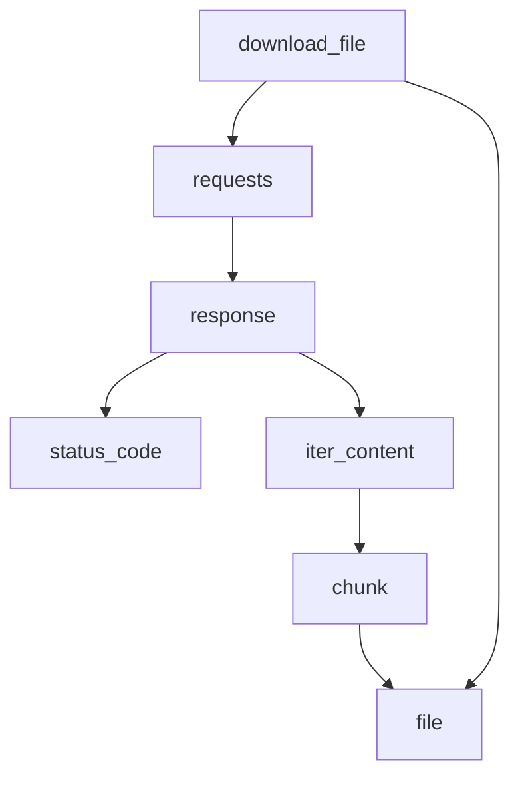

### **Системные инструкции для обработки кода проекта `hypotez`**

=========================================================================================

Описание функциональности и правил для генерации, анализа и улучшения кода. Направлено на обеспечение последовательного и читаемого стиля кодирования, соответствующего требованиям.

---

### **Основные принципы**

#### **1. Общие указания**:
- Соблюдай четкий и понятный стиль кодирования.
- Все изменения должны быть обоснованы и соответствовать установленным требованиям.

#### **2. Комментарии**:
- Используй `#` для внутренних комментариев.
- Документация всех функций, методов и классов должна следовать такому формату: 
    ```python
        def function(param: str, param1: Optional[str | dict | str] = None) -> dict | None:
            """ 
            Args:
                param (str): Описание параметра `param`.
                param1 (Optional[str | dict | str], optional): Описание параметра `param1`. По умолчанию `None`.
    
            Returns:
                dict | None: Описание возвращаемого значения. Возвращает словарь или `None`.
    
            Raises:
                SomeError: Описание ситуации, в которой возникает исключение `SomeError`.

            Ехаmple:
                >>> function('param', 'param1')
                {'param': 'param1'}
            """
    ```
- Комментарии и документация должны быть четкими, лаконичными и точными.

#### **3. Форматирование кода**:
- Используй одинарные кавычки. `a:str = 'value'`, `print('Hello World!')`;
- Добавляй пробелы вокруг операторов. Например, `x = 5`;
- Все параметры должны быть аннотированы типами. `def function(param: str, param1: Optional[str | dict | str] = None) -> dict | None:`;
- Не используй `Union`. Вместо этого используй `|`.

#### **4. Логирование**:
- Для логгирования Всегда Используй модуль `logger` из `src.logger.logger`.
- Ошибки должны логироваться с использованием `logger.error`.
Пример:
    ```python
        try:
            ...
        except Exception as ex:
            logger.error('Error while processing data', ех, exc_info=True)
    ```
#### **5 Не используй `Union[]` в коде. Вместо него используй `|`
Например:
```python
x: str | int ...
```


---

### **Основные требования**:

#### **1. Формат ответов в Markdown**:
- Все ответы должны быть выполнены в формате **Markdown**.

#### **2. Формат комментариев**:
- Используй указанный стиль для комментариев и документации в коде.
- Пример:

```python
from typing import Generator, Optional, List
from pathlib import Path


def read_text_file(
    file_path: str | Path,
    as_list: bool = False,
    extensions: Optional[List[str]] = None,
    chunk_size: int = 8192,
) -> Generator[str, None, None] | str | None:
    """
    Считывает содержимое файла (или файлов из каталога) с использованием генератора для экономии памяти.

    Args:
        file_path (str | Path): Путь к файлу или каталогу.
        as_list (bool): Если `True`, возвращает генератор строк.
        extensions (Optional[List[str]]): Список расширений файлов для чтения из каталога.
        chunk_size (int): Размер чанков для чтения файла в байтах.

    Returns:
        Generator[str, None, None] | str | None: Генератор строк, объединенная строка или `None` в случае ошибки.

    Raises:
        Exception: Если возникает ошибка при чтении файла.

    Example:
        >>> from pathlib import Path
        >>> file_path = Path('example.txt')
        >>> content = read_text_file(file_path)
        >>> if content:
        ...    print(f'File content: {content[:100]}...')
        File content: Example text...
    """
    ...
```
- Всегда делай подробные объяснения в комментариях. Избегай расплывчатых терминов, 
- таких как *«получить»* или *«делать»*
-  . Вместо этого используйте точные термины, такие как *«извлечь»*, *«проверить»*, *«выполнить»*.
- Вместо: *«получаем»*, *«возвращаем»*, *«преобразовываем»* используй имя объекта *«функция получае»*, *«переменная возвращает»*, *«код преобразовывает»* 
- Комментарии должны непосредственно предшествовать описываемому блоку кода и объяснять его назначение.

#### **3. Пробелы вокруг операторов присваивания**:
- Всегда добавляйте пробелы вокруг оператора `=`, чтобы повысить читаемость.
- Примеры:
  - **Неправильно**: `x=5`
  - **Правильно**: `x = 5`

#### **4. Использование `j_loads` или `j_loads_ns`**:
- Для чтения JSON или конфигурационных файлов замените стандартное использование `open` и `json.load` на `j_loads` или `j_loads_ns`.
- Пример:

```python
# Неправильно:
with open('config.json', 'r', encoding='utf-8') as f:
    data = json.load(f)

# Правильно:
data = j_loads('config.json')
```

#### **5. Сохранение комментариев**:
- Все существующие комментарии, начинающиеся с `#`, должны быть сохранены без изменений в разделе «Улучшенный код».
- Если комментарий кажется устаревшим или неясным, не изменяйте его. Вместо этого отметьте его в разделе «Изменения».

#### **6. Обработка `...` в коде**:
- Оставляйте `...` как указатели в коде без изменений.
- Не документируйте строки с `...`.
```

#### **7. Аннотации**
Для всех переменных должны быть определены аннотации типа. 
Для всех функций все входные и выходные параметры аннотириваны
Для все параметров должны быть аннотации типа.


### **8. webdriver**
В коде используется webdriver. Он импртируется из модуля `webdriver` проекта `hypotez`
```python
from src.webdirver import Driver, Chrome, Firefox, Playwright, ...
driver = Driver(Firefox)

Пoсле чего может использоваться как

close_banner = {
  "attribute": null,
  "by": "XPATH",
  "selector": "//button[@id = 'closeXButton']",
  "if_list": "first",
  "use_mouse": false,
  "mandatory": false,
  "timeout": 0,
  "timeout_for_event": "presence_of_element_located",
  "event": "click()",
  "locator_description": "Закрываю pop-up окно, если оно не появилось - не страшно (`mandatory`:`false`)"
}

result = driver.execute_locator(close_banner)
```

## Анализ кода `hypotez/src/utils/file_downloader.py`

### 1. Блок-схема

```mermaid
graph LR
    A[Начало: Вызов функции download_file(url, destination)] --> B{Отправка GET-запроса к URL с stream=True}
    B --> C{Проверка статуса ответа: response.status_code == 200?}
    C -- Да --> D[Открытие файла destination для записи в бинарном режиме ('wb')]
    D --> E{Цикл: Чтение файла по частям (chunk) из response.iter_content(chunk_size=1024)}
    E --> F[Запись каждой части (chunk) в файл]
    F --> E
    E -- Конец цикла --> G[Вывод сообщения: "Файл успешно загружен!"]
    C -- Нет --> H[Вывод сообщения: "Ошибка загрузки файла!"]
    G --> I[Конец]
    H --> I
```

**Примеры блоков:**

-   **A**: `download_file(file_url, save_as)` - Вызов функции с URL файла и именем для сохранения.
-   **B**: `response = requests.get(url, stream=True)` - Отправка запроса на скачивание файла.
-   **C**: `if response.status_code == 200:` - Проверка, что запрос успешен.
-   **D**: `with open(destination, 'wb') as file:` - Открытие файла для записи.
-   **E**: `for chunk in response.iter_content(chunk_size=1024):` - Чтение файла по частям.
-   **F**: `file.write(chunk)` - Запись части файла на диск.
-   **G**: `print("Файл успешно загружен!")` - Уведомление об успешной загрузке.
-   **H**: `print("Ошибка загрузки файла!")` - Уведомление об ошибке.

### 2. Диаграмма



**Объяснение зависимостей:**

-   `requests`: Это библиотека, используемая для выполнения HTTP-запросов. Функция `download_file` использует её для отправки GET-запроса к указанному URL.
-   `response`: Объект ответа, полученный от `requests.get()`. Он содержит статус ответа (`status_code`) и метод для итерации по содержимому файла (`iter_content`).
-   `status_code`: Атрибут объекта `response`, содержащий код статуса HTTP-ответа (например, 200 для успеха, 404 для "не найдено").
-   `iter_content`: Метод объекта `response`, который позволяет итерировать по содержимому ответа частями (chunks).
-   `chunk`: Часть содержимого файла, полученная из `iter_content`. Каждая часть записывается в файл на диске.
-   `file`: Файловый объект, открытый для записи скачанного содержимого. Функция `download_file` записывает чанки в этот файл.

### 3. Объяснение

**Импорты:**

-   `requests`: Используется для отправки HTTP-запросов. В данном случае, для отправки GET-запроса к URL файла, который нужно скачать.

**Функции:**

-   `download_file(url: str, destination: str)`:
    -   Аргументы:
        -   `url` (str): URL файла для скачивания.
        -   `destination` (str): Путь к файлу, куда будет сохранен скачанный файл.
    -   Возвращаемое значение: Отсутствует (None). Функция выполняет скачивание файла и сохранение его на диск.
    -   Назначение: Скачивает файл по указанному URL и сохраняет его в указанное место.
    -   Пример:
        ```python
        file_url = 'https://example.com/path/to/file.txt'
        save_as = 'downloaded_file.txt'
        download_file(file_url, save_as)
        ```

**Переменные:**

-   `response`: Объект ответа от HTTP-запроса. Используется для проверки статуса ответа и получения содержимого файла.
-   `chunk`: Часть содержимого файла, полученная из `response.iter_content()`.
-   `file_url`: URL файла для скачивания (пример: `'https://example.com/path/to/file.txt'`).
-   `save_as`: Имя файла, под которым скачанный файл будет сохранен на диске (пример: `'downloaded_file.txt'`).

**Потенциальные ошибки и области для улучшения:**

1.  **Отсутствие обработки исключений**: В коде отсутствует обработка исключений. Например, если `requests.get()` вызовет исключение (например, `ConnectionError`, `Timeout`), программа завершится с ошибкой. Рекомендуется добавить блок `try...except` для обработки возможных исключений.
2.  **Отсутствие логирования**: Важно добавить логирование для записи информации о процессе скачивания, ошибках и других важных событиях. Это поможет в отладке и мониторинге работы программы. (Используй модуль `logger` из `src.logger.logger`)
3.  **Отсутствие аннотаций**: В коде отсутствуют аннотации типов. Для улучшения читаемости и надежности рекомендуется добавить аннотации типов для аргументов функции и переменных.
4.  **Обработка ошибок HTTP**: Код проверяет только статус код 200. Следует рассмотреть обработку других успешных статус кодов (например, 201) или кодов перенаправления (3xx).
5.  **Проверка существования директории**: Перед открытием файла для записи, можно проверить, существует ли директория назначения и создать её, если необходимо.

**Цепочка взаимосвязей с другими частями проекта:**

Данный модуль `file_downloader.py` может использоваться в других частях проекта `hypotez`, где требуется скачивание файлов из интернета. Например, для скачивания файлов конфигурации, данных для анализа или других ресурсов. Он может быть вызван из других модулей, таких как модули для обработки данных, модули для автоматизации задач и т.д.
```python
from src.logger.logger import logger # Добавил для логирования
import requests
from typing import Optional

def download_file(url: str, destination: str) -> None:
    """
    Функция для скачивания файла по указанному URL и сохранения его на диск.

    Args:
        url (str): URL файла для скачивания.
        destination (str): Путь к файлу, куда будет сохранен скачанный файл.

    Returns:
        None

    Raises:
        requests.exceptions.RequestException: Если возникает ошибка при выполнении HTTP-запроса.
        IOError: Если возникает ошибка при записи файла на диск.
    """
    try:
        # Отправляем GET-запрос на сервер с указанным URL и передаем флаг stream=True для постепенной загрузки файла
        response = requests.get(url, stream=True)

        # Проверяем, успешен ли запрос (код ответа 200 означает успех)
        if response.status_code == 200:
            # Открываем файл для записи в бинарном режиме (wb)
            with open(destination, 'wb') as file:
                # Скачиваем файл по частям (по 1024 байта), чтобы избежать проблем с памятью при больших файлах
                for chunk in response.iter_content(chunk_size=1024):
                    file.write(chunk)  # Записываем каждую часть в файл
            logger.info(f'Файл успешно загружен из {url} в {destination}')  # Сообщаем об успешной загрузке
        else:
            logger.error(f'Ошибка загрузки файла из {url}. Код ответа: {response.status_code}')  # Если код ответа не 200, выводим сообщение об ошибке
    except requests.exceptions.RequestException as e:
        logger.error(f'Ошибка при выполнении HTTP-запроса: {e}', exc_info=True)
    except IOError as e:
        logger.error(f'Ошибка при записи файла на диск: {e}', exc_info=True)

# Пример использования функции: скачивание файла по URL
file_url: str = 'https://example.com/path/to/file.txt'  # URL файла для скачивания
save_as: str = 'downloaded_file.txt'  # Имя файла, под которым он будет сохранен на диске
download_file(file_url, save_as)  # Вызов функции скачивания файла