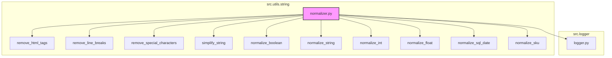

### **Системные инструкции для обработки кода проекта `hypotez`**

=========================================================================================

Описание функциональности и правил для генерации, анализа и улучшения кода. Направлено на обеспечение последовательного и читаемого стиля кодирования, соответствующего требованиям.

---

### **Основные принципы**

#### **1. Общие указания**:
- Соблюдай четкий и понятный стиль кодирования.
- Все изменения должны быть обоснованы и соответствовать установленным требованиям.

#### **2. Комментарии**:
- Используй `#` для внутренних комментариев.
- Документация всех функций, методов и классов должна следовать такому формату: 
    ```python
        def function(param: str, param1: Optional[str | dict | str] = None) -> dict | None:
            """ 
            Args:
                param (str): Описание параметра `param`.
                param1 (Optional[str | dict | str], optional): Описание параметра `param1`. По умолчанию `None`.
    
            Returns:
                dict | None: Описание возвращаемого значения. Возвращает словарь или `None`.
    
            Raises:
                SomeError: Описание ситуации, в которой возникает исключение `SomeError`.

            Ехаmple:
                >>> function('param', 'param1')
                {'param': 'param1'}
            """
    ```
- Комментарии и документация должны быть четкими, лаконичными и точными.

#### **3. Форматирование кода**:
- Используй одинарные кавычки. `a:str = 'value'`, `print('Hello World!')`;
- Добавляй пробелы вокруг операторов. Например, `x = 5`;
- Все параметры должны быть аннотированы типами. `def function(param: str, param1: Optional[str | dict | str] = None) -> dict | None:`;
- Не используй `Union`. Вместо этого используй `|`.

#### **4. Логирование**:
- Для логгирования Всегда Используй модуль `logger` из `src.logger.logger`.
- Ошибки должны логироваться с использованием `logger.error`.
Пример:
    ```python
        try:
            ...
        except Exception as ex:
            logger.error('Error while processing data', ех, exc_info=True)
    ```
#### **5 Не используй `Union[]` в коде. Вместо него используй `|`
Например:
```python
x: str | int ...
```


---

### **Основные требования**:

#### **1. Формат ответов в Markdown**:
- Все ответы должны быть выполнены в формате **Markdown**.

#### **2. Формат комментариев**:
- Используй указанный стиль для комментариев и документации в коде.
- Пример:

```python
from typing import Generator, Optional, List
from pathlib import Path


def read_text_file(
    file_path: str | Path,
    as_list: bool = False,
    extensions: Optional[List[str]] = None,
    chunk_size: int = 8192,
) -> Generator[str, None, None] | str | None:
    """
    Считывает содержимое файла (или файлов из каталога) с использованием генератора для экономии памяти.

    Args:
        file_path (str | Path): Путь к файлу или каталогу.
        as_list (bool): Если `True`, возвращает генератор строк.
        extensions (Optional[List[str]]): Список расширений файлов для чтения из каталога.
        chunk_size (int): Размер чанков для чтения файла в байтах.

    Returns:
        Generator[str, None, None] | str | None: Генератор строк, объединенная строка или `None` в случае ошибки.

    Raises:
        Exception: Если возникает ошибка при чтении файла.

    Example:
        >>> from pathlib import Path
        >>> file_path = Path('example.txt')
        >>> content = read_text_file(file_path)
        >>> if content:
        ...    print(f'File content: {content[:100]}...')
        File content: Example text...
    """
    ...
```
- Всегда делай подробные объяснения в комментариях. Избегай расплывчатых терминов, 
- таких как *«получить»* или *«делать»*. Вместо этого используйте точные термины, такие как *«извлечь»*, *«проверить»*, *«выполнить»*.
- Вместо: *«получаем»*, *«возвращаем»*, *«преобразовываем»* используй имя объекта *«функция получае»*, *«переменная возвращает»*, *«код преобразовывает»* 
- Комментарии должны непосредственно предшествовать описываемому блоку кода и объяснять его назначение.

#### **3. Пробелы вокруг операторов присваивания**:
- Всегда добавляйте пробелы вокруг оператора `=`, чтобы повысить читаемость.
- Примеры:
  - **Неправильно**: `x=5`
  - **Правильно**: `x = 5`

#### **4. Использование `j_loads` или `j_loads_ns`**:
- Для чтения JSON или конфигурационных файлов замените стандартное использование `open` и `json.load` на `j_loads` или `j_loads_ns`.
- Пример:

```python
# Неправильно:
with open('config.json', 'r', encoding='utf-8') as f:
    data = json.load(f)

# Правильно:
data = j_loads('config.json')
```

#### **5. Сохранение комментариев**:
- Все существующие комментарии, начинающиеся с `#`, должны быть сохранены без изменений в разделе «Улучшенный код».
- Если комментарий кажется устаревшим или неясным, не изменяйте его. Вместо этого отметьте его в разделе «Изменения».

#### **6. Обработка `...` в коде**:
- Оставляйте `...` как указатели в коде без изменений.
- Не документируйте строки с `...`.
```

#### **7. Аннотации**
Для всех переменных должны быть определены аннотации типа. 
Для всех функций все входные и выходные параметры аннотириваны
Для все параметров должны быть аннотации типа.


### **8. webdriver**
В коде используется webdriver. Он импртируется из модуля `webdriver` проекта `hypotez`
```python
from src.webdirver import Driver, Chrome, Firefox, Playwright, ...
driver = Driver(Firefox)

Пoсле чего может использоваться как

close_banner = {
  "attribute": null,
  "by": "XPATH",
  "selector": "//button[@id = 'closeXButton']",
  "if_list": "first",
  "use_mouse": false,
  "mandatory": false,
  "timeout": 0,
  "timeout_for_event": "presence_of_element_located",
  "event": "click()",
  "locator_description": "Закрываю pop-up окно, если оно не появилось - не страшно (`mandatory`:`false`)"
}

result = driver.execute_locator(close_banner)
```

### **Анализ кода `hypotez/src/utils/string/normalizer.py`**

#### **1. Блок-схема**

```mermaid
graph TD
    A[Начало] --> B{Функция normalize_boolean};
    B --> C{input_data - bool?};
    C -- Да --> D[Вернуть input_data];
    C -- Нет --> E{Преобразовать в str, убрать пробелы, в нижний регистр};
    E --> F{input_str in {'true', '1', 'yes', 'y', 'on', True, 1}?};
    F -- Да --> G[Вернуть True];
    F -- Нет --> H{input_str in {'false', '0', 'no', 'n', 'off', False, 0}?};
    H -- Да --> I[Вернуть False];
    H -- Нет --> J[Логировать debug сообщение];
    J --> K[Вернуть original_input];

    L[Начало] --> M{Функция normalize_string};
    M --> N{input_data - пустая строка?};
    N -- Да --> O[Вернуть ''];
    N -- Нет --> P{input_data - str или list?};
    P -- Нет --> Q[Выбросить TypeError];
    P -- Да --> R{input_data - list?};
    R -- Да --> S[Объединить в строку через пробел];
    S --> T[Удалить HTML-теги];
    R -- Нет --> T;
    T --> U[Удалить переносы строк];
    U --> V[Удалить спец. символы];
    V --> W[Нормализовать пробелы];
    W --> X[Кодировать в UTF-8];
    X --> Y[Вернуть нормализованную строку];

    Z[Начало] --> AA{Функция normalize_int};
    AA --> BB{input_data - Decimal?};
    BB -- Да --> CC[Преобразовать в int];
    BB -- Нет --> DD[Преобразовать в float, затем в int];
    DD --> CC;
    CC --> EE[Вернуть int];

    FF[Начало] --> GG{Функция normalize_float};
    GG --> HH{value - пустой?};
    HH -- Да --> II[Вернуть 0];
    HH -- Нет --> JJ{value - list или tuple?};
    JJ -- Да --> KK[Рекурсивно вызвать normalize_float для каждого элемента];
    KK --> LL[Вернуть список float];
    JJ -- Нет --> MM[Преобразовать в float];
    MM --> NN[Вернуть float];

    OO[Начало] --> PP{Функция normalize_sql_date};
    PP --> QQ{input_data - str?};
    QQ -- Да --> RR{Парсить дату из строки};
    RR --> SS{Формат даты YYYY-MM-DD?};
    SS -- Да --> UU[Вернуть дату в формате YYYY-MM-DD];
    SS -- Нет --> TT{Формат даты MM/DD/YYYY или DD/MM/YYYY?};
    TT -- Да --> UU;
    TT -- Нет --> VV[input_data - datetime?];
    VV -- Да --> WW[Вернуть дату в формате YYYY-MM-DD];
    VV -- Нет --> XX[Логировать ошибку];
    XX --> YY[Вернуть original_input];

    ZZ[Начало] --> A1{Функция simplify_string};
    A1 --> B1[Удалить все символы кроме букв, цифр и пробелов];
    B1 --> C1[Заменить пробелы на подчеркивания];
    C1 --> D1[Удалить последовательные подчеркивания];
    D1 --> E1[Вернуть упрощенную строку];

    F1[Начало] --> G1{Функция remove_line_breaks};
    G1 --> H1[Заменить переносы строк на пробелы];
    H1 --> I1[Удалить лишние пробелы в начале и конце строки];
    I1 --> J1[Вернуть строку без переносов];

    K1[Начало] --> L1{Функция remove_html_tags};
    L1 --> M1[Удалить HTML-теги];
    M1 --> N1[Удалить лишние пробелы в начале и конце строки];
    N1 --> O1[Вернуть строку без HTML-тегов];

    P1[Начало] --> Q1{Функция remove_special_characters};
    Q1 --> R1{chars - None?};
    R1 -- Да --> S1[chars = ['#']];
    R1 -- Нет --> T1[Создать регулярное выражение для удаления символов];
    T1 --> U1{input_str - list?};
    U1 -- Да --> V1[Удалить символы из каждой строки в списке];
    V1 --> W1[Вернуть список без спец. символов];
    U1 -- Нет --> X1[Удалить символы из строки];
    X1 --> Y1[Вернуть строку без спец. символов];

    Z1[Начало] --> A2{Функция normalize_sku};
    A2 --> B2[Удалить Hebrew keywords];
    B2 --> C2[Удалить все не-буквенно-цифровые символы, кроме дефисов];
    C2 --> D2[Вернуть нормализованный SKU];
```

#### **2. Диаграмма**



В этой диаграмме `normalizer.py` представляет собой основной модуль, который использует функции `remove_html_tags`, `remove_line_breaks`, `remove_special_characters`, `simplify_string`, `normalize_boolean`, `normalize_string`, `normalize_int`, `normalize_float`, `normalize_sql_date` и `normalize_sku` для нормализации строк и числовых данных. Также, модуль `normalizer` использует модуль `logger.py` из пакета `src.logger` для логирования ошибок и отладочной информации.

#### **3. Объяснение**

- **Импорты**:
  - `re`: Используется для работы с регулярными выражениями, например, для удаления HTML-тегов и специальных символов.
  - `html`: Предоставляет инструменты для работы с HTML, например, для экранирования и удаления тегов.
  - `datetime`: Используется для работы с датами и временем, необходимо для функции `normalize_sql_date`.
  - `decimal.Decimal`, `decimal.InvalidOperation`: Используются для точной работы с десятичными числами, особенно при нормализации чисел с плавающей точкой и целых чисел.
  - `typing.Any`, `typing.List`, `typing.Union`: Используются для аннотации типов, что улучшает читаемость и упрощает отладку кода.
  - `src.logger.logger`: Модуль логирования для записи ошибок и отладочной информации.

- **Функции**:
  - `normalize_boolean(input_data: Any) -> bool`:
    - **Аргументы**: `input_data` - данные любого типа, которые могут быть интерпретированы как булево значение.
    - **Возвращаемое значение**: Булево значение (`True` или `False`).
    - **Назначение**: Преобразует входные данные в булево значение. Если входные данные являются строкой, она преобразуется в нижний регистр и сравнивается со значениями `true`, `1`, `yes`, `y`, `on` или `false`, `0`, `no`, `n`, `off`. Если преобразование не удается, возвращается исходное значение.
    - **Пример**:
      ```python
      normalize_boolean('yes')  # Возвращает True
      normalize_boolean('0')    # Возвращает False
      normalize_boolean('abc')  # Возвращает 'abc'
      ```
  - `normalize_string(input_data: str | list) -> str`:
    - **Аргументы**: `input_data` - строка или список строк.
    - **Возвращаемое значение**: Очищенная и нормализованная строка в кодировке UTF-8.
    - **Назначение**: Нормализует входную строку или список строк, удаляя HTML-теги, переносы строк и специальные символы, а также нормализует пробелы.
    - **Пример**:
      ```python
      normalize_string(' Hello  World! ')  # Возвращает 'Hello World!'
      normalize_string(['Hello', ' World! '])  # Возвращает 'Hello World!'
      ```
  - `normalize_int(input_data: Union[str, int, float, Decimal]) -> int`:
    - **Аргументы**: `input_data` - строка, целое число, число с плавающей точкой или `Decimal`.
    - **Возвращаемое значение**: Целое число.
    - **Назначение**: Преобразует входные данные в целое число.
    - **Пример**:
      ```python
      normalize_int('42')    # Возвращает 42
      normalize_int(42.5)  # Возвращает 42
      ```
  - `normalize_float(value: Any) -> float | None`:
    - **Аргументы**: `value` - значение любого типа.
    - **Возвращаемое значение**: Число с плавающей точкой или список чисел с плавающей точкой, или `None`, если преобразование не удалось.
    - **Назначение**: Преобразует входные данные в число с плавающей точкой или список чисел с плавающей точкой.
    - **Пример**:
      ```python
      normalize_float('3.14')  # Возвращает 3.14
      normalize_float([1, '2.5', 3])  # Возвращает [1.0, 2.5, 3.0]
      ```
  - `normalize_sql_date(input_data: str) -> str`:
    - **Аргументы**: `input_data` - строка, представляющая дату.
    - **Возвращаемое значение**: Нормализованная дата в формате SQL (YYYY-MM-DD).
    - **Назначение**: Преобразует входную строку в формат даты SQL (YYYY-MM-DD). Поддерживает различные форматы входных данных, такие как YYYY-MM-DD, MM/DD/YYYY и DD/MM/YYYY.
    - **Пример**:
      ```python
      normalize_sql_date('2024-12-06')  # Возвращает '2024-12-06'
      normalize_sql_date('12/06/2024')  # Возвращает '2024-12-06'
      ```
  - `simplify_string(input_str: str) -> str`:
    - **Аргументы**: `input_str` - строка для упрощения.
    - **Возвращаемое значение**: Упрощенная строка, содержащая только буквы, цифры и символы подчеркивания вместо пробелов.
    - **Назначение**: Упрощает строку, удаляя все символы, кроме букв, цифр и пробелов, а затем заменяет пробелы на символы подчеркивания.
    - **Пример**:
      ```python
      simplify_string("It's a test string with 'single quotes', numbers 123 and symbols!")  # Возвращает 'Its_a_test_string_with_single_quotes_numbers_123_and_symbols'
      ```
  - `remove_line_breaks(input_str: str) -> str`:
    - **Аргументы**: `input_str` - строка, из которой нужно удалить переносы строк.
    - **Возвращаемое значение**: Строка без переносов строк.
    - **Назначение**: Удаляет переносы строк (`\n` и `\r`) из входной строки.
    - **Пример**:
      ```python
      remove_line_breaks('Hello\nWorld!')  # Возвращает 'Hello World!'
      ```
  - `remove_html_tags(input_html: str) -> str`:
    - **Аргументы**: `input_html` - строка, содержащая HTML-теги.
    - **Возвращаемое значение**: Строка без HTML-тегов.
    - **Назначение**: Удаляет HTML-теги из входной строки.
    - **Пример**:
      ```python
      remove_html_tags('<b>Hello</b> World!')  # Возвращает 'Hello World!'
      ```
  - `remove_special_characters(input_str: str | list, chars: list[str] = None) -> str | list`:
    - **Аргументы**: `input_str` - строка или список строк. `chars` (необязательный) - список символов для удаления. По умолчанию `None`.
    - **Возвращаемое значение**: Строка или список строк, в которых удалены указанные специальные символы.
    - **Назначение**: Удаляет указанные специальные символы из входной строки или списка строк.
    - **Пример**:
      ```python
      remove_special_characters('Hello#World!', chars=['#', '!'])  # Возвращает 'HelloWorld'
      remove_special_characters(['Hello#', 'World!'], chars=['#', '!'])  # Возвращает ['Hello', 'World']
      ```
  - `normalize_sku(input_str: str) -> str`:
    - **Аргументы**: `input_str` - строка, содержащая SKU.
    - **Возвращаемое значение**: Нормализованная строка SKU.
    - **Назначение**: Нормализует строку SKU, удаляя специфические Hebrew keywords и все не-буквенно-цифровые символы, кроме дефисов.
    - **Пример**:
      ```python
      normalize_sku("מקט: 303235-A")  # Возвращает '303235-A'
      normalize_sku("מק''ט: 12345-B")  # Возвращает '12345-B'
      ```

- **Переменные**:
  - `original_input`: Используется для хранения исходного значения входных данных, чтобы вернуть его в случае ошибки преобразования.
  - `logger`: Экземпляр логгера, используемый для записи ошибок и отладочной информации.

- **Потенциальные ошибки и области для улучшения**:
  - В функциях `normalize_boolean`, `normalize_int`, `normalize_float` и `normalize_sql_date` в случае ошибки возвращается исходное значение, что может быть не всегда ожидаемым поведением. Возможно, стоит возвращать `None` или выбрасывать исключение.
  - В функции `normalize_float` в случае ошибки логируется предупреждение, но возвращается исходное значение. Возможно, стоит возвращать `None`.

- **Взаимосвязи с другими частями проекта**:
  - Модуль `normalizer.py` использует модуль `logger.py` для логирования ошибок и отладочной информации. Это позволяет централизованно управлять логированием в проекте.
  - Функции нормализации могут использоваться в различных частях проекта, где требуется обработка и очистка данных, например, при парсинге данных из файлов, баз данных или веб-страниц.