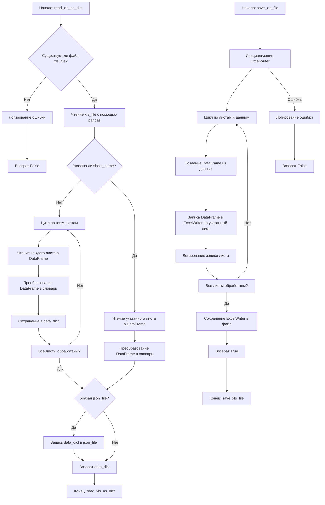
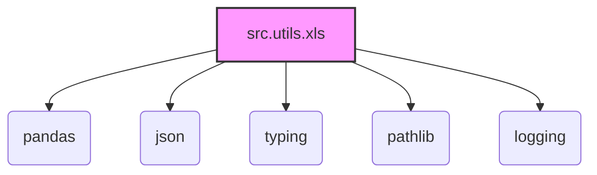

### **Системные инструкции для обработки кода проекта `hypotez`**

=========================================================================================

Описание функциональности и правил для генерации, анализа и улучшения кода. Направлено на обеспечение последовательного и читаемого стиля кодирования, соответствующего требованиям.

---

### **Основные принципы**

#### **1. Общие указания**:
- Соблюдай четкий и понятный стиль кодирования.
- Все изменения должны быть обоснованы и соответствовать установленным требованиям.

#### **2. Комментарии**:
- Используй `#` для внутренних комментариев.
- Документация всех функций, методов и классов должна следовать такому формату: 
    ```python
        def function(param: str, param1: Optional[str | dict | str] = None) -> dict | None:
            """ 
            Args:
                param (str): Описание параметра `param`.
                param1 (Optional[str | dict | str], optional): Описание параметра `param1`. По умолчанию `None`.
    
            Returns:
                dict | None: Описание возващаемого значения. Возвращает словарь или `None`.
    
            Raises:
                SomeError: Описание ситуации, в которой возникает исключение `SomeError`.

            Ехаmple:
                >>> function('param', 'param1')
                {'param': 'param1'}
            """
    ```
- Комментарии и документация должны быть четкими, лаконичными и точными.

#### **3. Форматирование кода**:
- Используй одинарные кавычки. `a:str = 'value'`, `print('Hello World!')`;
- Добавляй пробелы вокруг операторов. Например, `x = 5`;
- Все параметры должны быть аннотированы типами. `def function(param: str, param1: Optional[str | dict | str] = None) -> dict | None:`;
- Не используй `Union`. Вместо этого используй `|`.

#### **4. Логирование**:
- Для логгирования Всегда Используй модуль `logger` из `src.logger.logger`.
- Ошибки должны логироваться с использованием `logger.error`.
Пример:
    ```python
        try:
            ...
        except Exception as ex:
            logger.error('Error while processing data', ех, exc_info=True)
    ```
#### **5 Не используй `Union[]` в коде. Вместо него используй `|`
Например:
```python
x: str | int ...
```


---

### **Основные требования**:

#### **1. Формат ответов в Markdown**:
- Все ответы должны быть выполнены в формате **Markdown**.

#### **2. Формат комментариев**:
- Используй указанный стиль для комментариев и документации в коде.
- Пример:

```python
from typing import Generator, Optional, List
from pathlib import Path


def read_text_file(
    file_path: str | Path,
    as_list: bool = False,
    extensions: Optional[List[str]] = None,
    chunk_size: int = 8192,
) -> Generator[str, None, None] | str | None:
    """
    Считывает содержимое файла (или файлов из каталога) с использованием генератора для экономии памяти.

    Args:
        file_path (str | Path): Путь к файлу или каталогу.
        as_list (bool): Если `True`, возвращает генератор строк.
        extensions (Optional[List[str]]): Список расширений файлов для чтения из каталога.
        chunk_size (int): Размер чанков для чтения файла в байтах.

    Returns:
        Generator[str, None, None] | str | None: Генератор строк, объединенная строка или `None` в случае ошибки.

    Raises:
        Exception: Если возникает ошибка при чтении файла.

    Example:
        >>> from pathlib import Path
        >>> file_path = Path('example.txt')
        >>> content = read_text_file(file_path)
        >>> if content:
        ...    print(f'File content: {content[:100]}...')
        File content: Example text...
    """
    ...
```
- Всегда делай подробные объяснения в комментариях. Избегай расплывчатых терминов, 
- таких как *«получить»* или *«делать»*. Вместо этого используйте точные термины, такие как *«извлечь»*, *«проверить»*, *«выполнить»*.
- Вместо: *«получаем»*, *«возвращаем»*, *«преобразовываем»* используй имя объекта *«функция получае»*, *«переменная возвращает»*, *«код преобразовывает»* 
- Комментарии должны непосредственно предшествовать описываемому блоку кода и объяснять его назначение.

#### **3. Пробелы вокруг операторов присваивания**:
- Всегда добавляйте пробелы вокруг оператора `=`, чтобы повысить читаемость.
- Примеры:
  - **Неправильно**: `x=5`
  - **Правильно**: `x = 5`

#### **4. Использование `j_loads` или `j_loads_ns`**:
- Для чтения JSON или конфигурационных файлов замените стандартное использование `open` и `json.load` на `j_loads` или `j_loads_ns`.
- Пример:

```python
# Неправильно:
with open('config.json', 'r', encoding='utf-8') as f:
    data = json.load(f)

# Правильно:
data = j_loads('config.json')
```

#### **5. Сохранение комментариев**:
- Все существующие комментарии, начинающиеся с `#`, должны быть сохранены без изменений в разделе «Улучшенный код».
- Если комментарий кажется устаревшим или неясным, не изменяйте его. Вместо этого отметьте его в разделе «Изменения».

#### **6. Обработка `...` в коде**:
- Оставляйте `...` как указатели в коде без изменений.
- Не документируйте строки с `...`.
```

#### **7. Аннотации**
Для всех переменных должны быть определены аннотации типа. 
Для всех функций все входные и выходные параметры аннотириваны
Для все параметров должны быть аннотации типа.


### **8. webdriver**
В коде используется webdriver. Он импртируется из модуля `webdriver` проекта `hypotez`
```python
from src.webdirver import Driver, Chrome, Firefox, Playwright, ...
driver = Driver(Firefox)

Пoсле чего может использоваться как

close_banner = {
  "attribute": null,
  "by": "XPATH",
  "selector": "//button[@id = 'closeXButton']",
  "if_list": "first",
  "use_mouse": false,
  "mandatory": false,
  "timeout": 0,
  "timeout_for_event": "presence_of_element_located",
  "event": "click()",
  "locator_description": "Закрываю pop-up окно, если оно не появилось - не страшно (`mandatory`:`false`)"
}

result = driver.execute_locator(close_banner)
```

## Анализ кода `hypotez/src/utils/xls.py`

### 1. Блок-схема



### 2. Диаграмма



**Объяснение зависимостей:**

-   **pandas**: Используется для чтения и записи данных из/в Excel файлы. Предоставляет структуру DataFrame для удобной работы с табличными данными.
-   **json**: Используется для записи данных в файл JSON в функции `read_xls_as_dict`.
-   **typing**: Используется для аннотации типов, что улучшает читаемость и помогает предотвратить ошибки.
-   **pathlib**: Используется для работы с путями к файлам, обеспечивает кросс-платформенность и удобство.
-   **logging**: Используется для логирования ошибок и информационных сообщений.

### 3. Объяснение

#### Импорты:

*   `pandas`: Библиотека для анализа и обработки данных. Используется для чтения Excel файлов (`pd.ExcelFile`, `pd.read_excel`) и записи в Excel файлы (`pd.DataFrame`, `pd.ExcelWriter`).
*   `json`: Модуль для работы с JSON-данными. Используется для сохранения данных в JSON файл в функции `read_xls_as_dict`.
*   `typing`: Модуль для аннотации типов. Используется для указания типов аргументов и возвращаемых значений функций, что улучшает читаемость и помогает предотвратить ошибки.
*   `pathlib`: Модуль для работы с путями к файлам. Используется для проверки существования файла Excel.
*   `logging`: Модуль для логирования сообщений. Используется для записи ошибок и информационных сообщений.

#### Функции:

*   **`read_xls_as_dict(xls_file: str, json_file: str = None, sheet_name: Union[str, int] = None) -> Union[Dict, List[Dict], bool]`**:
    *   Аргументы:
        *   `xls_file` (str): Путь к Excel файлу.
        *   `json_file` (str, optional): Путь для сохранения JSON файла. Если не указан, JSON файл не создается.
        *   `sheet_name` (str | int, optional): Имя или индекс листа для чтения. Если не указан, читаются все листы.
    *   Возвращаемое значение:
        *   `Dict` | `List[Dict]` | `bool`: Словарь, содержащий данные из Excel файла, список словарей (если указан `sheet_name`), или `False` в случае ошибки.
    *   Назначение:
        Функция читает Excel файл, преобразует его в JSON формат и, если указан `json_file`, сохраняет в файл.  Поддерживает чтение как всех листов, так и конкретного листа. Обрабатывает ошибки, такие как отсутствие файла или ошибки при обработке листов, и логирует их.
    *   Пример:

        ```python
        data = read_xls_as_dict('input.xlsx', 'output.json', 'Sheet1')
        if data:
            print(data)
        ```
*   **`save_xls_file(data: Dict[str, List[Dict]], file_path: str) -> bool`**:
    *   Аргументы:
        *   `data` (Dict[str, List[Dict]]): Словарь, где ключи - имена листов, а значения - списки словарей, представляющие строки.
        *   `file_path` (str): Путь для сохранения Excel файла.
    *   Возвращаемое значение:
        *   `bool`: `True` в случае успешной записи, `False` в случае ошибки.
    *   Назначение:
        Функция сохраняет JSON данные в Excel файл.  Данные должны быть представлены в виде словаря, где ключи являются именами листов, а значения - списками словарей, представляющих строки.  Функция использует `pandas.ExcelWriter` для записи данных в Excel файл и обрабатывает возможные ошибки.
    *   Пример:

        ```python
        data_to_save = {'Sheet1': [{'column1': 'value1', 'column2': 'value2'}]}
        success = save_xls_file(data_to_save, 'output.xlsx')
        if success:
            print("Successfully saved to output.xlsx")
        ```

#### Переменные:

*   `xls_file_path` (Path): Объект `Path` из модуля `pathlib`, представляющий путь к Excel файлу.
*   `xls` (pd.ExcelFile): Объект `ExcelFile` из библиотеки `pandas`, представляющий Excel файл.
*   `data_dict` (Dict | List[Dict]): Словарь, содержащий данные, прочитанные из Excel файла.
*   `df` (pd.DataFrame): Объект `DataFrame` из библиотеки `pandas`, представляющий лист Excel.
*   `writer` (pd.ExcelWriter): Объект `ExcelWriter` из библиотеки `pandas`, используемый для записи данных в Excel файл.
*   `sheet_name` (str): имя листа
*   `rows` (List[Dict]): массив строк для записи в лист

#### Потенциальные ошибки и области для улучшения:

*   **Обработка исключений**:  В функциях `read_xls_as_dict` и `save_xls_file` используются общие блоки `except Exception as e`.  Было бы полезно конкретизировать типы исключений для более точной обработки (например, `IOError`, `ValueError`).
*   **Логирование**: Используется стандартный модуль `logging`, а не `logger` из `src.logger.logger`. Необходимо заменить.
*   **Типы данных**:  Использование `Union[str, int]` для `sheet_name` может быть не совсем корректным, так как pandas может ожидать разные типы в зависимости от реализации.

#### Взаимосвязи с другими частями проекта:

Этот модуль предоставляет утилиты для работы с Excel файлами, которые могут использоваться в других частях проекта, где требуется импорт или экспорт данных в формате Excel. Например, для импорта данных конфигурации или экспорта результатов анализа.