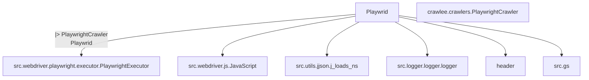
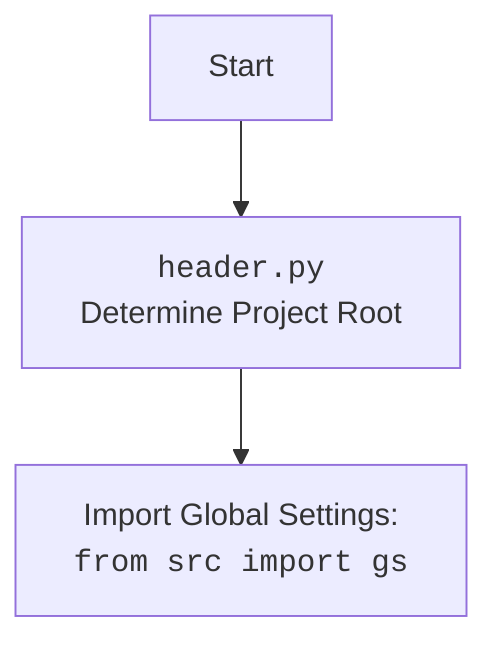

### **Системные инструкции для обработки кода проекта `hypotez`**

=========================================================================================

Описание функциональности и правил для генерации, анализа и улучшения кода. Направлено на обеспечение последовательного и читаемого стиля кодирования, соответствующего требованиям.

---

### **Основные принципы**

#### **1. Общие указания**:
- Соблюдай четкий и понятный стиль кодирования.
- Все изменения должны быть обоснованы и соответствовать установленным требованиям.

#### **2. Комментарии**:
- Используй `#` для внутренних комментариев.
- Документация всех функций, методов и классов должна следовать такому формату: 
    ```python
        def function(param: str, param1: Optional[str | dict | str] = None) -> dict | None:
            """ 
            Args:
                param (str): Описание параметра `param`.
                param1 (Optional[str | dict | str], optional): Описание параметра `param1`. По умолчанию `None`.
    
            Returns:
                dict | None: Описание возвращаемого значения. Возвращает словарь или `None`.
    
            Raises:
                SomeError: Описание ситуации, в которой возникает исключение `SomeError`.

            Ехаmple:
                >>> function('param', 'param1')
                {'param': 'param1'}
            """
    ```
- Комментарии и документация должны быть четкими, лаконичными и точными.

#### **3. Форматирование кода**:
- Используй одинарные кавычки. `a:str = 'value'`, `print('Hello World!')`;
- Добавляй пробелы вокруг операторов. Например, `x = 5`;
- Все параметры должны быть аннотированы типами. `def function(param: str, param1: Optional[str | dict | str] = None) -> dict | None:`;
- Не используй `Union`. Вместо этого используй `|`.

#### **4. Логирование**:
- Для логгирования Всегда Используй модуль `logger` из `src.logger.logger`.
- Ошибки должны логироваться с использованием `logger.error`.
Пример:
    ```python
        try:
            ...
        except Exception as ex:
            logger.error('Error while processing data', ех, exc_info=True)
    ```
#### **5 Не используй `Union[]` в коде. Вместо него используй `|`
Например:
```python
x: str | int ...
```


---

### **Основные требования**:

#### **1. Формат ответов в Markdown**:
- Все ответы должны быть выполнены в формате **Markdown**.

#### **2. Формат комментариев**:
- Используй указанный стиль для комментариев и документации в коде.
- Пример:

```python
from typing import Generator, Optional, List
from pathlib import Path


def read_text_file(
    file_path: str | Path,
    as_list: bool = False,
    extensions: Optional[List[str]] = None,
    chunk_size: int = 8192,
) -> Generator[str, None, None] | str | None:
    """
    Считывает содержимое файла (или файлов из каталога) с использованием генератора для экономии памяти.

    Args:
        file_path (str | Path): Путь к файлу или каталогу.
        as_list (bool): Если `True`, возвращает генератор строк.
        extensions (Optional[List[str]]): Список расширений файлов для чтения из каталога.
        chunk_size (int): Размер чанков для чтения файла в байтах.

    Returns:
        Generator[str, None, None] | str | None: Генератор строк, объединенная строка или `None` в случае ошибки.

    Raises:
        Exception: Если возникает ошибка при чтении файла.

    Example:
        >>> from pathlib import Path
        >>> file_path = Path('example.txt')
        >>> content = read_text_file(file_path)
        >>> if content:
        ...    print(f'File content: {content[:100]}...')
        File content: Example text...
    """
    ...
```
- Всегда делай подробные объяснения в комментариях. Избегай расплывчатых терминов, 
- таких как *«получить»* или *«делать»*. Вместо этого используйте точные термины, такие как *«извлечь»*, *«проверить»*, *«выполнить»*.
- Вместо: *«получаем»*, *«возвращаем»*, *«преобразовываем»* используй имя объекта *«функция получае»*, *«переменная возвращает»*, *«код преобразовывает»* 
- Комментарии должны непосредственно предшествовать описываемому блоку кода и объяснять его назначение.

#### **3. Пробелы вокруг операторов присваивания**:
- Всегда добавляйте пробелы вокруг оператора `=`, чтобы повысить читаемость.
- Примеры:
  - **Неправильно**: `x=5`
  - **Правильно**: `x = 5`

#### **4. Использование `j_loads` или `j_loads_ns`**:
- Для чтения JSON или конфигурационных файлов замените стандартное использование `open` и `json.load` на `j_loads` или `j_loads_ns`.
- Пример:

```python
# Неправильно:
with open('config.json', 'r', encoding='utf-8') as f:
    data = json.load(f)

# Правильно:
data = j_loads('config.json')
```

#### **5. Сохранение комментариев**:
- Все существующие комментарии, начинающиеся с `#`, должны быть сохранены без изменений в разделе «Улучшенный код».
- Если комментарий кажется устаревшим или неясным, не изменяйте его. Вместо этого отметьте его в разделе «Изменения».

#### **6. Обработка `...` в коде**:
- Оставляйте `...` как указатели в коде без изменений.
- Не документируйте строки с `...`.
```

#### **7. Аннотации**
Для всех переменных должны быть определены аннотации типа. 
Для всех функций все входные и выходные параметры аннотириваны
Для все параметров должны быть аннотации типа.


### **8. webdriver**
В коде используется webdriver. Он импртируется из модуля `webdriver` проекта `hypotez`
```python
from src.webdirver import Driver, Chrome, Firefox, Playwright, ...
driver = Driver(Firefox)

Пoсле чего может использоваться как

close_banner = {
  "attribute": null,
  "by": "XPATH",
  "selector": "//button[@id = 'closeXButton']",
  "if_list": "first",
  "use_mouse": false,
  "mandatory": false,
  "timeout": 0,
  "timeout_for_event": "presence_of_element_located",
  "event": "click()",
  "locator_description": "Закрываю pop-up окно, если оно не появилось - не страшно (`mandatory`:`false`)"
}

result = driver.execute_locator(close_banner)
```

## Анализ кода `hypotez/src/webdriver/playwright/playwrid.py`

### 1. Блок-схема

```mermaid
graph LR
    A[Начало] --> B{Инициализация Playwrid};
    B --> C{_set_launch_options()};
    C --> D{Определение параметров запуска браузера};
    D --> E{user_agent?}
    E -- Да --> F{Добавление user-agent};
    E -- Нет --> G{options?};
    G -- Да --> H{Объединение опций};
    G -- Нет --> I{Создание launch_options};
    F --> I;
    H --> I;
    I --> J{super().__init__()};
    J --> K{Запуск PlaywrightCrawler};
    K --> L{Если есть set_launch_options?};
    L -- Да --> M{Вызов set_launch_options()};
    L -- Нет --> N{Обработка launch_options};
    M --> O{start(url)};
    N --> O;
    O --> P{logger.info(f"Starting Playwright Crawler for {url}")};
    P --> Q{await self.executor.start()};
    Q --> R{await self.executor.goto(url)};
    R --> S{super().run(url)};
    S --> T{self.context = self.crawling_context};
    T --> U[Конец];
    O --> X{Exception as ex};
    X --> Y{logger.critical(\'Playwrid Crawler failed with an error:\', ex)};
    Y --> U;
```

**Примеры для блоков:**

*   **A (Начало)**: Начало выполнения кода.
*   **B (Инициализация Playwrid)**: Создание экземпляра класса `Playwrid`.
    *   Пример: `browser = Playwrid(options=["--headless"])`
*   **C (\_set\_launch\_options())**: Вызов метода для настройки параметров запуска браузера.
*   **D (Определение параметров запуска браузера)**: Определение значений для headless режима и опций.
*   **E (user\_agent?)**: Проверка, передан ли `user_agent`.
    *   Пример: `user_agent="custom_user_agent"`
*   **F (Добавление user-agent)**: Добавление пользовательского user-agent в launch\_options.
*   **G (options?)**: Проверка, переданы ли дополнительные опции.
    *   Пример: `options=["--proxy-server=proxy"]`
*   **H (Объединение опций)**: Добавление дополнительных опций к стандартным.
*   **I (Создание launch\_options)**: Создание словаря с параметрами запуска.
*   **J (super().\_\_init\_\_())**: Вызов конструктора родительского класса `PlaywrightCrawler`.
*   **K (Запуск PlaywrightCrawler)**: Инициализация и запуск `PlaywrightCrawler`.
*   **L (Если есть set\_launch\_options?)**: Проверка, существует ли метод `set_launch_options` в классе.
*   **M (Вызов set\_launch\_options())**: Вызов метода для установки параметров запуска.
*   **N (Обработка launch\_options)**: Альтернативная обработка параметров запуска.
*   **O (start(url))**: Запуск краулера и переход по указанному URL.
    *   Пример: `await browser.start("https://www.example.com")`
*   **P (logger.info(f"Starting Playwright Crawler for {url}"))**: Логирование начала работы краулера.
*   **Q (await self.executor.start())**: Запуск исполнителя.
*   **R (await self.executor.goto(url))**: Переход по URL с использованием исполнителя.
*   **S (super().run(url))**: Запуск процесса краулинга.
*   **T (self.context = self.crawling\_context)**: Получение контекста краулинга.
*   **U (Конец)**: Завершение выполнения кода.
*   **X (Exception as ex)**: Обработка исключения.
*   **Y (logger.critical(\'Playwrid Crawler failed with an error:\', ex))**: Логирование критической ошибки.

### 2. Диаграмма зависимостей



**Объяснение зависимостей:**

*   `Playwrid --|> PlaywrightCrawler`: Класс `Playwrid` наследует класс `PlaywrightCrawler` из библиотеки `crawlee`. Это означает, что `Playwrid` является подклассом `PlaywrightCrawler` и наследует его функциональность.
*   `Playwrid --> PlaywrightExecutor`: Класс `Playwrid` использует класс `PlaywrightExecutor` для выполнения действий в браузере. Это зависимость композиции, где `Playwrid` содержит экземпляр `PlaywrightExecutor`.
*   `Playwrid --> JavaScript`: Класс `Playwrid` использует класс `JavaScript` для выполнения JavaScript-кода в браузере. Это также зависимость композиции.
*   `Playwrid --> j_loads_ns`: Класс `Playwrid` использует функцию `j_loads_ns` для загрузки конфигурации из JSON-файла. Это зависимость использования.
*   `Playwrid --> logger`: Класс `Playwrid` использует модуль `logger` для логирования информации, ошибок и предупреждений. Это зависимость использования.
*   `Playwrid --> header`: Класс `Playwrid` использует модуль `header` для определения корневой директории проекта.
*   `Playwrid --> gs`: Класс `Playwrid` использует глобальные настройки из `src.gs`.



### 3. Объяснение кода

#### Импорты:

*   `asyncio`: Используется для поддержки асинхронного программирования.
*   `pathlib.Path`: Используется для работы с путями к файлам и директориям.
*   `typing.Optional, Dict, Any, List`: Используются для аннотации типов.
*   `types.SimpleNamespace`: Используется для создания объектов с атрибутами, доступными через точку.
*   `crawlee.crawlers.PlaywrightCrawler, crawlee.crawlers.PlaywrightCrawlingContext`: Импортируются классы для организации процесса обхода веб-страниц с использованием Playwright.
*   `header`:  Предположительно, содержит информацию о заголовках и корневой директории проекта. `from header import __root__` указывает на импорт переменной `__root__`, которая, вероятно, определяет корневую директорию проекта. Это важно для определения путей к конфигурационным файлам и другим ресурсам.
*   `src.gs`: Импортирует глобальные настройки проекта.
*   `src.webdriver.playwright.executor.PlaywrightExecutor`: Класс, выполняющий действия в браузере Playwright.
*   `src.webdriver.js.JavaScript`: Класс для работы с JavaScript-кодом.
*   `src.utils.jjson.j_loads_ns`: Функция для загрузки JSON-файлов в виде `SimpleNamespace`.
*   `src.logger.logger.logger`: Используется для логирования событий и ошибок.

#### Класс `Playwrid`:

*   **Назначение**: Является подклассом `PlaywrightCrawler` и предоставляет дополнительную функциональность для работы с Playwright.
*   **Атрибуты**:
    *   `driver_name (str)`: Имя драйвера, по умолчанию `'playwrid'`.
    *   `base_path (Path)`: Путь к директории с ресурсами драйвера.
    *   `config (SimpleNamespace)`: Конфигурация драйвера, загруженная из `playwrid.json`.
    *   `context`: Контекст выполнения Playwright.
*   **Методы**:
    *   `__init__(self, user_agent: Optional[str] = None, options: Optional[List[str]] = None, *args, **kwargs) -> None`: Инициализирует класс, настраивает параметры запуска браузера и создает экземпляр `PlaywrightExecutor`.
        *   `user_agent`:  Позволяет установить User-Agent для браузера. Если не указан, используется значение по умолчанию.
        *   `options`: Список дополнительных опций для запуска Playwright.
        *   Вызывает `_set_launch_options` для конфигурации параметров запуска.
        *   Инициализирует `PlaywrightExecutor`.
        *   Вызывает конструктор родительского класса `PlaywrightCrawler`, передавая необходимые параметры.
    *   `_set_launch_options(self, user_agent: Optional[str] = None, options: Optional[List[str]] = None) -> Dict[str, Any]`: Конфигурирует параметры запуска Playwright.
        *   Принимает `user_agent` и `options` в качестве аргументов.
        *   Формирует словарь `launch_options` с параметрами, такими как `headless` и `args`.
        *   Возвращает словарь с параметрами запуска.
    *   `async start(self, url: str) -> None`: Запускает краулер и переходит по указанному URL.
        *   Логирует начало работы краулера.
        *   Запускает `PlaywrightExecutor`.
        *   Переходит по URL с использованием `PlaywrightExecutor`.
        *   Запускает процесс краулинга, вызывая `super().run(url)`.
        *   Сохраняет контекст краулинга в `self.context`.
        *   Обрабатывает исключения и логирует ошибки.
    *   `current_url(self) -> Optional[str]`: Возвращает текущий URL браузера.
    *   `get_page_content(self) -> Optional[str]`: Возвращает HTML-содержимое текущей страницы.
    *   `get_element_content(self, selector: str) -> Optional[str]`: Возвращает внутренний HTML-код элемента, найденного по CSS-селектору.
    *   `get_element_value_by_xpath(self, xpath: str) -> Optional[str]`: Возвращает текстовое значение элемента, найденного по XPath.
    *   `click_element(self, selector: str) -> None`: Кликает на элемент, найденный по CSS-селектору.
    *   `execute_locator(self, locator: dict | SimpleNamespace, message: Optional[str] = None, typing_speed: float = 0) -> str | List[str] | bytes | List[bytes] | bool`:  Выполняет локатор через `PlaywrightExecutor`.

#### Функции:

*   `_set_launch_options`:  Преобразует параметры запуска в формат, необходимый для Playwright. Это включает в себя установку режима "headless", добавление аргументов командной строки и установку User-Agent.
    *   **Аргументы**:
        *   `user_agent (Optional[str])`: User-Agent для браузера.
        *   `options (Optional[List[str]])`: Список опций командной строки для Playwright.
    *   **Возвращаемое значение**:
        *   `Dict[str, Any]`: Словарь с параметрами запуска для Playwright.
*   `start`: Инициализирует и запускает краулер Playwright.
    *   **Аргументы**:
        *   `url (str)`: URL для начала краулинга.
    *   **Возвращаемое значение**: `None`.
    *   **Пример**:
        ```python
        browser = Playwrid(options=["--headless"])
        await browser.start("https://www.example.com")
        ```
*   `get_page_content`:  Извлекает HTML-содержимое текущей страницы.
    *   **Возвращаемое значение**:
        *   `Optional[str]`: HTML-содержимое страницы или `None`, если не удалось получить.
*   `get_element_content`:  Извлекает внутренний HTML-код элемента, соответствующего заданному CSS-селектору.
    *   **Аргументы**:
        *   `selector (str)`: CSS-селектор элемента.
    *   **Возвращаемое значение**:
        *   `Optional[str]`: Внутренний HTML-код элемента или `None`, если элемент не найден или произошла ошибка.
*   `get_element_value_by_xpath`:  Извлекает текстовое значение элемента, соответствующего заданному XPath-выражению.
    *   **Аргументы**:
        *   `xpath (str)`: XPath-выражение для поиска элемента.
    *   **Возвращаемое значение**:
        *   `Optional[str]`: Текстовое значение элемента или `None`, если элемент не найден или произошла ошибка.
*   `click_element`:  Выполняет клик на элементе, соответствующем заданному CSS-селектору.
    *   **Аргументы**:
        *   `selector (str)`: CSS-селектор элемента.
*   `execute_locator`: выполняет действия, определенные в локаторе (CSS selector, XPATH и т.д.) с использованием `PlaywrightExecutor`

#### Переменные:

*   `driver_name (str)`: Имя драйвера, по умолчанию `'playwrid'`.
*   `base_path (Path)`: Путь к базовой директории, где хранятся файлы конфигурации и другие ресурсы, относящиеся к драйверу `playwrid`.  Он формируется на основе `__root__`, определенной в `header.py`.
*   `config (SimpleNamespace)`:  Конфигурация, загруженная из JSON-файла (`playwrid.json`).
*   `context`:  Контекст Playwright, который содержит информацию о текущей странице, браузере и другие параметры.

#### Потенциальные ошибки и области для улучшения:

1.  **Обработка исключений**: В методах `get_element_content`, `get_element_value_by_xpath` и `click_element` используется общая обработка исключений. Было бы полезно добавить более специфичные блоки `except` для разных типов исключений, чтобы точнее определять причины ошибок.
2.  **Конфигурация**:  Загрузка конфигурации с использованием `j_loads_ns` выглядит хорошо, но стоит убедиться, что структура файла `playwrid.json` четко определена и документирована.
3.  **Логирование**:  Логирование используется, но можно добавить больше деталей в сообщения, чтобы облегчить отладку.
4.  **Асинхронность**:  Убедиться, что все методы, которые могут быть асинхронными, действительно используют `await`.
5.  **Типизация**:  Проверить, что все переменные и возвращаемые значения аннотированы типами.
6.  **Обработка `launch_options`**:  Обработка `launch_options` в `__init__` выглядит немного сложной.  Стоит упростить этот процесс, если это возможно.
7.   **driver**: В коде используется webdriver. Он импртируется из модуля `webdriver` проекта `hypotez`

#### Взаимосвязи с другими частями проекта:

*   `header.py`: Определяет корневую директорию проекта, что важно для определения путей к файлам конфигурации.
*   `src.gs`:  Предоставляет доступ к глобальным настройкам проекта.
*   `src.webdriver.playwright.executor.PlaywrightExecutor`:  Отвечает за выполнение действий в браузере Playwright.
*   `src.webdriver.js.JavaScript`:  Позволяет выполнять JavaScript-код в браузере.
*   `src.utils.jjson.j_loads_ns`:  Облегчает загрузку конфигурации из JSON-файлов.
*   `src.logger.logger.logger`:  Предоставляет механизм логирования для записи информации о работе краулера.

В целом, код выглядит хорошо структурированным и документированным. Он предоставляет удобный интерфейс для работы с Playwright и позволяет легко настраивать параметры запуска браузера.