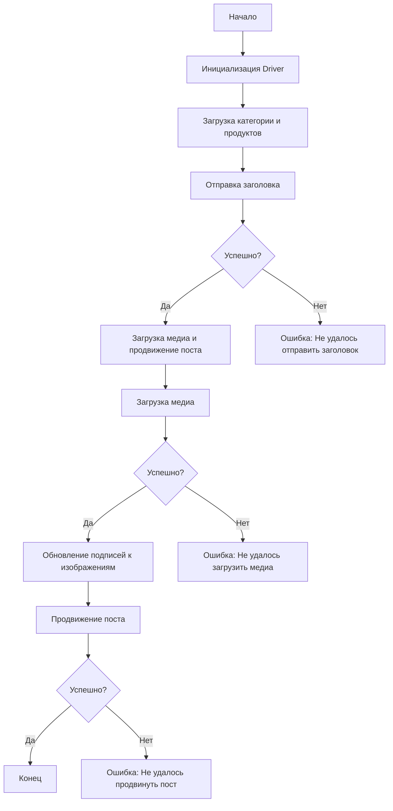

### Анализ кода модуля `src.endpoints.advertisement.facebook.post_message_async`

**Качество кода:**

- **Соответствие стандартам**: 7/10
- **Плюсы**:
    - Документация представлена в формате Markdown, что облегчает чтение и понимание структуры модуля.
    - Описаны основные функции и их параметры.
    - Приведена диаграмма структуры модуля.
- **Минусы**:
    - Отсутствует описание логики внутри функций, что затрудняет понимание их работы.
    - Не все функции содержат примеры использования.
    - Зависимости указаны, но не детализированы версии.
    - Отсутствуют аннотации типов.

**Рекомендации по улучшению:**

1.  **Добавить примеры использования для каждой функции**. Это поможет понять, как использовать функции на практике.
2.  **Добавить аннотации типов для параметров и возвращаемых значений функций**. Это улучшит читаемость кода и поможет избежать ошибок.
3.  **Перевести все комментарии и docstring на русский язык**. Это необходимо для соответствия требованиям.
4.  **В блоках обработки исключений использовать `ex` вместо `e`**.
5.  **Логировать ошибки с использованием `logger` из модуля `src.logger`**.
6.  **Более подробно описать логику работы функций**.
7.  **Указать версии зависимостей**.
8.  **Соблюдать PEP8**.

**Оптимизированный код:**

```markdown
```rst
... module:: src.endpoints.advertisement.facebook.post_message_async
```
[English]()

## Сценарий асинхронной публикации сообщения на Facebook

### Обзор

Этот скрипт является частью директории `hypotez/src/endpoints/advertisement/facebook/scenarios` и предназначен для автоматизации процесса публикации сообщений на Facebook. Скрипт взаимодействует со страницей Facebook, используя локаторы для выполнения различных действий, таких как отправка сообщений, загрузка медиафайлов и обновление подписей.

### Основные возможности

1. **Отправка заголовка и описания**: Отправляет заголовок и описание кампании в поле сообщения на Facebook.
2. **Загрузка медиафайлов**: Загружает медиафайлы (изображения и видео) на пост Facebook и обновляет их подписи.
3. **Продвижение поста**: Управляет всем процессом продвижения поста с заголовком, описанием и медиафайлами.

### Структура модуля



### Легенда

1. **Start**: Начало выполнения скрипта.
2. **InitDriver**: Создание экземпляра класса `Driver`.
3. **LoadCategoryAndProducts**: Загрузка данных категории и продуктов.
4. **SendTitle**: Вызов функции `post_title` для отправки заголовка.
5. **CheckTitleSuccess**: Проверка успешности отправки заголовка.
   - **Да**: Переход к загрузке медиа и продвижению поста.
   - **Нет**: Вывод ошибки "Не удалось отправить заголовок".
6. **UploadMediaAndPromotePost**: Вызов функции `promote_post`.
7. **UploadMedia**: Вызов функции `upload_media` для загрузки медиафайлов.
8. **CheckMediaSuccess**: Проверка успешности загрузки медиа.
   - **Да**: Переход к обновлению подписей к изображениям.
   - **Нет**: Вывод ошибки "Не удалось загрузить медиа".
9. **UpdateCaptions**: Вызов функции `update_images_captions` для обновления подписей.
10. **PromotePost**: Завершение процесса продвижения поста.
11. **CheckPromoteSuccess**: Проверка успешности продвижения поста.
    - **Да**: Конец выполнения скрипта.
    - **Нет**: Вывод ошибки "Не удалось продвинуть пост".
-----------------------

#### Функции

- **`post_title(d: Driver, category: SimpleNamespace) -> bool`**:
    ```python
    def post_title(d: Driver, category: SimpleNamespace) -> bool:
        """
        Отправляет заголовок и описание кампании в поле сообщения на Facebook.

        Args:
            d (Driver): Экземпляр `Driver` для взаимодействия с веб-страницей.
            category (SimpleNamespace): Категория, содержащая заголовок и описание для отправки.

        Returns:
            bool: `True`, если заголовок и описание были успешно отправлены, иначе `False`.

        Example:
            >>> from src.webdriver import Driver
            >>> from types import SimpleNamespace
            >>> # Предположим, что driver - это инициализированный экземпляр Driver
            >>> # driver = Driver(Chrome)
            >>> category = SimpleNamespace(title='Заголовок', description='Описание')
            >>> result = post_title(driver, category)
            >>> print(result)
            True
        """
        ...
    ```

- **`upload_media(d: Driver, products: List[SimpleNamespace], no_video: bool = False) -> bool`**:
    ```python
    def upload_media(d: Driver, products: List[SimpleNamespace], no_video: bool = False) -> bool:
        """
        Загружает медиафайлы на пост Facebook.

        Args:
            d (Driver): Экземпляр `Driver` для взаимодействия с веб-страницей.
            products (List[SimpleNamespace]): Список продуктов, содержащих пути к медиафайлам.
            no_video (bool, optional): Флаг, указывающий, следует ли пропустить загрузку видео. По умолчанию `False`.

        Returns:
            bool: `True`, если медиафайлы были успешно загружены, иначе `False`.

        Example:
            >>> from src.webdriver import Driver
            >>> from types import SimpleNamespace
            >>> # Предположим, что driver - это инициализированный экземпляр Driver
            >>> # driver = Driver(Chrome)
            >>> products = [SimpleNamespace(local_image_path='путь/к/изображению.jpg')]
            >>> result = upload_media(driver, products)
            >>> print(result)
            True
        """
        ...
    ```

- **`update_images_captions(d: Driver, products: List[SimpleNamespace], textarea_list: List[WebElement]) -> None`**:
    ```python
    def update_images_captions(d: Driver, products: List[SimpleNamespace], textarea_list: List[WebElement]) -> None:
        """
        Асинхронно добавляет описания к загруженным медиафайлам.

        Args:
            d (Driver): Экземпляр `Driver` для взаимодействия с веб-страницей.
            products (List[SimpleNamespace]): Список продуктов с деталями для обновления.
            textarea_list (List[WebElement]): Список текстовых полей, куда добавляются подписи.

        Example:
            >>> from src.webdriver import Driver
            >>> from types import SimpleNamespace
            >>> from selenium.webdriver.remote.webelement import WebElement
            >>> # Предположим, что driver - это инициализированный экземпляр Driver
            >>> # driver = Driver(Chrome)
            >>> products = [SimpleNamespace(image_description='Описание изображения')]
            >>> textarea_list = [WebElement(None, 'some_id')]  #  Пример списка WebElement
            >>> update_images_captions(driver, products, textarea_list)
        """
        ...
    ```

- **`promote_post(d: Driver, category: SimpleNamespace, products: List[SimpleNamespace], no_video: bool = False) -> bool`**:
    ```python
    def promote_post(d: Driver, category: SimpleNamespace, products: List[SimpleNamespace], no_video: bool = False) -> bool:
        """
        Управляет процессом продвижения поста с заголовком, описанием и медиафайлами.

        Args:
            d (Driver): Экземпляр `Driver` для взаимодействия с веб-страницей.
            category (SimpleNamespace): Детали категории, используемые для заголовка и описания поста.
            products (List[SimpleNamespace]): Список продуктов, содержащих медиа и детали для публикации.
            no_video (bool, optional): Флаг, указывающий, следует ли пропустить загрузку видео. По умолчанию `False`.

        Returns:
            bool: `True`, если пост был успешно продвинут, иначе `False`.

        Example:
            >>> from src.webdriver import Driver
            >>> from types import SimpleNamespace
            >>> # Предположим, что driver - это инициализированный экземпляр Driver
            >>> # driver = Driver(Chrome)
            >>> category = SimpleNamespace(title='Заголовок', description='Описание')
            >>> products = [SimpleNamespace(local_image_path='путь/к/изображению.jpg')]
            >>> result = promote_post(driver, category, products)
            >>> print(result)
            True
        """
        ...
    ```

### Использование

Для использования этого скрипта выполните следующие шаги:

1. **Инициализация Driver**: Создайте экземпляр класса `Driver`.
2. **Загрузка локаторов**: Загрузите локаторы из JSON-файла.
3. **Вызов функций**: Используйте предоставленные функции для отправки заголовка, загрузки медиа и продвижения поста.

#### Пример

```python
from src.webdriver import Driver
from types import SimpleNamespace

# Инициализация Driver
driver = Driver(...)

# Загрузка категории и продуктов
category = SimpleNamespace(title='Заголовок кампании', description='Описание кампании')
products = [SimpleNamespace(local_image_path='путь/к/изображению.jpg', ...)]

# Отправка заголовка
post_title(driver, category)

# Загрузка медиа и продвижение поста
await promote_post(driver, category, products)
```

### Зависимости

- `selenium`: Для веб-автоматизации.
- `asyncio`: Для асинхронных операций.
- `pathlib`: Для обработки путей к файлам.
- `types`: Для создания простых пространств имен.
- `typing`: Для аннотаций типов.

### Обработка ошибок

Скрипт включает надежную обработку ошибок, чтобы обеспечить продолжение выполнения даже в случае, если некоторые элементы не найдены или если возникли проблемы с веб-страницей. Это особенно полезно для обработки динамических или нестабильных веб-страниц.

### Вклад

Вклад в этот скрипт приветствуется. Пожалуйста, убедитесь, что любые изменения хорошо документированы и включают соответствующие тесты.

### Лицензия

Этот скрипт лицензирован под MIT License. Подробности смотрите в файле `LICENSE`.
```