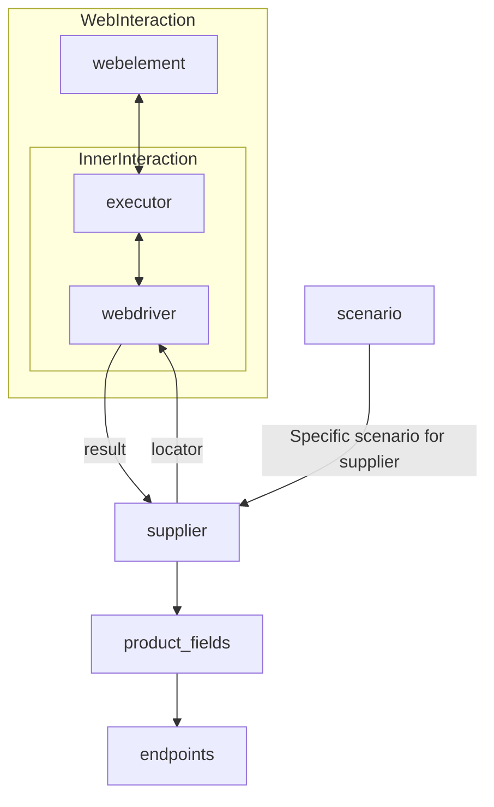

### **Анализ кода модуля `readme.md`**

---

**Качество кода:**

- **Соответствие стандартам**: 7/10
- **Плюсы**:
    - Документ содержит описание класса `Supplier` и его роли в проекте.
    - Приведен список реализованных поставщиков с указанием используемых технологий (webdriver, api).
    - Наличие ссылок на другие модули (`prefixes.md`, `../webdriver`, `../scenarios`).
    - Документ содержит диаграмму, демонстрирующую взаимодействие компонентов.

- **Минусы**:
    - Отсутствует подробное описание атрибутов и методов класса `Supplier`.
    - Нет примеров использования класса `Supplier`.
    - Описание поставщиков не унифицировано, отсутствует единый шаблон для каждого поставщика.
    - Некоторые ссылки могут быть нерабочими или вести на устаревшие версии документации.

**Рекомендации по улучшению:**

1.  **Добавить подробное описание класса `Supplier`**:
    - Описать атрибуты класса.
    - Описать методы класса и их назначение.
    - Привести примеры использования класса `Supplier`.

2.  **Унифицировать описание поставщиков**:
    - Создать единый шаблон для описания каждого поставщика.
    - В шаблоне указать:
        - Название поставщика.
        - Краткое описание поставщика.
        - Используемые технологии (webdriver, api).
        - Ссылку на документацию поставщика.
        - Ответственных за поддержку поставщика.

3.  **Проверить и обновить ссылки**:
    - Убедиться, что все ссылки в документе рабочие и ведут на актуальную информацию.
    - Обновить ссылки на документацию по webdriver и scenarios.

4. **Перевести на русский язык**:
    - Перевести на русский язык описание класса `Supplier` и список реализованных поставщиков.

**Оптимизированный код:**

```markdown
## Анализ кода модуля `readme.md`

---

**Анализ кода модуля `readme.md`**

=================================================

Файл `readme.md` предоставляет общее описание класса `Supplier`, являющегося базовым для всех поставщиков данных в проекте `hypotez`. Он также содержит список реализованных поставщиков и информацию о взаимодействии с другими модулями.

Пример использования
----------------------



# **Класс** `Supplier`

### **Базовый класс для всех поставщиков**

В контексте данного кода, `Supplier` представляет собой поставщика информации. Поставщик может быть производителем товаров, данных или информации. Источники поставщика включают целевую страницу веб-сайта, документ, базу данных или таблицу. Этот класс объединяет различных поставщиков под единым стандартизированным набором операций. Каждый поставщик имеет уникальный префикс. ([Подробнее о префиксах](prefixes.md))

Класс `Supplier` служит основой для управления взаимодействием с поставщиками. Он обрабатывает инициализацию, конфигурацию, аутентификацию и выполнение рабочих процессов для различных источников данных, таких как `amazon.com`, `walmart.com`, `mouser.com` и `digikey.com`. Клиенты также могут определять дополнительных поставщиков.

---

## Список реализованных поставщиков:

[aliexpress](aliexpress) - Реализован с двумя рабочими процессами: `webdriver` и `api`

[amazon](amazon) - `webdriver`

[bangood](bangood) - `webdriver`

[cdata](cdata) - `webdriver`

[chat_gpt](chat_gpt) - Взаимодействует с интерфейсом ChatGPT (НЕ С МОДЕЛЬЮ!)

[ebay](ebay) - `webdriver`

[etzmaleh](etzmaleh) - `webdriver`

[gearbest](gearbest) - `webdriver`

[grandadvance](grandadvance) - `webdriver`

[hb](hb) - `webdriver`

[ivory](ivory) - `webdriver`

[ksp](ksp) - `webdriver`

[kualastyle](kualastyle) `webdriver`

[morlevi](morlevi) `webdriver`

[visualdg](visualdg) `webdriver`

[wallashop](wallashop) `webdriver`

[wallmart](wallmart) `webdriver`

[Подробнее о WebDriver :class: `Driver`](../webdriver)
[Подробнее о рабочих процессах :class: `Scenario`](../scenarios)

---
