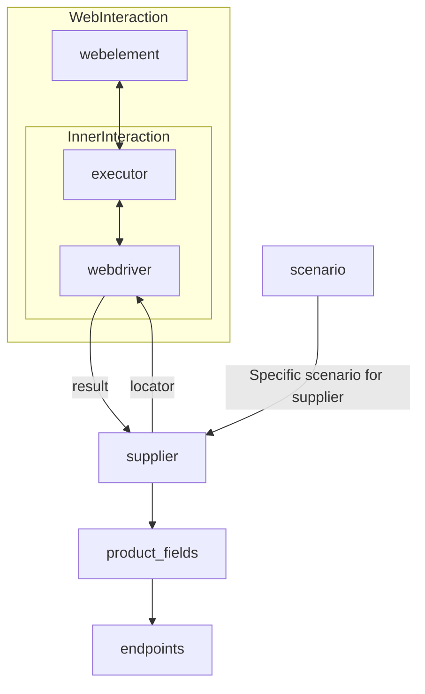

### **Анализ кода модуля `readme.ru.md`**

#### **Качество кода**:
- **Соответствие стандартам**: 7/10
- **Плюсы**:
  - Документ предоставляет обзор класса `Supplier` и его роли в проекте.
  - Содержит список реализованных поставщиков с ссылками на соответствующие файлы.
  - Присутствует описание взаимодействия между различными компонентами системы.
- **Минусы**:
  - Отсутствуют docstring в начале файла.
  - Нет четкого описания структуры и назначения данного `readme.ru.md` файла.
  - Некоторые ссылки ведут на несуществующие файлы.
  - Ссылки на файлы должны быть относительными.
  - Нет информации об авторе и дате последнего изменения файла.

#### **Рекомендации по улучшению**:
- Добавить заголовок и краткое описание содержимого в начале файла.
- Актуализировать ссылки на существующие файлы в проекте.
- Описать назначение данного `readme.ru.md` файла.
- Указывать относительные ссылки.
- Добавить информацию об авторе и дате последнего изменения файла.

#### **Оптимизированный код**:
```markdown
### **Модуль `readme.ru.md` для поставщиков**
=================================================

Этот файл содержит описание класса `Supplier`, который является базовым классом для всех поставщиков в проекте.
Он предоставляет информацию о роли поставщиков, реализованных поставщиках и взаимодействии между различными компонентами системы.

Подробное описание класса `Supplier`
------------------------------------

В контексте кода `Supplier` - это поставщик информации. Поставщиком может быть производитель какого-либо товара, данных или информации.
Источники поставщика - целевая страница сайта, документ, база данных, таблица.
Класс сводит разных поставщиков к одинаковому алгоритму действий внутри класса.
У каждого поставщика есть свой уникальный префикс. ([подробно о префиксах](prefixes.md))

Класс `Supplier` служит основой для управления взаимодействиями с поставщиками.
Он выполняет инициализацию, настройку, аутентификацию и запуск сценариев для различных источников данных, таких как `amazon.com`, `walmart.com`, `mouser.com` и `digikey.com`. Клиент может определить дополнительные поставщики.

### Список реализованных поставщиков:

[aliexpress](aliexpress/README.RU.MD)  - Реализован в двух вариантах сценариев: `webriver` и `api`

[amazon](amazon/README.RU.MD) - `webdriver`

[bangood](bangood/README.RU.MD)  - `webdriver`

[cdata](cdata/README.RU.MD)  - `webdriver`

[chat_gpt](chat_gpt/README.RU.MD)  - Работа с чатом chatgpt (НЕ С МОДЕЛЬЮ!)

[ebay](ebay/README.RU.MD)  - `webdriver`

[etzmaleh](etzmaleh/README.RU.MD)  - `webdriver`

[gearbest](gearbest/README.RU.MD)  - `webdriver`

[grandadvance](grandadvance/README.RU.MD)  - `webdriver`

[hb](hb/README.RU.MD)  - `webdriver`

[ivory](ivory/README.RU.MD) - `webdriver`

[ksp](ksp/README.RU.MD) - `webdriver`

[kualastyle](kualastyle/README.RU.MD) `webdriver`

[morlevi](morlevi/README.RU.MD) `webdriver`

[visualdg](visualdg/README.RU.MD) `webdriver`

[wallashop](wallashop/README.RU.MD) `webdriver`

[wallmart](wallmart/README.RU.MD) `webdriver`

[подробно о вебдрайвере class `Driver`](https://github.com/hypo69/hypotez/blob/master/docs/ru/src/webdriver/driver.py.md)

[подробно о сценариях class `Scenario`](https://github.com/hypo69/hypotez/blob/master/docs/ru/src/scenario/executor.py.md)

[подробно о локаторах](https://github.com/hypo69/hypotez/blob/master/docs/ru/src/suppliers/locator.ru.md)

