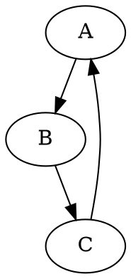

### **Анализ кода модуля `dot`**

## Качество кода:
- **Соответствие стандартам**: 7/10
- **Плюсы**:
  - Четкая структура кода, легко читаемый.
  - Обработка исключений `FileNotFoundError` и `Exception`.
  - Наличие примера использования в docstring.
- **Минусы**:
  - Отсутствует логирование.
  - Не используются аннотации типов для переменных внутри функций.
  - Docstring на английском языке.
  - Не используется модуль `logger` для логирования исключений.
  - В коде используется старый стиль форматирования строк, например `print(f"Error: The file '{dot_file}' was not found.")`.

## Рекомендации по улучшению:
- Перевести docstring на русский язык, соблюдая все требования оформления документации.
- Добавить логирование с использованием модуля `logger` из `src.logger`.
- Использовать одинарные кавычки для строк.
- Добавить аннотации типов для переменных внутри функций.
- Заменить `print` на `logger.error` для вывода сообщений об ошибках.
- Обновить форматирование строк в соответствии с современными стандартами Python.

## Оптимизированный код:

```python
                ## \file /src/utils/convertors/dot.py
# -*- coding: utf-8 -*-

#! .pyenv/bin/python3

"""
Модуль для конвертации файлов DOT в изображения PNG с использованием библиотеки Graphviz
========================================================================================

Модуль содержит функцию :func:`dot2png`, которая преобразует файлы DOT в изображения PNG.

Пример использования
----------------------

>>> dot2png('example.dot', 'output.png')

Этот код преобразует файл DOT 'example.dot' в изображение PNG 'output.png'.

Пример содержимого DOT файла ('example.dot'):



Для запуска скрипта из командной строки:

```bash
python dot2png.py example.dot output.png
```

Эта команда создаст PNG файл 'output.png' на основе графа, определенного в 'example.dot'.
"""

import sys
from graphviz import Source
from src.logger import logger


def dot2png(dot_file: str, png_file: str) -> None:
    """
    Конвертирует DOT файл в PNG изображение.

    Args:
        dot_file (str): Путь к входному DOT файлу.
        png_file (str): Путь, куда будет сохранено выходное PNG изображение.

    Raises:
        FileNotFoundError: Если DOT файл не существует.
        Exception: При других ошибках во время конвертации.

    Example:
        >>> dot2png('example.dot', 'output.png')

        Этот код преобразует файл DOT 'example.dot' в изображение PNG 'output.png'.

        Пример содержимого DOT файла ('example.dot'):

        ```dot
        digraph G {
            A -> B;
            B -> C;
            C -> A;
        }
        ```

        Для запуска скрипта из командной строки:

        ```bash
        python dot2png.py example.dot output.png
        ```

        Эта команда создаст PNG файл 'output.png' на основе графа, определенного в 'example.dot'.
    """
    try:
        # Чтение DOT файла
        with open(dot_file, 'r') as f:
            dot_content: str = f.read()

        # Создание объекта Source из содержимого DOT файла
        source: Source = Source(dot_content)

        # Рендеринг в PNG файл
        source.format = 'png'
        source.render(png_file, cleanup=True)
    except FileNotFoundError as ex:
        logger.error(f'Файл \'{dot_file}\' не найден.', ex, exc_info=True)
        raise ex
    except Exception as ex:
        logger.error(f'Произошла ошибка во время конвертации: {ex}', ex, exc_info=True)
        raise ex


if __name__ == '__main__':
    if len(sys.argv) != 3:
        print('Использование: python dot2png.py <input_dot_file> <output_png_file>')
        sys.exit(1)

    input_dot_file: str = sys.argv[1]
    output_png_file: str = sys.argv[2]

    dot2png(input_dot_file, output_png_file)