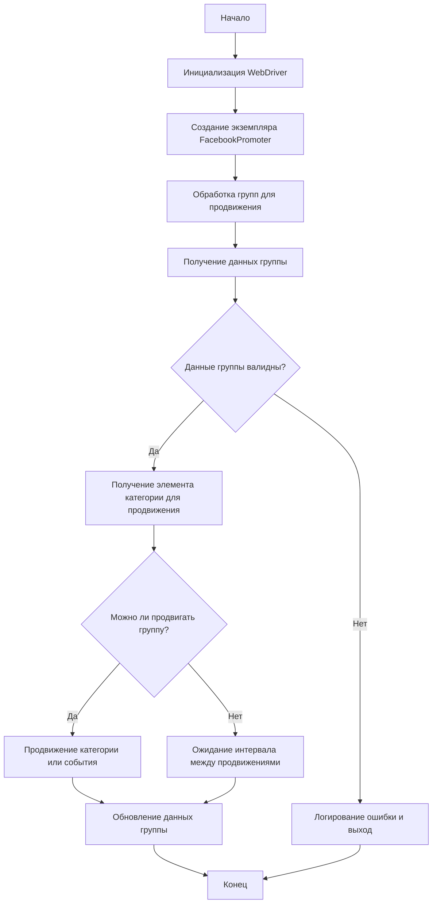

# Документация модуля Facebook Promoter

## Обзор

Модуль **Facebook Promoter** автоматизирует процесс продвижения товаров и событий AliExpress в группах Facebook. Модуль отвечает за публикацию рекламных материалов в Facebook, обеспечивая продвижение категорий и событий без дубликатов. Он использует WebDriver для автоматизации браузера, что обеспечивает эффективное управление рекламными кампаниями.

## Функциональность модуля

- Продвижение категорий и событий в группах Facebook.
- Предотвращение дублирования рекламных публикаций путем отслеживания уже продвинутых элементов.
- Поддержка конфигурации данных групп через файлы.
- Возможность отключения загрузки видео в рекламных публикациях.

## Требования

- **Python** 3.x
- Необходимые библиотеки:
  - `random`
  - `datetime`
  - `pathlib`
  - `urllib.parse`
  - `types.SimpleNamespace`
  - `src` (пользовательский модуль)

## Схема работы модуля



## Использование

### Пример использования класса FacebookPromoter

```python
from src.endpoints.advertisement.facebook.promoter import FacebookPromoter
from src.webdriver.driver import Driver
from src.utils.jjson import j_loads_ns

# Создание инстанса драйвера (пример с Chrome)
d = Driver()

# Создание экземпляра FacebookPromoter
promoter = FacebookPromoter(
    d=d,
    promoter="aliexpress",
    group_file_paths=["path/to/group/file1.json", "path/to/group/file2.json"]
)

# Запуск продвижения товаров или событий
promoter.process_groups(
    campaign_name="Campaign1",
    events=[],
    group_categories_to_adv=["sales"],
    language="en",
    currency="USD"
)
```

## Классы

### `FacebookPromoter`

Этот класс управляет процессом продвижения товаров и событий AliExpress в группах Facebook.

**Методы**:

- `__init__(self, d: Driver, promoter: str, group_file_paths: Optional[list[str | Path] | str | Path] = None, no_video: bool = False)`
- `promote(self, group: SimpleNamespace, item: SimpleNamespace, is_event: bool = False, language: str = None, currency: str = None) -> bool`
- `log_promotion_error(self, is_event: bool, item_name: str)`
- `update_group_promotion_data(self, group: SimpleNamespace, item_name: str, is_event: bool = False)`
- `process_groups(self, campaign_name: str = None, events: list[SimpleNamespace] = None, is_event: bool = False, group_file_paths: list[str] = None, group_categories_to_adv: list[str] = ['sales'], language: str = None, currency: str = None)`
- `get_category_item(self, campaign_name: str, group: SimpleNamespace, language: str, currency: str) -> SimpleNamespace`
- `check_interval(self, group: SimpleNamespace) -> bool`
- `validate_group(self, group: SimpleNamespace) -> bool`

## Методы класса

### `__init__`

```python
def __init__(self, d: Driver, promoter: str, group_file_paths: Optional[list[str | Path] | str | Path] = None, no_video: bool = False):
    """
    Инициализирует промоутер Facebook с необходимыми конфигурациями.

    Args:
        d (Driver): Экземпляр WebDriver для автоматизации.
        promoter (str): Название промоутера (например, "aliexpress").
        group_file_paths (Optional[list[str | Path] | str | Path]): Пути к файлам данных групп.
        no_video (bool): Флаг для отключения видео в постах. По умолчанию `False`.

    """
    ...
```

### `promote`

```python
def promote(self, group: SimpleNamespace, item: SimpleNamespace, is_event: bool = False, language: str = None, currency: str = None) -> bool:
    """
    Продвигает категорию или событие в указанной группе Facebook.

    Args:
        group (SimpleNamespace): Данные группы.
        item (SimpleNamespace): Элемент категории или события для продвижения.
        is_event (bool): Является ли элемент событием.
        language (str): Язык продвижения.
        currency (str): Валюта для продвижения.

    Returns:
        bool: Успешно ли прошло продвижение.
    """
    ...
```

### `log_promotion_error`

```python
def log_promotion_error(self, is_event: bool, item_name: str):
    """
    Логирует ошибку при неудачном продвижении.

    Args:
        is_event (bool): Является ли элемент событием.
        item_name (str): Название элемента.
    """
    ...
```

### `update_group_promotion_data`

```python
def update_group_promotion_data(self, group: SimpleNamespace, item_name: str, is_event: bool = False):
    """
    Обновляет данные группы после продвижения, добавляя продвинутый элемент в список продвинутых категорий или событий.

    Args:
        group (SimpleNamespace): Данные группы.
        item_name (str): Название продвинутого элемента.
        is_event (bool): Является ли элемент событием.
    """
    ...
```

### `process_groups`

```python
def process_groups(self, campaign_name: str = None, events: list[SimpleNamespace] = None, is_event: bool = False, group_file_paths: list[str] = None, group_categories_to_adv: list[str] = ['sales'], language: str = None, currency: str = None):
    """
    Обрабатывает группы для текущей кампании или продвижения события.

    Args:
        campaign_name (str): Название кампании.
        events (list[SimpleNamespace]): Список событий для продвижения.
        is_event (bool): Продвигать события или категории.
        group_file_paths (list[str]): Пути к файлам данных групп.
        group_categories_to_adv (list[str]): Категории для продвижения.
        language (str): Язык продвижения.
        currency (str): Валюта для продвижения.
    """
    ...
```

### `get_category_item`

```python
def get_category_item(self, campaign_name: str, group: SimpleNamespace, language: str, currency: str) -> SimpleNamespace:
    """
    Извлекает элемент категории для продвижения на основе кампании и промоутера.

    Args:
        campaign_name (str): Название кампании.
        group (SimpleNamespace): Данные группы.
        language (str): Язык продвижения.
        currency (str): Валюта для продвижения.

    Returns:
        SimpleNamespace: Элемент категории для продвижения.
    """
    ...
```

### `check_interval`

```python
def check_interval(self, group: SimpleNamespace) -> bool:
    """
    Проверяет, прошло ли достаточно времени для повторного продвижения этой группы.

    Args:
        group (SimpleNamespace): Данные группы.

    Returns:
        bool: Может ли группа быть продвинута снова.
    """
    ...
```

### `validate_group`

```python
def validate_group(self, group: SimpleNamespace) -> bool:
    """
    Проверяет данные группы, чтобы убедиться, что у нее есть необходимые атрибуты.

    Args:
        group (SimpleNamespace): Данные группы.

    Returns:
        bool: Валидны ли данные группы.
    """
    ...
```

## Лицензия

Этот модуль является частью большего пакета **Facebook Promoter** и распространяется под лицензией MIT.