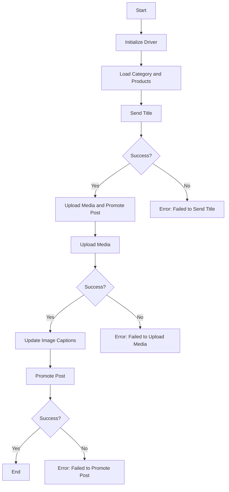

# Модуль `src.endpoints.advertisement.facebook.post_message_async`

## Обзор

Этот скрипт является частью директории `hypotez/src/endpoints/advertisement/facebook/scenarios` и предназначен для автоматизации процесса публикации сообщений на Facebook. Скрипт взаимодействует со страницей Facebook, используя локаторы для выполнения различных действий, таких как отправка сообщений, загрузка медиафайлов и обновление подписей.

## Подробней

Этот код используется для автоматизации процесса публикации рекламных сообщений в Facebook, включая загрузку медиафайлов и добавление заголовков. Это позволяет автоматизировать рутинные задачи и повысить эффективность рекламных кампаний.

## Структура модуля



### Легенда

1.  **Start**: Начало выполнения скрипта.
2.  **InitDriver**: Создание экземпляра класса `Driver`.
3.  **LoadCategoryAndProducts**: Загрузка данных категории и продукта.
4.  **SendTitle**: Вызов функции `post_title` для отправки заголовка.
5.  **CheckTitleSuccess**: Проверка успешной отправки заголовка.
    *   **Yes**: Переход к загрузке медиа и продвижению поста.
    *   **No**: Вывод ошибки "Failed to send title".
6.  **UploadMediaAndPromotePost**: Вызов функции `promote_post`.
7.  **UploadMedia**: Вызов функции `upload_media` для загрузки медиафайлов.
8.  **CheckMediaSuccess**: Проверка успешной загрузки медиа.
    *   **Yes**: Переход к обновлению подписей изображений.
    *   **No**: Вывод ошибки "Failed to upload media".
9.  **UpdateCaptions**: Вызов функции `update_images_captions` для обновления подписей.
10. **PromotePost**: Завершение процесса продвижения поста.
11. **CheckPromoteSuccess**: Проверка успешного продвижения поста.
    *   **Yes**: Конец выполнения скрипта.
    *   **No**: Вывод ошибки "Failed to promote post".

## Функции

### `post_title`

```python
def post_title(d: Driver, category: SimpleNamespace) -> bool:
    """Отправляет заголовок и описание кампании в поле сообщения Facebook.

    Args:
        d (Driver): Экземпляр `Driver`, используемый для взаимодействия с веб-страницей.
        category (SimpleNamespace): Категория, содержащая заголовок и описание для отправки.

    Returns:
        bool: `True`, если заголовок и описание были успешно отправлены, иначе `None`.
    """
    ...
```

**Назначение**: Отправляет заголовок и описание кампании в поле сообщения Facebook.

**Параметры**:

*   `d` (Driver): Экземпляр `Driver`, используемый для взаимодействия с веб-страницей.
*   `category` (SimpleNamespace): Категория, содержащая заголовок и описание для отправки.

**Возвращает**:

*   `bool`: `True`, если заголовок и описание были успешно отправлены, иначе `None`.

**Как работает функция**:

Функция `post_title` использует экземпляр `Driver` для взаимодействия с веб-страницей Facebook. Она берет заголовок и описание из объекта `category` и отправляет их в соответствующие поля для создания сообщения.

**Примеры**:

```python
from src.webdriver.driver import Driver
from types import SimpleNamespace

# Инициализация драйвера
driver = Driver(...)

# Создание объекта category
category = SimpleNamespace(title="Заголовок кампании", description="Описание кампании")

# Отправка заголовка
post_title(driver, category)
```

### `upload_media`

```python
def upload_media(d: Driver, products: List[SimpleNamespace], no_video: bool = False) -> bool:
    """Загружает медиафайлы в пост Facebook и обновляет их подписи.

    Args:
        d (Driver): Экземпляр `Driver`, используемый для взаимодействия с веб-страницей.
        products (List[SimpleNamespace]): Список продуктов, содержащих пути к медиафайлам.
        no_video (bool): Флаг, указывающий, следует ли пропускать загрузку видео.

    Returns:
        bool: `True`, если медиафайлы были успешно загружены, иначе `None`.
    """
    ...
```

**Назначение**: Загружает медиафайлы в пост Facebook и обновляет их подписи.

**Параметры**:

*   `d` (Driver): Экземпляр `Driver`, используемый для взаимодействия с веб-страницей.
*   `products` (List[SimpleNamespace]): Список продуктов, содержащих пути к медиафайлам.
*   `no_video` (bool): Флаг, указывающий, следует ли пропускать загрузку видео.

**Возвращает**:

*   `bool`: `True`, если медиафайлы были успешно загружены, иначе `None`.

**Как работает функция**:

Функция `upload_media` использует экземпляр `Driver` для загрузки медиафайлов (изображений и видео) в пост Facebook. Она итерируется по списку продуктов, извлекая пути к медиафайлам и загружая их. Флаг `no_video` позволяет пропускать загрузку видео, если это необходимо.

**Примеры**:

```python
from src.webdriver.driver import Driver
from types import SimpleNamespace

# Инициализация драйвера
driver = Driver(...)

# Создание списка продуктов
products = [
    SimpleNamespace(local_image_path='путь/к/изображению1.jpg'),
    SimpleNamespace(local_image_path='путь/к/изображению2.jpg'),
    SimpleNamespace(local_video_path='путь/к/видео.mp4')
]

# Загрузка медиафайлов
upload_media(driver, products, no_video=True)
```

### `update_images_captions`

```python
def update_images_captions(d: Driver, products: List[SimpleNamespace], textarea_list: List[WebElement]) -> None:
    """Асинхронно добавляет описания к загруженным медиафайлам.

    Args:
        d (Driver): Экземпляр `Driver`, используемый для взаимодействия с веб-страницей.
        products (List[SimpleNamespace]): Список продуктов с деталями для обновления.
        textarea_list (List[WebElement]): Список текстовых полей, в которые добавляются подписи.
    """
    ...
```

**Назначение**: Асинхронно добавляет описания к загруженным медиафайлам.

**Параметры**:

*   `d` (Driver): Экземпляр `Driver`, используемый для взаимодействия с веб-страницей.
*   `products` (List[SimpleNamespace]): Список продуктов с деталями для обновления.
*   `textarea_list` (List[WebElement]): Список текстовых полей, в которые добавляются подписи.

**Как работает функция**:

Функция `update_images_captions` использует экземпляр `Driver` для добавления описаний к загруженным медиафайлам. Она итерируется по списку текстовых полей и добавляет соответствующие описания из списка продуктов.

**Примеры**:

```python
from src.webdriver.driver import Driver
from types import SimpleNamespace
from selenium.webdriver.remote.webelement import WebElement

# Инициализация драйвера
driver = Driver(...)

# Создание списка продуктов
products = [
    SimpleNamespace(description='Описание для изображения 1'),
    SimpleNamespace(description='Описание для изображения 2')
]

# Создание списка текстовых полей (пример)
textarea_list = [WebElement(), WebElement()]

# Обновление подписей изображений
update_images_captions(driver, products, textarea_list)
```

### `promote_post`

```python
def promote_post(d: Driver, category: SimpleNamespace, products: List[SimpleNamespace], no_video: bool = False) -> bool:
    """Управляет процессом продвижения поста с заголовком, описанием и медиафайлами.

    Args:
        d (Driver): Экземпляр `Driver`, используемый для взаимодействия с веб-страницей.
        category (SimpleNamespace): Детали категории, используемые для заголовка и описания поста.
        products (List[SimpleNamespace]): Список продуктов, содержащих медиа и детали для публикации.
        no_video (bool): Флаг, указывающий, следует ли пропускать загрузку видео.

    Returns:
        bool: `True`, если пост был успешно продвинут, иначе `None`.
    """
    ...
```

**Назначение**: Управляет процессом продвижения поста с заголовком, описанием и медиафайлами.

**Параметры**:

*   `d` (Driver): Экземпляр `Driver`, используемый для взаимодействия с веб-страницей.
*   `category` (SimpleNamespace): Детали категории, используемые для заголовка и описания поста.
*   `products` (List[SimpleNamespace]): Список продуктов, содержащих медиа и детали для публикации.
*   `no_video` (bool): Флаг, указывающий, следует ли пропускать загрузку видео.

**Возвращает**:

*   `bool`: `True`, если пост был успешно продвинут, иначе `None`.

**Как работает функция**:

Функция `promote_post` управляет всем процессом продвижения поста в Facebook. Она вызывает функции `post_title` для отправки заголовка и описания, `upload_media` для загрузки медиафайлов и `update_images_captions` для обновления подписей. Флаг `no_video` позволяет пропускать загрузку видео, если это необходимо.

**Примеры**:

```python
from src.webdriver.driver import Driver
from types import SimpleNamespace

# Инициализация драйвера
driver = Driver(...)

# Создание объекта category
category = SimpleNamespace(title="Заголовок кампании", description="Описание кампании")

# Создание списка продуктов
products = [
    SimpleNamespace(local_image_path='путь/к/изображению1.jpg', description='Описание для изображения 1'),
    SimpleNamespace(local_image_path='путь/к/изображению2.jpg', description='Описание для изображения 2')
]

# Продвижение поста
promote_post(driver, category, products, no_video=True)
```

## Использование

Для использования этого скрипта выполните следующие шаги:

1.  **Инициализация драйвера**: Создайте экземпляр класса `Driver`.
2.  **Загрузка локаторов**: Загрузите локаторы из JSON-файла.
3.  **Вызов функций**: Используйте предоставленные функции для отправки заголовка, загрузки медиа и продвижения поста.

## Зависимости

*   `selenium`: Для автоматизации веб-интерфейса.
*   `asyncio`: Для асинхронных операций.
*   `pathlib`: Для работы с путями к файлам.
*   `types`: Для создания простых пространств имен.
*   `typing`: Для аннотаций типов.

## Обработка ошибок

Скрипт включает надежную обработку ошибок, чтобы обеспечить продолжение выполнения даже в случае, если определенные элементы не найдены или возникли проблемы с веб-страницей. Это особенно полезно для работы с динамическими или нестабильными веб-страницами.