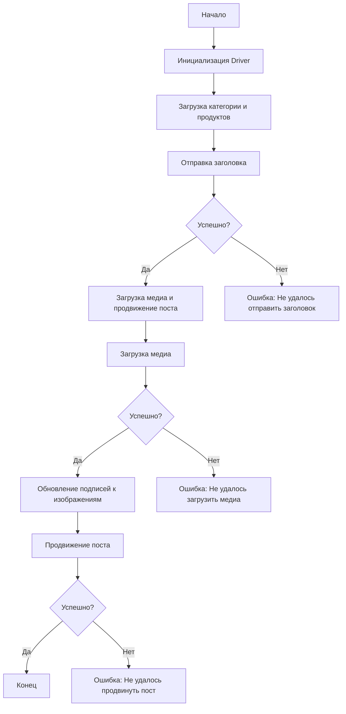

# Модуль: Сценарий асинхронной публикации сообщения на Facebook

## Обзор

Этот модуль, расположенный в директории `hypotez/src/endpoints/advertisement/facebook/scenarios`, предназначен для автоматизации процесса публикации сообщений на Facebook. Скрипт взаимодействует со страницей Facebook, используя локаторы для выполнения различных действий, таких как отправка сообщений, загрузка медиафайлов и обновление подписей.

## Подробнее

Этот модуль автоматизирует процесс публикации рекламных постов на Facebook, включая загрузку медиафайлов и управление подписями к ним. Он предназначен для упрощения и ускорения процесса создания рекламных кампаний, а также для минимизации ошибок, связанных с ручным вводом данных. Модуль также включает обработку ошибок, что обеспечивает стабильность работы даже при возникновении проблем с веб-страницей Facebook.

## Структура модуля



### Легенда

1.  **Start**: Начало выполнения скрипта.
2.  **InitDriver**: Создание экземпляра класса `Driver`.
3.  **LoadCategoryAndProducts**: Загрузка данных категории и продуктов.
4.  **SendTitle**: Вызов функции `post_title` для отправки заголовка.
5.  **CheckTitleSuccess**: Проверка успешности отправки заголовка.
    *   **Да**: Переход к загрузке медиа и продвижению поста.
    *   **Нет**: Вывод ошибки "Не удалось отправить заголовок".
6.  **UploadMediaAndPromotePost**: Вызов функции `promote_post`.
7.  **UploadMedia**: Вызов функции `upload_media` для загрузки медиафайлов.
8.  **CheckMediaSuccess**: Проверка успешности загрузки медиа.
    *   **Да**: Переход к обновлению подписей к изображениям.
    *   **Нет**: Вывод ошибки "Не удалось загрузить медиа".
9.  **UpdateCaptions**: Вызов функции `update_images_captions` для обновления подписей.
10. **PromotePost**: Завершение процесса продвижения поста.
11. **CheckPromoteSuccess**: Проверка успешности продвижения поста.
    *   **Да**: Конец выполнения скрипта.
    *   **Нет**: Вывод ошибки "Не удалось продвинуть пост".

## Функции

### `post_title`

```python
def post_title(d: Driver, category: SimpleNamespace) -> bool:
    """
    Отправляет заголовок и описание кампании в поле сообщения на Facebook.
    Args:
        d (Driver): Экземпляр `Driver` для взаимодействия с веб-страницей.
        category (SimpleNamespace): Категория, содержащая заголовок и описание для отправки.

    Returns:
        bool: `True`, если заголовок и описание были успешно отправлены, иначе `None`.
    """
    ...
```

**Назначение**: Функция `post_title` отвечает за ввод заголовка и описания рекламной кампании в соответствующее поле на странице Facebook.

**Параметры**:

*   `d` (Driver): Экземпляр драйвера веб-браузера, который используется для взаимодействия со страницей Facebook.
*   `category` (SimpleNamespace): Объект, содержащий атрибуты `title` (заголовок кампании) и `description` (описание кампании), которые необходимо ввести в соответствующие поля на странице Facebook.

**Возвращает**:

*   `bool`: `True`, если заголовок и описание были успешно введены в поля, иначе `None`.

**Как работает функция**:

Функция `post_title` использует экземпляр драйвера `d` для нахождения полей ввода заголовка и описания на странице Facebook. Затем она вводит значения `title` и `description` из объекта `category` в найденные поля. В случае успешного ввода функция возвращает `True`, иначе `None`.

**Примеры**:

```python
from src.webdriver.driver import Driver
from types import SimpleNamespace

# Пример использования функции post_title
driver = Driver(browser_name="chrome")  # Инициализация драйвера (пример с Chrome)
category_data = SimpleNamespace(title="Заголовок моей кампании", description="Описание моей кампании")
result = post_title(driver, category_data)
if result:
    print("Заголовок и описание успешно отправлены.")
else:
    print("Не удалось отправить заголовок и описание.")
```

### `upload_media`

```python
def upload_media(d: Driver, products: List[SimpleNamespace], no_video: bool = False) -> bool:
    """
    Загружает медиафайлы на пост Facebook и обновляет их подписи.
    Args:
        d (Driver): Экземпляр `Driver` для взаимодействия с веб-страницей.
        products (List[SimpleNamespace]): Список продуктов, содержащих пути к медиафайлам.
        no_video (bool): Флаг, указывающий, следует ли пропустить загрузку видео.

    Returns:
        bool: `True`, если медиафайлы были успешно загружены, иначе `None`.
    """
    ...
```

**Назначение**: Функция `upload_media` отвечает за загрузку медиафайлов (изображений и видео) на пост в Facebook.

**Параметры**:

*   `d` (Driver): Экземпляр драйвера веб-браузера, используемый для взаимодействия со страницей Facebook.
*   `products` (List[SimpleNamespace]): Список объектов `SimpleNamespace`, где каждый объект содержит информацию о продукте, включая пути к медиафайлам, которые необходимо загрузить.
*   `no_video` (bool): Флаг, указывающий, следует ли пропускать загрузку видеофайлов. Если `True`, то видеофайлы не будут загружены. По умолчанию `False`.

**Возвращает**:

*   `bool`: `True`, если все медиафайлы были успешно загружены, иначе `None`.

**Как работает функция**:

Функция `upload_media` итерируется по списку продуктов `products` и загружает медиафайлы, указанные в каждом продукте. Если флаг `no_video` установлен в `True`, загрузка видеофайлов пропускается. Функция использует драйвер `d` для взаимодействия с элементами веб-страницы Facebook, такими как кнопки загрузки и поля для ввода подписей.

**Примеры**:

```python
from src.webdriver.driver import Driver
from types import SimpleNamespace
import pathlib

# Пример использования функции upload_media
driver = Driver(browser_name="chrome")  # Инициализация драйвера (пример с Chrome)

# Создаем объекты SimpleNamespace с путями к изображениям и видео
product1 = SimpleNamespace(local_image_path=str(pathlib.Path("path/to/image1.jpg").resolve()), local_video_path=str(pathlib.Path("path/to/video1.mp4").resolve()))
product2 = SimpleNamespace(local_image_path=str(pathlib.Path("path/to/image2.jpg").resolve()), local_video_path=str(pathlib.Path("path/to/video2.mp4").resolve()))

products_list = [product1, product2]

# Загружаем медиафайлы, включая видео
result = upload_media(driver, products_list)
if result:
    print("Медиафайлы успешно загружены.")
else:
    print("Не удалось загрузить медиафайлы.")

# Загружаем только изображения, пропуская видео
result_no_video = upload_media(driver, products_list, no_video=True)
if result_no_video:
    print("Изображения успешно загружены (видео пропущено).")
else:
    print("Не удалось загрузить изображения.")
```

### `update_images_captions`

```python
def update_images_captions(d: Driver, products: List[SimpleNamespace], textarea_list: List[WebElement]) -> None:
    """
    Асинхронно добавляет описания к загруженным медиафайлам.
    Args:
        d (Driver): Экземпляр `Driver` для взаимодействия с веб-страницей.
        products (List[SimpleNamespace]): Список продуктов с деталями для обновления.
        textarea_list (List[WebElement]): Список текстовых полей, куда добавляются подписи.
    """
    ...
```

**Назначение**: Функция `update_images_captions` предназначена для добавления или обновления подписей к загруженным медиафайлам (изображениям) на странице Facebook.

**Параметры**:

*   `d` (Driver): Экземпляр драйвера веб-браузера, который используется для взаимодействия с веб-страницей Facebook. Этот драйвер предоставляет методы для навигации по странице, поиска элементов и выполнения действий, таких как ввод текста.
*   `products` (List[SimpleNamespace]): Список объектов `SimpleNamespace`, содержащих информацию о продуктах. Каждый продукт может иметь атрибуты, такие как описание, которое будет использоваться в качестве подписи к изображению.
*   `textarea_list` (List[WebElement]): Список веб-элементов, представляющих текстовые поля (textarea) на странице Facebook, в которые будут введены подписи к изображениям.

**Возвращает**:

*   `None`: Функция ничего не возвращает. Она выполняет действия на веб-странице Facebook и не предназначена для возврата каких-либо значений.

**Как работает функция**:

Функция `update_images_captions` принимает список продуктов и список текстовых полей. Она итерируется по этим спискам, чтобы добавить описание каждого продукта в соответствующее текстовое поле. Функция использует драйвер `d` для взаимодействия с веб-элементами на странице Facebook.

**Примеры**:

```python
from src.webdriver.driver import Driver
from types import SimpleNamespace
from selenium.webdriver.remote.webelement import WebElement
from selenium.webdriver.common.by import By

# Пример использования функции update_images_captions
driver = Driver(browser_name="chrome")  # Инициализация драйвера (пример с Chrome)

# Создаем объекты SimpleNamespace с описаниями продуктов
product1 = SimpleNamespace(description="Описание продукта 1")
product2 = SimpleNamespace(description="Описание продукта 2")
products_list = [product1, product2]

# Получаем список текстовых полей (пример, нужно адаптировать под реальные локаторы)
textarea_list = [
    driver.driver.find_element(By.XPATH, "//textarea[@aria-label='Описание 1']"),
    driver.driver.find_element(By.XPATH, "//textarea[@aria-label='Описание 2']")
]

# Обновляем подписи к изображениям
update_images_captions(driver, products_list, textarea_list)

print("Подписи к изображениям успешно обновлены.")
```

### `promote_post`

```python
def promote_post(d: Driver, category: SimpleNamespace, products: List[SimpleNamespace], no_video: bool = False) -> bool:
    """
    Управляет процессом продвижения поста с заголовком, описанием и медиафайлами.
    Args:
        d (Driver): Экземпляр `Driver` для взаимодействия с веб-страницей.
        category (SimpleNamespace): Детали категории, используемые для заголовка и описания поста.
        products (List[SimpleNamespace]): Список продуктов, содержащих медиа и детали для публикации.
        no_video (bool): Флаг, указывающий, следует ли пропустить загрузку видео.

    Returns:
        bool: `True`, если пост был успешно продвинут, иначе `None`.
    """
    ...
```

**Назначение**: Функция `promote_post` управляет всем процессом продвижения поста в Facebook, включая отправку заголовка и описания, загрузку медиафайлов и выполнение других необходимых действий для успешной публикации рекламного поста.

**Параметры**:

*   `d` (Driver): Экземпляр класса `Driver`, используемый для взаимодействия с веб-страницей Facebook через Selenium WebDriver.
*   `category` (SimpleNamespace): Объект, содержащий информацию о категории поста, включая заголовок и описание.
*   `products` (List[SimpleNamespace]): Список объектов, содержащих информацию о продуктах, включая медиафайлы (изображения и видео) и другие детали, необходимые для публикации поста.
*   `no_video` (bool): Флаг, указывающий, следует ли пропустить загрузку видеофайлов. Если `True`, то видеофайлы не будут загружены. По умолчанию `False`.

**Возвращает**:

*   `bool`: `True`, если пост был успешно продвинут и опубликован, иначе `None`.

**Как работает функция**:

Функция `promote_post` выполняет следующие шаги:

1.  Отправляет заголовок и описание поста, используя функцию `post_title`.
2.  Загружает медиафайлы (изображения и видео), используя функцию `upload_media`.
3.  Выполняет другие действия, необходимые для продвижения поста, такие как выбор целевой аудитории, установка бюджета и т.д.
4.  Проверяет, был ли пост успешно опубликован.

**Примеры**:

```python
from src.webdriver.driver import Driver
from types import SimpleNamespace
import pathlib

# Пример использования функции promote_post
driver = Driver(browser_name="chrome")  # Инициализация драйвера (пример с Chrome)

# Создаем объекты SimpleNamespace с данными для поста
category_data = SimpleNamespace(title="Заголовок рекламного поста", description="Описание рекламного поста")
product1 = SimpleNamespace(local_image_path=str(pathlib.Path("path/to/image1.jpg").resolve()), local_video_path=str(pathlib.Path("path/to/video1.mp4").resolve()))
product2 = SimpleNamespace(local_image_path=str(pathlib.Path("path/to/image2.jpg").resolve()), local_video_path=str(pathlib.Path("path/to/video2.mp4").resolve()))
products_list = [product1, product2]

# Продвигаем пост, включая видео
result = promote_post(driver, category_data, products_list)
if result:
    print("Пост успешно продвинут и опубликован.")
else:
    print("Не удалось продвинуть пост.")

# Продвигаем пост, пропуская видео
result_no_video = promote_post(driver, category_data, products_list, no_video=True)
if result_no_video:
    print("Пост успешно продвинут и опубликован (видео пропущено).")
else:
    print("Не удалось продвинуть пост.")
```

## Использование

Для использования этого скрипта выполните следующие шаги:

1.  **Инициализация Driver**: Создайте экземпляр класса `Driver`.
2.  **Загрузка локаторов**: Загрузите локаторы из JSON-файла.
3.  **Вызов функций**: Используйте предоставленные функции для отправки заголовка, загрузки медиа и продвижения поста.

## Зависимости

*   `selenium`: Для веб-автоматизации.
*   `asyncio`: Для асинхронных операций.
*   `pathlib`: Для обработки путей к файлам.
*   `types`: Для создания простых пространств имен.
*   `typing`: Для аннотаций типов.

## Обработка ошибок

Скрипт включает надежную обработку ошибок, чтобы обеспечить продолжение выполнения даже в случае, если некоторые элементы не найдены или если возникли проблемы с веб-страницей. Это особенно полезно для обработки динамических или нестабильных веб-страниц.

## Вклад

Вклад в этот скрипт приветствуется. Пожалуйста, убедитесь, что любые изменения хорошо документированы и включают соответствующие тесты.

## Лицензия

Этот скрипт лицензирован под MIT License. Подробности смотрите в файле `LICENSE`.