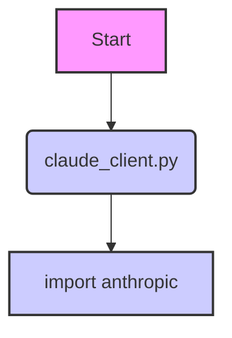

### **Системные инструкции для обработки кода проекта `hypotez`**

=========================================================================================

Описание функциональности и правил для генерации, анализа и улучшения кода. Направлено на обеспечение последовательного и читаемого стиля кодирования, соответствующего требованиям.

---

### **Основные принципы**

#### **1. Общие указания**:
- Соблюдай четкий и понятный стиль кодирования.
- Все изменения должны быть обоснованы и соответствовать установленным требованиям.

#### **2. Комментарии**:
- Используй `#` для внутренних комментариев.
- Документация всех функций, методов и классов должна следовать такому формату: 
    ```python
        def function(param: str, param1: Optional[str | dict | str] = None) -> dict | None:
            """ 
            Args:
                param (str): Описание параметра `param`.
                param1 (Optional[str | dict | str], optional): Описание параметра `param1`. По умолчанию `None`.
    
            Returns:
                dict | None: Описание возвращаемого значения. Возвращает словарь или `None`.
    
            Raises:
                SomeError: Описание ситуации, в которой возникает исключение `SomeError`.

            Ехаmple:
                >>> function('param', 'param1')
                {'param': 'param1'}
            """
    ```
- Комментарии и документация должны быть четкими, лаконичными и точными.

#### **3. Форматирование кода**:
- Используй одинарные кавычки. `a:str = 'value'`, `print('Hello World!')`;
- Добавляй пробелы вокруг операторов. Например, `x = 5`;
- Все параметры должны быть аннотированы типами. `def function(param: str, param1: Optional[str | dict | str] = None) -> dict | None:`;
- Не используй `Union`. Вместо этого используй `|`.

#### **4. Логирование**:
- Для логгирования Всегда Используй модуль `logger` из `src.logger.logger`.
- Ошибки должны логироваться с использованием `logger.error`.
Пример:
    ```python
        try:
            ...
        except Exception as ex:
            logger.error('Error while processing data', ех, exc_info=True)
    ```
#### **5 Не используй `Union[]` в коде. Вместо него используй `|`
Например:
```python
x: str | int ...
```


---

### **Основные требования**:

#### **1. Формат ответов в Markdown**:
- Все ответы должны быть выполнены в формате **Markdown**.

#### **2. Формат комментариев**:
- Используй указанный стиль для комментариев и документации в коде.
- Пример:

```python
from typing import Generator, Optional, List
from pathlib import Path


def read_text_file(
    file_path: str | Path,
    as_list: bool = False,
    extensions: Optional[List[str]] = None,
    chunk_size: int = 8192,
) -> Generator[str, None, None] | str | None:
    """
    Считывает содержимое файла (или файлов из каталога) с использованием генератора для экономии памяти.

    Args:
        file_path (str | Path): Путь к файлу или каталогу.
        as_list (bool): Если `True`, возвращает генератор строк.
        extensions (Optional[List[str]]): Список расширений файлов для чтения из каталога.
        chunk_size (int): Размер чанков для чтения файла в байтах.

    Returns:
        Generator[str, None, None] | str | None: Генератор строк, объединенная строка или `None` в случае ошибки.

    Raises:
        Exception: Если возникает ошибка при чтении файла.

    Example:
        >>> from pathlib import Path
        >>> file_path = Path('example.txt')
        >>> content = read_text_file(file_path)
        >>> if content:
        ...    print(f'File content: {content[:100]}...')
        File content: Example text...
    """
    ...
```
- Всегда делай подробные объяснения в комментариях. Избегай расплывчатых терминов, 
- таких как *«получить»* или *«делать»*
-  . Вместо этого используйте точные термины, такие как *«извлечь»*, *«проверить»*, *«выполнить»*.
- Вместо: *«получаем»*, *«возвращаем»*, *«преобразовываем»* используй имя объекта *«функция получае»*, *«переменная возвращает»*, *«код преобразовывает»* 
- Комментарии должны непосредственно предшествовать описываемому блоку кода и объяснять его назначение.

#### **3. Пробелы вокруг операторов присваивания**:
- Всегда добавляйте пробелы вокруг оператора `=`, чтобы повысить читаемость.
- Примеры:
  - **Неправильно**: `x=5`
  - **Правильно**: `x = 5`

#### **4. Использование `j_loads` или `j_loads_ns`**:
- Для чтения JSON или конфигурационных файлов замените стандартное использование `open` и `json.load` на `j_loads` или `j_loads_ns`.
- Пример:

```python
# Неправильно:
with open('config.json', 'r', encoding='utf-8') as f:
    data = json.load(f)

# Правильно:
data = j_loads('config.json')
```

#### **5. Сохранение комментариев**:
- Все существующие комментарии, начинающиеся с `#`, должны быть сохранены без изменений в разделе «Улучшенный код».
- Если комментарий кажется устаревшим или неясным, не изменяйте его. Вместо этого отметьте его в разделе «Изменения».

#### **6. Обработка `...` в коде**:
- Оставляйте `...` как указатели в коде без изменений.
- Не документируйте строки с `...`.
```

#### **7. Аннотации**
Для всех переменных должны быть определены аннотации типа. 
Для всех функций все входные и выходные параметры аннотириваны
Для все параметров должны быть аннотации типа.


### **8. webdriver**
В коде используется webdriver. Он импртируется из модуля `webdriver` проекта `hypotez`
```python
from src.webdirver import Driver, Chrome, Firefox, Playwright, ...
driver = Driver(Firefox)

Пoсле чего может использоваться как

close_banner = {
  "attribute": null,
  "by": "XPATH",
  "selector": "//button[@id = 'closeXButton']",
  "if_list": "first",
  "use_mouse": false,
  "mandatory": false,
  "timeout": 0,
  "timeout_for_event": "presence_of_element_located",
  "event": "click()",
  "locator_description": "Закрываю pop-up окно, если оно не появилось - не страшно (`mandatory`:`false`)"
}

result = driver.execute_locator(close_banner)
```

### Анализ `hypotez/src/ai/anthropic/readme.ru.md`

Этот файл `readme.ru.md` находится в директории `src/ai/anthropic` проекта `hypotez`. Он содержит информацию о модуле для взаимодействия с моделью Claude от Anthropic на русском языке.

#### 1. Блок-схема

```mermaid
graph TD
    A[Начало] --> B{Установка библиотеки anthropic};
    B -- Успешно --> C{Инициализация ClaudeClient};
    C --> D{Генерация текста};
    D --> E{Анализ тональности};
    E --> F{Перевод текста};
    F --> G[Конец];
    B -- Ошибка --> H[Инструкция по установке];
    H --> B;
    D -- Пример --> D1[prompt = "Напишите короткую историю о роботе, который учится любить."];
    D1 --> D2[generated_text = claude_client.generate_text(prompt)];
    E -- Пример --> E1[text_to_analyze = "Сегодня я очень счастлив!"];
    E1 --> E2[sentiment_analysis = claude_client.analyze_sentiment(text_to_analyze)];
    F -- Пример --> F1[text_to_translate = "Привет, как дела?"];
    F1 --> F2[translated_text = claude_client.translate_text(text_to_translate, source_language, target_language)];
```

#### 2. Диаграмма зависимостей



Диаграмма показывает зависимость модуля `claude_client.py` от библиотеки `anthropic`. Это означает, что для работы с Claude API необходимо установить и импортировать библиотеку `anthropic`.

#### 3. Объяснение

-   **Импорты:**
    -   `anthropic`: Эта библиотека используется для взаимодействия с API Claude от Anthropic. Она необходима для выполнения запросов к модели, таких как генерация текста, анализ тональности и перевод.

-   **Классы:**
    -   `ClaudeClient`: Класс, предоставляющий интерфейс для работы с API Claude. Он инициализируется с API-ключом и предоставляет методы для генерации текста, анализа тональности и перевода текста.

-   **Функции:**
    -   `generate_text(prompt: str, max_tokens_to_sample: int = 100) -> str`: Генерирует текст на основе заданного промпта. Принимает строку `prompt` и опциональное количество токенов `max_tokens_to_sample`. Возвращает сгенерированный текст.
        ```python
        prompt = "Напишите короткую историю о роботе, который учится любить."
        generated_text = claude_client.generate_text(prompt)
        print("Сгенерированный текст:", generated_text)
        ```
    -   `analyze_sentiment(text: str) -> str`: Анализирует тональность заданного текста. Принимает строку `text` и возвращает результат анализа тональности.
        ```python
        text_to_analyze = "Сегодня я очень счастлив!"
        sentiment_analysis = claude_client.analyze_sentiment(text_to_analyze)
        print("Анализ тональности:", sentiment_analysis)
        ```
    -   `translate_text(text: str, source_language: str, target_language: str) -> str`: Переводит заданный текст с одного языка на другой. Принимает строку `text` для перевода, код исходного языка `source_language` и код целевого языка `target_language`. Возвращает переведенный текст.
        ```python
        text_to_translate = "Привет, как дела?"
        source_language = "ru"
        target_language = "en"
        translated_text = claude_client.translate_text(text_to_translate, source_language, target_language)
        print("Переведенный текст:", translated_text)
        ```

-   **Переменные:**
    -   `api_key`: Строка, содержащая API-ключ для доступа к API Claude. Важно заменить `"your-api-key"` на реальный ключ.
    -   `claude_client`: Экземпляр класса `ClaudeClient`, инициализированный с API-ключом.

-   **Потенциальные ошибки и области для улучшения:**
    -   Отсутствует обработка ошибок при взаимодействии с API Claude. Следует добавить блоки `try...except` для обработки возможных исключений, таких как ошибки аутентификации, сетевые ошибки и т.д.
    -   Нет информации о том, какие значения возвращает `analyze_sentiment`. Желательно указать формат возвращаемого значения и возможные варианты.
    -   Не указаны возможные значения для кодов языков `source_language` и `target_language` в `translate_text`. Следует добавить ссылку на документацию или указать примеры кодов языков.

**Взаимосвязи с другими частями проекта:**
Этот модуль предназначен для интеграции с другими частями проекта, которые требуют взаимодействия с языковой моделью Claude. Например, он может быть использован для автоматической генерации контента, анализа отзывов пользователей или перевода документации.