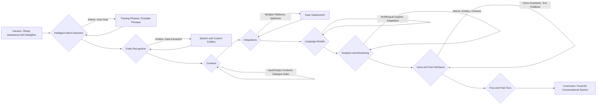
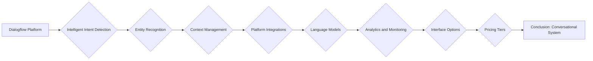

### **Системные инструкции для обработки кода проекта `hypotez`**

=========================================================================================

Описание функциональности и правил для генерации, анализа и улучшения кода. Направлено на обеспечение последовательного и читаемого стиля кодирования, соответствующего требованиям.

---

### **Основные принципы**

#### **1. Общие указания**:
- Соблюдай четкий и понятный стиль кодирования.
- Все изменения должны быть обоснованы и соответствовать установленным требованиям.

#### **2. Комментарии**:
- Используй `#` для внутренних комментариев.
- Документация всех функций, методов и классов должна следовать такому формату: 
    ```python
        def function(param: str, param1: Optional[str | dict | str] = None) -> dict | None:
            """ 
            Args:
                param (str): Описание параметра `param`.
                param1 (Optional[str | dict | str], optional): Описание параметра `param1`. По умолчанию `None`.
    
            Returns:
                dict | None: Описание возвращаемого значения. Возвращает словарь или `None`.
    
            Raises:
                SomeError: Описание ситуации, в которой возникает исключение `SomeError`.

            Ехаmple:
                >>> function('param', 'param1')
                {'param': 'param1'}
            """
    ```
- Комментарии и документация должны быть четкими, лаконичными и точными.

#### **3. Форматирование кода**:
- Используй одинарные кавычки. `a:str = 'value'`, `print('Hello World!')`;
- Добавляй пробелы вокруг операторов. Например, `x = 5`;
- Все параметры должны быть аннотированы типами. `def function(param: str, param1: Optional[str | dict | str] = None) -> dict | None:`;
- Не используй `Union`. Вместо этого используй `|`.

#### **4. Логирование**:
- Для логгирования Всегда Используй модуль `logger` из `src.logger.logger`.
- Ошибки должны логироваться с использованием `logger.error`.
Пример:
    ```python
        try:
            ...
        except Exception as ex:
            logger.error('Error while processing data', ех, exc_info=True)
    ```
#### **5 Не используй `Union[]` в коде. Вместо него используй `|`
Например:
```python
x: str | int ...
```


---

### **Основные требования**:

#### **1. Формат ответов в Markdown**:
- Все ответы должны быть выполнены в формате **Markdown**.

#### **2. Формат комментариев**:
- Используй указанный стиль для комментариев и документации в коде.
- Пример:

```python
from typing import Generator, Optional, List
from pathlib import Path


def read_text_file(
    file_path: str | Path,
    as_list: bool = False,
    extensions: Optional[List[str]] = None,
    chunk_size: int = 8192,
) -> Generator[str, None, None] | str | None:
    """
    Считывает содержимое файла (или файлов из каталога) с использованием генератора для экономии памяти.

    Args:
        file_path (str | Path): Путь к файлу или каталогу.
        as_list (bool): Если `True`, возвращает генератор строк.
        extensions (Optional[List[str]]): Список расширений файлов для чтения из каталога.
        chunk_size (int): Размер чанков для чтения файла в байтах.

    Returns:
        Generator[str, None, None] | str | None: Генератор строк, объединенная строка или `None` в случае ошибки.

    Raises:
        Exception: Если возникает ошибка при чтении файла.

    Example:
        >>> from pathlib import Path
        >>> file_path = Path('example.txt')
        >>> content = read_text_file(file_path)
        >>> if content:
        ...    print(f'File content: {content[:100]}...')
        File content: Example text...
    """
    ...
```
- Всегда делай подробные объяснения в комментариях. Избегай расплывчатых терминов, 
- таких как *«получить»* или *«делать»*. Вместо этого используйте точные термины, такие как *«извлечь»*, *«проверить»*, *«выполнить»*.
- Вместо: *«получаем»*, *«возвращаем»*, *«преобразовываем»* используй имя объекта *«функция получае»*, *«переменная возвращает»*, *«код преобразовывает»* 
- Комментарии должны непосредственно предшествовать описываемому блоку кода и объяснять его назначение.

#### **3. Пробелы вокруг операторов присваивания**:
- Всегда добавляйте пробелы вокруг оператора `=`, чтобы повысить читаемость.
- Примеры:
  - **Неправильно**: `x=5`
  - **Правильно**: `x = 5`

#### **4. Использование `j_loads` или `j_loads_ns`**:
- Для чтения JSON или конфигурационных файлов замените стандартное использование `open` и `json.load` на `j_loads` или `j_loads_ns`.
- Пример:

```python
# Неправильно:
with open('config.json', 'r', encoding='utf-8') as f:
    data = json.load(f)

# Правильно:
data = j_loads('config.json')
```

#### **5. Сохранение комментариев**:
- Все существующие комментарии, начинающиеся с `#`, должны быть сохранены без изменений в разделе «Улучшенный код».
- Если комментарий кажется устаревшим или неясным, не изменяйте его. Вместо этого отметьте его в разделе «Изменения».

#### **6. Обработка `...` в коде**:
- Оставляйте `...` как указатели в коде без изменений.
- Не документируйте строки с `...`.
```

#### **7. Аннотации**
Для всех переменных должны быть определены аннотации типа. 
Для всех функций все входные и выходные параметры аннотириваны
Для все параметров должны быть аннотации типа.


### **8. webdriver**
В коде используется webdriver. Он импртируется из модуля `webdriver` проекта `hypotez`
```python
from src.webdirver import Driver, Chrome, Firefox, Playwright, ...
driver = Driver(Firefox)

Пoсле чего может использоваться как

close_banner = {
  "attribute": null,
  "by": "XPATH",
  "selector": "//button[@id = 'closeXButton']",
  "if_list": "first",
  "use_mouse": false,
  "mandatory": false,
  "timeout": 0,
  "timeout_for_event": "presence_of_element_located",
  "event": "click()",
  "locator_description": "Закрываю pop-up окно, если оно не появилось - не страшно (`mandatory`:`false`)"
}

result = driver.execute_locator(close_banner)
```

### **Анализ кода `hypotez/src/ai/dialogflow/about.md`**

#### **1. Блок-схема**



**Примеры для каждого логического блока:**

*   **A (Начало)**: Описание Dialogflow как AI платформы для создания conversational interfaces.
*   **B (Intelligent Intent Detection)**:
    *   *Intents*: Пользователь хочет заказать пиццу.
    *   *Training Phrases*: "Я хочу заказать пиццу", "Принесите мне пиццу".
*   **C (Training Phrases)**: Dialogflow обучается на фразах, чтобы понимать намерения пользователя.
*   **D (Entity Recognition)**:
    *   *Entities*: "Грибы" в запросе "Закажите пиццу с грибами".
    *   *System and Custom Entities*: Даты, времена, числа (системные) и типы начинок (пользовательские).
*   **E (System and Custom Entities)**: Dialogflow извлекает данные для понимания запроса.
*   **F (Contexts)**:
    *   *Input/Output Contexts*: Бот помнит, что пользователь уже выбрал пиццу, и предлагает добавки.
*   **G (Integrations)**:
    *   *Multiple Platforms*: Интеграция с Google Assistant, Facebook Messenger.
    *   *Webhook*: Вызов внешнего API для обработки заказа пиццы.
*   **H (Easy Deployment)**: Развертывание чат-бота на различных платформах.
*   **I (Language Models)**:
    *   *Multilingual Support*: Поддержка английского, испанского, французского языков.
    *   *Language-Specific Adaptation*: Учет сленга и диалектов.
*   **J (Analytics and Monitoring)**:
    *   *Intents, Entities, Contexts*: Отслеживание наиболее частых намерений пользователей, извлекаемых сущностей и используемых контекстов.
*   **K (Voice and Text Interfaces)**:
    *   *Voice Assistants*: Взаимодействие через голосовые команды.
    *   *Text Chatbots*: Взаимодействие через текстовые сообщения.
*   **L (Free and Paid Tiers)**: Выбор подходящего тарифного плана для проекта.
*   **M (Conclusion)**: Заключение о Dialogflow как мощном инструменте для создания чат-ботов.

#### **2. Диаграмма**



**Объяснение диаграммы:**

*   **Dialogflow Platform**: Центральная платформа для создания чат-ботов.
*   **Intelligent Intent Detection**: Обнаружение намерений пользователя.
*   **Entity Recognition**: Извлечение ключевых данных из запросов пользователя.
*   **Context Management**: Управление состоянием диалога.
*   **Platform Integrations**: Интеграция с различными платформами (Google Assistant, Facebook Messenger и т.д.).
*   **Language Models**: Использование языковых моделей для понимания и обработки текста.
*   **Analytics and Monitoring**: Анализ производительности чат-бота.
*   **Interface Options**: Варианты интерфейсов (голосовые, текстовые).
*   **Pricing Tiers**: Доступные тарифные планы.
*   **Conclusion: Conversational System**: Итоговая система для ведения диалогов.

#### **3. Объяснение**

**Общее описание:**

Файл `hypotez/src/ai/dialogflow/about.md` представляет собой Markdown-файл, содержащий обзор возможностей платформы Dialogflow. Dialogflow - это платформа искусственного интеллекта от Google, предназначенная для создания conversational interfaces, таких как чат-боты и голосовые помощники. Документ описывает ключевые функции и преимущества использования Dialogflow для разработки интерактивных систем.

**Импорты:**

Файл не содержит импортов, так как это Markdown-файл, а не код Python.

**Классы:**

Файл не содержит классов, так как это Markdown-файл.

**Функции:**

Файл не содержит функций, так как это Markdown-файл.

**Переменные:**

Файл не содержит переменных, так как это Markdown-файл. Однако, можно выделить ключевые концепции, которые можно рассматривать как переменные в контексте Dialogflow:

*   **Intents**: Представляют намерения пользователя.
*   **Entities**: Представляют ключевые данные, извлеченные из запросов пользователя.
*   **Contexts**: Управляют состоянием диалога.

**Потенциальные ошибки и области для улучшения:**

*   Файл предоставляет общее описание, но не содержит конкретных примеров кода или конфигурации.
*   Можно было бы добавить ссылки на официальную документацию Dialogflow для более подробного изучения.

**Взаимосвязи с другими частями проекта:**

Этот файл, вероятно, является частью документации или справочных материалов проекта `hypotez`, связанных с использованием Dialogflow для реализации чат-ботов или голосовых интерфейсов. Он может быть использован для обучения пользователей или разработчиков, работающих над проектом.