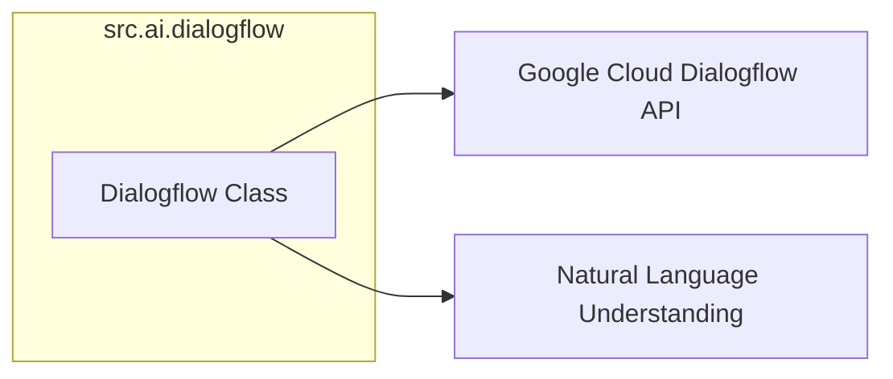

### **Системные инструкции для обработки кода проекта `hypotez`**

=========================================================================================

Описание функциональности и правил для генерации, анализа и улучшения кода. Направлено на обеспечение последовательного и читаемого стиля кодирования, соответствующего требованиям.

---

### **Основные принципы**

#### **1. Общие указания**:
- Соблюдай четкий и понятный стиль кодирования.
- Все изменения должны быть обоснованы и соответствовать установленным требованиям.

#### **2. Комментарии**:
- Используй `#` для внутренних комментариев.
- Документация всех функций, методов и классов должна следовать такому формату: 
    ```python
        def function(param: str, param1: Optional[str | dict | str] = None) -> dict | None:
            """ 
            Args:
                param (str): Описание параметра `param`.
                param1 (Optional[str | dict | str], optional): Описание параметра `param1`. По умолчанию `None`.
    
            Returns:
                dict | None: Описание возвращаемого значения. Возвращает словарь или `None`.
    
            Raises:
                SomeError: Описание ситуации, в которой возникает исключение `SomeError`.

            Ехаmple:
                >>> function('param', 'param1')
                {'param': 'param1'}
            """
    ```
- Комментарии и документация должны быть четкими, лаконичными и точными.

#### **3. Форматирование кода**:
- Используй одинарные кавычки. `a:str = 'value'`, `print('Hello World!')`;
- Добавляй пробелы вокруг операторов. Например, `x = 5`;
- Все параметры должны быть аннотированы типами. `def function(param: str, param1: Optional[str | dict | str] = None) -> dict | None:`;
- Не используй `Union`. Вместо этого используй `|`.

#### **4. Логирование**:
- Для логгирования Всегда Используй модуль `logger` из `src.logger.logger`.
- Ошибки должны логироваться с использованием `logger.error`.
Пример:
    ```python
        try:
            ...
        except Exception as ex:
            logger.error('Error while processing data', ех, exc_info=True)
    ```
#### **5 Не используй `Union[]` в коде. Вместо него используй `|`
Например:
```python
x: str | int ...
```


---

### **Основные требования**:

#### **1. Формат ответов в Markdown**:
- Все ответы должны быть выполнены в формате **Markdown**.

#### **2. Формат комментариев**:
- Используй указанный стиль для комментариев и документации в коде.
- Пример:

```python
from typing import Generator, Optional, List
from pathlib import Path


def read_text_file(
    file_path: str | Path,
    as_list: bool = False,
    extensions: Optional[List[str]] = None,
    chunk_size: int = 8192,
) -> Generator[str, None, None] | str | None:
    """
    Считывает содержимое файла (или файлов из каталога) с использованием генератора для экономии памяти.

    Args:
        file_path (str | Path): Путь к файлу или каталогу.
        as_list (bool): Если `True`, возвращает генератор строк.
        extensions (Optional[List[str]]): Список расширений файлов для чтения из каталога.
        chunk_size (int): Размер чанков для чтения файла в байтах.

    Returns:
        Generator[str, None, None] | str | None: Генератор строк, объединенная строка или `None` в случае ошибки.

    Raises:
        Exception: Если возникает ошибка при чтении файла.

    Example:
        >>> from pathlib import Path
        >>> file_path = Path('example.txt')
        >>> content = read_text_file(file_path)
        >>> if content:
        ...    print(f'File content: {content[:100]}...')
        File content: Example text...
    """
    ...
```
- Всегда делай подробные объяснения в комментариях. Избегай расплывчатых терминов, 
- таких как *«получить»* или *«делать»*. Вместо этого используйте точные термины, такие как *«извлечь»*, *«проверить»*, *«выполнить»*.
- Вместо: *«получаем»*, *«возвращаем»*, *«преобразовываем»* используй имя объекта *«функция получае»*, *«переменная возвращает»*, *«код преобразовывает»* 
- Комментарии должны непосредственно предшествовать описываемому блоку кода и объяснять его назначение.

#### **3. Пробелы вокруг операторов присваивания**:
- Всегда добавляйте пробелы вокруг оператора `=`, чтобы повысить читаемость.
- Примеры:
  - **Неправильно**: `x=5`
  - **Правильно**: `x = 5`

#### **4. Использование `j_loads` или `j_loads_ns`**:
- Для чтения JSON или конфигурационных файлов замените стандартное использование `open` и `json.load` на `j_loads` или `j_loads_ns`.
- Пример:

```python
# Неправильно:
with open('config.json', 'r', encoding='utf-8') as f:
    data = json.load(f)

# Правильно:
data = j_loads('config.json')
```

#### **5. Сохранение комментариев**:
- Все существующие комментарии, начинающиеся с `#`, должны быть сохранены без изменений в разделе «Улучшенный код».
- Если комментарий кажется устаревшим или неясным, не изменяйте его. Вместо этого отметьте его в разделе «Изменения».

#### **6. Обработка `...` в коде**:
- Оставляйте `...` как указатели в коде без изменений.
- Не документируйте строки с `...`.
```

#### **7. Аннотации**
Для всех переменных должны быть определены аннотации типа. 
Для всех функций все входные и выходные параметры аннотириваны
Для все параметров должны быть аннотации типа.


### **8. webdriver**
В коде используется webdriver. Он импртируется из модуля `webdriver` проекта `hypotez`
```python
from src.webdirver import Driver, Chrome, Firefox, Playwright, ...
driver = Driver(Firefox)

Пoсле чего может использоваться как

close_banner = {
  "attribute": null,
  "by": "XPATH",
  "selector": "//button[@id = 'closeXButton']",
  "if_list": "first",
  "use_mouse": false,
  "mandatory": false,
  "timeout": 0,
  "timeout_for_event": "presence_of_element_located",
  "event": "click()",
  "locator_description": "Закрываю pop-up окно, если оно не появилось - не страшно (`mandatory`:`false`)"
}

result = driver.execute_locator(close_banner)
```

### Анализ `src/ai/dialogflow/readme.ru.md`

Этот файл представляет собой документацию на русском языке для модуля `dialogflow`, который предназначен для интеграции с Google Dialogflow. Он описывает основные возможности модуля и предоставляет пример использования.

#### 1. **Блок-схема**

```mermaid
graph LR
    A[Начало] --> B(Инициализация Dialogflow клиента);
    B --> C{Определение намерения пользователя (detect_intent)};
    C -- Да --> D(Возвращает ответ с информацией о намерении);
    C -- Нет --> E(Обработка ошибки);
    B --> F{Получение списка намерений (list_intents)};
    F -- Да --> G(Возвращает список доступных намерений);
    F -- Нет --> H(Обработка ошибки);
    B --> I{Создание нового намерения (create_intent)};
    I -- Да --> J(Возвращает информацию о созданном намерении);
    I -- Нет --> K(Обработка ошибки);
    B --> L{Удаление намерения (delete_intent)};
    L -- Да --> M(Намерение удалено);
    L -- Нет --> N(Обработка ошибки);
    D --> O[Конец];
    G --> O;
    J --> O;
    M --> O;
    E --> O;
    H --> O;
    K --> O;
    N --> O;
```

**Примеры:**

*   **Инициализация клиента:** `dialogflow_client = Dialogflow(project_id, session_id)`
*   **Определение намерения:** `intent_response = dialogflow_client.detect_intent("Hello")`
*   **Получение списка намерений:** `intents = dialogflow_client.list_intents()`
*   **Создание нового намерения:** `new_intent = dialogflow_client.create_intent(...)`
*   **Удаление намерения:** `dialogflow_client.delete_intent("your-intent-id")`

#### 2. **Диаграмма**



**Объяснение зависимостей:**

*   `Dialogflow` класс представляет собой интеграцию с Google Dialogflow.
*   `GoogleAPI` представляет Google Cloud Dialogflow API, с которым взаимодействует класс `Dialogflow`.
*   `NLU` (Natural Language Understanding) - это область, к которой относится функциональность Dialogflow, обеспечивающая понимание естественного языка.

#### 3. **Объяснение**

*   **Модуль `src.ai.dialogflow`**: Этот модуль предоставляет функциональность для интеграции с Google Dialogflow, что позволяет создавать приложения, понимающие естественный язык.

*   **Ключевые функции:**
    *   **Определение намерений (Intent Detection)**: Позволяет определить, что пользователь хочет сделать, на основе его текста.
    *   **Работа с сущностями (Entity Recognition)**: Позволяет извлекать ключевые данные из текста пользователя (например, даты, имена, места).
    *   **Контексты (Contexts)**: Позволяют управлять состоянием разговора, запоминая предыдущие взаимодействия.
    *   **Интеграции**: Обеспечивает возможность подключения к различным платформам (Google Assistant, Facebook Messenger, и т.д.).
    *   **Webhook**: Позволяет вызывать внешние сервисы и API для обработки запросов.

*   **Пример использования:**
    В примере показано, как инициализировать клиента Dialogflow, определить намерение пользователя, получить список намерений и создать новое намерение.  Важно отметить, что для удаления намерения необходимо заменить `"your-intent-id"` на реальный ID намерения.

*   **Потенциальные улучшения:**
    *   Добавить обработку ошибок и логирование для более надежной работы.
    *   Реализовать поддержку контекстов для более сложных диалогов.
    *   Добавить возможность настройки параметров запросов к Dialogflow API.

**Цепочка взаимосвязей с другими частями проекта:**

Модуль `src.ai.dialogflow` может быть использован в других частях проекта, где требуется обработка естественного языка и создание разговорных интерфейсов. Например, он может быть интегрирован с модулями для обработки пользовательского ввода или для автоматизации задач.