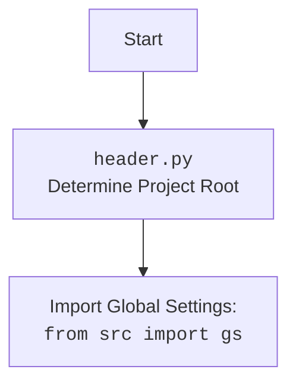

### **Системные инструкции для обработки кода проекта `hypotez`**

=========================================================================================

Описание функциональности и правил для генерации, анализа и улучшения кода. Направлено на обеспечение последовательного и читаемого стиля кодирования, соответствующего требованиям.

---

### **Основные принципы**

#### **1. Общие указания**:
- Соблюдай четкий и понятный стиль кодирования.
- Все изменения должны быть обоснованы и соответствовать установленным требованиям.

#### **2. Комментарии**:
- Используй `#` для внутренних комментариев.
- Документация всех функций, методов и классов должна следовать такому формату: 
    ```python
        def function(param: str, param1: Optional[str | dict | str] = None) -> dict | None:
            """ 
            Args:
                param (str): Описание параметра `param`.
                param1 (Optional[str | dict | str], optional): Описание параметра `param1`. По умолчанию `None`.
    
            Returns:
                dict | None: Описание возвращаемого значения. Возвращает словарь или `None`.
    
            Raises:
                SomeError: Описание ситуации, в которой возникает исключение `SomeError`.

            Ехаmple:
                >>> function('param', 'param1')
                {'param': 'param1'}
            """
    ```
- Комментарии и документация должны быть четкими, лаконичными и точными.

#### **3. Форматирование кода**:
- Используй одинарные кавычки. `a:str = 'value'`, `print('Hello World!')`;
- Добавляй пробелы вокруг операторов. Например, `x = 5`;
- Все параметры должны быть аннотированы типами. `def function(param: str, param1: Optional[str | dict | str] = None) -> dict | None:`;
- Не используй `Union`. Вместо этого используй `|`.

#### **4. Логирование**:
- Для логгирования Всегда Используй модуль `logger` из `src.logger.logger`.
- Ошибки должны логироваться с использованием `logger.error`.
Пример:
    ```python
        try:
            ...
        except Exception as ex:
            logger.error('Error while processing data', ех, exc_info=True)
    ```
#### **5 Не используй `Union[]` в коде. Вместо него используй `|`
Например:
```python
x: str | int ...
```


---

### **Основные требования**:

#### **1. Формат ответов в Markdown**:
- Все ответы должны быть выполнены в формате **Markdown**.

#### **2. Формат комментариев**:
- Используй указанный стиль для комментариев и документации в коде.
- Пример:

```python
from typing import Generator, Optional, List
from pathlib import Path


def read_text_file(
    file_path: str | Path,
    as_list: bool = False,
    extensions: Optional[List[str]] = None,
    chunk_size: int = 8192,
) -> Generator[str, None, None] | str | None:
    """
    Считывает содержимое файла (или файлов из каталога) с использованием генератора для экономии памяти.

    Args:
        file_path (str | Path): Путь к файлу или каталогу.
        as_list (bool): Если `True`, возвращает генератор строк.
        extensions (Optional[List[str]]): Список расширений файлов для чтения из каталога.
        chunk_size (int): Размер чанков для чтения файла в байтах.

    Returns:
        Generator[str, None, None] | str | None: Генератор строк, объединенная строка или `None` в случае ошибки.

    Raises:
        Exception: Если возникает ошибка при чтении файла.

    Example:
        >>> from pathlib import Path
        >>> file_path = Path('example.txt')
        >>> content = read_text_file(file_path)
        >>> if content:
        ...    print(f'File content: {content[:100]}...')
        File content: Example text...
    """
    ...
```
- Всегда делай подробные объяснения в комментариях. Избегай расплывчатых терминов, 
- таких как *«получить»* или *«делать»*. Вместо этого используйте точные термины, такие как *«извлечь»*, *«проверить»*, *«выполнить»*.
- Вместо: *«получаем»*, *«возвращаем»*, *«преобразовываем»* используй имя объекта *«функция получае»*, *«переменная возвращает»*, *«код преобразовывает»* 
- Комментарии должны непосредственно предшествовать описываемому блоку кода и объяснять его назначение.

#### **3. Пробелы вокруг операторов присваивания**:
- Всегда добавляйте пробелы вокруг оператора `=`, чтобы повысить читаемость.
- Примеры:
  - **Неправильно**: `x=5`
  - **Правильно**: `x = 5`

#### **4. Использование `j_loads` или `j_loads_ns`**:
- Для чтения JSON или конфигурационных файлов замените стандартное использование `open` и `json.load` на `j_loads` или `j_loads_ns`.
- Пример:

```python
# Неправильно:
with open('config.json', 'r', encoding='utf-8') as f:
    data = json.load(f)

# Правильно:
data = j_loads('config.json')
```

#### **5. Сохранение комментариев**:
- Все существующие комментарии, начинающиеся с `#`, должны быть сохранены без изменений в разделе «Улучшенный код».
- Если комментарий кажется устаревшим или неясным, не изменяйте его. Вместо этого отметьте его в разделе «Изменения».

#### **6. Обработка `...` в коде**:
- Оставляйте `...` как указатели в коде без изменений.
- Не документируйте строки с `...`.
```

#### **7. Аннотации**
Для всех переменных должны быть определены аннотации типа. 
Для всех функций все входные и выходные параметры аннотириваны
Для все параметров должны быть аннотации типа.


### **8. webdriver**
В коде используется webdriver. Он импртируется из модуля `webdriver` проекта `hypotez`
```python
from src.webdirver import Driver, Chrome, Firefox, Playwright, ...
driver = Driver(Firefox)

Пoсле чего может использоваться как

close_banner = {
  "attribute": null,
  "by": "XPATH",
  "selector": "//button[@id = 'closeXButton']",
  "if_list": "first",
  "use_mouse": false,
  "mandatory": false,
  "timeout": 0,
  "timeout_for_event": "presence_of_element_located",
  "event": "click()",
  "locator_description": "Закрываю pop-up окно, если оно не появилось - не страшно (`mandatory`:`false`)"
}

result = driver.execute_locator(close_banner)
```

## Анализ кода `hypotez/src/ai/openai/chat_openai/browser_agent.py`

### 1. Блок-схема

```mermaid
graph LR
    A[Начало] --> B{Инициализация AIBrowserAgent};
    B -- api_key, model_name, search_engine --> C{Инициализация ChatOpenAI (LLM)};
    C -- task_prompt --> D{Запуск run_task};
    D --> E{Определение driver (Playwright или custom)};
    E --> F{Инициализация Agent (browser_use)};
    F -- task_prompt, llm, driver --> G{Запуск agent.run()};
    G --> H{Обработка результата};
    H --> I{Закрытие driver (если возможно)};
    I --> J{Возврат результата};
    J --> K[Конец];

    style A fill:#f9f,stroke:#333,stroke-width:2px
    style K fill:#f9f,stroke:#333,stroke-width:2px
```

Пример для каждого логического блока:

*   **A (Начало)**: Начало работы программы.
*   **B (Инициализация AIBrowserAgent)**: Создается экземпляр класса `AIBrowserAgent` с переданными параметрами `api_key`, `model_name`, `search_engine` и `custom_driver`.
*   **C (Инициализация ChatOpenAI (LLM))**: Инициализируется языковая модель `ChatOpenAI` с использованием `api_key` и `model_name`.
*   **D (Запуск run_task)**: Вызывается метод `run_task` с аргументом `task_prompt`.
*   **E (Определение driver (Playwright или custom))**: Определяется, какой драйвер использовать: либо стандартный Playwright, либо переданный `custom_driver`.
*   **F (Инициализация Agent (browser_use))**: Инициализируется агент `Agent` из библиотеки `browser_use` с передачей `task_prompt`, языковой модели `llm` и драйвера `driver`.
*   **G (Запуск agent.run())**: Запускается выполнение задачи с использованием метода `run()` агента `Agent`.
*   **H (Обработка результата)**: Обрабатывается результат выполнения задачи, полученный от агента.
*   **I (Закрытие driver (если возможно))**: Попытка закрыть драйвер, если это возможно (есть метод `close`).
*   **J (Возврат результата)**: Возвращается результат выполнения задачи.
*   **K (Конец)**: Завершение работы программы.

### 2. Диаграмма

```mermaid
graph TD
    AIBrowserAgent --> ChatOpenAI
    AIBrowserAgent --> Agent
    AIBrowserAgent --> logger
    AIBrowserAgent --> urllib.parse
    AIBrowserAgent -- custom_driver --> WebDriver[WebDriver (custom)]
    Agent -- driver --> WebDriver

    subgraph Dependencies
        ChatOpenAI[langchain_openai.ChatOpenAI]
        Agent[browser_use.Agent]
        logger[src.logger.logger]
        urllib.parse[urllib.parse]
        WebDriver[WebDriver (e.g., PlaywrightFirefoxAdapter)]
    end

    style AIBrowserAgent fill:#f9f,stroke:#333,stroke-width:2px
```

**Объяснение зависимостей:**

*   **`langchain_openai.ChatOpenAI`**: Используется для взаимодействия с языковой моделью OpenAI.
*   **`browser_use.Agent`**: Основной класс для управления браузером и выполнения задач.
*   **`src.logger.logger`**: Модуль логирования для записи информации о работе агента и ошибок.
*   **`urllib.parse`**: Используется для кодирования URL-адресов.
*   **`WebDriver`**: Интерфейс для управления браузером (например, Playwright, Selenium).



### 3. Объяснение

#### Импорты:

*   `langchain_openai.ChatOpenAI`: Интеграция с OpenAI для использования языковых моделей. Позволяет создавать и использовать модели OpenAI для анализа и генерации текста.
*   `browser_use.Agent`: Класс для управления браузером и выполнения задач в браузере. Предоставляет интерфейс для автоматизации действий в браузере, таких как поиск информации и взаимодействие с веб-страницами.
*   `asyncio`: Модуль для поддержки асинхронного программирования. Используется для асинхронного выполнения задач, чтобы не блокировать основной поток выполнения.
*   `dotenv.load_dotenv`: Функция для загрузки переменных окружения из файла `.env`. Позволяет хранить конфиденциальную информацию (например, API-ключи) в файле `.env` и загружать их в переменные окружения.
*   `typing.Optional, typing.List, typing.Union`: Модуль `typing` используется для аннотации типов, что улучшает читаемость и помогает выявлять ошибки на этапе разработки. `Optional` указывает, что переменная может быть `None`, `List` указывает на список элементов определенного типа, `Union` указывает, что переменная может быть одного из перечисленных типов.
*   `urllib.parse`: Модуль для работы с URL-адресами, в частности, для кодирования и декодирования URL.
*   `header`: Определяет корень проекта.
*   `src.gs`: Используется для доступа к глобальным настройкам проекта, таким как учетные данные и параметры конфигурации.
*   `src.logger.logger`: Модуль логирования, используемый для записи информации о работе программы и отладки.

#### Классы:

*   **`AIBrowserAgent`**:
    *   **Роль**: Создание и управление агентом, использующим браузер для выполнения задач.
    *   **Атрибуты**:
        *   `api_key: str`: Ключ API OpenAI.
        *   `model_name: str`: Название языковой модели OpenAI.
        *   `search_engine: str`: Поисковая система для использования.
        *   `llm: ChatOpenAI`: Экземпляр языковой модели OpenAI.
        *   `custom_driver: Optional[object]`: Опциональный WebDriver.
    *   **Методы**:
        *   `__init__(self, api_key: str, model_name: str = "gpt-4o-mini", search_engine: str = "google", custom_driver: Optional[object] = None)`: Инициализирует класс `AIBrowserAgent`.
        *   `run_task(self, task_prompt: str) -> Optional[str]`: Запускает агента для выполнения задачи.
        *   `find_product_alternatives(self, product_url: Optional[str] = None, sku: Optional[str] = None) -> Optional[str]`: Ищет аналоги продукта по URL или SKU.
        *   `ask(self, q: str) -> Optional[str]`: Синхронная обертка для `ask_async`.
        *   `ask_async(self, q: str) -> Optional[str]`: Отвечает на вопрос, используя поиск в интернете.

#### Функции:

*   **`main()`**:
    *   **Аргументы**: Нет.
    *   **Возвращаемое значение**: Нет.
    *   **Назначение**: Пример использования класса `AIBrowserAgent`.
    *   **Пример**:

    ```python
    async def main():
        api_key: str = None  # Replace with your actual method of obtaining the API key
        model_name: str = 'gpt-4o-mini'
        agent = AIBrowserAgent(api_key=api_key, model_name=model_name)
        sku: str = '1493001'
        product_url: str = None
        alternatives = await agent.find_product_alternatives(product_url=product_url, sku=sku)
        if alternatives:
            print("Найденные аналоги:")
            print(alternatives)
        else:
            print("Не удалось найти аналоги.")
        question = "Какая сейчас погода в Москве?"
        answer = await agent.ask_async(question)
        if answer:
            print("Ответ на вопрос:")
            print(answer)
        else:
            print("Не удалось получить ответ на вопрос.")

    if __name__ == "__main__":
        asyncio.run(main())
    ```

#### Переменные:

*   `ENDPOINT: str = 'openai.browser_agent'`: Определяет endpoint для логирования и мониторинга.
*   `MODE: str = 'PRODUCTION'`: Определяет режим работы (PRODUCTION или DEV). Влияет на то, какой бот будет запущен.
*   `USE_ENV: bool`: Флаг, указывающий, следует ли загружать переменные окружения из файла `.env`.

#### Потенциальные ошибки и области для улучшения:

*   Обработка ошибок в асинхронных методах может быть улучшена с использованием более специфичных исключений.
*   Добавить возможность настройки параметров поисковой системы (например, количество результатов).
*   В `find_product_alternatives` можно добавить проверку на доступность URL продукта перед выполнением поиска.
*   В `main()` добавить обработку исключений при инициализации `AIBrowserAgent`.
*   В коде присутствует переменная `MODE`, которая переопределяется. Следует удалить одну из них или использовать разные имена.

#### Взаимосвязи с другими частями проекта:

*   `src.gs`: Используется для получения глобальных настроек, что позволяет централизованно управлять конфигурацией агента.
*   `src.logger.logger`: Используется для логирования, что позволяет отслеживать работу агента и выявлять проблемы.
*   `header`: Используется для определения корня проекта.

Этот модуль создает AI-агента, который может искать информацию в Google или DuckDuckGo и анализировать веб-страницы. Он использует библиотеки `langchain_openai` для интеграции с OpenAI и `browser_use` для управления браузером.