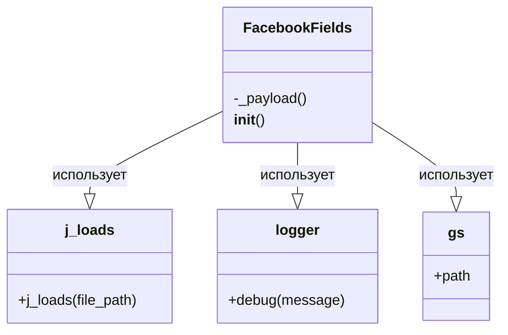

### **Системные инструкции для обработки кода проекта `hypotez`**

=========================================================================================

Описание функциональности и правил для генерации, анализа и улучшения кода. Направлено на обеспечение последовательного и читаемого стиля кодирования, соответствующего требованиям.

---

### **Основные принципы**

#### **1. Общие указания**:
- Соблюдай четкий и понятный стиль кодирования.
- Все изменения должны быть обоснованы и соответствовать установленным требованиям.

#### **2. Комментарии**:
- Используй `#` для внутренних комментариев.
- Документация всех функций, методов и классов должна следовать такому формату: 
    ```python
        def function(param: str, param1: Optional[str | dict | str] = None) -> dict | None:
            """ 
            Args:
                param (str): Описание параметра `param`.
                param1 (Optional[str | dict | str], optional): Описание параметра `param1`. По умолчанию `None`.
    
            Returns:
                dict | None: Описание возвращаемого значения. Возвращает словарь или `None`.
    
            Raises:
                SomeError: Описание ситуации, в которой возникает исключение `SomeError`.

            Ехаmple:
                >>> function('param', 'param1')
                {'param': 'param1'}
            """
    ```
- Комментарии и документация должны быть четкими, лаконичными и точными.

#### **3. Форматирование кода**:
- Используй одинарные кавычки. `a:str = 'value'`, `print('Hello World!')`;
- Добавляй пробелы вокруг операторов. Например, `x = 5`;
- Все параметры должны быть аннотированы типами. `def function(param: str, param1: Optional[str | dict | str] = None) -> dict | None:`;
- Не используй `Union`. Вместо этого используй `|`.

#### **4. Логирование**:
- Для логгирования Всегда Используй модуль `logger` из `src.logger.logger`.
- Ошибки должны логироваться с использованием `logger.error`.
Пример:
    ```python
        try:
            ...
        except Exception as ex:
            logger.error('Error while processing data', ех, exc_info=True)
    ```
#### **5 Не используй `Union[]` в коде. Вместо него используй `|`
Например:
```python
x: str | int ...
```


---

### **Основные требования**:

#### **1. Формат ответов в Markdown**:
- Все ответы должны быть выполнены в формате **Markdown**.

#### **2. Формат комментариев**:
- Используй указанный стиль для комментариев и документации в коде.
- Пример:

```python
from typing import Generator, Optional, List
from pathlib import Path


def read_text_file(
    file_path: str | Path,
    as_list: bool = False,
    extensions: Optional[List[str]] = None,
    chunk_size: int = 8192,
) -> Generator[str, None, None] | str | None:
    """
    Считывает содержимое файла (или файлов из каталога) с использованием генератора для экономии памяти.

    Args:
        file_path (str | Path): Путь к файлу или каталогу.
        as_list (bool): Если `True`, возвращает генератор строк.
        extensions (Optional[List[str]]): Список расширений файлов для чтения из каталога.
        chunk_size (int): Размер чанков для чтения файла в байтах.

    Returns:
        Generator[str, None, None] | str | None: Генератор строк, объединенная строка или `None` в случае ошибки.

    Raises:
        Exception: Если возникает ошибка при чтении файла.

    Example:
        >>> from pathlib import Path
        >>> file_path = Path('example.txt')
        >>> content = read_text_file(file_path)
        >>> if content:
        ...    print(f'File content: {content[:100]}...')
        File content: Example text...
    """
    ...
```
- Всегда делай подробные объяснения в комментариях. Избегай расплывчатых терминов, 
- таких как *«получить»* или *«делать»*
-  . Вместо этого используйте точные термины, такие как *«извлечь»*, *«проверить»*, *«выполнить»*.
- Вместо: *«получаем»*, *«возвращаем»*, *«преобразовываем»* используй имя объекта *«функция получае»*, *«переменная возвращает»*, *«код преобразовывает»* 
- Комментарии должны непосредственно предшествовать описываемому блоку кода и объяснять его назначение.

#### **3. Пробелы вокруг операторов присваивания**:
- Всегда добавляйте пробелы вокруг оператора `=`, чтобы повысить читаемость.
- Примеры:
  - **Неправильно**: `x=5`
  - **Правильно**: `x = 5`

#### **4. Использование `j_loads` или `j_loads_ns`**:
- Для чтения JSON или конфигурационных файлов замените стандартное использование `open` и `json.load` на `j_loads` или `j_loads_ns`.
- Пример:

```python
# Неправильно:
with open('config.json', 'r', encoding='utf-8') as f:
    data = json.load(f)

# Правильно:
data = j_loads('config.json')
```

#### **5. Сохранение комментариев**:
- Все существующие комментарии, начинающиеся с `#`, должны быть сохранены без изменений в разделе «Улучшенный код».
- Если комментарий кажется устаревшим или неясным, не изменяйте его. Вместо этого отметьте его в разделе «Изменения».

#### **6. Обработка `...` в коде**:
- Оставляйте `...` как указатели в коде без изменений.
- Не документируйте строки с `...`.
```

#### **7. Аннотации**
Для всех переменных должны быть определены аннотации типа. 
Для всех функций все входные и выходные параметры аннотириваны
Для все параметров должны быть аннотации типа.


### **8. webdriver**
В коде используется webdriver. Он импртируется из модуля `webdriver` проекта `hypotez`
```python
from src.webdirver import Driver, Chrome, Firefox, Playwright, ...
driver = Driver(Firefox)

Пoсле чего может использоваться как

close_banner = {
  "attribute": null,
  "by": "XPATH",
  "selector": "//button[@id = 'closeXButton']",
  "if_list": "first",
  "use_mouse": false,
  "mandatory": false,
  "timeout": 0,
  "timeout_for_event": "presence_of_element_located",
  "event": "click()",
  "locator_description": "Закрываю pop-up окно, если оно не появилось - не страшно (`mandatory`:`false`)"
}

result = driver.execute_locator(close_banner)
```

## Анализ кода `facebook_fields.py`

### 1. Блок-схема

```mermaid
graph TD
    A[Начало: Инициализация класса `FacebookFields`] --> B{Вызов `self._payload()`};
    B --> C[Функция `_payload()`: Загрузка данных из JSON файла];
    C --> D{Попытка загрузки JSON из `facebook_feilds.json`};
    D -- Успешно --> E[Перебор элементов в загруженных данных];
    D -- Ошибка --> F[Логирование ошибки загрузки];
    E --> G[Установка атрибутов объекта `self` из данных JSON];
    G --> H[Конец: Атрибуты объекта `self` установлены];
    F --> H;
```

**Примеры для логических блоков:**

-   **A**: `fb_fields = FacebookFields()` - Создание экземпляра класса.
-   **B**: `self._payload()` - Вызов метода для загрузки данных.
-   **C**: Метод `_payload` пытается прочитать JSON файл, расположенный по пути, определенному в `gs.path.src`.
-   **D**: `data = j_loads (Path (gs.path.src, 'advertisement', 'facebok', 'facebook_feilds.json'))` - попытка загрузки данных из файла. Если файл не найден или имеет неверный формат, `j_loads` вернет `None`.
-   **E**: Цикл `for name, value in data.items():` - перебор элементов (ключ, значение) в словаре `data`.
-   **F**: `logger.debug(f"Ошибка загрузки полей из файла {gs.path.src}/advertisement/facebok/facebook_feilds.json")` - логирование ошибки, если не удалось загрузить данные.
-   **G**: `setattr(self, f'{name}', value)` - установка атрибута для объекта `self`. Например, если в `facebook_feilds.json` есть поле `{"campaign_name": "MyCampaign"}`, то будет установлен атрибут `self.campaign_name = "MyCampaign"`.

### 2. Диаграмма



**Объяснение зависимостей:**

*   `FacebookFields` использует `j_loads` для загрузки данных из JSON файла.
*   `FacebookFields` использует `logger` для логирования ошибок.
*   `FacebookFields` использует `gs` для получения пути к файлу конфигурации.

### 3. Объяснение

#### Импорты:

*   `pathlib.Path`: Используется для работы с путями к файлам и каталогам.
*   `src.gs`: `gs` (global settings) — это модуль, содержащий глобальные настройки проекта, включая пути к различным директориям.
*   `src.utils.jjson.j_loads`: Функция `j_loads` используется для загрузки данных из JSON файла. Она выполняет те же функции, что и `json.load`, но предоставляет дополнительную функциональность или обработку ошибок.
*   `src.utils.jjson.j_loads_ns`: (Not used)
*   `src.logger.logger`: Модуль `logger` используется для логирования отладочной информации и ошибок.

#### Классы:

*   `FacebookFields`:
    *   **Роль**: Предназначен для хранения полей, используемых в Facebook API для работы с объявлениями и эвентами.
    *   **Атрибуты**: Атрибуты устанавливаются динамически из JSON файла.
    *   **Методы**:
        *   `__init__(self)`: Конструктор класса, который вызывает метод `self._payload()` для инициализации полей.
        *   `_payload(self)`: Загружает данные из JSON файла, расположенного по пути `gs.path.src/advertisement/facebok/facebook_feilds.json`, и устанавливает атрибуты объекта `self` на основе этих данных. Если загрузка не удалась, логирует ошибку.

#### Функции:

*   `__init__(self)`:
    *   **Аргументы**: `self` (экземпляр класса).
    *   **Возвращаемое значение**: None.
    *   **Назначение**: Инициализирует класс и вызывает метод `_payload` для загрузки полей.
*   `_payload(self)`:
    *   **Аргументы**: `self` (экземпляр класса).
    *   **Возвращаемое значение**: `True` в случае успешной загрузки данных, `None` в случае ошибки.
    *   **Назначение**: Загружает данные из JSON файла с использованием `j_loads` и устанавливает атрибуты объекта `self` на основе этих данных. В случае ошибки логирует отладочное сообщение.

#### Переменные:

*   `data`: Содержит данные, загруженные из JSON файла. Если файл не удалось загрузить, `data` будет `None`.
*   `name`, `value`: Используются в цикле `for name, value in data.items():` для перебора ключей и значений в словаре `data`.

#### Потенциальные ошибки и области для улучшения:

*   **Обработка ошибок**: В случае ошибки загрузки JSON файла логируется только отладочное сообщение. Может быть полезно добавить более серьезную обработку ошибок, например, выбрасывать исключение или использовать значения по умолчанию.
*   **Путь к файлу**: Жестко заданный путь к файлу `facebook_feilds.json`. Лучше использовать относительные пути или переменные окружения для гибкости.
*   **Отсутствие аннотаций типов**: Отсутствуют аннотации типов для параметров и возвращаемых значений методов.

#### Взаимосвязи с другими частями проекта:

*   Модуль зависит от `src.gs` для получения пути к файлу конфигурации, что позволяет централизованно управлять настройками проекта.
*   Использует `src.utils.jjson.j_loads` для загрузки данных из JSON файла, что обеспечивает унифицированный способ работы с JSON данными в проекте.
*   Использует `src.logger.logger` для логирования, что позволяет централизованно собирать и анализировать логи.
*   Модуль `facebook_fields.py` предоставляет класс `FacebookFields`, который используется другими модулями для получения доступа к полям, необходимым для работы с Facebook API.

```mermaid
flowchart TD
    Start --> A[<code>src.gs</code><br>Global Settings]
    A --> B[Определение путей к файлам и директориям]
    B --> End