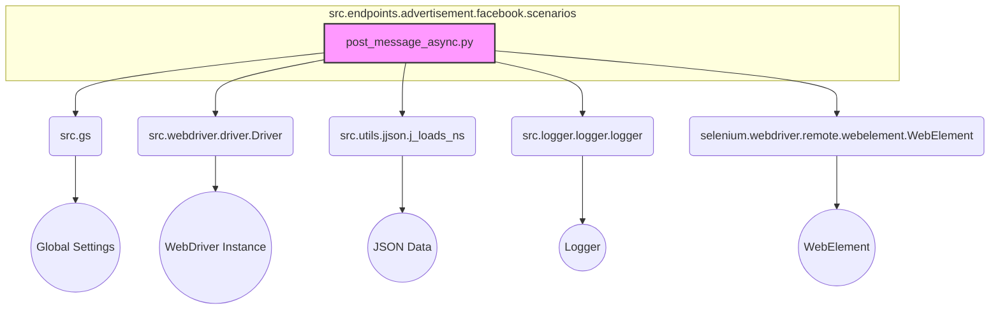

### **Системные инструкции для обработки кода проекта `hypotez`**

=========================================================================================

Описание функциональности и правил для генерации, анализа и улучшения кода. Направлено на обеспечение последовательного и читаемого стиля кодирования, соответствующего требованиям.

---

### **Основные принципы**

#### **1. Общие указания**:
- Соблюдай четкий и понятный стиль кодирования.
- Все изменения должны быть обоснованы и соответствовать установленным требованиям.

#### **2. Комментарии**:
- Используй `#` для внутренних комментариев.
- Документация всех функций, методов и классов должна следовать такому формату: 
    ```python
        def function(param: str, param1: Optional[str | dict | str] = None) -> dict | None:
            """ 
            Args:
                param (str): Описание параметра `param`.
                param1 (Optional[str | dict | str], optional): Описание параметра `param1`. По умолчанию `None`.
    
            Returns:
                dict | None: Описание возвращаемого значения. Возвращает словарь или `None`.
    
            Raises:
                SomeError: Описание ситуации, в которой возникает исключение `SomeError`.

            Ехаmple:
                >>> function('param', 'param1')
                {'param': 'param1'}
            """
    ```
- Комментарии и документация должны быть четкими, лаконичными и точными.

#### **3. Форматирование кода**:
- Используй одинарные кавычки. `a:str = 'value'`, `print('Hello World!')`;
- Добавляй пробелы вокруг операторов. Например, `x = 5`;
- Все параметры должны быть аннотированы типами. `def function(param: str, param1: Optional[str | dict | str] = None) -> dict | None:`;
- Не используй `Union`. Вместо этого используй `|`.

#### **4. Логирование**:
- Для логгирования Всегда Используй модуль `logger` из `src.logger.logger`.
- Ошибки должны логироваться с использованием `logger.error`.
Пример:
    ```python
        try:
            ...
        except Exception as ex:
            logger.error('Error while processing data', ех, exc_info=True)
    ```
#### **5 Не используй `Union[]` в коде. Вместо него используй `|`
Например:
```python
x: str | int ...
```


---

### **Основные требования**:

#### **1. Формат ответов в Markdown**:
- Все ответы должны быть выполнены в формате **Markdown**.

#### **2. Формат комментариев**:
- Используй указанный стиль для комментариев и документации в коде.
- Пример:

```python
from typing import Generator, Optional, List
from pathlib import Path


def read_text_file(
    file_path: str | Path,
    as_list: bool = False,
    extensions: Optional[List[str]] = None,
    chunk_size: int = 8192,
) -> Generator[str, None, None] | str | None:
    """
    Считывает содержимое файла (или файлов из каталога) с использованием генератора для экономии памяти.

    Args:
        file_path (str | Path): Путь к файлу или каталогу.
        as_list (bool): Если `True`, возвращает генератор строк.
        extensions (Optional[List[str]]): Список расширений файлов для чтения из каталога.
        chunk_size (int): Размер чанков для чтения файла в байтах.

    Returns:
        Generator[str, None, None] | str | None: Генератор строк, объединенная строка или `None` в случае ошибки.

    Raises:
        Exception: Если возникает ошибка при чтении файла.

    Example:
        >>> from pathlib import Path
        >>> file_path = Path('example.txt')
        >>> content = read_text_file(file_path)
        >>> if content:
        ...    print(f'File content: {content[:100]}...')
        File content: Example text...
    """
    ...
```
- Всегда делай подробные объяснения в комментариях. Избегай расплывчатых терминов, 
- таких как *«получить»* или *«делать»*. Вместо этого используйте точные термины, такие как *«извлечь»*, *«проверить»*, *«выполнить»*.
- Вместо: *«получаем»*, *«возвращаем»*, *«преобразовываем»* используй имя объекта *«функция получае»*, *«переменная возвращает»*, *«код преобразовывает»* 
- Комментарии должны непосредственно предшествовать описываемому блоку кода и объяснять его назначение.

#### **3. Пробелы вокруг операторов присваивания**:
- Всегда добавляйте пробелы вокруг оператора `=`, чтобы повысить читаемость.
- Примеры:
  - **Неправильно**: `x=5`
  - **Правильно**: `x = 5`

#### **4. Использование `j_loads` или `j_loads_ns`**:
- Для чтения JSON или конфигурационных файлов замените стандартное использование `open` и `json.load` на `j_loads` или `j_loads_ns`.
- Пример:

```python
# Неправильно:
with open('config.json', 'r', encoding='utf-8') as f:
    data = json.load(f)

# Правильно:
data = j_loads('config.json')
```

#### **5. Сохранение комментариев**:
- Все существующие комментарии, начинающиеся с `#`, должны быть сохранены без изменений в разделе «Улучшенный код».
- Если комментарий кажется устаревшим или неясным, не изменяйте его. Вместо этого отметьте его в разделе «Изменения».

#### **6. Обработка `...` в коде**:
- Оставляйте `...` как указатели в коде без изменений.
- Не документируйте строки с `...`.
```

#### **7. Аннотации**
Для всех переменных должны быть определены аннотации типа. 
Для всех функций все входные и выходные параметры аннотириваны
Для все параметров должны быть аннотации типа.


### **8. webdriver**
В коде используется webdriver. Он импртируется из модуля `webdriver` проекта `hypotez`
```python
from src.webdirver import Driver, Chrome, Firefox, Playwright, ...
driver = Driver(Firefox)

Пoсле чего может использоваться как

close_banner = {
  "attribute": null,
  "by": "XPATH",
  "selector": "//button[@id = 'closeXButton']",
  "if_list": "first",
  "use_mouse": false,
  "mandatory": false,
  "timeout": 0,
  "timeout_for_event": "presence_of_element_located",
  "event": "click()",
  "locator_description": "Закрываю pop-up окно, если оно не появилось - не страшно (`mandatory`:`false`)"
}

result = driver.execute_locator(close_banner)
```

### Анализ кода `hypotez/src/endpoints/advertisement/facebook/scenarios/post_message_async.py`

#### 1. Блок-схема

```mermaid
graph TD
    A[Начало: promote_post] --> B{Вызов: post_title};
    B -- Успешно --> C{Ожидание: d.wait(0.5)};
    B -- Ошибка --> F[Завершение: Ошибка post_title];
    C --> D{Вызов: upload_media};
    D -- Успешно --> E{Вызов: d.execute_locator(locator.finish_editing_button)};
    D -- Ошибка --> G[Завершение: Ошибка upload_media];
    E -- Успешно --> H{Вызов: d.execute_locator(locator.publish)};
    E -- Ошибка --> I[Завершение: Ошибка finish_editing_button];
    H -- Успешно --> J[Завершение: Успех promote_post];
    H -- Ошибка --> K[Завершение: Ошибка publish];
    
    subgraph post_title
        B --> B1{Вызов: d.scroll(1, 1200, 'backward')};
        B1 -- Успешно --> B2{Вызов: d.execute_locator(locator.open_add_post_box)};
        B1 -- Ошибка --> B3[Завершение: Ошибка scroll];
        B2 -- Успешно --> B4{Формирование message};
        B2 -- Ошибка --> B5[Завершение: Ошибка open_add_post_box];
        B4 --> B6{Вызов: d.execute_locator(locator.add_message, message)};
        B6 -- Успешно --> B7[Завершение: Успех post_title];
        B6 -- Ошибка --> B8[Завершение: Ошибка add_message];
    end
    
    subgraph upload_media
        D --> D1{Вызов: d.execute_locator(locator.open_add_foto_video_form)};
        D1 -- Успешно --> D2{Ожидание: d.wait(0.5)};
        D1 -- Ошибка --> D3[Завершение: Ошибка open_add_foto_video_form];
        D2 --> D4{products = products if isinstance(products, list) else [products]};
        D4 --> D5{Цикл: for product in products};
        D5 --> D6{media_path = ...};
        D6 --> D7{Вызов: d.execute_locator(locator.foto_video_input, media_path)};
        D7 -- Успешно --> D8{Ожидание: d.wait(1.5)};
        D7 -- Ошибка --> D9[Завершение: Ошибка загрузки изображения];
        D8 --> D5;
        D5 -- Конец цикла --> DA{Вызов: d.execute_locator(locator.edit_uloaded_media_button)};
        DA -- Успешно --> DB{uploaded_media_frame = d.execute_locator(locator.uploaded_media_frame)};
        DA -- Ошибка --> DC[Завершение: Ошибка edit_uloaded_media_button];
        DB --> DD{uploaded_media_frame = ...};
        DD --> DE{Ожидание: d.wait(0.3)};
        DE --> DF{textarea_list = d.execute_locator(locator.edit_image_properties_textarea)};
        DF -- Успешно --> DG{Вызов: update_images_captions};
        DF -- Ошибка --> DH[Завершение: Ошибка поиска textarea];
        DG --> DI[Завершение: Успех upload_media];
    end
```

#### 2. Диаграмма



**Объяснение зависимостей:**

-   `src.gs`: Импортирует глобальные настройки проекта, необходимые для определения путей к файлам.
-   `src.webdriver.driver.Driver`: Импортирует класс `Driver`, используемый для управления браузером через Selenium.
-   `src.utils.jjson.j_loads_ns`: Импортирует функцию `j_loads_ns` для загрузки данных из JSON-файлов, в частности, локаторов.
-   `src.logger.logger.logger`: Импортирует объект `logger` для логирования событий и ошибок.
-   `selenium.webdriver.remote.webelement.WebElement`: Класс, представляющий веб-элемент на странице, используется для работы с элементами textarea.

#### 3. Объяснение

**Импорты:**

-   `time`: Используется для добавления задержек в процессе выполнения, например, `time.sleep(1)`.
-   `asyncio`: Используется для асинхронного выполнения задач, таких как обновление подписей к изображениям.
-   `pathlib.Path`: Используется для работы с путями к файлам и каталогам.
-   `typing.Dict, typing.List`: Используются для аннотации типов переменных и параметров функций.
-   `selenium.webdriver.remote.webelement.WebElement`: Используется для представления веб-элементов на странице, в частности, textarea.
-   `src.gs`: Импортирует глобальные настройки проекта.
-   `src.webdriver.driver.Driver`: Импортирует класс `Driver` для управления браузером.
-   `src.utils.jjson.j_loads_ns`: Импортирует функцию `j_loads_ns` для загрузки JSON-файлов в виде пространств имен.
-   `src.logger.logger.logger`: Импортирует объект `logger` для логирования событий.

**Переменные:**

-   `locator`: Объект `SimpleNamespace`, содержащий локаторы элементов веб-страницы, загруженные из JSON-файла (`post_message.json`).

**Функции:**

-   `post_title(d: Driver, category: SimpleNamespace) -> bool`:
    -   **Аргументы:**
        -   `d`: Экземпляр класса `Driver`, используемый для взаимодействия с веб-страницей.
        -   `category`: Объект `SimpleNamespace`, содержащий заголовок (`title`) и описание (`description`) кампании.
    -   **Возвращаемое значение:**
        -   `bool`: `True`, если заголовок и описание успешно отправлены, иначе `None`.
    -   **Назначение:**
        -   Отправляет заголовок и описание кампании в поле для ввода сообщения.
        -   Сначала прокручивает страницу назад, затем открывает поле для добавления сообщения, формирует сообщение и добавляет его в поле.
    -   **Пример:**
        ```python
        driver = Driver(...)
        category = SimpleNamespace(title="Campaign Title", description="Campaign Description")
        post_title(driver, category)
        ```
-   `async def upload_media(d: Driver, products: List[SimpleNamespace], no_video:bool = False) -> bool`:
    -   **Аргументы:**
        -   `d`: Экземпляр класса `Driver`.
        -   `products`: Список объектов `SimpleNamespace`, содержащих информацию о продуктах, включая пути к медиафайлам (`local_image_path`, `local_video_path`).
        -   `no_video`: `bool` флаг, указывающий на то, что видео не нужно загружать.
    -   **Возвращаемое значение:**
        -   `bool`: `True`, если медиафайлы успешно загружены, иначе `None`.
    -   **Назначение:**
        -   Загружает медиафайлы (изображения или видео) и обновляет подписи к ним.
        -   Открывает форму для добавления медиа, загружает файлы из списка продуктов и обновляет подписи.
    -   **Пример:**
        ```python
        driver = Driver(...)
        products = [SimpleNamespace(local_image_path='path/to/image.jpg', ...)]
        await upload_media(driver, products)
        ```
-   `async def update_images_captions(d: Driver, products: List[SimpleNamespace], textarea_list: List[WebElement]) -> None`:
    -   **Аргументы:**
        -   `d`: Экземпляр класса `Driver`.
        -   `products`: Список объектов `SimpleNamespace`, содержащих детали продуктов для обновления.
        -   `textarea_list`: Список веб-элементов textarea, в которые добавляются подписи.
    -   **Назначение:**
        -   Асинхронно добавляет описания к загруженным медиафайлам.
        -   Использует `asyncio.to_thread` для выполнения функции `handle_product` в отдельном потоке для каждого продукта.
    -   `handle_product`
        -   **Аргументы:**
            -   `product`: Продукт для обновления
            -   `textarea_list`: Список textarea
            -   `i`: Индекс продукта
        -   **Назначение:**
            -   Обновляет подписи для каждого продукта.
-   `async def promote_post(d: Driver, category: SimpleNamespace, products: List[SimpleNamespace], no_video:bool = False) -> bool`:
    -   **Аргументы:**
        -   `d`: Экземпляр класса `Driver`.
        -   `category`: Объект `SimpleNamespace` с деталями категории для заголовка и описания поста.
        -   `products`: Список объектов `SimpleNamespace` с медиафайлами и деталями продуктов.
        -   `no_video`: `bool` флаг, указывающий на то, что видео не нужно загружать.
    -   **Возвращаемое значение:**
        -   `bool`: `True`, если процесс продвижения поста завершился успешно, иначе `None`.
    -   **Назначение:**
        -   Управляет процессом продвижения поста, включающим добавление заголовка, описания и медиафайлов.
        -   Вызывает функции `post_title`, `upload_media` и `d.execute_locator` для завершения процесса.

**Классы:**

В данном коде классы не определены. Используются экземпляры класса `Driver` и `SimpleNamespace`.

**Потенциальные ошибки и области для улучшения:**

1.  **Обработка ошибок:** В функциях `post_title` и `upload_media` при возникновении ошибки возвращается `None`, хотя в аннотации указан тип `bool`. Стоит изменить возвращаемое значение на `False` в случае ошибки.
2.  **Логирование:** В некоторых местах логируются только сообщения об ошибках, но не логируются успешные операции. Добавление логирования успешных операций может помочь в отладке и мониторинге.
3.  **Асинхронность:** Использование `asyncio.to_thread` для выполнения `handle_product` может быть избыточным, если операции внутри `handle_product` не являются блокирующими. Если `send_keys` является блокирующей операцией, то использование потоков оправдано.
4.  **Улучшение читаемости:** Можно разбить функцию `update_images_captions` на более мелкие подфункции для улучшения читаемости.

**Цепочка взаимосвязей с другими частями проекта:**

-   Этот модуль является частью подсистемы для автоматизации публикаций в Facebook (`src.endpoints.advertisement.facebook`).
-   Он использует общие компоненты, такие как `Driver` для управления браузером, `j_loads_ns` для загрузки конфигураций и `logger` для логирования.
-   Данный модуль зависит от структуры JSON-файлов, определяющих локаторы элементов веб-страницы.
-   Он также использует глобальные настройки проекта, хранящиеся в `src.gs`.