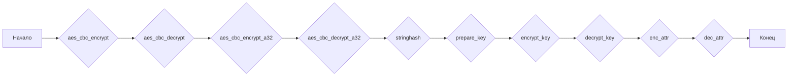

### **Системные инструкции для обработки кода проекта `hypotez`**

=========================================================================================

Описание функциональности и правил для генерации, анализа и улучшения кода. Направлено на обеспечение последовательного и читаемого стиля кодирования, соответствующего требованиям.

---

### **Основные принципы**

#### **1. Общие указания**:
- Соблюдай четкий и понятный стиль кодирования.
- Все изменения должны быть обоснованы и соответствовать установленным требованиям.

#### **2. Комментарии**:
- Используй `#` для внутренних комментариев.
- Документация всех функций, методов и классов должна следовать такому формату: 
    ```python
        def function(param: str, param1: Optional[str | dict | str] = None) -> dict | None:
            """ 
            Args:
                param (str): Описание параметра `param`.
                param1 (Optional[str | dict | str], optional): Описание параметра `param1`. По умолчанию `None`.
    
            Returns:
                dict | None: Описание возвращаемого значения. Возвращает словарь или `None`.
    
            Raises:
                SomeError: Описание ситуации, в которой возникает исключение `SomeError`.

            Ехаmple:
                >>> function('param', 'param1')
                {'param': 'param1'}
            """
    ```
- Комментарии и документация должны быть четкими, лаконичными и точными.

#### **3. Форматирование кода**:
- Используй одинарные кавычки. `a:str = 'value'`, `print('Hello World!')`;
- Добавляй пробелы вокруг операторов. Например, `x = 5`;
- Все параметры должны быть аннотированы типами. `def function(param: str, param1: Optional[str | dict | str] = None) -> dict | None:`;
- Не используй `Union`. Вместо этого используй `|`.

#### **4. Логирование**:
- Для логгирования Всегда Используй модуль `logger` из `src.logger.logger`.
- Ошибки должны логироваться с использованием `logger.error`.
Пример:
    ```python
        try:
            ...
        except Exception as ex:
            logger.error('Error while processing data', ех, exc_info=True)
    ```
#### **5 Не используй `Union[]` в коде. Вместо него используй `|`
Например:
```python
x: str | int ...
```


---

### **Основные требования**:

#### **1. Формат ответов в Markdown**:
- Все ответы должны быть выполнены в формате **Markdown**.

#### **2. Формат комментариев**:
- Используй указанный стиль для комментариев и документации в коде.
- Пример:

```python
from typing import Generator, Optional, List
from pathlib import Path


def read_text_file(
    file_path: str | Path,
    as_list: bool = False,
    extensions: Optional[List[str]] = None,
    chunk_size: int = 8192,
) -> Generator[str, None, None] | str | None:
    """
    Считывает содержимое файла (или файлов из каталога) с использованием генератора для экономии памяти.

    Args:
        file_path (str | Path): Путь к файлу или каталогу.
        as_list (bool): Если `True`, возвращает генератор строк.
        extensions (Optional[List[str]]): Список расширений файлов для чтения из каталога.
        chunk_size (int): Размер чанков для чтения файла в байтах.

    Returns:
        Generator[str, None, None] | str | None: Генератор строк, объединенная строка или `None` в случае ошибки.

    Raises:
        Exception: Если возникает ошибка при чтении файла.

    Example:
        >>> from pathlib import Path
        >>> file_path = Path('example.txt')
        >>> content = read_text_file(file_path)
        >>> if content:
        ...    print(f'File content: {content[:100]}...')
        File content: Example text...
    """
    ...
```
- Всегда делай подробные объяснения в комментариях. Избегай расплывчатых терминов, 
- таких как *«получить»* или *«делать»*. Вместо этого используйте точные термины, такие как *«извлечь»*, *«проверить»*, *«выполнить»*.
- Вместо: *«получаем»*, *«возвращаем»*, *«преобразовываем»* используй имя объекта *«функция получае»*, *«переменная возвращает»*, *«код преобразовывает»* 
- Комментарии должны непосредственно предшествовать описываемому блоку кода и объяснять его назначение.

#### **3. Пробелы вокруг операторов присваивания**:
- Всегда добавляйте пробелы вокруг оператора `=`, чтобы повысить читаемость.
- Примеры:
  - **Неправильно**: `x=5`
  - **Правильно**: `x = 5`

#### **4. Использование `j_loads` или `j_loads_ns`**:
- Для чтения JSON или конфигурационных файлов замените стандартное использование `open` и `json.load` на `j_loads` или `j_loads_ns`.
- Пример:

```python
# Неправильно:
with open('config.json', 'r', encoding='utf-8') as f:
    data = json.load(f)

# Правильно:
data = j_loads('config.json')
```

#### **5. Сохранение комментариев**:
- Все существующие комментарии, начинающиеся с `#`, должны быть сохранены без изменений в разделе «Улучшенный код».
- Если комментарий кажется устаревшим или неясным, не изменяйте его. Вместо этого отметьте его в разделе «Изменения».

#### **6. Обработка `...` в коде**:
- Оставляйте `...` как указатели в коде без изменений.
- Не документируйте строки с `...`.
```

#### **7. Аннотации**
Для всех переменных должны быть определены аннотации типа. 
Для всех функций все входные и выходные параметры аннотириваны
Для все параметров должны быть аннотации типа.


### **8. webdriver**
В коде используется webdriver. Он импртируется из модуля `webdriver` проекта `hypotez`
```python
from src.webdirver import Driver, Chrome, Firefox, Playwright, ...
driver = Driver(Firefox)

Пoсле чего может использоваться как

close_banner = {
  "attribute": null,
  "by": "XPATH",
  "selector": "//button[@id = 'closeXButton']",
  "if_list": "first",
  "use_mouse": false,
  "mandatory": false,
  "timeout": 0,
  "timeout_for_event": "presence_of_element_located",
  "event": "click()",
  "locator_description": "Закрываю pop-up окно, если оно не появилось - не страшно (`mandatory`:`false`)"
}

result = driver.execute_locator(close_banner)
```

### Анализ кода `hypotez/src/endpoints/bots/google_drive/mega/crypto.py`

#### 1. Блок-схема



**Примеры для каждого блока:**

-   **aes\_cbc\_encrypt**: Шифрование данных с использованием AES в режиме CBC.

    *Пример*:

    ```python
    key = b'Sixteen byte key'
    data = b'Data to encrypt'
    encrypted_data = aes_cbc_encrypt(data, key)
    ```

-   **aes\_cbc\_decrypt**: Расшифровка данных, зашифрованных AES в режиме CBC.

    *Пример*:

    ```python
    key = b'Sixteen byte key'
    encrypted_data = b'Encrypted data'
    decrypted_data = aes_cbc_decrypt(encrypted_data, key)
    ```

-   **aes\_cbc\_encrypt\_a32**: Шифрование данных, представленных в формате a32, с использованием AES в режиме CBC.

    *Пример*:

    ```python
    key = [1, 2, 3, 4]
    data = [5, 6, 7, 8]
    encrypted_data = aes_cbc_encrypt_a32(data, key)
    ```

-   **aes\_cbc\_decrypt\_a32**: Расшифровка данных, представленных в формате a32, с использованием AES в режиме CBC.

    *Пример*:

    ```python
    key = [1, 2, 3, 4]
    encrypted_data = [9, 10, 11, 12]
    decrypted_data = aes_cbc_decrypt_a32(encrypted_data, key)
    ```

-   **stringhash**: Создание хэша строки с использованием AES.

    *Пример*:

    ```python
    string = 'example string'
    aeskey = [1, 2, 3, 4]
    hash_value = stringhash(string, aeskey)
    ```

-   **prepare\_key**: Подготовка ключа шифрования.

    *Пример*:

    ```python
    a = [1, 2, 3, 4, 5, 6, 7, 8]
    prepared_key = prepare_key(a)
    ```

-   **encrypt\_key**: Шифрование ключа.

    *Пример*:

    ```python
    a = [1, 2, 3, 4, 5, 6, 7, 8]
    key = [9, 10, 11, 12]
    encrypted_key = encrypt_key(a, key)
    ```

-   **decrypt\_key**: Расшифровка ключа.

    *Пример*:

    ```python
    a = [1, 2, 3, 4, 5, 6, 7, 8]
    key = [9, 10, 11, 12]
    decrypted_key = decrypt_key(a, key)
    ```

-   **enc\_attr**: Шифрование атрибутов с добавлением префикса 'MEGA' и заполнением нулями.

    *Пример*:

    ```python
    attr = {'name': 'example', 'size': 1024}
    key = [1, 2, 3, 4]
    encrypted_attr = enc_attr(attr, key)
    ```

-   **dec\_attr**: Расшифровка атрибутов и удаление префикса 'MEGA' и заполнения нулями.

    *Пример*:

    ```python
    encrypted_attr = b'Encrypted attribute data'
    key = [1, 2, 3, 4]
    decrypted_attr = dec_attr(encrypted_attr, key)
    ```

#### 2. Диаграмма

```mermaid
graph LR
    subgraph CryptoFunctions
        aes_cbc_encrypt(data: bytes, key: bytes) --> encrypted_data(bytes)
        aes_cbc_decrypt(data: bytes, key: bytes) --> decrypted_data(bytes)
        aes_cbc_encrypt_a32(data: list[int], key: list[int]) --> encrypted_data_a32(list[int])
        aes_cbc_decrypt_a32(data: list[int], key: list[int]) --> decrypted_data_a32(list[int])
        stringhash(s: str, aeskey: list[int]) --> hash_value(str)
        prepare_key(a: list[int]) --> pkey(list[int])
        encrypt_key(a: list[int], key: list[int]) --> encrypted_key(list[int])
        decrypt_key(a: list[int], key: list[int]) --> decrypted_key(list[int])
        enc_attr(attr: dict, key: list[int]) --> encrypted_attr(bytes)
        dec_attr(attr: bytes, key: list[int]) --> decrypted_attr(dict)
    end

    subgraph UtilityFunctions
        str_to_a32(s: str) --> a32_list(list[int])
        a32_to_str(a32_list: list[int]) --> s(str)
        a32_to_base64(a32_list: list[int]) --> base64_string(str)
    end

    CryptoFunctions --> UtilityFunctions
```

**Объяснение зависимостей:**

*   `Crypto.Cipher.AES`: Используется для реализации шифрования и расшифровки AES в режиме CBC.
*   `mega.utils`: Этот модуль, вероятно, содержит утилиты для преобразования данных между различными форматами, такими как строки, массивы 32-битных целых чисел (a32) и base64.

    *   `a32_to_str`: Преобразует массив 32-битных целых чисел в строку.
    *   `str_to_a32`: Преобразует строку в массив 32-битных целых чисел.
    *   `a32_to_base64`: Преобразует массив 32-битных целых чисел в строку base64.

#### 3. Объяснение

**Импорты:**

*   `json`: Используется для сериализации и десериализации данных в формате JSON.
*   `Crypto.Cipher.AES`: Используется для реализации шифрования и расшифровки AES в режиме CBC (Cipher Block Chaining).
*   `mega.utils`:
    *   `a32_to_str`: Преобразует массив 32-битных целых чисел в строку.
    *   `str_to_a32`: Преобразует строку в массив 32-битных целых чисел.
    *   `a32_to_base64`: Преобразует массив 32-битных целых чисел в строку base64.

**Функции:**

*   `aes_cbc_encrypt(data: bytes, key: bytes) -> bytes`: Шифрует данные с использованием AES в режиме CBC. Принимает на вход данные (`data`) и ключ (`key`) в виде байтов и возвращает зашифрованные данные в виде байтов.  Использует `AES.new(key, AES.MODE_CBC, '\\0' * 16)` для инициализации шифра.
*   `aes_cbc_decrypt(data: bytes, key: bytes) -> bytes`: Расшифровывает данные, зашифрованные AES в режиме CBC. Принимает зашифрованные данные (`data`) и ключ (`key`) в виде байтов и возвращает расшифрованные данные в виде байтов. Использует `AES.new(key, AES.MODE_CBC, '\\0' * 16)` для инициализации шифра.
*   `aes_cbc_encrypt_a32(data: list[int], key: list[int]) -> list[int]`: Шифрует данные, представленные в виде массива 32-битных целых чисел, с использованием AES в режиме CBC.  Преобразует входные массивы в строки, шифрует, а затем преобразует обратно в массив целых чисел.
*   `aes_cbc_decrypt_a32(data: list[int], key: list[int]) -> list[int]`: Расшифровывает данные, представленные в виде массива 32-битных целых чисел, с использованием AES в режиме CBC. Преобразует входные массивы в строки, расшифровывает, а затем преобразует обратно в массив целых чисел.
*   `stringhash(s: str, aeskey: list[int]) -> str`: Создает хэш строки `s` с использованием ключа `aeskey` и AES. Преобразует строку в массив 32-битных целых чисел, выполняет XOR над элементами массива, а затем выполняет несколько раундов шифрования AES. Возвращает base64 представление первых двух элементов результирующего массива.
*   `prepare_key(a: list[int]) -> list[int]`: Подготавливает ключ шифрования на основе входного массива `a`. Выполняет несколько раундов шифрования AES с использованием `pkey` в качестве ключа.
*   `encrypt_key(a: list[int], key: list[int]) -> list[int]`: Шифрует массив `a` с использованием ключа `key`.  Разбивает массив `a` на блоки по 4 элемента и шифрует каждый блок с помощью AES.
*   `decrypt_key(a: list[int], key: list[int]) -> list[int]`: Расшифровывает массив `a` с использованием ключа `key`.  Разбивает массив `a` на блоки по 4 элемента и расшифровывает каждый блок с помощью AES.
*   `enc_attr(attr: dict, key: list[int]) -> bytes`: Шифрует атрибуты `attr` (словарь) с использованием ключа `key`.  Добавляет префикс 'MEGA' к JSON-представлению атрибутов, дополняет строку нулями до кратной 16 байтам длины и шифрует с помощью AES.
*   `dec_attr(attr: bytes, key: list[int]) -> dict`: Расшифровывает атрибуты `attr` с использованием ключа `key`.  Расшифровывает данные с помощью AES, удаляет префикс 'MEGA' и отбрасывает символы заполнения. Затем преобразует JSON-строку обратно в словарь.

**Переменные:**

В основном используются как параметры функций, хранят промежуточные результаты шифрования/дешифрования.

**Потенциальные ошибки и области для улучшения:**

*   Отсутствует обработка исключений.  В случае возникновения ошибок при шифровании/дешифровании или преобразовании данных, программа может завершиться аварийно.
*   Использование фиксированного вектора инициализации (IV) `\0` \* 16 в режимах CBC может привести к уязвимостям, если один и тот же ключ используется для шифрования нескольких сообщений. Рекомендуется использовать случайный IV для каждого сообщения.
*   Отсутствуют аннотации типов, что затрудняет понимание типов данных, используемых в функциях.
*   В функциях `encrypt_key` и `decrypt_key` используется `sum` со вторым аргументом `()`, что является неявным и может быть заменено на более явный способ конкатенации списков.

**Цепочка взаимосвязей с другими частями проекта:**

Этот модуль, вероятно, используется для шифрования и расшифровки данных, передаваемых между клиентом и сервером Mega.  Функции `enc_attr` и `dec_attr` могут использоваться для защиты метаданных файлов, таких как имена и размеры. Функции преобразования `a32_to_str`, `str_to_a32` и `a32_to_base64` обеспечивают совместимость с форматами данных, используемыми в Mega.