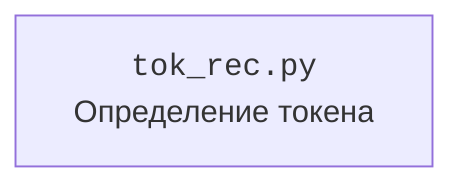

### **Анализ кода проекта `hypotez`**

=========================================================================================

#### **1. Блок-схема**

```mermaid
graph TD
    A[Начало: Функция is_token(token)] --> B{token.split()[-1]};
    B --> C{TLEN = len(token)};
    C --> D{TLEN == 62?};
    D -- Да --> E{token[1] == "/"?};
    D -- Нет --> F[Возврат False];
    E -- Да --> G[Возврат True];
    E -- Нет --> F;
    F --> H[Конец];
    G --> H;
```

**Примеры:**

1.  **Вход:** `"token=abcdef/123456789012345678901234567890123456789012345678901234567890"`

    *   `token.split()[-1]` извлекает `"abcdef/123456789012345678901234567890123456789012345678901234567890"`.
    *   `TLEN` присваивается значение 62.
    *   Проверяется, что `TLEN == 62`. Результат: `True`.
    *   Проверяется, что `token[1] == "/"`. Результат: `False`.
    *   Возвращается `False`.
2.  **Вход:** `"abcdef/123456789012345678901234567890123456789012345678901234567890"`

    *   `token.split()[-1]` извлекает `"abcdef/123456789012345678901234567890123456789012345678901234567890"`.
    *   `TLEN` присваивается значение 62.
    *   Проверяется, что `TLEN == 62`. Результат: `True`.
    *   Проверяется, что `token[1] == "/"`. Результат: `True`.
    *   Возвращается `True`.
3.  **Вход:** `"abc def"`

    *   `token.split()[-1]` извлекает `"def"`.
    *   `TLEN` присваивается значение 3.
    *   Проверяется, что `TLEN == 62`. Результат: `False`.
    *   Возвращается `False`.

#### **2. Диаграмма зависимостей**



**Объяснение:**

В данном коде отсутствуют импорты из других модулей, поэтому диаграмма зависимостей показывает только сам файл `tok_rec.py`.

#### **3. Объяснение**

**Назначение:**

Файл `hypotez/src/endpoints/bots/google_drive/plugins/tok_rec.py` содержит функцию `is_token`, предназначенную для проверки, является ли переданная строка токеном определенного формата. Этот модуль, вероятно, используется для валидации токенов, полученных от Google Drive.

**Функции:**

*   `is_token(token: str) -> bool`:
    *   **Аргументы:**
        *   `token` (str): Строка, которую нужно проверить.
    *   **Возвращаемое значение:**
        *   `bool`: `True`, если строка соответствует формату токена, иначе `False`.
    *   **Назначение:**
        1.  Извлекает последнее слово из строки, используя `token.split()[-1]`.
        2.  Определяет длину извлеченного слова и сохраняет в переменной `TLEN`.
        3.  Проверяет, равна ли `TLEN` 62.
        4.  Если длина равна 62, проверяет, является ли второй символ `"/"`.
        5.  Возвращает `True`, если оба условия выполнены, иначе `False`.
    *   **Пример:**

```python
        >>> is_token("abcdef/123456789012345678901234567890123456789012345678901234567890")
        True
```

**Переменные:**

*   `TLEN` (int): Длина проверяемой строки.
*   `token` (str): строка токена

**Потенциальные ошибки и области для улучшения:**

1.  **Недостаточная документация:** Отсутствует подробное описание формата токена, который проверяется.
2.  **Жесткая привязка к длине и символу:** Проверка `TLEN == 62` и `token[1] == "/"` делает функцию очень специфичной. Возможно, стоит добавить гибкости, чтобы можно было проверять токены других форматов.
3.  **Отсутствие обработки исключений:** Функция не обрабатывает возможные исключения, например, если `token` имеет длину меньше 2.

**Взаимосвязь с другими частями проекта:**

Этот модуль, вероятно, используется в других частях проекта `hypotez`, связанных с Google Drive, для проверки и обработки токенов авторизации. Например, он может использоваться в модулях, которые получают или обновляют токены доступа.