### **Системные инструкции для обработки кода проекта `hypotez`**

=========================================================================================

Описание функциональности и правил для генерации, анализа и улучшения кода. Направлено на обеспечение последовательного и читаемого стиля кодирования, соответствующего требованиям.

---

### **Основные принципы**

#### **1. Общие указания**:
- Соблюдай четкий и понятный стиль кодирования.
- Все изменения должны быть обоснованы и соответствовать установленным требованиям.

#### **2. Комментарии**:
- Используй `#` для внутренних комментариев.
- Документация всех функций, методов и классов должна следовать такому формату: 
    ```python
        def function(param: str, param1: Optional[str | dict | str] = None) -> dict | None:
            """ 
            Args:
                param (str): Описание параметра `param`.
                param1 (Optional[str | dict | str], optional): Описание параметра `param1`. По умолчанию `None`.
    
            Returns:
                dict | None: Описание возвращаемого значения. Возвращает словарь или `None`.
    
            Raises:
                SomeError: Описание ситуации, в которой возникает исключение `SomeError`.

            Ехаmple:
                >>> function('param', 'param1')
                {'param': 'param1'}
            """
    ```
- Комментарии и документация должны быть четкими, лаконичными и точными.

#### **3. Форматирование кода**:
- Используй одинарные кавычки. `a:str = 'value'`, `print('Hello World!')`;
- Добавляй пробелы вокруг операторов. Например, `x = 5`;
- Все параметры должны быть аннотированы типами. `def function(param: str, param1: Optional[str | dict | str] = None) -> dict | None:`;
- Не используй `Union`. Вместо этого используй `|`.

#### **4. Логирование**:
- Для логгирования Всегда Используй модуль `logger` из `src.logger.logger`.
- Ошибки должны логироваться с использованием `logger.error`.
Пример:
    ```python
        try:
            ...
        except Exception as ex:
            logger.error('Error while processing data', ех, exc_info=True)
    ```
#### **5 Не используй `Union[]` в коде. Вместо него используй `|`
Например:
```python
x: str | int ...
```


---

### **Основные требования**:

#### **1. Формат ответов в Markdown**:
- Все ответы должны быть выполнены в формате **Markdown**.

#### **2. Формат комментариев**:
- Используй указанный стиль для комментариев и документации в коде.
- Пример:

```python
from typing import Generator, Optional, List
from pathlib import Path


def read_text_file(
    file_path: str | Path,
    as_list: bool = False,
    extensions: Optional[List[str]] = None,
    chunk_size: int = 8192,
) -> Generator[str, None, None] | str | None:
    """
    Считывает содержимое файла (или файлов из каталога) с использованием генератора для экономии памяти.

    Args:
        file_path (str | Path): Путь к файлу или каталогу.
        as_list (bool): Если `True`, возвращает генератор строк.
        extensions (Optional[List[str]]): Список расширений файлов для чтения из каталога.
        chunk_size (int): Размер чанков для чтения файла в байтах.

    Returns:
        Generator[str, None, None] | str | None: Генератор строк, объединенная строка или `None` в случае ошибки.

    Raises:
        Exception: Если возникает ошибка при чтении файла.

    Example:
        >>> from pathlib import Path
        >>> file_path = Path('example.txt')
        >>> content = read_text_file(file_path)
        >>> if content:
        ...    print(f'File content: {content[:100]}...')
        File content: Example text...
    """
    ...
```
- Всегда делай подробные объяснения в комментариях. Избегай расплывчатых терминов, 
- таких как *«получить»* или *«делать»*
-  . Вместо этого используйте точные термины, такие как *«извлечь»*, *«проверить»*, *«выполнить»*.
- Вместо: *«получаем»*, *«возвращаем»*, *«преобразовываем»* используй имя объекта *«функция получае»*, *«переменная возвращает»*, *«код преобразовывает»* 
- Комментарии должны непосредственно предшествовать описываемому блоку кода и объяснять его назначение.

#### **3. Пробелы вокруг операторов присваивания**:
- Всегда добавляйте пробелы вокруг оператора `=`, чтобы повысить читаемость.
- Примеры:
  - **Неправильно**: `x=5`
  - **Правильно**: `x = 5`

#### **4. Использование `j_loads` или `j_loads_ns`**:
- Для чтения JSON или конфигурационных файлов замените стандартное использование `open` и `json.load` на `j_loads` или `j_loads_ns`.
- Пример:

```python
# Неправильно:
with open('config.json', 'r', encoding='utf-8') as f:
    data = json.load(f)

# Правильно:
data = j_loads('config.json')
```

#### **5. Сохранение комментариев**:
- Все существующие комментарии, начинающиеся с `#`, должны быть сохранены без изменений в разделе «Улучшенный код».
- Если комментарий кажется устаревшим или неясным, не изменяйте его. Вместо этого отметьте его в разделе «Изменения».

#### **6. Обработка `...` в коде**:
- Оставляйте `...` как указатели в коде без изменений.
- Не документируйте строки с `...`.
```

#### **7. Аннотации**
Для всех переменных должны быть определены аннотации типа. 
Для всех функций все входные и выходные параметры аннотириваны
Для все параметров должны быть аннотации типа.


### **8. webdriver**
В коде используется webdriver. Он импртируется из модуля `webdriver` проекта `hypotez`
```python
from src.webdirver import Driver, Chrome, Firefox, Playwright, ...
driver = Driver(Firefox)

Пoсле чего может использоваться как

close_banner = {
  "attribute": null,
  "by": "XPATH",
  "selector": "//button[@id = 'closeXButton']",
  "if_list": "first",
  "use_mouse": false,
  "mandatory": false,
  "timeout": 0,
  "timeout_for_event": "presence_of_element_located",
  "event": "click()",
  "locator_description": "Закрываю pop-up окно, если оно не появилось - не страшно (`mandatory`:`false`)"
}

result = driver.execute_locator(close_banner)
```

## Анализ кода `ToolBox_main.py`

### 1. Блок-схема

```mermaid
graph TD
    A[Начало] --> B{Команда /pre_checkout_query/callback_query/text?}
    B -- Команда:/start --> C[Обработка StartProcessing]
    B -- pre_checkout_query --> D[Обработка process_pre_checkout_query]
    B -- successful_payment --> E[Обработка successful_payment]
    B -- callback_query --> F[Обработка CallsProcessing]
    B -- text/photo --> G[Обработка TasksProcessing]

    C --> C1{Существует ли пользователь в БД?}
    C1 -- Нет --> C2[Создание записи о пользователе в БД с DATA_PATTERN()]
    C1 -- Да --> C3[Обновление данных пользователя из БД]
    C2 --> C4[Вызов tb.start_request(message)]
    C3 --> C4
    C4 --> H[Конец обработки StartProcessing]

    D --> D1[Ответ на pre_checkout_query с ok=True]
    D1 --> I[Конец обработки process_pre_checkout_query]

    E --> E1[Извлечение user_id]
    E1 --> E2{Тип оплаты?}
    E2 -- basic_invoice_payload --> E3[Установка db[user_id]['basic'] = True]
    E2 -- pro_invoice_payload --> E4[Установка db[user_id]['pro'] = True и db[user_id]['basic'] = True]
    E3 --> E5[Начисление токенов и установка времени подписки]
    E4 --> E5
    E5 --> E6[Обновление данных в БД]
    E6 --> E7[Отправка сообщения об успешной оплате]
    E7 --> E8[Вызов tb.restart(message)]
    E8 --> J[Конец обработки successful_payment]

    F --> F1{call.data в tb.data?}
    F1 -- Да --> F2{call.data?}
    F1 -- Нет --> F9{call.data в text_buttons?}

    F2 -- text --> F3[Вызов tb.Text_types(call.message)]
    F2 -- images --> F4{db[user_id]["pro"]?}
    F4 -- Да --> F5[Вызов tb.ImageSize(call.message)]
    F4 -- Нет --> F6[Отправка сообщения об обновлении тарифа]
    F2 -- free --> F7[Установка db[user_id]['free'] = True и вызов tb.FreeArea(call.message)]
    F2 -- tariff --> F8[Вызов tb.TariffArea(call.message)]

    F9 -- Да --> F10[Определение index]
    F9 -- Нет --> F14{call.data in ...?}

    F10 --> F11{index in avalib?}
    F11 -- Да --> F12[Вызов tb.SomeTexts(call.message, avalib.index(index))]
    F11 -- Нет --> F13[Установка db[user_id]['text'][index] = 1 и вызов tb.OneTextArea(call.message, index)]

    F14 -- Да --> F15{call.data?}
    F15 -- exit --> F16[Сброс данных пользователя и вызов tb.restart_markup(call.message)]
    F15 -- text_exit --> F17[Сброс текстовых данных и вызов tb.Text_types(call.message)]
    F15 -- tariff_exit --> F18[Вызов tb.TariffExit(call.message)]

    G --> G1{db[user_id]['images'] != ""?}
    G1 -- Да --> G2[Обработка генерации изображений]
    G1 -- Нет --> G3{db[user_id]['free']?}
    G3 -- Да --> G4{message.text == 'В меню'?}
    G4 -- Да --> G5[Завершение сессии free режима]
    G4 -- Нет --> G6[Обработка free mode]
    G3 -- Нет --> G7[Обработка text]

    H --> Конец
    I --> Конец
    J --> Конец
    F3 --> Конец
    F5 --> Конец
    F6 --> Конец
    F7 --> Конец
    F8 --> Конец
    F12 --> Конец
    F13 --> Конец
    F16 --> Конец
    F17 --> Конец
    F18 --> Конец
    G2 --> Конец
    G5 --> Конец
    G6 --> Конец
    G7 --> Конец
```

### 2. Диаграмма

```mermaid
flowchart TD
    subgraph Импорты
        asyncio["asyncio: Для асинхронного программирования"]
        base64["base64: Для кодирования и декодирования данных в base64"]
        string["string: Содержит набор строковых констант (например, ascii_letters, digits)"]
        random["random: Для генерации случайных чисел"]
        telebot["telebot: Библиотека для работы с Telegram Bot API"]
        dotenv["dotenv: Для загрузки переменных окружения из файла .env"]
        datetime["datetime: Для работы с датой и временем"]
        threading["threading: Для работы с потоками"]
        dateutil["dateutil: Расширения для работы с датой и временем"]
        ToolBox_requests["ToolBox_requests: Пользовательский модуль для обработки запросов"]
        ToolBox_DataBase["ToolBox_DataBase: Пользовательский модуль для работы с базой данных"]
    end

    subgraph Объекты
        tb["tb: Объект класса ToolBox (ToolBox_requests)"]
        bot["bot: Объект бота (tb.bot)"]
        base["base: Объект класса DataBase (ToolBox_DataBase)"]
        db["db: Данные пользователей, загруженные из базы данных"]
    end

    asyncio --> ToolBox_main["ToolBox_main.py"]
    base64 --> ToolBox_main
    string --> ToolBox_main
    random --> ToolBox_main
    telebot --> ToolBox_main
    dotenv --> ToolBox_main
    datetime --> ToolBox_main
    threading --> ToolBox_main
    dateutil --> ToolBox_main
    ToolBox_requests --> ToolBox_main
    ToolBox_DataBase --> ToolBox_main

    tb --> ToolBox_main
    bot --> ToolBox_main
    base --> ToolBox_main
    db --> ToolBox_main

    ToolBox_main --> pre_checkout_query["Обработка предварительных проверок оплаты"]
    ToolBox_main --> successful_payment["Обработка успешной оплаты"]
    ToolBox_main --> StartProcessing["Обработка команды /start"]
    ToolBox_main --> personal_account["Обработка команды /profile"]
    ToolBox_main --> CallsProcessing["Обработка callback запросов"]
    ToolBox_main --> TasksProcessing["Обработка текстовых и фото сообщений"]
    ToolBox_main --> end_check_tariff_time["Асинхронная проверка времени окончания тарифа"]
```



### 3. Объяснение

- **Расположение файла в проекте**: `hypotez/src/endpoints/bots/telegram/ToolBoxbot-main/ToolBox/ToolBox_main.py` - основной файл для управления логикой Telegram-бота.

#### Импорты:

- `asyncio`: Используется для асинхронного программирования, необходимо для асинхронного запуска проверки времени окончания тарифа.
- `base64`: Используется для кодирования изображений в формат base64 для передачи в API.
- `string`: Используется для генерации промокодов.
- `random`: Используется для генерации случайных данных, таких как промокоды и seed для генерации изображений.
- `telebot`: Библиотека pyTelegramBotAPI для создания Telegram-ботов.
- `dotenv`: Используется для загрузки переменных окружения из файла `.env`.
- `datetime`: Используется для работы с датами и временем, например, для определения времени окончания подписки.
- `threading`: Используется для создания и управления потоками, что позволяет выполнять несколько задач параллельно (например, обработка запросов к API).
- `dateutil.relativedelta`: Используется для удобного добавления интервалов времени к датам (например, добавление месяца к дате подписки).
- `ToolBox_requests`: Пользовательский модуль, вероятно, содержащий функции для взаимодействия с API, отправки сообщений, обработки различных типов запросов и управления логикой бота.
- `ToolBox_DataBase`: Пользовательский модуль для работы с базой данных, содержащий функции для создания, загрузки и обновления данных пользователей.

#### Переменные:

- `N`: Количество типов текста (используется для инициализации данных пользователя).
- `DATA_PATTERN`: Лямбда-функция, определяющая структуру данных пользователя по умолчанию.
- `photo_array`: Пустой список, предположительно предназначенный для хранения фотографий.
- `tb`: Экземпляр класса `ToolBox` (из `ToolBox_requests`), представляющий собой набор инструментов для работы бота.
- `bot`: Экземпляр бота, инициализированный с помощью `telebot`.
- `base`: Экземпляр класса `DataBase` (из `ToolBox_DataBase`), представляющий собой интерфейс для работы с базой данных.
- `db`: Словарь, содержащий данные пользователей, загруженные из базы данных.

#### Классы:

- `DataBase`: Класс для работы с базой данных.
  - Атрибуты: `db_name`, `table_name`, `titles`.
  - Методы: `create()`, `load_data_from_db()`, `insert_or_update_data()`.
- `ToolBox`: Класс, содержащий инструменты для работы с ботом (логика обработки сообщений, отправка ответов и т.д.).

#### Функции:

- `process_pre_checkout_query(pre_checkout_query)`: Обрабатывает предварительные запросы перед оплатой.
  - Аргументы: `pre_checkout_query` (объект запроса).
  - Возвращаемое значение: Нет.
  - Назначение: Подтверждает возможность проведения оплаты.
- `successful_payment(message)`: Обрабатывает успешные платежи.
  - Аргументы: `message` (объект сообщения).
  - Возвращаемое значение: Нет.
  - Назначение: Обновляет данные пользователя в базе данных после успешной оплаты.
- `StartProcessing(message)`: Обрабатывает команду `/start`.
  - Аргументы: `message` (объект сообщения).
  - Возвращаемое значение: Нет.
  - Назначение: Инициализирует или обновляет данные пользователя в базе данных при старте работы с ботом.
- `personal_account(message)`: Обрабатывает команду `/profile`, отображает информацию о тарифном плане пользователя.
  - Аргументы: `message` (объект сообщения).
  - Возвращаемое значение: Нет.
  - Назначение: Отображает информацию о подписке пользователя.
- `show_stat(message)`: Отображает статистику по использованию бота (доступно только для администраторов).
  - Аргументы: `message` (объект сообщения).
  - Возвращаемое значение: Нет.
  - Назначение: Отображает статистику бота для администраторов.
- `CallsProcessing(call)`: Обрабатывает все callback-запросы от inline-кнопок.
  - Аргументы: `call` (объект callback-запроса).
  - Возвращаемое значение: Нет.
  - Назначение: Обрабатывает нажатия на кнопки в боте.
- `TasksProcessing(message)`: Обрабатывает текстовые сообщения и фотографии, поступающие от пользователя.
  - Аргументы: `message` (объект сообщения).
  - Возвращаемое значение: Нет.
  - Назначение: Обрабатывает различные типы сообщений от пользователя.
- `end_check_tariff_time()`: Асинхронная функция, проверяющая время окончания подписки у пользователей.
  - Аргументы: Нет.
  - Возвращаемое значение: Нет.
  - Назначение: Регулярно проверяет, не закончилась ли подписка у пользователей.
- `generate_promo_code(length: int) -> str`: Генерирует промокод заданной длины.
  - Аргументы: `length` (длина промокода).
  - Возвращаемое значение: `promo_code` (сгенерированный промокод).
  - Назначение: Генерирует случайный промокод.
- `TokensCancelletionPattern(user_id: str, func, message, i: int = None) -> None`: Абстрагирует процесс списания токенов или запросов у пользователя.
  - Аргументы:
    - `user_id` (str): ID пользователя.
    - `func`: Функция, отвечающая за обработку текста (например, `tb.TextCommands` или `tb.FreeCommand`).
    - `message`: Объект сообщения.
    - `i` (int, optional): Индекс для текстовых команд.
  - Возвращаемое значение: None
  - Назначение: Списывает токены или бесплатные запросы в зависимости от типа подписки пользователя.

#### Потенциальные ошибки и области для улучшения:

- **Обработка исключений**: В коде отсутствуют явные блоки `try...except` для обработки возможных исключений, которые могут возникнуть при работе с базой данных, API Telegram или при обработке изображений. Добавление обработки исключений сделает код более надежным.
- **Логирование**: Отсутствует логирование действий и ошибок. Добавление логирования поможет отслеживать работу бота и выявлять проблемы.
- **Безопасность**: Проверка промокода `if message.text.lower() == "free24" or message.text == [us['ref'] for us in db.values()] and db[user_id]['ref']!=message.text:` может быть уязвима для атак перебора промокодов. Следует рассмотреть возможность добавления защиты от перебора.
- **Многопоточность**: Использование `thr.join()` сразу после `thr.start()` нивелирует эффект от использования потоков, так как основной поток ждет завершения порожденного потока. Следует пересмотреть логику использования потоков, чтобы они действительно выполнялись параллельно.
- **Использование `global`**: Слишком частое использование `global` может затруднить отслеживание изменений переменных. Рассмотреть возможность использования классов или других способов передачи данных между функциями.
- **Дублирование кода**: Есть участки кода, которые повторяются (например, при проверке тарифов). Можно вынести повторяющийся код в отдельные функции.

#### Взаимосвязи с другими частями проекта:

- `ToolBox_requests` и `ToolBox_DataBase`: Эти модули предоставляют функциональность для работы с API и базой данных, соответственно. Файл `ToolBox_main.py` использует их для реализации основной логики бота.
- Зависимость от `.env`: Файл использует библиотеку `dotenv` для загрузки переменных окружения, таких как токен бота, из файла `.env`.

В целом, код представляет собой основу для Telegram-бота с функциональностью обработки текста, изображений, подписок и промокодов. Для улучшения надежности и удобства сопровождения рекомендуется добавить обработку исключений, логирование и пересмотреть логику использования потоков.