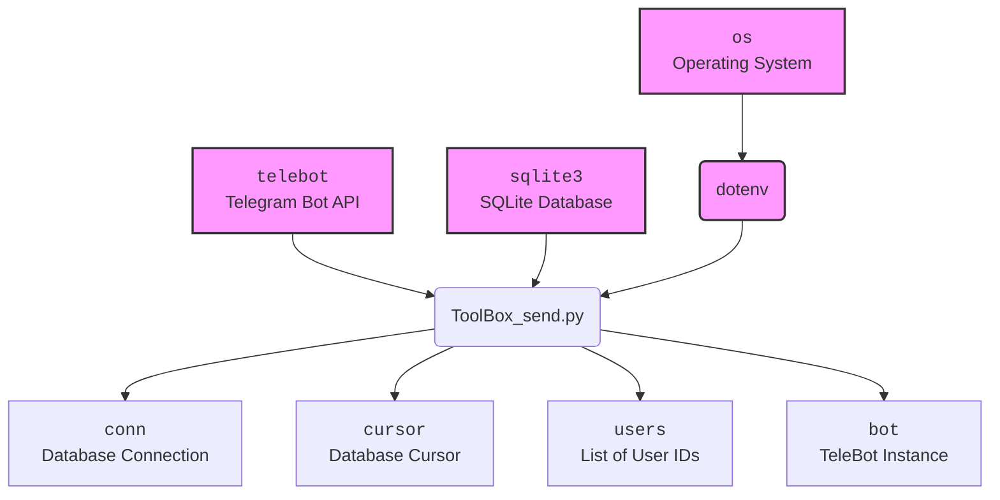

### **Системные инструкции для обработки кода проекта `hypotez`**

=========================================================================================

Описание функциональности и правил для генерации, анализа и улучшения кода. Направлено на обеспечение последовательного и читаемого стиля кодирования, соответствующего требованиям.

---

### **Основные принципы**

#### **1. Общие указания**:
- Соблюдай четкий и понятный стиль кодирования.
- Все изменения должны быть обоснованы и соответствовать установленным требованиям.

#### **2. Комментарии**:
- Используй `#` для внутренних комментариев.
- Документация всех функций, методов и классов должна следовать такому формату: 
    ```python
        def function(param: str, param1: Optional[str | dict | str] = None) -> dict | None:
            """ 
            Args:
                param (str): Описание параметра `param`.
                param1 (Optional[str | dict | str], optional): Описание параметра `param1`. По умолчанию `None`.
    
            Returns:
                dict | None: Описание возвращаемого значения. Возвращает словарь или `None`.
    
            Raises:
                SomeError: Описание ситуации, в которой возникает исключение `SomeError`.

            Ехаmple:
                >>> function('param', 'param1')
                {'param': 'param1'}
            """
    ```
- Комментарии и документация должны быть четкими, лаконичными и точными.

#### **3. Форматирование кода**:
- Используй одинарные кавычки. `a:str = 'value'`, `print('Hello World!')`;
- Добавляй пробелы вокруг операторов. Например, `x = 5`;
- Все параметры должны быть аннотированы типами. `def function(param: str, param1: Optional[str | dict | str] = None) -> dict | None:`;
- Не используй `Union`. Вместо этого используй `|`.

#### **4. Логирование**:
- Для логгирования Всегда Используй модуль `logger` из `src.logger.logger`.
- Ошибки должны логироваться с использованием `logger.error`.
Пример:
    ```python
        try:
            ...
        except Exception as ex:
            logger.error('Error while processing data', ех, exc_info=True)
    ```
#### **5 Не используй `Union[]` в коде. Вместо него используй `|`
Например:
```python
x: str | int ...
```


---

### **Основные требования**:

#### **1. Формат ответов в Markdown**:
- Все ответы должны быть выполнены в формате **Markdown**.

#### **2. Формат комментариев**:
- Используй указанный стиль для комментариев и документации в коде.
- Пример:

```python
from typing import Generator, Optional, List
from pathlib import Path


def read_text_file(
    file_path: str | Path,
    as_list: bool = False,
    extensions: Optional[List[str]] = None,
    chunk_size: int = 8192,
) -> Generator[str, None, None] | str | None:
    """
    Считывает содержимое файла (или файлов из каталога) с использованием генератора для экономии памяти.

    Args:
        file_path (str | Path): Путь к файлу или каталогу.
        as_list (bool): Если `True`, возвращает генератор строк.
        extensions (Optional[List[str]]): Список расширений файлов для чтения из каталога.
        chunk_size (int): Размер чанков для чтения файла в байтах.

    Returns:
        Generator[str, None, None] | str | None: Генератор строк, объединенная строка или `None` в случае ошибки.

    Raises:
        Exception: Если возникает ошибка при чтении файла.

    Example:
        >>> from pathlib import Path
        >>> file_path = Path('example.txt')
        >>> content = read_text_file(file_path)
        >>> if content:
        ...    print(f'File content: {content[:100]}...')
        File content: Example text...
    """
    ...
```
- Всегда делай подробные объяснения в комментариях. Избегай расплывчатых терминов, 
- таких как *«получить»* или *«делать»*. Вместо этого используйте точные термины, такие как *«извлечь»*, *«проверить»*, *«выполнить»*.
- Вместо: *«получаем»*, *«возвращаем»*, *«преобразовываем»* используй имя объекта *«функция получае»*, *«переменная возвращает»*, *«код преобразовывает»* 
- Комментарии должны непосредственно предшествовать описываемому блоку кода и объяснять его назначение.

#### **3. Пробелы вокруг операторов присваивания**:
- Всегда добавляйте пробелы вокруг оператора `=`, чтобы повысить читаемость.
- Примеры:
  - **Неправильно**: `x=5`
  - **Правильно**: `x = 5`

#### **4. Использование `j_loads` или `j_loads_ns`**:
- Для чтения JSON или конфигурационных файлов замените стандартное использование `open` и `json.load` на `j_loads` или `j_loads_ns`.
- Пример:

```python
# Неправильно:
with open('config.json', 'r', encoding='utf-8') as f:
    data = json.load(f)

# Правильно:
data = j_loads('config.json')
```

#### **5. Сохранение комментариев**:
- Все существующие комментарии, начинающиеся с `#`, должны быть сохранены без изменений в разделе «Улучшенный код».
- Если комментарий кажется устаревшим или неясным, не изменяйте его. Вместо этого отметьте его в разделе «Изменения».

#### **6. Обработка `...` в коде**:
- Оставляйте `...` как указатели в коде без изменений.
- Не документируйте строки с `...`.
```

#### **7. Аннотации**
Для всех переменных должны быть определены аннотации типа. 
Для всех функций все входные и выходные параметры аннотириваны
Для все параметров должны быть аннотации типа.


### **8. webdriver**
В коде используется webdriver. Он импртируется из модуля `webdriver` проекта `hypotez`
```python
from src.webdirver import Driver, Chrome, Firefox, Playwright, ...
driver = Driver(Firefox)

Пoсле чего может использоваться как

close_banner = {
  "attribute": null,
  "by": "XPATH",
  "selector": "//button[@id = 'closeXButton']",
  "if_list": "first",
  "use_mouse": false,
  "mandatory": false,
  "timeout": 0,
  "timeout_for_event": "presence_of_element_located",
  "event": "click()",
  "locator_description": "Закрываю pop-up окно, если оно не появилось - не страшно (`mandatory`:`false`)"
}

result = driver.execute_locator(close_banner)
```

```markdown
## Анализ кода `hypotez/src/endpoints/bots/telegram/ToolBoxbot-main/ToolBox/ToolBox_send.py`

### 1. Блок-схема

```mermaid
graph TD
    A[Начало: Инициализация] --> B{Загрузка переменных окружения из .env};
    B -- Успешно --> C{Инициализация Telebot с использованием токена из переменных окружения};
    C --> D{Установка соединения с базой данных SQLite};
    D --> E{Создание курсора для выполнения SQL-запросов};
    E --> F{Выполнение запроса к базе данных для получения ID пользователей, у которых `promocode != 1`};
    F --> G{Извлечение списка ID пользователей};
    G --> H{Начало цикла по списку ID пользователей};
    H --> I{Попытка отправить сообщение пользователю через Telebot};
    I -- Успешно --> J{Вывод в консоль: ID пользователя и "yes"};
    I -- Ошибка --> K{Вывод в консоль: ID пользователя и "no"};
    J --> L{Переход к следующему ID пользователя};
    K --> L;
    L --> M{Проверка, остались ли еще ID пользователей};
    M -- Да --> H;
    M -- Нет --> N[Конец];
```

**Примеры для логических блоков:**

*   **B (Загрузка переменных окружения из .env)**: `load_dotenv()` загружает переменные окружения, в том числе `TOKEN`.
*   **C (Инициализация Telebot)**: `bot = telebot.TeleBot(token=os.environ['TOKEN'])` создает экземпляр бота, используя токен, полученный из переменных окружения.
*   **F (Выполнение запроса к базе данных)**: `cursor.execute(f"SELECT id FROM users_data_table WHERE promocode != 1")` выбирает всех пользователей из таблицы `users_data_table`, у которых значение столбца `promocode` не равно 1.
*   **I (Попытка отправить сообщение)**: `bot.send_message(chat_id=us[0], text="...", parse_mode='html')` отправляет сообщение каждому пользователю.
*   **J (Вывод в консоль: ID пользователя и "yes")**: `print(us[0], "yes")` выводит ID пользователя и "yes" в случае успешной отправки сообщения.
*   **K (Вывод в консоль: ID пользователя и "no")**: `print(us[0], "no")` выводит ID пользователя и "no" в случае ошибки при отправке сообщения.

### 2. Диаграмма



**Объяснение зависимостей:**

*   `telebot`: Используется для взаимодействия с Telegram Bot API, отправки сообщений.
*   `sqlite3`: Используется для работы с базой данных SQLite, получения ID пользователей.
*   `os`: Используется для доступа к переменным окружения.
*   `dotenv`: Используется для загрузки переменных окружения из файла `.env`.
*   `conn`: Представляет собой соединение с базой данных SQLite.
*   `cursor`: Используется для выполнения SQL-запросов к базе данных.
*   `users`: Список ID пользователей, полученных из базы данных.
*   `bot`: Экземпляр класса `TeleBot`, используемый для отправки сообщений пользователям.

### 3. Объяснение

#### Импорты:

*   `telebot`: Этот модуль предоставляет API для взаимодействия с Telegram Bot. Он позволяет отправлять сообщения, обрабатывать команды и многое другое.
*   `sqlite3`: Этот модуль предоставляет интерфейс для работы с базами данных SQLite. В данном коде он используется для подключения к базе данных `UsersData.db` и выполнения SQL-запросов.
*   `os`: Этот модуль предоставляет функции для взаимодействия с операционной системой, например, для доступа к переменным окружения.
*   `dotenv`: Этот модуль используется для загрузки переменных окружения из файла `.env`. Это позволяет хранить конфиденциальные данные, такие как токен бота, вне кода.

#### Переменные:

*   `bot`: Экземпляр класса `telebot.TeleBot`, используемый для отправки сообщений. Инициализируется токеном, полученным из переменной окружения `TOKEN`.
*   `conn`: Объект соединения с базой данных SQLite `UsersData.db`.
*   `cursor`: Объект курсора, используемый для выполнения SQL-запросов.
*   `users`: Список кортежей, содержащих ID пользователей, полученных из базы данных. Каждый кортеж содержит один элемент - ID пользователя.
*   `us`: Переменная цикла, представляющая собой кортеж с ID пользователя.

#### Функциональность:

1.  **Загрузка переменных окружения**:

    *   `load_dotenv()` загружает переменные окружения из файла `.env`.
2.  **Инициализация бота**:

    *   `bot = telebot.TeleBot(token=os.environ['TOKEN'])` создает экземпляр бота Telegram с использованием токена, хранящегося в переменной окружения `TOKEN`.
3.  **Подключение к базе данных**:

    *   `conn = sqlite3.connect('UsersData.db')` устанавливает соединение с базой данных SQLite `UsersData.db`.
    *   `cursor = conn.cursor()` создает курсор, который используется для выполнения SQL-запросов.
4.  **Получение списка пользователей**:

    *   `cursor.execute(f"SELECT id FROM users_data_table WHERE promocode != 1")` выполняет SQL-запрос для выбора всех ID пользователей из таблицы `users_data_table`, у которых значение столбца `promocode` не равно 1.
    *   `users = cursor.fetchall()` извлекает все результаты запроса в виде списка кортежей.
5.  **Отправка сообщений пользователям**:

    *   Цикл `for us in users:` перебирает список ID пользователей.
    *   `bot.send_message(chat_id=us[0], text="...", parse_mode='html')` пытается отправить сообщение каждому пользователю. `us[0]` содержит ID пользователя. Текст сообщения содержит информацию о промокоде `FREE24`.
    *   Блок `try...except` обрабатывает возможные ошибки при отправке сообщений. Если сообщение отправлено успешно, выводится `ID пользователя` и `"yes"`. Если произошла ошибка, выводится `ID пользователя` и `"no"`.

#### Потенциальные ошибки и области для улучшения:

1.  **Обработка исключений**:
    *   В блоке `except` не указывается конкретный тип исключения. Рекомендуется указывать конкретный тип исключения, чтобы обрабатывать только ожидаемые ошибки.  `except telebot.apihelper.ApiTelegramException as e:`
    *   В блоке `except` не ведется логгирование ошибки. Рекомендуется использовать модуль `logger` из `src.logger.logger` для записи информации об ошибке, чтобы можно было анализировать и устранять проблемы.
2.  **Безопасность**:
    *   Использование f-string для формирования SQL-запроса может быть небезопасным, если данные, вставляемые в запрос, поступают от пользователя. В данном случае это не так, но в общем случае рекомендуется использовать параметризованные запросы для предотвращения SQL-инъекций.
3.  **Обработка базы данных**:
    *   Не закрывается соединение с базой данных. После завершения работы с базой данных необходимо закрыть соединение с помощью `conn.close()`. Это предотвратит утечку ресурсов.
4.  **Аннотации типов**:
    *   Отсутствуют аннотации типов для переменных и параметров функций. Добавление аннотаций типов улучшит читаемость и поддерживаемость кода.

**Пример улучшения кода:**

```python
import telebot
import sqlite3
import os
from dotenv import load_dotenv
from typing import List, Tuple
import logging

# Настройка логгера
logger = logging.getLogger(__name__)
logger.setLevel(logging.INFO)
formatter = logging.Formatter('%(asctime)s:%(levelname)s:%(name)s:%(message)s')
file_handler = logging.FileHandler('toolbox_send.log')
file_handler.setFormatter(formatter)
logger.addHandler(file_handler)


load_dotenv()

TOKEN: str = os.environ.get('TOKEN')
if not TOKEN:
    logger.error('Не удалось получить токен из переменных окружения')
    raise ValueError('Токен не найден в переменных окружения')

bot = telebot.TeleBot(token=TOKEN)

try:
    conn = sqlite3.connect('UsersData.db')
    cursor = conn.cursor()

    cursor.execute("SELECT id FROM users_data_table WHERE promocode != 1")
    users: List[Tuple[int]] = cursor.fetchall()

    for us in users:
        user_id: int = us[0]
        try:
            bot.send_message(
                chat_id=user_id,
                text="Успейте воспользоваться промокодом FREE24 до 21 декабря!\n\nПо нему вы получите бесплатный месяц тарифа PRO — это безлимит на генерацию текста и изображений 💥 \n\nЧтобы ввести промокод, перейдите на вкладку Тарифы и нажмите кнопку «Промокод».",
                parse_mode='html'
            )
            logger.info(f'Сообщение успешно отправлено пользователю {user_id}')
            print(user_id, "yes")
        except telebot.apihelper.ApiTelegramException as e:
            logger.error(f'Ошибка при отправке сообщения пользователю {user_id}: {e}')
            print(user_id, "no")
        except Exception as e:
            logger.error(f'Непредвиденная ошибка при обработке пользователя {user_id}: {e}', exc_info=True)
            print(user_id, "no")

except sqlite3.Error as e:
    logger.error(f'Ошибка при работе с базой данных: {e}')
except Exception as e:
    logger.error(f'Непредвиденная ошибка: {e}', exc_info=True)
finally:
    if conn:
        conn.close()
        logger.info('Соединение с базой данных закрыто')
```

**Изменения:**

*   Добавлены аннотации типов.
*   Добавлена обработка конкретных исключений (`telebot.apihelper.ApiTelegramException`, `sqlite3.Error`).
*   Добавлено логирование ошибок с использованием модуля `logging`.
*   Добавлено закрытие соединения с базой данных в блоке `finally`.
*   Улучшена читаемость кода.

Этот анализ предоставляет полное представление о функциональности кода, его зависимостях и потенциальных улучшениях.