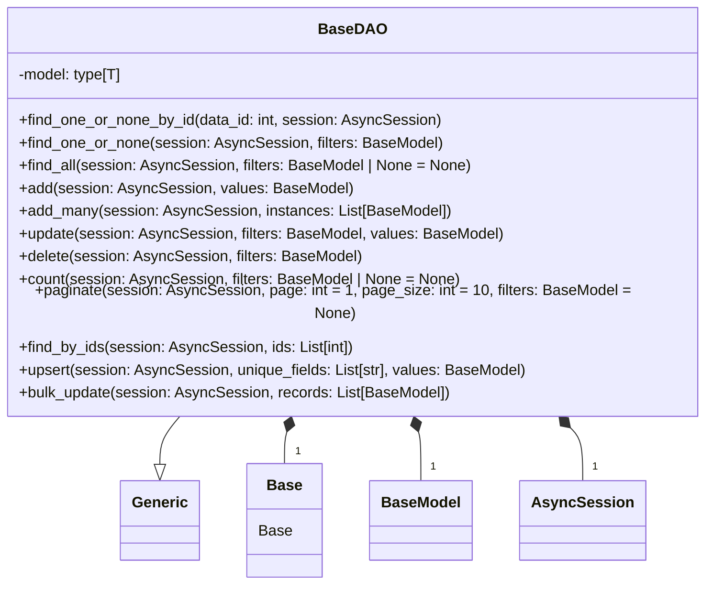

### **Системные инструкции для обработки кода проекта `hypotez`**

=========================================================================================

Описание функциональности и правил для генерации, анализа и улучшения кода. Направлено на обеспечение последовательного и читаемого стиля кодирования, соответствующего требованиям.

---

### **Основные принципы**

#### **1. Общие указания**:
- Соблюдай четкий и понятный стиль кодирования.
- Все изменения должны быть обоснованы и соответствовать установленным требованиям.

#### **2. Комментарии**:
- Используй `#` для внутренних комментариев.
- Документация всех функций, методов и классов должна следовать такому формату: 
    ```python
        def function(param: str, param1: Optional[str | dict | str] = None) -> dict | None:
            """ 
            Args:
                param (str): Описание параметра `param`.
                param1 (Optional[str | dict | str], optional): Описание параметра `param1`. По умолчанию `None`.
    
            Returns:
                dict | None: Описание возвращаемого значения. Возвращает словарь или `None`.
    
            Raises:
                SomeError: Описание ситуации, в которой возникает исключение `SomeError`.

            Ехаmple:
                >>> function('param', 'param1')
                {'param': 'param1'}
            """
    ```
- Комментарии и документация должны быть четкими, лаконичными и точными.

#### **3. Форматирование кода**:
- Используй одинарные кавычки. `a:str = 'value'`, `print('Hello World!')`;
- Добавляй пробелы вокруг операторов. Например, `x = 5`;
- Все параметры должны быть аннотированы типами. `def function(param: str, param1: Optional[str | dict | str] = None) -> dict | None:`;
- Не используй `Union`. Вместо этого используй `|`.

#### **4. Логирование**:
- Для логгирования Всегда Используй модуль `logger` из `src.logger.logger`.
- Ошибки должны логироваться с использованием `logger.error`.
Пример:
    ```python
        try:
            ...
        except Exception as ex:
            logger.error('Error while processing data', ех, exc_info=True)
    ```
#### **5 Не используй `Union[]` в коде. Вместо него используй `|`
Например:
```python
x: str | int ...
```


---

### **Основные требования**:

#### **1. Формат ответов в Markdown**:
- Все ответы должны быть выполнены в формате **Markdown**.

#### **2. Формат комментариев**:
- Используй указанный стиль для комментариев и документации в коде.
- Пример:

```python
from typing import Generator, Optional, List
from pathlib import Path


def read_text_file(
    file_path: str | Path,
    as_list: bool = False,
    extensions: Optional[List[str]] = None,
    chunk_size: int = 8192,
) -> Generator[str, None, None] | str | None:
    """
    Считывает содержимое файла (или файлов из каталога) с использованием генератора для экономии памяти.

    Args:
        file_path (str | Path): Путь к файлу или каталогу.
        as_list (bool): Если `True`, возвращает генератор строк.
        extensions (Optional[List[str]]): Список расширений файлов для чтения из каталога.
        chunk_size (int): Размер чанков для чтения файла в байтах.

    Returns:
        Generator[str, None, None] | str | None: Генератор строк, объединенная строка или `None` в случае ошибки.

    Raises:
        Exception: Если возникает ошибка при чтении файла.

    Example:
        >>> from pathlib import Path
        >>> file_path = Path('example.txt')
        >>> content = read_text_file(file_path)
        >>> if content:
        ...    print(f'File content: {content[:100]}...')
        File content: Example text...
    """
    ...
```
- Всегда делай подробные объяснения в комментариях. Избегай расплывчатых терминов, 
- таких как *«получить»* или *«делать»*
-  . Вместо этого используйте точные термины, такие как *«извлечь»*, *«проверить»*, *«выполнить»*.
- Вместо: *«получаем»*, *«возвращаем»*, *«преобразовываем»* используй имя объекта *«функция получае»*, *«переменная возвращает»*, *«код преобразовывает»* 
- Комментарии должны непосредственно предшествовать описываемому блоку кода и объяснять его назначение.

#### **3. Пробелы вокруг операторов присваивания**:
- Всегда добавляйте пробелы вокруг оператора `=`, чтобы повысить читаемость.
- Примеры:
  - **Неправильно**: `x=5`
  - **Правильно**: `x = 5`

#### **4. Использование `j_loads` или `j_loads_ns`**:
- Для чтения JSON или конфигурационных файлов замените стандартное использование `open` и `json.load` на `j_loads` или `j_loads_ns`.
- Пример:

```python
# Неправильно:
with open('config.json', 'r', encoding='utf-8') as f:
    data = json.load(f)

# Правильно:
data = j_loads('config.json')
```

#### **5. Сохранение комментариев**:
- Все существующие комментарии, начинающиеся с `#`, должны быть сохранены без изменений в разделе «Улучшенный код».
- Если комментарий кажется устаревшим или неясным, не изменяйте его. Вместо этого отметьте его в разделе «Изменения».

#### **6. Обработка `...` в коде**:
- Оставляйте `...` как указатели в коде без изменений.
- Не документируйте строки с `...`.
```

#### **7. Аннотации**
Для всех переменных должны быть определены аннотации типа. 
Для всех функций все входные и выходные параметры аннотириваны
Для все параметров должны быть аннотации типа.


### **8. webdriver**
В коде используется webdriver. Он импртируется из модуля `webdriver` проекта `hypotez`
```python
from src.webdirver import Driver, Chrome, Firefox, Playwright, ...
driver = Driver(Firefox)

Пoсле чего может использоваться как

close_banner = {
  "attribute": null,
  "by": "XPATH",
  "selector": "//button[@id = 'closeXButton']",
  "if_list": "first",
  "use_mouse": false,
  "mandatory": false,
  "timeout": 0,
  "timeout_for_event": "presence_of_element_located",
  "event": "click()",
  "locator_description": "Закрываю pop-up окно, если оно не появилось - не страшно (`mandatory`:`false`)"
}

result = driver.execute_locator(close_banner)
```

### Анализ кода `hypotez/src/endpoints/bots/telegram/digital_market/bot/dao/base.py`

#### 1. Блок-схема

```mermaid
graph TD
    A[Начало] --> B{Вызов метода DAO};
    B --> C{Выбор операции: find_one_or_none_by_id, find_one_or_none, find_all, add, add_many, update, delete, count, paginate, find_by_ids, upsert, bulk_update};

    subgraph find_one_or_none_by_id
    C -- find_one_or_none_by_id --> D[Логирование начала поиска по ID];
    D --> E{SQL запрос: SELECT ... WHERE id = data_id};
    E --> F{Запись найдена?};
    F -- Да --> G[Логирование: запись найдена];
    G --> H[Возврат записи];
    F -- Нет --> I[Логирование: запись не найдена];
    I --> H;
    E -- Ошибка --> J[Логирование ошибки];
    J --> K[Проброс исключения];
    end

    subgraph find_one_or_none
    C -- find_one_or_none --> L[Преобразование фильтров в словарь];
    L --> M[Логирование начала поиска по фильтрам];
    M --> N{SQL запрос: SELECT ... WHERE filters};
    N --> O{Запись найдена?};
    O -- Да --> P[Логирование: запись найдена];
    P --> Q[Возврат записи];
    O -- Нет --> R[Логирование: запись не найдена];
    R --> Q;
    N -- Ошибка --> S[Логирование ошибки];
    S --> T[Проброс исключения];
    end

    subgraph find_all
    C -- find_all --> U[Преобразование фильтров в словарь];
    U --> V[Логирование начала поиска всех записей по фильтрам];
    V --> W{SQL запрос: SELECT ... WHERE filters};
    W --> X[Получение всех записей];
    X --> Y[Логирование количества найденных записей];
    Y --> Z[Возврат списка записей];
    W -- Ошибка --> AA[Логирование ошибки];
    AA --> BB[Проброс исключения];
    end

    subgraph add
    C -- add --> CC[Преобразование значений в словарь];
    CC --> DD[Логирование начала добавления записи];
    DD --> EE[Создание экземпляра модели];
    EE --> FF[Добавление экземпляра в сессию];
    FF --> GG{Попытка выполнить flush сессии};
    GG -- Успех --> HH[Логирование успешного добавления записи];
    HH --> II[Возврат нового экземпляра];
    GG -- Ошибка --> JJ[Выполнение отката сессии];
    JJ --> KK[Логирование ошибки добавления записи];
    KK --> LL[Проброс исключения];
    end

    subgraph add_many
    C -- add_many --> MM[Преобразование списка BaseModel в список словарей];
    MM --> NN[Логирование начала добавления нескольких записей];
    NN --> OO[Создание списка экземпляров модели];
    OO --> PP[Добавление всех экземпляров в сессию];
    PP --> QQ{Попытка выполнить flush сессии};
    QQ -- Успех --> RR[Логирование успешного добавления записей];
    RR --> SS[Возврат списка новых экземпляров];
    QQ -- Ошибка --> TT[Выполнение отката сессии];
    TT --> UU[Логирование ошибки добавления нескольких записей];
    UU --> VV[Проброс исключения];
    end

   subgraph update
    C -- update --> update_start[Преобразование фильтров и значений в словари];
    update_start --> update_log[Логирование начала обновления записей];
    update_log --> update_query[Формирование SQL запроса UPDATE с фильтрами и новыми значениями];
    update_query --> update_execute[Выполнение SQL запроса];
    update_execute --> update_flush[Выполнение flush сессии];
    update_flush --> update_log_success[Логирование количества обновленных записей];
    update_log_success --> update_return[Возврат количества обновленных записей];
    update_execute -- Ошибка --> update_rollback[Выполнение отката сессии];
    update_rollback --> update_log_error[Логирование ошибки при обновлении записей];
    update_log_error --> update_raise[Проброс исключения];
    end

    subgraph delete
        C -- delete --> delete_start[Преобразование фильтров в словарь];
        delete_start --> delete_check[Проверка наличия фильтров];
        delete_check -- Нет фильтров --> delete_log_error[Логирование ошибки: нужен хотя бы один фильтр для удаления];
        delete_log_error --> delete_raise_value_error[Проброс исключения ValueError];
        delete_check -- Есть фильтры --> delete_log[Логирование начала удаления записей];
        delete_log --> delete_query[Формирование SQL запроса DELETE с фильтрами];
        delete_query --> delete_execute[Выполнение SQL запроса];
        delete_execute --> delete_flush[Выполнение flush сессии];
        delete_flush --> delete_log_success[Логирование количества удаленных записей];
        delete_log_success --> delete_return[Возврат количества удаленных записей];
        delete_execute -- Ошибка --> delete_rollback[Выполнение отката сессии];
        delete_rollback --> delete_log_error_sql[Логирование ошибки при удалении записей];
        delete_log_error_sql --> delete_raise_sql[Проброс исключения SQLAlchemyError];
    end

    subgraph count
        C -- count --> count_start[Преобразование фильтров в словарь];
        count_start --> count_log[Логирование начала подсчета количества записей];
        count_log --> count_query[Формирование SQL запроса SELECT COUNT(*) с фильтрами];
        count_query --> count_execute[Выполнение SQL запроса];
        count_execute --> count_scalar[Получение скалярного значения (количество записей)];
        count_scalar --> count_log_result[Логирование найденного количества записей];
        count_log_result --> count_return[Возврат количества записей];
        count_execute -- Ошибка --> count_log_error[Логирование ошибки при подсчете записей];
        count_log_error --> count_raise[Проброс исключения];
    end

    subgraph paginate
        C -- paginate --> paginate_start[Преобразование фильтров в словарь];
        paginate_start --> paginate_log[Логирование начала пагинации записей];
        paginate_log --> paginate_query[Формирование SQL запроса SELECT с фильтрами, OFFSET и LIMIT];
        paginate_query --> paginate_execute[Выполнение SQL запроса];
        paginate_execute --> paginate_scalars[Получение списка записей для текущей страницы];
        paginate_scalars --> paginate_log_result[Логирование количества записей на текущей странице];
        paginate_log_result --> paginate_return[Возврат списка записей];
        paginate_execute -- Ошибка --> paginate_log_error[Логирование ошибки при пагинации записей];
        paginate_log_error --> paginate_raise[Проброс исключения];
    end

    subgraph find_by_ids
        C -- find_by_ids --> find_by_ids_log[Логирование начала поиска записей по списку ID];
        find_by_ids_log --> find_by_ids_query[Формирование SQL запроса SELECT с фильтром по списку ID];
        find_by_ids_query --> find_by_ids_execute[Выполнение SQL запроса];
        find_by_ids_execute --> find_by_ids_scalars[Получение списка записей по списку ID];
        find_by_ids_scalars --> find_by_ids_log_result[Логирование количества найденных записей по списку ID];
        find_by_ids_log_result --> find_by_ids_return[Возврат списка записей];
        find_by_ids_execute -- Ошибка --> find_by_ids_log_error[Логирование ошибки при поиске записей по списку ID];
        find_by_ids_log_error --> find_by_ids_raise[Проброс исключения];
    end

    subgraph upsert
        C -- upsert --> upsert_start[Преобразование значений в словарь, формирование фильтра по unique_fields];
        upsert_start --> upsert_log[Логирование начала upsert];
        upsert_log --> upsert_find_existing[Поиск существующей записи по фильтру];
        upsert_find_existing --> upsert_check_existing[Проверка, найдена ли существующая запись];
        upsert_check_existing -- Да --> upsert_update[Обновление существующей записи];
        upsert_update --> upsert_flush_existing[Выполнение flush сессии для обновления существующей записи];
        upsert_flush_existing --> upsert_log_update[Логирование обновления существующей записи];
        upsert_log_update --> upsert_return_existing[Возврат существующей записи];
        upsert_check_existing -- Нет --> upsert_create[Создание новой записи];
        upsert_create --> upsert_add_new[Добавление новой записи в сессию];
        upsert_add_new --> upsert_flush_new[Выполнение flush сессии для создания новой записи];
        upsert_flush_new --> upsert_log_create[Логирование создания новой записи];
        upsert_log_create --> upsert_return_new[Возврат новой записи];
        upsert_find_existing -- Ошибка --> upsert_rollback[Выполнение отката сессии];
        upsert_rollback --> upsert_log_error[Логирование ошибки при upsert];
        upsert_log_error --> upsert_raise[Проброс исключения];
    end
    
    subgraph bulk_update
        C -- bulk_update --> bulk_update_log[Логирование начала массового обновления записей];
        bulk_update_log --> bulk_update_init[Инициализация счетчика обновленных записей];
        bulk_update_init --> bulk_update_loop_start[Начало цикла по списку записей];
        bulk_update_loop_start --> bulk_update_loop_check[Проверка наличия 'id' в записи];
        bulk_update_loop_check -- Нет 'id' --> bulk_update_loop_continue[Переход к следующей записи];
        bulk_update_loop_check -- Есть 'id' --> bulk_update_extract_data[Извлечение данных для обновления (исключая 'id')];
        bulk_update_extract_data --> bulk_update_stmt[Формирование SQL запроса UPDATE с фильтром по 'id' и новыми значениями];
        bulk_update_stmt --> bulk_update_execute[Выполнение SQL запроса];
        bulk_update_execute --> bulk_update_increment_count[Увеличение счетчика обновленных записей];
        bulk_update_increment_count --> bulk_update_loop_end[Конец цикла];
        bulk_update_loop_end --> bulk_update_flush[Выполнение flush сессии после цикла];
        bulk_update_flush --> bulk_update_log_success[Логирование количества обновленных записей];
        bulk_update_log_success --> bulk_update_return[Возврат количества обновленных записей];
        bulk_update_execute -- Ошибка --> bulk_update_rollback[Выполнение отката сессии];
        bulk_update_rollback --> bulk_update_log_error[Логирование ошибки при массовом обновлении];
        bulk_update_log_error --> bulk_update_raise[Проброс исключения];
    end
```

#### 2. Диаграмма



**Объяснение зависимостей:**

-   `BaseDAO` является generic классом, параметризованным типом `T`, который должен быть подклассом `Base`. Это указывает на то, что `BaseDAO` предназначен для работы с моделями, которые наследуются от `Base` (вероятно, базовый класс SQLAlchemy).
-   `Base` - это базовый класс для моделей SQLAlchemy, представляющих таблицы в базе данных.
-   `BaseModel` из `pydantic` используется для валидации и сериализации данных, используемых для фильтрации и создания/обновления записей.
-   `AsyncSession` из `sqlalchemy.ext.asyncio` представляет асинхронную сессию базы данных, используемую для выполнения операций с базой данных.
-   Импортируются типы `List`, `Any`, `TypeVar` и `Generic` из модуля `typing` для целей аннотации типов и определения обобщенных классов.

#### 3. Объяснение

**Импорты:**

*   `typing`:
    *   `List`: Используется для аннотации типов, обозначающих списки.
    *   `Any`: Используется для указания, что переменная может быть любого типа.
    *   `TypeVar`: Используется для создания переменных типов для обобщенного программирования.
    *   `Generic`: Используется для создания обобщенных классов, которые могут работать с разными типами данных.
*   `pydantic`:
    *   `BaseModel`: Базовый класс для моделей данных, используемый для валидации и сериализации данных.
*   `sqlalchemy.exc`:
    *   `SQLAlchemyError`: Базовый класс для всех исключений SQLAlchemy.
*   `sqlalchemy.future`:
    *   `select`: Функция для создания SQL запросов SELECT.
*   `sqlalchemy`:
    *   `update as sqlalchemy_update`: Функция для создания SQL запросов UPDATE. Переименована во избежание конфликтов имен.
    *   `delete as sqlalchemy_delete`: Функция для создания SQL запросов DELETE. Переименована во избежание конфликтов имен.
    *   `func`: Предоставляет доступ к SQL функциям, таким как `count`.
*   `loguru`:
    *   `logger`: Используется для логирования событий, происходящих в DAO.
*   `sqlalchemy.ext.asyncio`:
    *   `AsyncSession`: Используется для асинхронного взаимодействия с базой данных.
*   `bot.dao.database`:
    *   `Base`: Базовый класс для моделей SQLAlchemy, определенный в проекте.

**Классы:**

*   `BaseDAO(Generic[T])`:
    *   Является обобщенным (generic) классом, предназначенным для Data Access Object (DAO).
    *   Параметризуется типом `T`, который должен быть подклассом `Base`. Это обеспечивает типобезопасность при работе с моделями SQLAlchemy.
    *   `model: type[T]`: Атрибут класса, который должен быть установлен в подклассах, чтобы указать, с какой моделью SQLAlchemy работает DAO.
    *   Содержит набор статических методов для выполнения основных операций CRUD (Create, Read, Update, Delete) с базой данных:
        *   `find_one_or_none_by_id`: Находит одну запись по ID.
        *   `find_one_or_none`: Находит одну запись по фильтрам.
        *   `find_all`: Находит все записи по фильтрам.
        *   `add`: Добавляет одну запись.
        *   `add_many`: Добавляет несколько записей.
        *   `update`: Обновляет записи по фильтрам.
        *   `delete`: Удаляет записи по фильтрам.
        *   `count`: Подсчитывает количество записей по фильтрам.
        *   `paginate`: Возвращает записи для заданной страницы с учетом размера страницы и фильтров.
        *   `find_by_ids`: Находит несколько записей по списку ID.
        *    `upsert`: Создает запись или обновляет существующую.
        *   `bulk_update`: Массовое обновление записей.
    *   Все методы являются асинхронными и принимают `AsyncSession` в качестве аргумента для взаимодействия с базой данных.
    *   Используют `logger` для логирования хода выполнения операций и возможных ошибок.
    *   Обрабатывают исключения `SQLAlchemyError`, логируют их и пробрасывают дальше.

**Функции (методы класса `BaseDAO`):**

*   `find_one_or_none_by_id(cls, data_id: int, session: AsyncSession)`:
    *   Аргументы:
        *   `data_id: int`: ID записи для поиска.
        *   `session: AsyncSession`: Асинхронная сессия базы данных.
    *   Возвращаемое значение:
        *   `record: T | None`: Найденная запись или `None`, если запись не найдена.
    *   Назначение:
        *   Поиск записи в базе данных по ее ID.
        *   Использует `select` для формирования SQL запроса.
        *   Логирует начало поиска, результат поиска и возможные ошибки.
    *   Пример:

    ```python
    record = await BaseDAO.find_one_or_none_by_id(data_id=123, session=session)
    if record:
        print(f"Найдена запись: {record}")
    else:
        print("Запись не найдена")
    ```

*   `find_one_or_none(cls, session: AsyncSession, filters: BaseModel)`:
    *   Аргументы:
        *   `session: AsyncSession`: Асинхронная сессия базы данных.
        *   `filters: BaseModel`: Pydantic модель, содержащая фильтры для поиска.
    *   Возвращаемое значение:
        *   `record: T | None`: Найденная запись или `None`, если запись не найдена.
    *   Назначение:
        *   Поиск записи в базе данных по заданным фильтрам.
        *   Преобразует Pydantic модель `filters` в словарь для использования в `filter_by`.
        *   Логирует начало поиска, результат поиска и возможные ошибки.
    *   Пример:

    ```python
    class UserFilter(BaseModel):
        name: str
        age: int

    filters = UserFilter(name="John", age=30)
    record = await BaseDAO.find_one_or_none(session=session, filters=filters)
    if record:
        print(f"Найдена запись: {record}")
    else:
        print("Запись не найдена")
    ```

*   `find_all(cls, session: AsyncSession, filters: BaseModel | None = None)`:
    *   Аргументы:
        *   `session: AsyncSession`: Асинхронная сессия базы данных.
        *   `filters: BaseModel | None`: Pydantic модель, содержащая фильтры для поиска. Может быть `None`, если нужно найти все записи.
    *   Возвращаемое значение:
        *   `records: List[T]`: Список найденных записей.
    *   Назначение:
        *   Поиск всех записей в базе данных, соответствующих заданным фильтрам.
        *   Преобразует Pydantic модель `filters` в словарь для использования в `filter_by`.
        *   Логирует начало поиска, количество найденных записей и возможные ошибки.
    *   Пример:

    ```python
    class UserFilter(BaseModel):
        age_gt: Optional[int] = None  # Optional field for filtering by age greater than

    filters = UserFilter(age_gt=25)
    records = await BaseDAO.find_all(session=session, filters=filters)
    print(f"Найдено {len(records)} записей.")
    ```

*   `add(cls, session: AsyncSession, values: BaseModel)`:
    *   Аргументы:
        *   `session: AsyncSession`: Асинхронная сессия базы данных.
        *   `values: BaseModel`: Pydantic модель, содержащая значения для создания новой записи.
    *   Возвращаемое значение:
        *   `new_instance: T`: Новый экземпляр модели, добавленный в базу данных.
    *   Назначение:
        *   Добавление новой записи в базу данных.
        *   Преобразует Pydantic модель `values` в словарь для создания экземпляра модели SQLAlchemy.
        *   Добавляет новый экземпляр в сессию и выполняет `flush` для сохранения изменений.
        *   Логирует начало добавления, успешное добавление и возможные ошибки.
        *   В случае ошибки выполняет `rollback` сессии.
    *   Пример:

    ```python
    class UserCreate(BaseModel):
        name: str
        age: int

    values = UserCreate(name="Alice", age=28)
    new_user = await BaseDAO.add(session=session, values=values)
    print(f"Добавлен новый пользователь: {new_user}")
    ```

*   `add_many(cls, session: AsyncSession, instances: List[BaseModel])`:
    *   Аргументы:
        *   `session: AsyncSession`: Асинхронная сессия базы данных.
        *   `instances: List[BaseModel]`: Список Pydantic моделей, содержащих значения для создания новых записей.
    *   Возвращаемое значение:
        *   `new_instances: List[T]`: Список новых экземпляров моделей, добавленных в базу данных.
    *   Назначение:
        *   Добавление нескольких новых записей в базу данных.
        *   Преобразует список Pydantic моделей `instances` в список словарей для создания экземпляров моделей SQLAlchemy.
        *   Добавляет новые экземпляры в сессию и выполняет `flush` для сохранения изменений.
        *   Логирует начало добавления, успешное добавление и возможные ошибки.
        *   В случае ошибки выполняет `rollback` сессии.
    *   Пример:

    ```python
    class UserCreate(BaseModel):
        name: str
        age: int

    users_data = [
        UserCreate(name="Bob", age=32),
        UserCreate(name="Charlie", age=24),
    ]
    new_users = await BaseDAO.add_many(session=session, instances=users_data)
    print(f"Добавлено {len(new_users)} новых пользователей.")
    ```

*   `update(cls, session: AsyncSession, filters: BaseModel, values: BaseModel)`:
    *   Аргументы:
        *   `session: AsyncSession`: Асинхронная сессия базы данных.
        *   `filters: BaseModel`: Pydantic модель, содержащая фильтры для выбора записей для обновления.
        *   `values: BaseModel`: Pydantic модель, содержащая значения для обновления записей.
    *   Возвращаемое значение:
        *   `rowcount: int`: Количество обновленных записей.
    *   Назначение:
        *   Обновление записей в базе данных, соответствующих заданным фильтрам.
        *   Преобразует Pydantic модели `filters` и `values` в словари.
        *   Использует `sqlalchemy_update` для формирования SQL запроса UPDATE.
        *   Логирует начало обновления, количество обновленных записей и возможные ошибки.
        *   В случае ошибки выполняет `rollback` сессии.
    *   Пример:

    ```python
    class UserFilter(BaseModel):
        name: str

    class UserUpdate(BaseModel):
        age: int

    filters = UserFilter(name="Bob")
    values = UserUpdate(age=33)
    updated_count = await BaseDAO.update(session=session, filters=filters, values=values)
    print(f"Обновлено {updated_count} записей.")
    ```

*   `delete(cls, session: AsyncSession, filters: BaseModel)`:
    *   Аргументы:
        *   `session: AsyncSession`: Асинхронная сессия базы данных.
        *   `filters: BaseModel`: Pydantic модель, содержащая фильтры для выбора записей для удаления.
    *   Возвращаемое значение:
        *   `rowcount: int`: Количество удаленных записей.
    *   Назначение:
        *   Удаление записей из базы данных, соответствующих заданным фильтрам.
        *   Преобразует Pydantic модель `filters` в словарь.
        *   Использует `sqlalchemy_delete` для формирования SQL запроса DELETE.
        *   Логирует начало удаления, количество удаленных записей и возможные ошибки.
        *   В случае ошибки выполняет `rollback` сессии.
        *   Вызывает `ValueError`, если не предоставлены фильтры для удаления.
    *   Пример:

    ```python
    class UserFilter(BaseModel):
        age: int

    filters = UserFilter(age=33)
    deleted_count = await BaseDAO.delete(session=session, filters=filters)
    print(f"Удалено {deleted_count} записей.")
    ```

*   `count(cls, session: AsyncSession, filters: BaseModel | None = None)`:
    *   Аргументы:
        *   `session: AsyncSession`: Асинхронная сессия базы данных.
        *   `filters: BaseModel | None`: Pydantic модель, содержащая фильтры для подсчета записей. Может быть `None`, если нужно подсчитать все записи.
    *   Возвращаемое значение:
        *   `count: int`: Количество записей, соответствующих заданным фильтрам.
    *   Назначение:
        *   Подсчет количества записей в базе данных, соответствующих заданным фильтрам.
        *   Преобразует Pydantic модель `filters` в словарь.
        *   Использует `func.count` для формирования SQL запроса COUNT.
        *   Логирует начало подсчета, найденное количество записей и возможные ошибки.
    *   Пример:

    ```python
    class UserFilter(BaseModel):
        age_gt: int

    filters = UserFilter(age_gt=30)
    user_count = await BaseDAO.count(session=session, filters=filters)