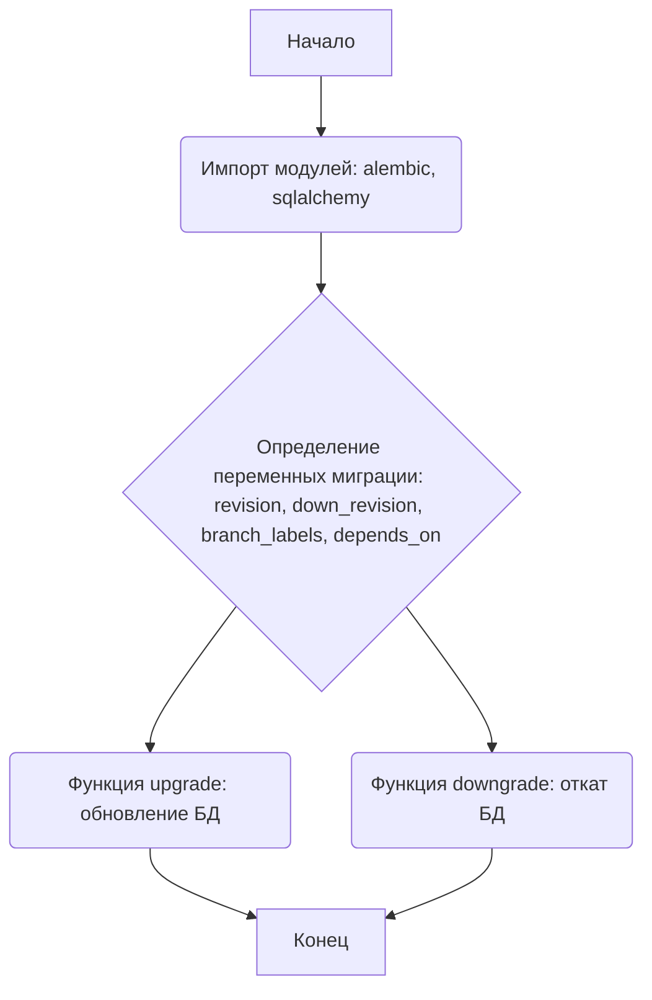

### **Анализ кода проекта `hypotez`**

=========================================================================================

**Расположение файла в проекте:** `hypotez/src/endpoints/bots/telegram/digital_market/bot/migration/versions/47f559ec82bb_initial_revision.py`

Данный файл представляет собой скрипт миграции базы данных, созданный с помощью Alembic. Он предназначен для управления изменениями в структуре базы данных в проекте `hypotez`.

---

### **1. Блок-схема**

```mermaid
graph LR
    A[Начало] --> B{Определение переменных миграции};
    B --> C{Функция upgrade()};
    C --> D{Выполнение операций обновления базы данных};
    D --> E[Конец upgrade()];
    E --> F{Функция downgrade()};
    F --> G{Выполнение операций отката базы данных};
    G --> H[Конец downgrade()];
    H --> I[Завершение];
    style A fill:#f9f,stroke:#333,stroke-width:2px
    style E fill:#f9f,stroke:#333,stroke-width:2px
    style I fill:#f9f,stroke:#333,stroke-width:2px
```

**Примеры для каждого логического блока:**

- **A (Начало):** Начало выполнения скрипта миграции.
- **B (Определение переменных миграции):** Определение `revision`, `down_revision`, `branch_labels`, `depends_on`. Пример: `revision: str = '47f559ec82bb'`.
- **C (Функция upgrade()):** Начало функции `upgrade()`, предназначенной для внесения изменений в структуру БД.
- **D (Выполнение операций обновления базы данных):** В данном случае, функция `upgrade()` пуста (`pass`), т.е. никаких изменений не вносится.
- **E (Конец upgrade()):** Завершение функции `upgrade()`.
- **F (Функция downgrade()):** Начало функции `downgrade()`, предназначенной для отката изменений структуры БД.
- **G (Выполнение операций отката базы данных):** В данном случае, функция `downgrade()` пуста (`pass`), т.е. никаких операций отката не производится.
- **H (Конец downgrade()):** Завершение функции `downgrade()`.
- **I (Завершение):** Завершение выполнения скрипта миграции.

---

### **2. Диаграмма**



**Объяснение зависимостей:**

- `alembic`: Используется для автоматизации процесса миграции базы данных. Позволяет применять и откатывать изменения схемы базы данных.
- `sqlalchemy`: Является Python SQL toolkit и ORM (Object-Relational Mapper), предоставляющим мощный и гибкий способ взаимодействия с базами данных.

---

### **3. Объяснение**

#### **Импорты:**

- `typing.Sequence`, `typing.Union`: Используются для аннотации типов, что помогает улучшить читаемость и предотвратить ошибки.
- `alembic.op`: Предоставляет набор операций для изменения схемы базы данных (например, создание таблиц, добавление столбцов и т.д.).
- `sqlalchemy as sa`: Используется для определения структуры базы данных и выполнения SQL-запросов.

#### **Переменные:**

- `revision: str = '47f559ec82bb'`: Идентификатор данной редакции миграции.
- `down_revision: Union[str, None] = None`: Идентификатор предыдущей редакции миграции (для отката). В данном случае `None`, так как это первая миграция.
- `branch_labels: Union[str, Sequence[str], None] = None`: Метки ветвей для организации миграций.
- `depends_on: Union[str, Sequence[str], None] = None`: Список миграций, от которых зависит данная миграция.

#### **Функции:**

- `upgrade() -> None`: Функция, применяющая изменения к базе данных. В данном случае она пуста (`pass`), т.е. никаких изменений не вносится.
- `downgrade() -> None`: Функция, откатывающая изменения базы данных. В данном случае она пуста (`pass`), т.е. никаких операций отката не производится.

#### **Потенциальные ошибки или области для улучшения:**

- В данном скрипте миграции обе функции (`upgrade` и `downgrade`) пусты. Это означает, что при применении этой миграции никаких изменений в базе данных не произойдет. Необходимо добавить реальные операции для изменения схемы базы данных.

#### **Взаимосвязи с другими частями проекта:**

- Данный скрипт является частью системы миграций базы данных, используемой Alembic. Он позволяет управлять изменениями в схеме базы данных, используемой другими частями проекта (например, ORM-моделями). При изменении моделей необходимо создавать соответствующие миграции для обновления схемы базы данных.