### **Системные инструкции для обработки кода проекта `hypotez`**

=========================================================================================

Описание функциональности и правил для генерации, анализа и улучшения кода. Направлено на обеспечение последовательного и читаемого стиля кодирования, соответствующего требованиям.

---

### **Основные принципы**

#### **1. Общие указания**:
- Соблюдай четкий и понятный стиль кодирования.
- Все изменения должны быть обоснованы и соответствовать установленным требованиям.

#### **2. Комментарии**:
- Используй `#` для внутренних комментариев.
- Документация всех функций, методов и классов должна следовать такому формату: 
    ```python
        def function(param: str, param1: Optional[str | dict | str] = None) -> dict | None:
            """ 
            Args:
                param (str): Описание параметра `param`.
                param1 (Optional[str | dict | str], optional): Описание параметра `param1`. По умолчанию `None`.
    
            Returns:
                dict | None: Описание возвращаемого значения. Возвращает словарь или `None`.
    
            Raises:
                SomeError: Описание ситуации, в которой возникает исключение `SomeError`.

            Ехаmple:
                >>> function('param', 'param1')
                {'param': 'param1'}
            """
    ```
- Комментарии и документация должны быть четкими, лаконичными и точными.

#### **3. Форматирование кода**:
- Используй одинарные кавычки. `a:str = 'value'`, `print('Hello World!')`;
- Добавляй пробелы вокруг операторов. Например, `x = 5`;
- Все параметры должны быть аннотированы типами. `def function(param: str, param1: Optional[str | dict | str] = None) -> dict | None:`;
- Не используй `Union`. Вместо этого используй `|`.

#### **4. Логирование**:
- Для логгирования Всегда Используй модуль `logger` из `src.logger.logger`.
- Ошибки должны логироваться с использованием `logger.error`.
Пример:
    ```python
        try:
            ...
        except Exception as ex:
            logger.error('Error while processing data', ех, exc_info=True)
    ```
#### **5 Не используй `Union[]` в коде. Вместо него используй `|`
Например:
```python
x: str | int ...
```


---

### **Основные требования**:

#### **1. Формат ответов в Markdown**:
- Все ответы должны быть выполнены в формате **Markdown**.

#### **2. Формат комментариев**:
- Используй указанный стиль для комментариев и документации в коде.
- Пример:

```python
from typing import Generator, Optional, List
from pathlib import Path


def read_text_file(
    file_path: str | Path,
    as_list: bool = False,
    extensions: Optional[List[str]] = None,
    chunk_size: int = 8192,
) -> Generator[str, None, None] | str | None:
    """
    Считывает содержимое файла (или файлов из каталога) с использованием генератора для экономии памяти.

    Args:
        file_path (str | Path): Путь к файлу или каталогу.
        as_list (bool): Если `True`, возвращает генератор строк.
        extensions (Optional[List[str]]): Список расширений файлов для чтения из каталога.
        chunk_size (int): Размер чанков для чтения файла в байтах.

    Returns:
        Generator[str, None, None] | str | None: Генератор строк, объединенная строка или `None` в случае ошибки.

    Raises:
        Exception: Если возникает ошибка при чтении файла.

    Example:
        >>> from pathlib import Path
        >>> file_path = Path('example.txt')
        >>> content = read_text_file(file_path)
        >>> if content:
        ...    print(f'File content: {content[:100]}...')
        File content: Example text...
    """
    ...
```
- Всегда делай подробные объяснения в комментариях. Избегай расплывчатых терминов, 
- таких как *«получить»* или *«делать»*
-  . Вместо этого используйте точные термины, такие как *«извлечь»*, *«проверить»*, *«выполнить»*.
- Вместо: *«получаем»*, *«возвращаем»*, *«преобразовываем»* используй имя объекта *«функция получае»*, *«переменная возвращает»*, *«код преобразовывает»* 
- Комментарии должны непосредственно предшествовать описываемому блоку кода и объяснять его назначение.

#### **3. Пробелы вокруг операторов присваивания**:
- Всегда добавляйте пробелы вокруг оператора `=`, чтобы повысить читаемость.
- Примеры:
  - **Неправильно**: `x=5`
  - **Правильно**: `x = 5`

#### **4. Использование `j_loads` или `j_loads_ns`**:
- Для чтения JSON или конфигурационных файлов замените стандартное использование `open` и `json.load` на `j_loads` или `j_loads_ns`.
- Пример:

```python
# Неправильно:
with open('config.json', 'r', encoding='utf-8') as f:
    data = json.load(f)

# Правильно:
data = j_loads('config.json')
```

#### **5. Сохранение комментариев**:
- Все существующие комментарии, начинающиеся с `#`, должны быть сохранены без изменений в разделе «Улучшенный код».
- Если комментарий кажется устаревшим или неясным, не изменяйте его. Вместо этого отметьте его в разделе «Изменения».

#### **6. Обработка `...` в коде**:
- Оставляйте `...` как указатели в коде без изменений.
- Не документируйте строки с `...`.
```

#### **7. Аннотации**
Для всех переменных должны быть определены аннотации типа. 
Для всех функций все входные и выходные параметры аннотириваны
Для все параметров должны быть аннотации типа.


### **8. webdriver**
В коде используется webdriver. Он импртируется из модуля `webdriver` проекта `hypotez`
```python
from src.webdirver import Driver, Chrome, Firefox, Playwright, ...
driver = Driver(Firefox)

Пoсле чего может использоваться как

close_banner = {
  "attribute": null,
  "by": "XPATH",
  "selector": "//button[@id = 'closeXButton']",
  "if_list": "first",
  "use_mouse": false,
  "mandatory": false,
  "timeout": 0,
  "timeout_for_event": "presence_of_element_located",
  "event": "click()",
  "locator_description": "Закрываю pop-up окно, если оно не появилось - не страшно (`mandatory`:`false`)"
}

result = driver.execute_locator(close_banner)
```

### Анализ кода `hypotez/src/endpoints/bots/telegram/digital_market/bot/user/catalog_router.py`

#### 1. Блок-схема:

```mermaid
graph TD
    A[Начало: Получение CallbackQuery с data == "catalog"] --> B{Загрузка каталога...};
    B --> C{Удаление предыдущего сообщения (если есть)};
    C --> D{Запрос к БД: CategoryDao.find_all() для получения данных каталога};
    D --> E{Ответ пользователю: Вывод категорий товаров с клавиатурой catalog_kb()};
    
    F[Начало: Получение CallbackQuery с data.startswith("category_")] --> G{Извлечение category_id из call.data};
    G --> H{Запрос к БД: ProductDao.find_all() для получения товаров категории};
    H --> I{Проверка: count_products > 0?};
    I -- Да --> J{Ответ пользователю: "В данной категории {count_products} товаров."};
    J --> K{Цикл по products_category: Формирование текста товара и вывод с клавиатурой product_kb()};
    I -- Нет --> L{Ответ пользователю: "В данной категории нет товаров."};
    
    M[Начало: Получение CallbackQuery с data.startswith('buy_')] --> N{Извлечение payment_type, product_id, price из call.data};
    N --> O{Запрос к БД: UserDAO.find_one_or_none() для получения информации о пользователе};
    O --> P{Условие: payment_type == 'yukassa'?};
    P -- Да --> Q[Вызов send_yukassa_invoice()];
    P -- Нет --> R{Условие: payment_type == 'stars'?};
    R -- Да --> S[Вызов send_stars_invoice()];
    R -- Нет --> T[Вызов send_robocassa_invoice()];
    Q --> U{Удаление сообщения};
    S --> U;
    T --> U;

    V[Начало: Получение PreCheckoutQuery] --> W{Ответ на pre_checkout_query: ok=True};

    X[Начало: Получение Message с ContentType.SUCCESSFUL_PAYMENT] --> Y{Извлечение payment_type, user_id, product_id из payment_info.invoice_payload};
    Y --> Z{Определение price и currency в зависимости от payment_type};
    Z --> AA{Формирование payment_data};
    AA --> BB[Вызов successful_payment_logic()];
```

#### 2. Диаграмма:

```mermaid
flowchart TD
    subgraph aiogram
        A[aiogram.Router]
        B[aiogram.F]
        C[aiogram.enums.ContentType]
        D[aiogram.types.Message]
        E[aiogram.types.CallbackQuery]
        F[aiogram.types.LabeledPrice]
        G[aiogram.types.PreCheckoutQuery]
    end

    subgraph sqlalchemy
        H[sqlalchemy.ext.asyncio.AsyncSession]
    end

    subgraph bot.app
        I[bot.app.utils.generate_payment_link]
    end

    subgraph bot.config
        J[bot.config.bot]
        K[bot.config.settings]
    end

    subgraph bot.dao
        L[bot.dao.dao.UserDAO]
        M[bot.dao.dao.CategoryDao]
        N[bot.dao.dao.ProductDao]
        O[bot.dao.dao.PurchaseDao]
    end

    subgraph bot.user
        P[bot.user.kbs.*]
        Q[bot.user.schemas.TelegramIDModel]
        R[bot.user.schemas.ProductCategoryIDModel]
        S[bot.user.schemas.PaymentData]
        T[bot.user.utils.successful_payment_logic]
    end
    
    A --> catalog_router
    B --> catalog_router
    C --> catalog_router
    D --> catalog_router
    E --> catalog_router
    F --> catalog_router
    G --> catalog_router
    H --> catalog_router
    I --> catalog_router
    J --> catalog_router
    K --> catalog_router
    L --> catalog_router
    M --> catalog_router
    N --> catalog_router
    O --> catalog_router
    P --> catalog_router
    Q --> catalog_router
    R --> catalog_router
    S --> catalog_router
    T --> catalog_router
    
    style catalog_router fill:#f9f,stroke:#333,stroke-width:2px
```



**Объяснение зависимостей:**

-   `aiogram`: Используется для создания Telegram-бота, обработки входящих запросов, отправки сообщений и организации логики работы бота.

    *   `Router`: Организует обработчики сообщений и callback-запросов.
    *   `F`: Фильтры для обработки определенных типов запросов.
    *   `ContentType`: Перечисление типов контента, таких как успешная оплата.
    *   `Message`: Объект сообщения, отправленного пользователем или ботом.
    *   `CallbackQuery`: Объект callback-запроса, отправленного пользователем после нажатия на кнопку.
    *   `LabeledPrice`: Используется для указания цены в инвойсах.
    *   `PreCheckoutQuery`: Объект запроса перед подтверждением оплаты.
-   `sqlalchemy`: Используется для взаимодействия с базой данных.

    *   `AsyncSession`: Асинхронная сессия для работы с базой данных.
-   `bot.app.utils`: Вспомогательные функции приложения.

    *   `generate_payment_link`: Функция для генерации платежной ссылки.
-   `bot.config`: Конфигурация бота.

    *   `bot`: Объект бота aiogram.
    *   `settings`: Настройки бота, такие как токен провайдера.
-   `bot.dao`: Data Access Objects для работы с базой данных.

    *   `UserDAO`: DAO для работы с пользователями.
    *   `CategoryDao`: DAO для работы с категориями.
    *   `ProductDao`: DAO для работы с продуктами.
    *   `PurchaseDao`: DAO для работы с покупками.
-   `bot.user`: Компоненты пользовательской части бота.

    *   `kbs`: Модуль, содержащий клавиатуры для бота.
    *   `schemas`: Pydantic-схемы для валидации данных.
        *   `TelegramIDModel`: Схема для валидации Telegram ID.
        *   `ProductCategoryIDModel`: Схема для валидации ID категории продукта.
        *   `PaymentData`: Схема для валидации данных платежа.
    *   `utils`: Вспомогательные функции для пользовательской части бота.
        *   `successful_payment_logic`: Логика обработки успешного платежа.

#### 3. Объяснение:

**Импорты:**

*   `aiogram`: Фреймворк для создания Telegram-ботов.
*   `sqlalchemy`: ORM для работы с базами данных.
*   `bot.app.utils`: Содержит утилиты для приложения, такие как `generate_payment_link`.
*   `bot.config`: Содержит конфигурацию бота, включая токен и настройки.
*   `bot.dao`: Содержит Data Access Objects (DAO) для работы с базой данных.
*   `bot.user`: Содержит модули для пользовательской части бота, такие как клавиатуры, схемы и утилиты.

**Router:**

*   `catalog_router`: aiogram Router, который используется для организации обработчиков callback-запросов и сообщений, связанных с каталогом товаров.

**Функции:**

*   `page_catalog(call: CallbackQuery, session_without_commit: AsyncSession)`:
    *   Обработчик callback-запроса с `F.data == "catalog"`.
    *   Запрашивает из базы данных все категории товаров с помощью `CategoryDao.find_all()`.
    *   Отправляет пользователю сообщение со списком категорий, используя клавиатуру `catalog_kb()`.
    *   Пример: Пользователь нажимает кнопку "Каталог", бот отображает список категорий.
*   `page_catalog_products(call: CallbackQuery, session_without_commit: AsyncSession)`:
    *   Обработчик callback-запроса с `F.data.startswith("category_")`.
    *   Извлекает `category_id` из данных callback-запроса.
    *   Запрашивает из базы данных все продукты, принадлежащие к данной категории, с помощью `ProductDao.find_all()`.
    *   Отправляет пользователю сообщение с описанием каждого продукта, используя клавиатуру `product_kb()`.
    *   Пример: Пользователь нажимает на категорию "Электроника", бот отображает список товаров в этой категории.
*   `process_about(call: CallbackQuery, session_without_commit: AsyncSession)`:
    *   Обработчик callback-запроса с `F.data.startswith('buy_')`.
    *   Извлекает `payment_type`, `product_id` и `price` из данных callback-запроса.
    *   В зависимости от `payment_type` вызывает одну из функций для отправки инвойса:
        *   `send_yukassa_invoice()`
        *   `send_stars_invoice()`
        *   `send_robocassa_invoice()`
    *   Пример: Пользователь нажимает кнопку "Купить", бот инициирует процесс оплаты.
*   `send_yukassa_invoice(call, user_info, product_id, price)`:
    *   Отправляет пользователю инвойс через ЮKassa.
    *   Использует `bot.send_invoice()` для отправки инвойса.
    *   `payload` содержит информацию для идентификации платежа.
    *   `prices` содержит цену товара.
    *   Пример: Отправка инвойса для оплаты через ЮKassa.
*   `send_robocassa_invoice(call, user_info, product_id, price, session: AsyncSession)`:
    *   Генерирует платежную ссылку для Robocassa с помощью `generate_payment_link()`.
    *   Отправляет пользователю сообщение с ссылкой на оплату.
    *   Пример: Отправка ссылки для оплаты через Robocassa.
*   `send_stars_invoice(call, user_info, product_id, stars_price)`:
    *   Отправляет пользователю инвойс для оплаты в "звездах".
    *   Использует `bot.send_invoice()` для отправки инвойса.
    *   Пример: Отправка инвойса для оплаты в "звездах".
*   `pre_checkout_query(pre_checkout_q: PreCheckoutQuery)`:
    *   Обработчик pre-checkout запроса.
    *   Подтверждает возможность проведения платежа, отправляя `ok=True`.
*   `successful_payment(message: Message, session_with_commit: AsyncSession)`:
    *   Обработчик сообщения об успешной оплате.
    *   Извлекает информацию о платеже из `message.successful_payment`.
    *   Вызывает функцию `successful_payment_logic()` для обработки успешного платежа.
    *   Пример: Пользователь успешно оплатил товар, бот обрабатывает информацию о платеже.

**Связи между компонентами:**

*   `catalog_router` использует `CategoryDao` и `ProductDao` для получения данных из базы данных.
*   `catalog_router` использует `catalog_kb` и `product_kb` для формирования клавиатур.
*   Функции `send_*_invoice` используют `bot.send_invoice()` для отправки инвойсов и `generate_payment_link()` для генерации ссылок на оплату.
*   `successful_payment` использует `successful_payment_logic` для обработки успешного платежа.

**Потенциальные ошибки и области для улучшения:**

*   Обработка исключений в `page_catalog` выполнена с помощью `except Exception as e: pass`.  Рекомендуется конкретизировать тип исключения и добавить логирование ошибки.
*   В `send_stars_invoice` `provider_token=""`.  Необходимо проверить, требуется ли токен для оплаты "звездами".
*   Отсутствует логирование ошибок.  Рекомендуется добавить логирование с использованием `logger.error` для отслеживания проблем.
*   Необходимо добавить обработку ошибок при оплате.