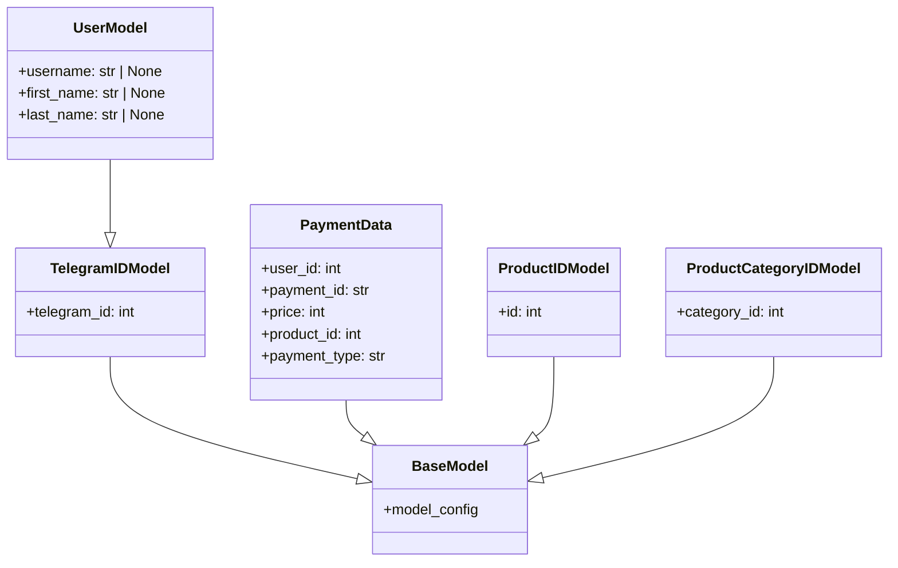

### **Системные инструкции для обработки кода проекта `hypotez`**

=========================================================================================

Описание функциональности и правил для генерации, анализа и улучшения кода. Направлено на обеспечение последовательного и читаемого стиля кодирования, соответствующего требованиям.

---

### **Основные принципы**

#### **1. Общие указания**:
- Соблюдай четкий и понятный стиль кодирования.
- Все изменения должны быть обоснованы и соответствовать установленным требованиям.

#### **2. Комментарии**:
- Используй `#` для внутренних комментариев.
- Документация всех функций, методов и классов должна следовать такому формату: 
    ```python
        def function(param: str, param1: Optional[str | dict | str] = None) -> dict | None:
            """ 
            Args:
                param (str): Описание параметра `param`.
                param1 (Optional[str | dict | str], optional): Описание параметра `param1`. По умолчанию `None`.
    
            Returns:
                dict | None: Описание возвращаемого значения. Возвращает словарь или `None`.
    
            Raises:
                SomeError: Описание ситуации, в которой возникает исключение `SomeError`.

            Ехаmple:
                >>> function('param', 'param1')
                {'param': 'param1'}
            """
    ```
- Комментарии и документация должны быть четкими, лаконичными и точными.

#### **3. Форматирование кода**:
- Используй одинарные кавычки. `a:str = 'value'`, `print('Hello World!')`;
- Добавляй пробелы вокруг операторов. Например, `x = 5`;
- Все параметры должны быть аннотированы типами. `def function(param: str, param1: Optional[str | dict | str] = None) -> dict | None:`;
- Не используй `Union`. Вместо этого используй `|`.

#### **4. Логирование**:
- Для логгирования Всегда Используй модуль `logger` из `src.logger.logger`.
- Ошибки должны логироваться с использованием `logger.error`.
Пример:
    ```python
        try:
            ...
        except Exception as ex:
            logger.error('Error while processing data', ех, exc_info=True)
    ```
#### **5 Не используй `Union[]` в коде. Вместо него используй `|`
Например:
```python
x: str | int ...
```


---

### **Основные требования**:

#### **1. Формат ответов в Markdown**:
- Все ответы должны быть выполнены в формате **Markdown**.

#### **2. Формат комментариев**:
- Используй указанный стиль для комментариев и документации в коде.
- Пример:

```python
from typing import Generator, Optional, List
from pathlib import Path


def read_text_file(
    file_path: str | Path,
    as_list: bool = False,
    extensions: Optional[List[str]] = None,
    chunk_size: int = 8192,
) -> Generator[str, None, None] | str | None:
    """
    Считывает содержимое файла (или файлов из каталога) с использованием генератора для экономии памяти.

    Args:
        file_path (str | Path): Путь к файлу или каталогу.
        as_list (bool): Если `True`, возвращает генератор строк.
        extensions (Optional[List[str]]): Список расширений файлов для чтения из каталога.
        chunk_size (int): Размер чанков для чтения файла в байтах.

    Returns:
        Generator[str, None, None] | str | None: Генератор строк, объединенная строка или `None` в случае ошибки.

    Raises:
        Exception: Если возникает ошибка при чтении файла.

    Example:
        >>> from pathlib import Path
        >>> file_path = Path('example.txt')
        >>> content = read_text_file(file_path)
        >>> if content:
        ...    print(f'File content: {content[:100]}...')
        File content: Example text...
    """
    ...
```
- Всегда делай подробные объяснения в комментариях. Избегай расплывчатых терминов, 
- таких как *«получить»* или *«делать»*. Вместо этого используйте точные термины, такие как *«извлечь»*, *«проверить»*, *«выполнить»*.
- Вместо: *«получаем»*, *«возвращаем»*, *«преобразовываем»* используй имя объекта *«функция получае»*, *«переменная возвращает»*, *«код преобразовывает»* 
- Комментарии должны непосредственно предшествовать описываемому блоку кода и объяснять его назначение.

#### **3. Пробелы вокруг операторов присваивания**:
- Всегда добавляйте пробелы вокруг оператора `=`, чтобы повысить читаемость.
- Примеры:
  - **Неправильно**: `x=5`
  - **Правильно**: `x = 5`

#### **4. Использование `j_loads` или `j_loads_ns`**:
- Для чтения JSON или конфигурационных файлов замените стандартное использование `open` и `json.load` на `j_loads` или `j_loads_ns`.
- Пример:

```python
# Неправильно:
with open('config.json', 'r', encoding='utf-8') as f:
    data = json.load(f)

# Правильно:
data = j_loads('config.json')
```

#### **5. Сохранение комментариев**:
- Все существующие комментарии, начинающиеся с `#`, должны быть сохранены без изменений в разделе «Улучшенный код».
- Если комментарий кажется устаревшим или неясным, не изменяйте его. Вместо этого отметьте его в разделе «Изменения».

#### **6. Обработка `...` в коде**:
- Оставляйте `...` как указатели в коде без изменений.
- Не документируйте строки с `...`.
```

#### **7. Аннотации**
Для всех переменных должны быть определены аннотации типа. 
Для всех функций все входные и выходные параметры аннотириваны
Для все параметров должны быть аннотации типа.


### **8. webdriver**
В коде используется webdriver. Он импртируется из модуля `webdriver` проекта `hypotez`
```python
from src.webdirver import Driver, Chrome, Firefox, Playwright, ...
driver = Driver(Firefox)

Пoсле чего может использоваться как

close_banner = {
  "attribute": null,
  "by": "XPATH",
  "selector": "//button[@id = 'closeXButton']",
  "if_list": "first",
  "use_mouse": false,
  "mandatory": false,
  "timeout": 0,
  "timeout_for_event": "presence_of_element_located",
  "event": "click()",
  "locator_description": "Закрываю pop-up окно, если оно не появилось - не страшно (`mandatory`:`false`)"
}

result = driver.execute_locator(close_banner)
```

```markdown
## Анализ кода `hypotez/src/endpoints/bots/telegram/digital_market/bot/user/schemas.py`

Файл содержит определения Pydantic-моделей, используемых для валидации и типизации данных, связанных с пользователями Telegram, продуктами и платежами в контексте цифрового рынка.

### 1. Блок-схема

```mermaid
graph TD
    A[Начало] --> B(TelegramIDModel: Базовая модель для идентификации пользователя по Telegram ID);
    B --> C{model_config: Настройка модели из атрибутов};
    C --> D(UserModel: Модель пользователя, расширяющая TelegramIDModel);
    D --> E{username: str | None, first_name: str | None, last_name: str | None};
    E --> F(ProductIDModel: Модель для идентификации продукта по ID);
    F --> G{id: int};
    G --> H(ProductCategoryIDModel: Модель для идентификации категории продукта по ID);
    H --> I{category_id: int};
    I --> J(PaymentData: Модель данных платежа);
    J --> K{user_id: int, payment_id: str, price: int, product_id: int, payment_type: str};
    K --> L[Конец];
```

**Примеры для логических блоков:**

-   **TelegramIDModel**:

    ```python
    telegram_user = TelegramIDModel(telegram_id=123456789)
    print(telegram_user)
    #> telegram_user = TelegramIDModel(telegram_id=123456789)
    ```

-   **UserModel**:

    ```python
    user = UserModel(telegram_id=123456789, username='testuser', first_name='Test', last_name='User')
    print(user)
    #> user = UserModel(telegram_id=123456789, username='testuser', first_name='Test', last_name='User')
    ```

-   **ProductIDModel**:

    ```python
    product = ProductIDModel(id=98765)
    print(product)
    #> product = ProductIDModel(id=98765)
    ```

-   **ProductCategoryIDModel**:

    ```python
    category = ProductCategoryIDModel(category_id=54321)
    print(category)
    #> category = ProductCategoryIDModel(category_id=54321)
    ```

-   **PaymentData**:

    ```python
    payment = PaymentData(user_id=123456789, payment_id='payment123', price=100, product_id=98765, payment_type='card')
    print(payment)
    #> payment = PaymentData(user_id=123456789, payment_id='payment123', price=100, product_id=98765, payment_type='card')
    ```

### 2. Диаграмма



**Описание зависимостей:**

-   `pydantic`: Используется для определения моделей данных с валидацией типов.
    -   `BaseModel`: Базовый класс для создания Pydantic моделей.
    -   `ConfigDict`: Используется для настройки поведения модели, например, для настройки получения данных из атрибутов объектов.
    -   `Field`: Используется для настройки полей модели, например, для добавления описания и ограничений.

### 3. Объяснение

#### Импорты:

-   `from pydantic import BaseModel, ConfigDict, Field`: Импортирует необходимые классы и функции из библиотеки `pydantic`.
    -   `BaseModel`: Базовый класс для создания моделей данных, обеспечивающих валидацию типов и структуры данных.
    -   `ConfigDict`: Класс для настройки конфигурации модели, позволяет, например, автоматически заполнять поля модели из атрибутов объекта.
    -   `Field`: Функция для определения дополнительных параметров полей модели, таких как описание, значения по умолчанию, ограничения (например, `max_length`).

#### Классы:

-   **TelegramIDModel**:
    -   Роль: Представляет идентификатор пользователя в Telegram.
    -   Атрибуты:
        -   `telegram_id` (int): Уникальный идентификатор пользователя в Telegram.
    -   Методы:
        -   Отсутствуют явно определенные методы, но класс наследуется от `BaseModel` и использует функциональность Pydantic для валидации данных.
    -   Взаимодействие:
        -   Служит базовой моделью для `UserModel`, обеспечивая наличие `telegram_id`.
    -   `model_config = ConfigDict(from_attributes=True)`: Конфигурация указывает Pydantic, что модель может быть создана из атрибутов объекта.

-   **UserModel**:
    -   Роль: Представляет информацию о пользователе Telegram.
    -   Атрибуты:
        -   `username` (str | None): Имя пользователя в Telegram (может отсутствовать).
        -   `first_name` (str | None): Имя пользователя (может отсутствовать).
        -   `last_name` (str | None): Фамилия пользователя (может отсутствовать).
    -   Методы:
        -   Отсутствуют явно определенные методы, но класс наследуется от `TelegramIDModel` и `BaseModel` и использует их функциональность.
    -   Взаимодействие:
        -   Расширяет `TelegramIDModel`, добавляя информацию об имени пользователя.

-   **ProductIDModel**:
    -   Роль: Представляет идентификатор продукта.
    -   Атрибуты:
        -   `id` (int): Уникальный идентификатор продукта.

-   **ProductCategoryIDModel**:
    -   Роль: Представляет идентификатор категории продукта.
    -   Атрибуты:
        -   `category_id` (int): Уникальный идентификатор категории продукта.

-   **PaymentData**:
    -   Роль: Представляет данные о платеже.
    -   Атрибуты:
        -   `user_id` (int): ID пользователя Telegram.
        -   `payment_id` (str): Уникальный ID платежа (максимальная длина 255 символов).
        -   `price` (int): Сумма платежа в рублях.
        -   `product_id` (int): ID товара.
        -   `payment_type` (str): Тип оплаты.

#### Функции:

-   Явно определенные функции отсутствуют, но Pydantic автоматически генерирует методы валидации, сериализации и десериализации для каждого класса, унаследованного от `BaseModel`.

#### Переменные:

-   В основном представлены атрибутами классов, которые определяют структуру данных и их типы.

#### Потенциальные ошибки и области для улучшения:

-   **Отсутствие документации**: Отсутствуют docstring для классов, что затрудняет понимание их назначения и использования без детального анализа кода.
-   **Отсутствие валидации**: Можно добавить дополнительные валидации для полей, например, проверку формата `payment_id` или допустимые значения для `payment_type`.

#### Взаимосвязи с другими частями проекта:

-   Эти модели данных используются в Telegram боте (`digital_market/bot/user/`) для обработки данных пользователей, продуктов и платежей. Они могут быть использованы для валидации входящих данных от пользователей, хранения информации в базе данных и обмена данными с другими сервисами.